# 供应链可持续发展的数据分析

> 原文：<https://towardsdatascience.com/data-analytics-for-supply-chain-sustainability-c6066de41609>

## 使用数据分析，通过诊断和战略决策减少端到端供应链运营对环境的影响

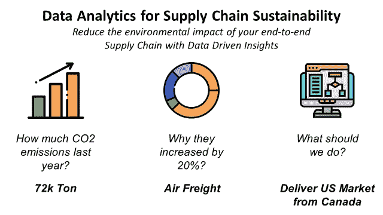

(图片由作者提供)

多年来，投资者对可持续发展透明度的要求越来越高，2030 年成为第一个重要里程碑。

通过 ESG 得分，组织的可持续性越来越受到重视。

因此，各公司现在都在争先恐后地实施二氧化碳减排路线图。

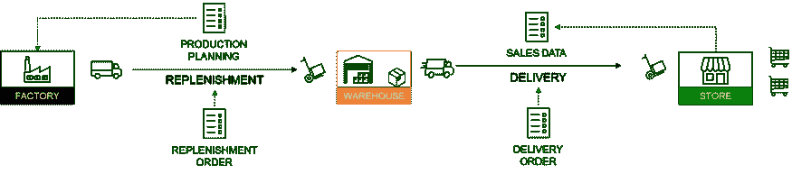

国际供应链网络的前一个例子—(图片由作者提供)

在[之前的出版物](/what-is-supply-chain-analytics-42f1b2df4a2)中，我将供应链分析作为一套工具，为一家国际时装零售商提高 [**运营绩效**](https://www.youtube.com/watch?v=KR_ziEiPcDk) 和 [**降低成本**](https://www.youtube.com/watch?v=aJnrEElPvvs) 。

在本文中，我们将重点介绍如何使用**相同的工具**和**方法**来**减少端到端供应链的环境影响**。

💌新文章直接免费放入你的收件箱:[时事通讯](https://www.samirsaci.com/#/portal/signup)

## 如何利用数据分析实现供应链可持续发展？

供应链分析是一套使用信息流来回答问题和支持决策的工具和方法。

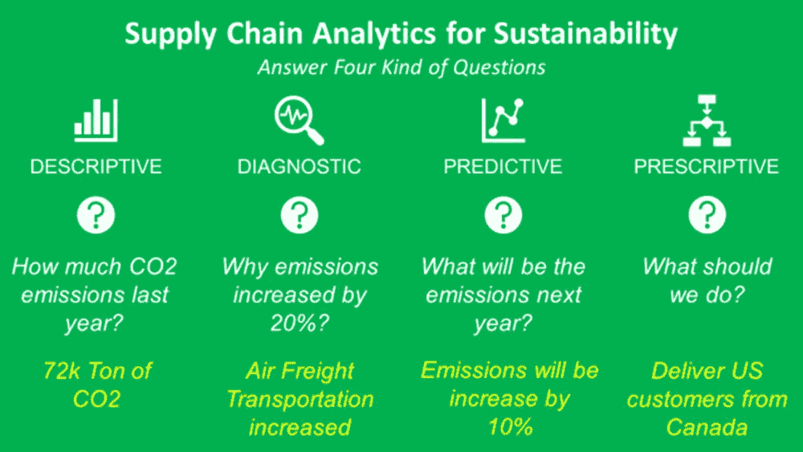

可持续发展的四种供应链分析——(图片由作者提供)

每种类型都可以回答特定的问题，并通过使用方法、数学概念和分析工具来支持您的运营实现绿色转型。

## 描述性分析:二氧化碳排放报告

一套工具，提供可见性和整个供应链的单一事实来源，以跟踪您的货件、检测事故并衡量您的运营绩效。

```
**❓ QUESTION**
How many tons of CO2 are emitted by my distribution network?
```

这是你绿色转型的第一步:你需要衡量你的运营对环境的影响。

一套工具，提供供应链中测量二氧化碳排放的可见性和单一事实来源:

**按国家**

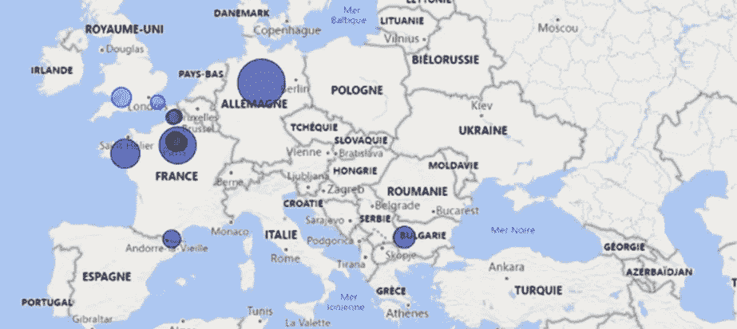

报告示例—(图片由作者提供)

**按项目**


报告示例—(图片由作者提供)

这个想法是测量沿着价值链的二氧化碳排放量，并建立报告，以了解你的分销网络的每一个环节的影响。

```
**💡 INSIGHTS** It looks like the easiest type from a mathematical point of view.However, it may be the main bottleneck of your green transformation as it requires harmonizing data from different systems.
```

如果您想要构建一个强大的基础来创建报告并为预测、诊断或说明性分析提供高级模型，这是非常必要的。

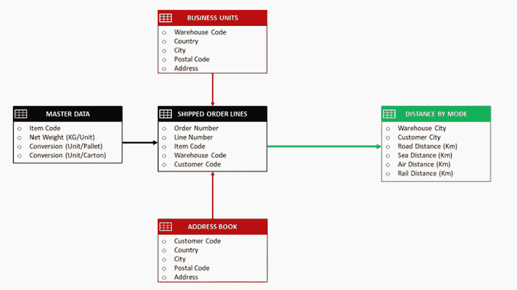

工作流程示例—(图片由作者提供)

```
📈 **ANALYTICS** - Data extraction, transformation and processing with SQL, Python
- Visualizations using matplotlib and PowerBI**🚀 RESULTS**
The measure of the emissions by scope and market to build your baseline of your transformation roadmap.
```

更多细节，你可以看看这个视频

(作者视频)

## 诊断分析:产品生命周期管理

这可以概括为事件或问题根本原因分析。

```
**❓ QUESTION**
What is the most polluting mode of transportation in France?
```

这一步非常接近描述性分析。建立了单一的统一数据源后，我们可以沿着价值链追踪排放情况。

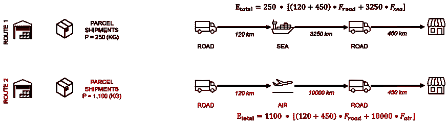

分布排放—(图片由作者提供)

```
**💡 INSIGHTS** If your colleague from the sustainability team is asking you why emissions doubled last year.1\. Have a look at the historical data 
2\. Split the emissions by transportation mode (road, air, sea)
```

这将有助于您理解，这是因为运输团队在面临生产延迟后，用空运取代了海运。

```
**🚀 RESULTS** This kind of diagnostic can help your management to spot the biggest sources of emissions and put its focus on them.📊 **ADDITIONAL KPIS**
You can implement additional KPIs such as % of air freight (high emissions), % of electric last mile delivery to bring a more proactive approach and trigger alerts if needed.
```

## 规定性分析:更新你的目标函数

协助运营部门解决问题，优化资源以实现二氧化碳排放目标。

```
**❓ QUESTION**
Where should we locate our factories to minimize the CO2 emissions of our Supply Chain Network?
```

在上一篇文章中，我介绍了帮助运营部门解决问题和优化资源以达到最佳效率的解决方案。

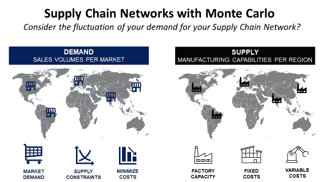

供应链网络设计文章(链接)

对于您的绿色转型，工具和方法将是相似的。唯一的区别是，现在你的目标函数将支持减少二氧化碳排放量。

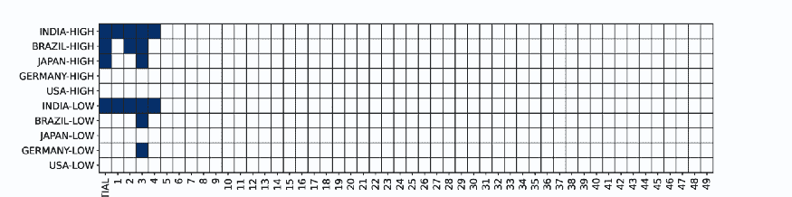

[布尔图](https://youtu.be/VLv_Lbv07ms)显示结果—(图片由作者提供)

在[的上一篇文章](https://www.samirsaci.com/robust-supply-chain-networks-with-monte-carlo-simulation/)中，我用方法论设计了一个最佳的工厂网络，来制造产品并交付给特定的市场。

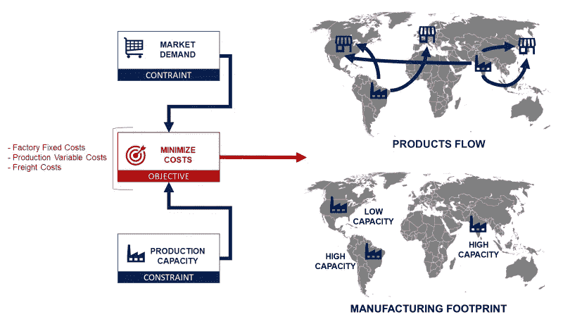

初始线性规划问题—(图片由作者提供)

这个想法是使用一个线性规划模型来选择决策变量(工厂位置),以最低的成本生产和交付产品。

```
**💡 INSIGHTS** In this kind of exercises usually markets are very far from cheap production locations. Therefore, you'll have high levels of CO2 emissions due to transportation.
```

> 如果我们现在改变目标函数呢？

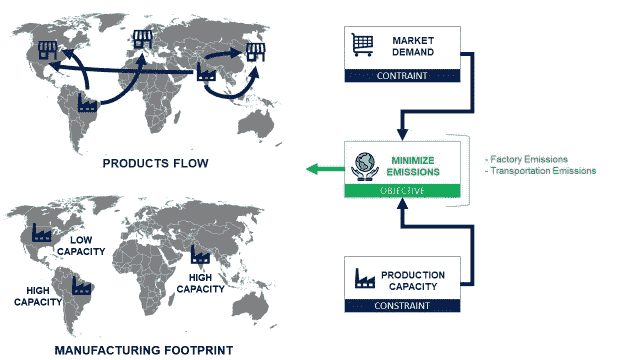

考虑可持续性的新问题—(图片由作者提供)

现在让我们要求模型在考虑运输和生产的同时，考虑到市场最小供应量的约束，使二氧化碳排放量最小化。

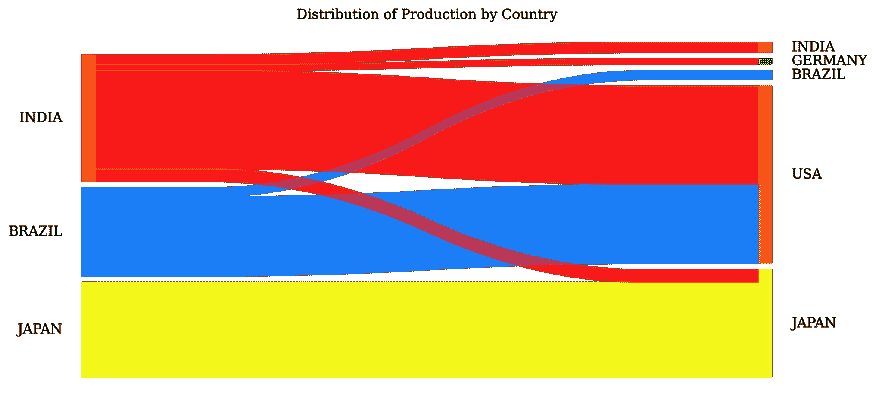

[桑基图表](https://youtu.be/yUncQ6aFEBU)示例——(图片由作者提供)

```
🚀 **RESULTS** You may need to completely transform your network to get plants close to your markets.The impact on the cost will be not negligible as you'll have to produce in countries with high labor costs.**💡 GO BEYOND**
Improve your model by including several types of transportation mode (electric, low emissions cargo fuels) that may increase the costs but reduce your CO2 footprint.Thus, you may find alternative solutions and keep some of your facilities in competitive countries.
```

# 结论

*在 medium 上关注我，获取更多与数据分析和供应链管理相关的文章*

## 为什么重要？

作为供应链经理，您的职责范围包括

1.  了解并最小化风险
2.  优化运营以降低成本和**二氧化碳排放**
3.  提供资源规划的可见性
4.  为未来场景做准备

## 同样的方法，同样的工具

对于描述性分析，没有什么变化，只是现在你需要更加重视数据质量。

至于其他的，调整你的关注点，在你的目标函数中包含二氧化碳减排。

在这段短片中，我们将详细介绍不同类型的供应链分析，

## 混合方法

这里的一切都应该考虑到你生产和交付的商品的价值。

如果您想保持适当的盈利水平，只关注二氧化碳减排可能是不合理的。

因此，您需要创新，并在数据驱动的见解的支持下使用替代解决方案。

## 用数码相机模拟不同的场景

数字孪生是物理对象或系统的数字复制品。

供应链数字模型是一种计算机模型，代表供应链中涉及的各种组件和流程，如仓库、运输网络和生产设施。

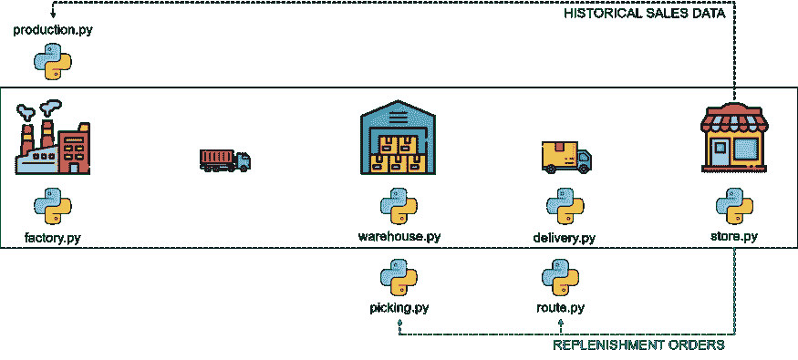

使用 Python 的数字孪生示例—(图片由作者提供)

模拟几个绿色计划的场景

场景 1:您想要建立一个本地仓库来缩短最后一英里的配送距离

*   **对服务水平会有什么影响？**
*   **仓储成本会有什么影响(地点越多)？**
*   **我们能减排多少二氧化碳？**

场景 2:您希望停止空运以减少二氧化碳排放

*   **对商店的补货周期会有什么影响？**
*   **分销计划员需要提前多长时间创建补货订单？**
*   **对二氧化碳减排会有什么影响？**

场景 3:您想要建立更多的工厂，为所有市场进行本地生产

*   **对生产成本会有什么影响？**
*   **运输成本会有什么影响(工厂靠近仓库)？**
*   **我们能减少多少二氧化碳排放量？**

对于每个场景，您可以操作与计划相关联的参数，并查看您的整体性能会降低多少。

然后，您可以调整其他指标(仓库容量和位置、补货提前期等)，直到您重新达到初始目标。

这将向您展示供应链的改进，以获得适应这些新的绿色倡议的稳健性水平。

[](https://www.samirsaci.com/what-is-a-supply-chain-digital-twin/)  

## 数字孪生模型的例子:绿色库存管理

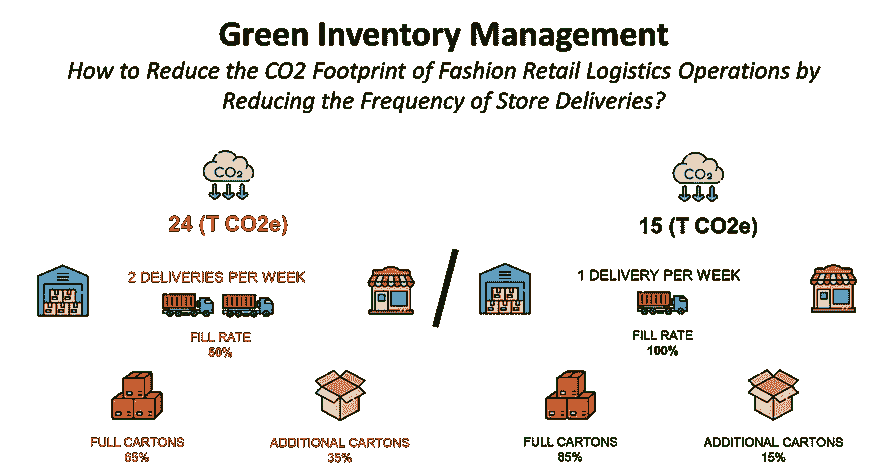

(图片由作者提供)

绿色库存管理可以定义为以环境可持续的方式管理库存。

对于分销网络而言，这可能涉及一系列旨在减少订单传输、准备和交付的环境影响的流程和规则。


(图片由作者提供)

> *如果我们降低商场补货频率，会对二氧化碳排放量产生什么影响？*

使用数据分析来模拟商店补货频率的变化，并衡量对整体环境影响的影响。

[](https://www.samirsaci.com/green-inventory-management-case-study/)  

## 数字孪生模型的范例:时尚循环经济

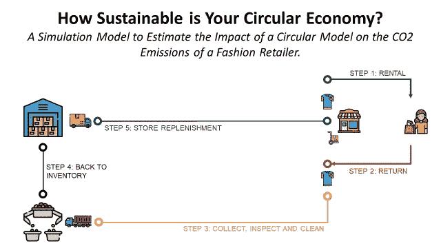

(图片由作者提供)

**循环经济**是一种经济模式，旨在最大限度地减少浪费和提高资源效率。

它包括设计注重寿命、重复使用和回收的产品和工艺。

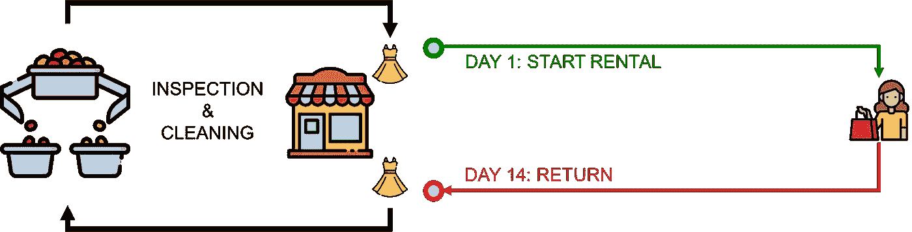

(图片由作者提供)

一些公司已经实施了一种**订阅模式**，在这种模式下，客户支付一定的费用就可以在特定的时间段内获得**的产品或服务。**

使用数据分析来模拟循环订阅模式的几种情况对快速时尚零售商的减排和用水的影响。

[](https://www.samirsaci.com/how-sustainable-is-your-circular-economy/)  

## 考虑当地的倡议

管理浪费和减少消耗品的使用也是**减少仓库**运营对商店交付的影响的好方法。

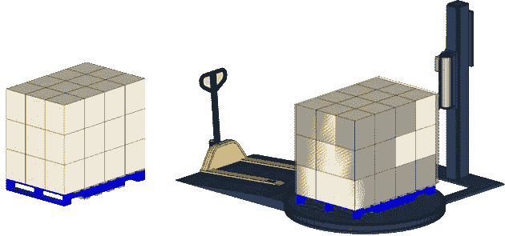

减少包装薄膜的使用量—(图片由作者提供)

数据分析还可以帮助您估计这些小举措对整个网络的影响(如果应用于所有仓库)。

1.  使用实际运行数据计算电流消耗
2.  将这些参数包含在您的数字孪生兄弟中
3.  概念验证后，估计节约目标
4.  推断整个网络(每个仓库)的节约

所有这些举措都与降低成本和优化运营的努力相一致。

您可以调整您的持续改进方法，以跟踪耗材使用情况，并找到不会影响您工作效率的替代方案。

首先，从测量运营的当前消耗和环境影响开始。

数据分析可以帮助您自动化这一过程。

[](https://www.samirsaci.com/sustainable-logistics-reduce-packing-and-consummables-consumption/)  

# 关于我

让我们在 [Linkedin](https://www.linkedin.com/in/samir-saci/) 和 [Twitter](https://twitter.com/Samir_Saci_) 上连线，我是一名[供应链工程师](https://www.samirsaci.com/about/)使用数据分析来改善物流运作和降低成本。

如果你对数据分析和供应链感兴趣，可以看看我的网站

[](https://samirsaci.com)  

## 参考

*   [什么是供应链分析](/what-is-supply-chain-analytics-42f1b2df4a2?source=your_stories_page-------------------------------------)，Samir Saci，走向数据科学
*   [蒙特卡洛模拟的稳健供应链网络](https://www.samirsaci.com/robust-supply-chain-networks-with-monte-carlo-simulation/)，Samir Saci