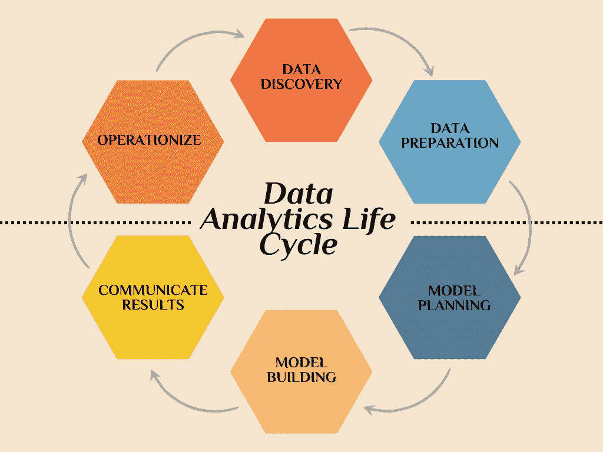
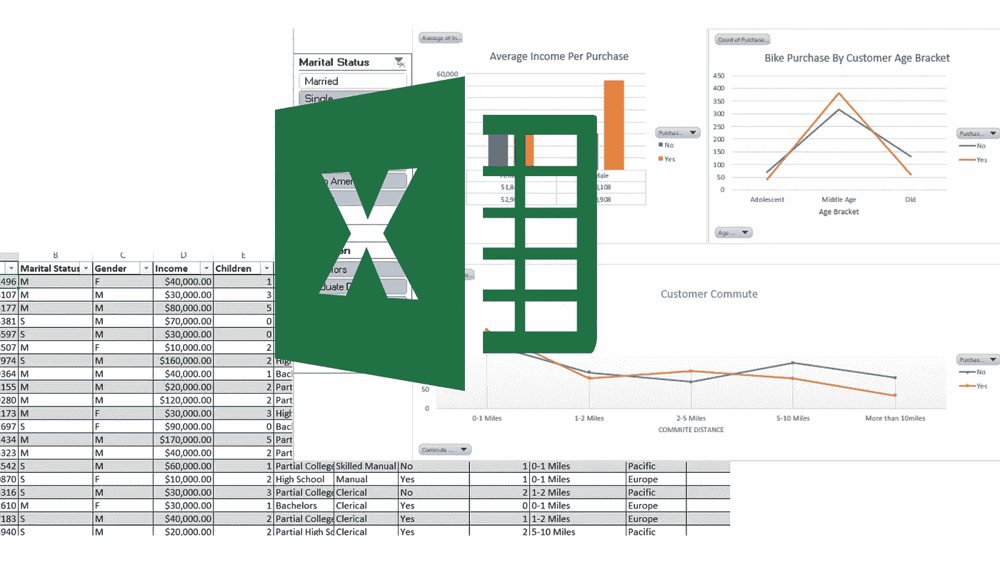

# 时尚数据分析:Excel 系列(# 1)-概述

> 原文：<https://towardsdatascience.com/data-analytics-in-fashion-excel-series-1-f1a6eed57393>

## Microsoft Excel 数据分析入门综合蓝图


Timur Saglambilek 以[像素](https://www.pexels.com/photo/analytics-text-185576/)拍摄的照片

> **本文讨论的原则适用于时尚以外的其他行业。换句话说，无论您是数据爱好者、研究人员、时尚爱好者、学生还是专业人士，讨论的 Excel 概念都与您的领域相关并适用。**

时尚品牌和零售商正在寻找最大化数据分析的方法，主要是通过针对目标受众的个性化来改善产品供应。

根据麦肯锡的研究，将数据整合到规划、销售和供应链中的时尚和奢侈品公司已经收到了显著的效果，在库存和商店优化中实施数据驱动的决策，销售额增加了 10%，库存成本降低了约 15%。

一般来说，那些优化了数据能力以建立以客户为中心的业务的品牌，其数字销售额增长了 30-50%。

> 总而言之，随着每天发布的数据越来越多，时尚品牌越早学会利用数据，他们在这个时代的生存机会就越大——数据领先者和后来者之间的差距已经扩大。

> **和我在一起……**

<https://medium.com/data4fashion/fashion-and-big-data-application-cb946dd76844>  

虽然许多时尚品牌尚未利用数据的力量，但一些品牌正在探索员工技能提升选项和人才搜寻，一些品牌甚至愿意培训新的数据专业人员，如数据工程师、数据分析师、数据科学家、云工程师等。

换句话说，无论你是核心设计师、插画师、跟单员、技术设计师等，你都需要知道如何从你公司的数据中解读见解- **掌握数据分析。**

</re-imagine-the-business-of-fashion-part-1-cc8037cbef6d>  

也就是说，本文将重点关注数据分析的关键步骤之一，即**“数据清理”、**，但在探索这一步骤之前，让我带您了解一下数据分析生命周期的各个阶段。

# 数据分析生命周期的 6 个阶段



作者图片

每天大约产生 2.5 万亿字节的数据，随着技术的不断发展，我们产生的数据量也将不断增加。随着数据的创建，也需要对其进行处理和重用。因此，数据经历了一个围绕 6 个阶段的循环运动，每个阶段都有一个规定的目标、任务、功能和相关性。

以上各阶段依次进行，但是，流程可以是向前或向后移动- ***这是一个迭代过程。***

**#1。数据发现:**


照片由 Pavel Danilyuk 以[像素拍摄](https://www.pexels.com/photo/a-person-playing-chess-8438944/)

以下是数据发现阶段发生的一些活动:

1.  数据团队和主要利益相关者检查业务趋势。
2.  定义目标和成功标准。
3.  创建业务案例研究，即确定一个业务问题，团队想出一个策略来处理它。
4.  数据需求、数据来源和数据预期讲述的故事。
5.  所需资源的评估和评价。
6.  根据业务问题制定假设。

**#2 数据准备:**

> **焦点从业务需求转移到数据需求。**

此时，数据团队执行以下任务:

*   识别数据源
*   确定在指定的时间范围内可以从每个来源获得多少数据。
*   整理数据收集、处理和清理。
*   这个阶段可能会执行多次。

**#3 模型规划:**

*   团队探索来自前一阶段的数据。
*   处理和存储数据需要分析沙盒。它还在整个项目时间框架内提供网络功能。
*   团队了解变量并选择适合业务案例的变量- **特征选择用于模型构建。**
*   接下来，确定技术、要构建的模型和工作流。

**# 4。模型构建:**

*   数据集是为测试、培训和生产而开发的
*   模型是使用模型规划阶段确定的不同算法构建的。
*   执行模型的试运行，以基于业务问题测试模型的有效性。

**#5。沟通结果:**


罗德尼制作公司在[像素上拍摄的一张张照片](https://www.pexels.com/photo/people-having-a-meeting-5922205/)

*   该团队确定关键结果，衡量与业务问题相关的价值，并生成数据故事，以将结果传达给风险承担者。
*   主要利益相关方将获得的结果与在**数据交付阶段设定的目标和成功标准进行比较。**
*   这个阶段决定了项目的**成败。**

**#6。操作化:**

*   最后，团队运行一个试点项目来部署模型和测试实时环境。
*   这种方法有助于了解小规模生产环境中的模型性能和相关约束，并在全面部署之前进行调整。
*   团队准备完整的报告、简报、源代码和相关文档。

> 然而，如果结果与阶段 1 中的成功标准相反，团队可以在数据分析生命周期中向后移动到之前的任何阶段，以修改任何输入，从而获得不同的结果。

> **数据分析周期确实是一个迭代过程。**

***阅读时间很长，但我很高兴我们已经涵盖了数据分析生命周期的基础知识。***

```
***QUICK QUESTION:******Remember the focus of this article is on data cleaning, what phase of the data analytics life cycle do you think data cleaning belongs to?***
```

如果你做到了这一步，给自己竖起大拇指。你做得很好！

Gif by [Giphy](https://giphy.com/)

> **但是，我还有一个理论概念要讲，然后直接进入 Excel 中的数据清理！**

***很简短，我保证！***

> 为了更好地理解我们想要在 Excel 中做什么，强调数据清理的一些好处是很重要的。

拿起你的咖啡，让我们开始吧！！！

# 什么是数据清洗？


照片由[阿德利·瓦希德](https://unsplash.com/@adliwahid?utm_source=unsplash&utm_medium=referral&utm_content=creditCopyText)在 [Unsplash](https://unsplash.com/?utm_source=unsplash&utm_medium=referral&utm_content=creditCopyText) 上拍摄

数据清理是数据需求阶段的一个关键步骤，您可能要在这个阶段花费大约 80%的时间。换句话说，这个阶段的其余部分很大程度上取决于您的数据有多干净。因此，建议你尽最大努力完成这项工作。

**为什么要清洗数据？**

清理数据的主要原因是为了在构建模型时获得准确的结果。例如，当您构建一个模型来预测销售额或用户是否会点击广告时，重复的条目会改变您的结果。更重要的是，干净的数据更容易阅读、理解，也更容易展示。

说到这里，让我们进入你期待已久的时刻。

告诉过你我会长话短说的！

****挤眉弄眼****

# Excel 用于数据分析



作者图片

Microsoft Excel 是一种已经存在了一段时间的电子表格应用程序。它不仅用于存储结构化数据，还可以执行计算、可视化、构建模型等。尽管它已经存在了 30 多年，但它在行业中仍然有很大的相关性，因此是学习数据分析的一个很好的工具。

> **为什么要用 Excel 开始分析？为什么不是 Python？SQL？**

除了 Excel 价格合理、处理能力要求较低(设备类型)之外，它还为数据分析中使用的其他工具奠定了坚实的基础。换句话说，更容易学习，在其中建立基础将加深你对分析过程的了解。

**简单地说，当你知道 Excel 的时候，学习其他复杂的工具，比如 SQL，就会变得很容易。这将确保你有一个更好的过渡。**

关于这一点，整个系列将涵盖 12 种用于清理 excel 中数据的技术和公式。

> **准备好潜水了吗？？**
> 
> 拿些饼干，让我们开始吧！！！


由 [Tamas Pap](https://unsplash.com/@tamasp?utm_source=unsplash&utm_medium=referral&utm_content=creditCopyText) 在 [Unsplash](https://unsplash.com/s/photos/cookies?utm_source=unsplash&utm_medium=referral&utm_content=creditCopyText) 上拍摄的照片

```
Two things to do before performing data cleaning;#1.Make a copy of your dataset.
#2.Spend some time to understand your data-is it a sales data? customer data? what features does it have?the features, datatypes.Doing the #2 will guide you into what to look out for when performing data cleaning.
```

以下是本系列教程将要讨论的 12 种技术:

1.  调整列的大小
2.  去掉前导和尾随空格。
3.  删除单元格中的换行符
4.  删除重复项
5.  处理空白行和单元格
6.  规范判决案例
7.  数字格式
8.  突出显示错误
9.  将文本拆分成列
10.  合并两列或更多列
11.  查找和替换
12.  表格格式

> 既然您已经了解了数据清理的概念和一些清理数据的 excel 技术，请直接跳到这里的</data-analytics-in-fashion-excel-series-2-8e29be44a306>**，您将直接进入使用上述 15 种技术中的每一种的逐步过程。**

```
The next two tutorials in this series will be structured below;**Tutorial 2: Techniques 1–6****Tutorial 3: Techniques 7–12****Tutorial 4: A complete Data Cleaning Project in Microsoft Excel.**
```

**每个教程都有*截图、视频短片、*和*练习题*来强化你的学习。**

**点击 [**这里**](/data-analytics-in-fashion-excel-series-2-8e29be44a306) 开始！！！！**

> **希望你喜欢读这篇文章，就像我喜欢写这篇文章一样。**
> 
> **不要犹豫，在评论区提出你的问题和意见。**

**在 [LinkedIn](https://www.linkedin.com/in/olaoluwakiitan-olabiyi/) 上和我联系。**

***干杯！***

**</practical-guide-to-data-visualization-83e375b0037> [## 数据可视化实用指南

towardsdatascience.com](/practical-guide-to-data-visualization-83e375b0037)**