# 时尚的数据分析:Excel 系列(# 2)-数据清理

> 原文：<https://towardsdatascience.com/data-analytics-in-fashion-excel-series-2-8e29be44a306>

## Microsoft Excel 数据分析入门综合蓝图


照片由[UX](https://unsplash.com/@uxindo?utm_source=unsplash&utm_medium=referral&utm_content=creditCopyText)在 [Unsplash](https://unsplash.com/?utm_source=unsplash&utm_medium=referral&utm_content=creditCopyText) 上拍摄

> **欢迎来到 Excel 系列教程 2。点击** [**此处**](/data-analytics-in-fashion-excel-series-1-f1a6eed57393) **阅读教程#1。否则，继续下面的教程#2。**

本教程中涉及的数据清理技术有:

1.  调整列的大小
2.  去掉前导和尾随空格。
3.  删除单元格中的换行符
4.  删除重复项
5.  处理空白行和单元格
6.  规范判决案例

使用的数据集是 Kaggle 的时尚数据集，您可以在这里访问它们> > >[数据集 1](https://www.kaggle.com/datasets/nicapotato/womens-ecommerce-clothing-reviews) 和[数据集 2](https://www.kaggle.com/datasets/shivamb/fashion-clothing-products-catalog)

> **我们开始吧！**

# **#1。调整列的大小:**

有时，当您将数据集导入 Excel 时，一些列看起来被压缩了，因此很难看到每个单元格中的完整值。下面的图 1 给出了一个例子。


作者图片:图 1

有不同的方法来解决这个问题，但更快的方法包括两个步骤。

```
**STEPS:**1.Select the **'all button'**(to the left of column 'A').
2.Double click on any of the boundary lines between the columns.
```

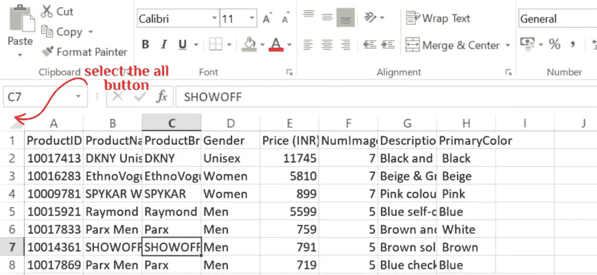

作者图片:图 2


作者图片:图 3

> 这将自动调整所有列的大小，如图 4 所示。

视频 1:调整列的大小

> 图 4 中显示了相同的数据，但现在看起来更具可读性。

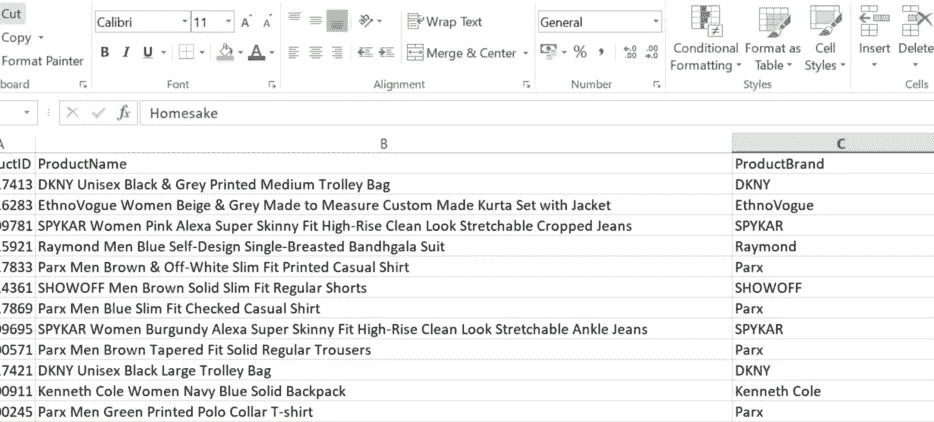

作者图片:图 4

# #2.去掉前导和尾随空格:

前导空格和尾随空格是出现在数据输入的开头、中间或结尾的不必要的空白，它们可能很难被发现。图 5 的 A 列中示出了一个例子。

> **要去掉这些空格，请使用修剪功能。**

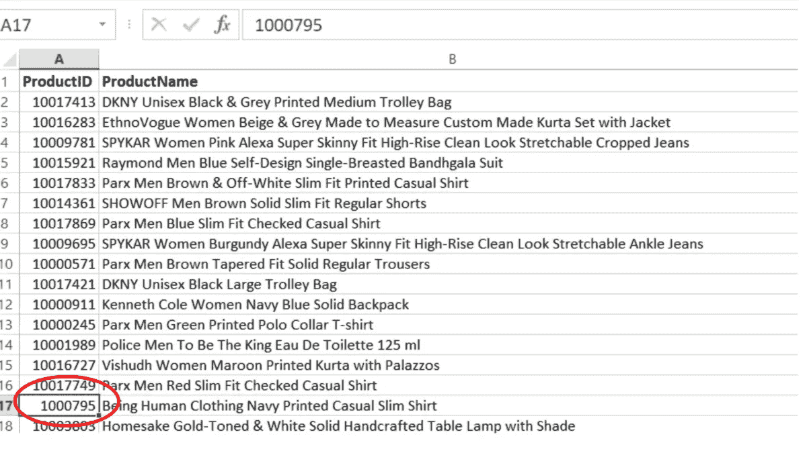

作者图片:图 5

> **语法:**
> 
> =修剪(文本)

```
**STEPS:**1\. Place your cursor on the column (**ProductID**) you wish to clean, hit **Ctrl shift +** at the same time.
2\. Select**'Entire column**'as illustrated in Fig. 6a
3\. Click ok.(This will create a new column to the left of ProductID).
```

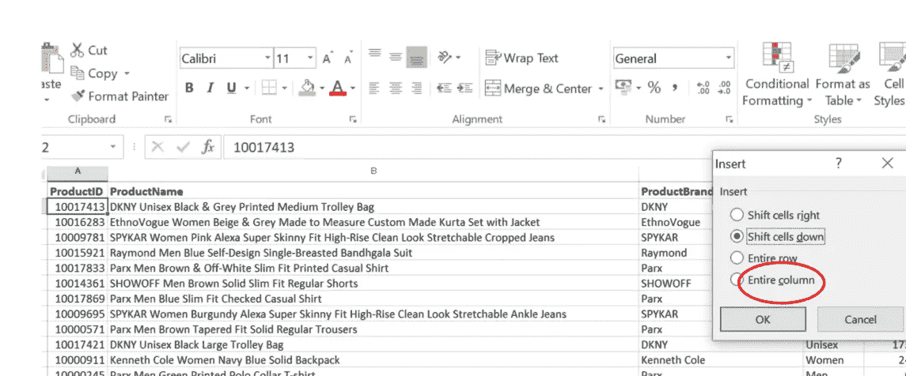

作者图片图 6a

```
4\. In the new column(column A),Type **=TRIM(B2)**;where B2 is the cell reference for ProductID. See Fig. 6b
5\. Press **ENTER** 6\. The result will be a cell with '1001743' and without the unwanted spaces as shown in Fig.7 and Video 2.
```

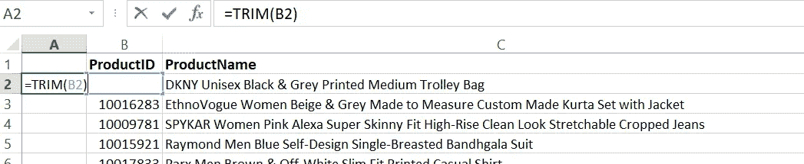

作者图片:图 6b

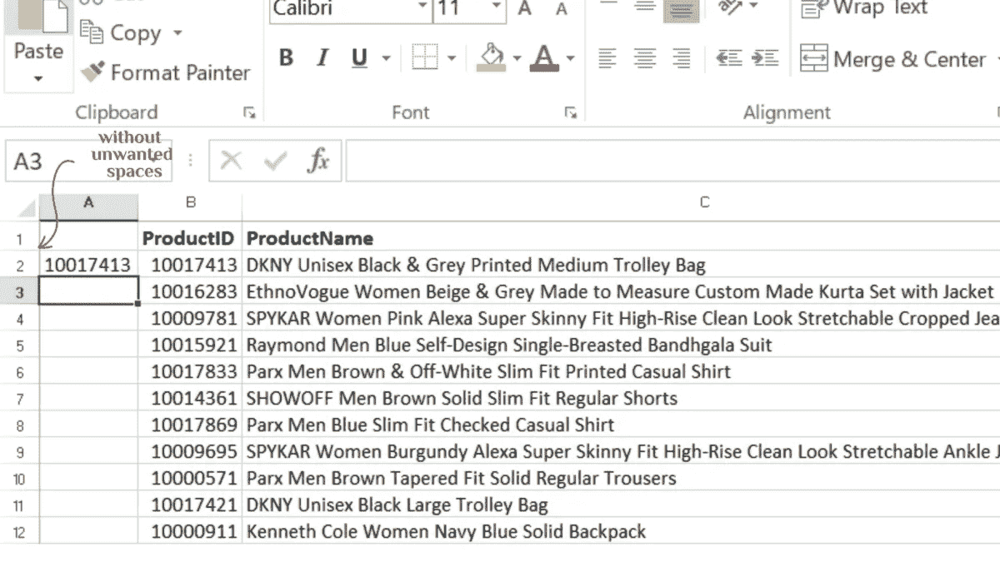

作者图片:图 7

如您所见，单元格 A2 中的值现在更靠近行，并且没有任何前导空格。接下来的几个步骤将指导您如何在 A2 列的其余行中复制结果。

```
7\. Select cell A2 (10017413),hover your cursur towards the the tiny square on the right side of the green triangle.
8\. Double click to automatically fill the rest of the row so that your result will look like Fig. 8
```

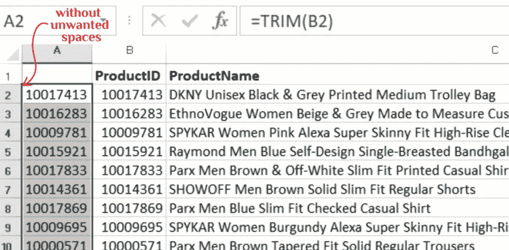

作者图片:图 8

现在我们已经清理了不需要的空间，我们需要删除其中一列，因为重复是不正确的。

> **按照以下步骤完成该过程。**

```
**STEPS:**9\. Place your cursor on cell A2, press **Ctrl Shift Down arrow key** simultaneously to select the entire column.
10.Ctrl C to copy the values.
11.**Ctrl Shift Up arrow key** to go back up.
12.Select cell B2
13.Navigate to **Paste** in the Home Tab.
14\. Click the drop down arrow and select 'value' under the **paste values** session.**This will copy the values in column A into column B seamlessly.
See video 2 for a demo.**
```

> **在这之后，右键单击 A 列并选择删除。**

视频 2:删除不需要的空间

> PS:不要犯普通复制粘贴方法的错误，因为它不会给你预期的结果。

# #3.移除单元格中的换行符:

手动换行符和非打印字符有时会出现在数据集中。要消除这种情况，请使用**清洁**功能。在某些情况下，CLEAN 和 TRIM 函数会一起使用，特别是当数据集很大并且不可能发现所有换行符和额外字符时。

例如，在本教程示例数据集中，看起来没有任何可见的换行符，但建议在处理不需要的空间时使用 CLEAN with TRIM，如上面第 2 条所述。

> **参考视频#3，了解如何组合两种功能。**

视频 3:结合修剪和清洁功能

> **要复制和粘贴数值，请参考#3** 中的步骤 9–14

# #4.删除重复项:

数据集中有多个条目会影响分析和模型构建的准确性。因此你需要处理它。你要么先突出显示它，要么直接删除它。

**删除重复数据:**

Excel 允许您定义什么是重复项，还可以选择要删除重复项的列。

```
**STEPS:***Select Data > Remove Duplicates > Check the data has header > check columns to remove duplicates from > Click OK*
```

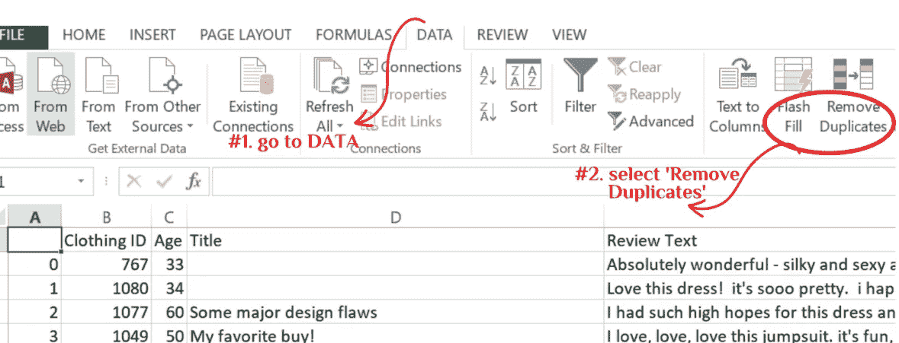

作者图片:图 9

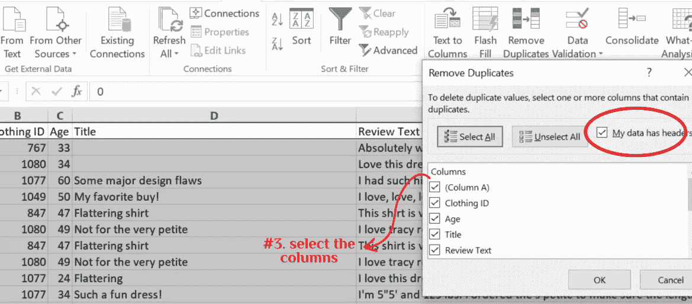

作者图片:图 10

> **如果您的数据有标题，请确保选中标题框。**

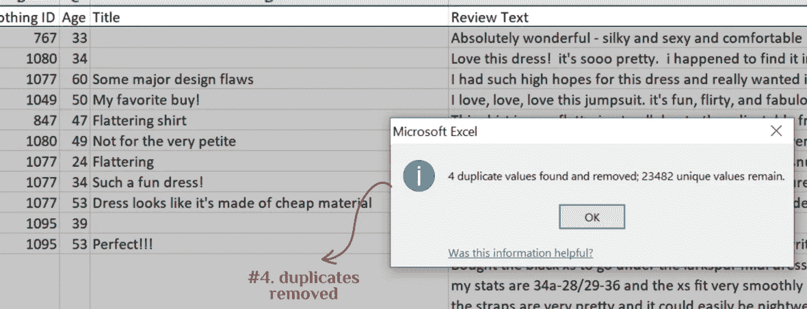

作者图片:图 11

视频 4:删除重复项

# #5.处理空白行和单元格:

缺失的值会对结果产生重大影响，并且总是会影响您从中得出的结论。虽然有不同的方法来处理缺失的价值观，但最重要的是不要忽视它们。

> 您可以决定用“无”、“0”或任何其他单词来填充缺少的单元格。**使用以下步骤高亮显示并填充空白单元格。**

```
**STEPS:**1.Select the entire dataset.
2.Hit the F5 key to open the **'Go To'** dialogue box**.** 3**.Click Special >select blank> click ok** 4.Type what you want to fillin the blank cells
5.Press CNTRL ENTER to automatically fill the word in all the blank cells.
```

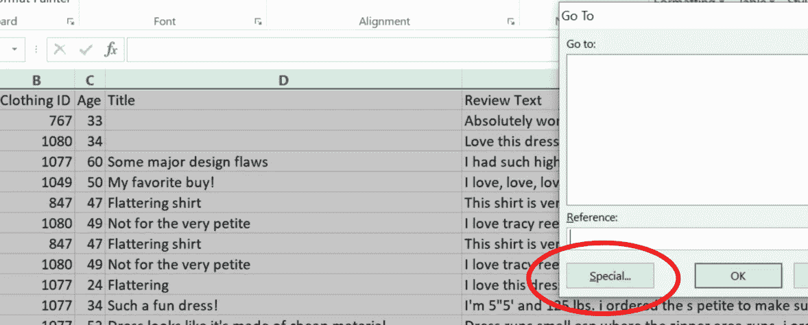

作者图片:图 12

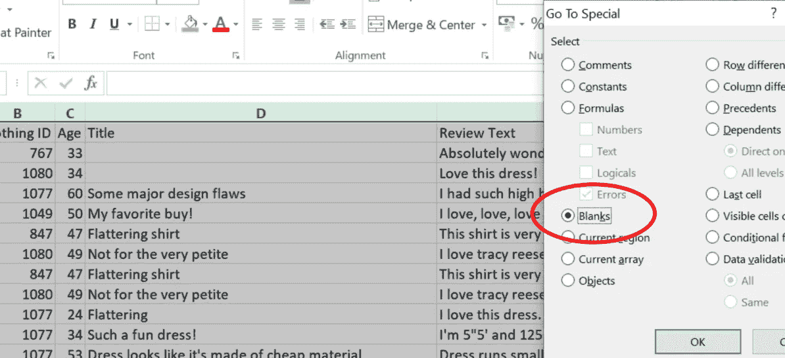

作者图片:图 13

> PS:输入‘缺失值’后，记得按 Ctrl ENTER。如果您单独按 ENTER 键，您键入的单词将只出现在一个单元格中，其他空白单元格仍将保持空白。

视频 5:填补空白

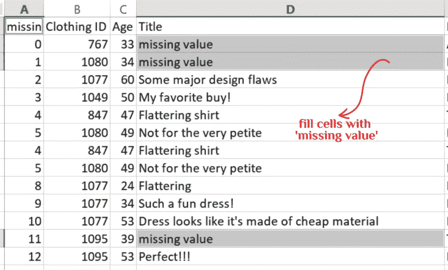

作者图片:图 14

# #6 标准化判决案例

使用数据集的另一个常见情况是不一致的句子情况。例如，一个列可能有大写、小写和大写的组合。您可以使用三个函数将整列转换为最合适的句子大小写。

> **=LOWER()—将所有文本转换为小写。
> =UPPER() —将所有文本转换为大写。
> =正确—将所有文本转换成正确的大小写。**

```
**STEPS:** 1.Create a new column next to the ProductBand.
2.Type =PROPER(C2)-Where C2 is the cell reference of 'DKNY' in column C.(Fig.15)
3.Press Enter and you should have 'DKNY' converted to 'Dkny'.
4.Follow the procedure in the video to replicate the result in the rest of the rows.
```

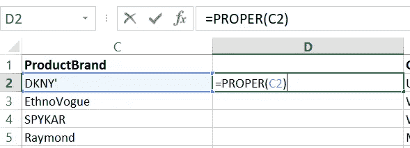

作者图片:图 15

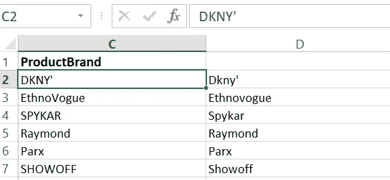

作者图片:图 16

> 同样，我们不能有重复的列，所以决定你喜欢的句子大小写，并参考#2 关于如何复制和粘贴值。然后删除不需要的列。

```
Follow the steps used in =PROPER()to apply the =LOWER()and =UPPER()functions.Refer to video 6 for a demo of the three functions.
```

视频 6:改变句子大小写

# **结论**

很好的完成了总结部分。如果你有任何问题、反馈或特殊要求，请不要犹豫，在评论区提出，或者通过 [LinkedIn](https://www.linkedin.com/in/olaoluwakiitan-olabiyi/) 联系我。如果你还没有阅读第一篇文章，点击[这里](/data-analytics-in-fashion-excel-series-1-f1a6eed57393)开始阅读。

此外，这些只是 Excel 中使用的一些数据清理技术。在下一个教程中，我将讨论更多的 6，然后做一个完整的数据清理项目。

**听起来不错？**

回头见！

> 希望你喜欢读这篇文章，就像我喜欢写它一样。
> 
> 不要犹豫，在评论区提出你的问题和贡献。

在 [LinkedIn](https://www.linkedin.com/in/olaoluwakiitan-olabiyi/) 上与我联系。

*干杯！*

[](/practical-guide-to-data-visualization-83e375b0037) [## 数据可视化实用指南

towardsdatascience.com](/practical-guide-to-data-visualization-83e375b0037)