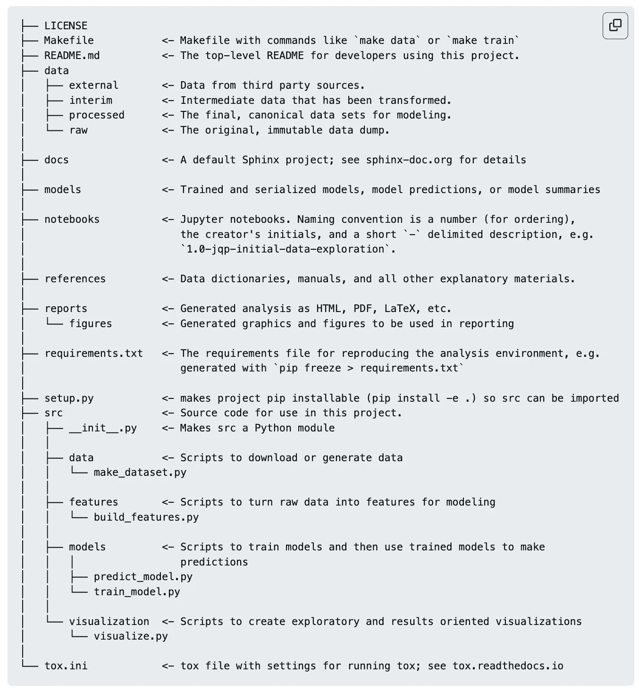
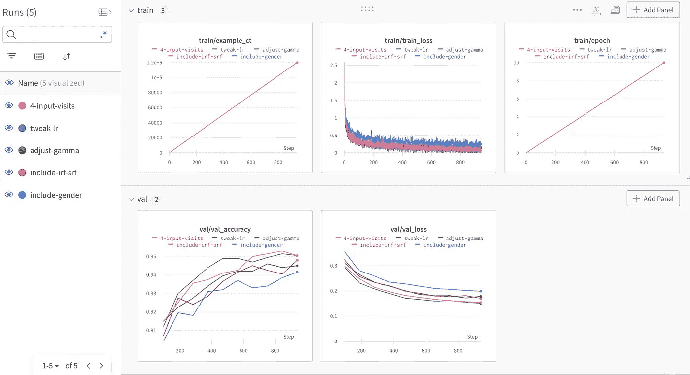
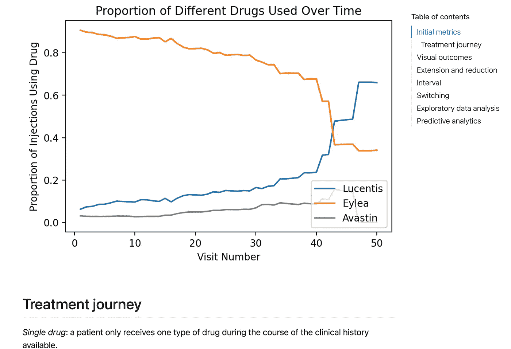

# 人工智能初创公司的数据分析原则

> 原文：<https://towardsdatascience.com/data-analytics-principles-at-an-ai-startup-eebbdb208c55>

## 数据分析和机器学习科学方法的规则

蒂姆·高在 [Unsplash](https://unsplash.com?utm_source=medium&utm_medium=referral) 上拍摄的照片

我在 SaaS 空间的一家健康创业公司工作，作为一名数据科学家，我的职责主要是生成可重复的分析和构建信息丰富的机器学习模型。虽然这似乎是一个相当标准的角色，但我认为在如何实现这一点上，比一些局外人(甚至是数据科学家自己)可能想象的要紧张得多。

数据科学经常在两个极端之间摇摆:确保工作的输出是完美的，或者关注产生输出的代码。不幸的是，这种不平衡的方法导致了双方的问题。只考虑最终产品会降低代码的正确性和可再现性，并导致产生大量的技术债务。相反，像软件开发人员一样迂腐地编写代码会降低数据科学团队的敏捷性，并阻止他们快速迭代实验以找到“足够好”的解决方案。在这里，我的目标是概述我公司的数据科学团队使用的过程，以在两个极端之间取得适当的平衡。

# 项目模板减少了开销

[Cookiecutter 数据科学](https://drivendata.github.io/cookiecutter-data-science/)的人认为我们的工作应该是正确的和可重复的。达到这种平衡是困难的，为此他们提倡在项目间使用标准模板，可以根据需要进行修改。对此的主要论点是:

*   原始数据应该是不可变的，因此数据应该以结构化的方式存储，这意味着您只处理原始数据，而不覆盖它。
*   虽然笔记本很适合探索，但它们不太擅长复制分析。为此，笔记本应该与脚本分开。这创造了一种共生和自我维持的关系:笔记本中的代码可以重构为脚本，脚本可以用于在笔记本中进行进一步的分析和探索。
*   结构允许容易再现的计算环境。

这种组织结构也有助于文档化。当每个项目都有相同的结构时，人们知道去哪里找代码。他们花在如何安排回购上的时间要少得多，这很累，而且会消耗掉原本可以用于贡献的精力。

我使用 Cookiecutter 模板的一个项目的自述文件(图片由作者提供)。

# 使用实验跟踪器

大多数人最初都很难习惯机器学习模型的版本控制。我知道我做到了。当我第一次开始将深度学习应用于工作中的问题时，我的大多数结果都是随意保存的。我会有一个 csv 列表，其名称类似于 *model_run_3_tweak_lr.csv* ，以及另一个包含不同特征工程的不同数据集的完整列表。事情很快变得非常混乱。

幸运的是，我发现了[权重和偏差](https://wandb.ai/home)，它允许团队快速迭代不同的模型，持续评估标准度量，并执行超参数调整。这导致了更好的再现性和对产生模型的过程的更好理解。当我写一篇涉及长期预测视力的论文时，我严重依赖 WandB，仅仅是因为我必须调整的超参数的数量。

一个 WandB 仪表板示例，我在预测患者视力时用来跟踪实验(图片由作者提供)。

# 使用最容易理解的格式，而不是最流行的

一段时间以来，我在工作中面临的一个问题是如何向我们产品的客户呈现回顾性和实时数据。这两种类型的数据以不同的方式存储。以前，我一直在尝试许多不同的压缩分析方法，比如 Plotly 仪表盘、元数据库页面和简单的复制粘贴到谷歌文档。正如你可能猜到的，这是站不住脚的。

有一天，我写了一个脚本来接收客户的回顾性数据，生成大量具有各种结果的 CSV，将这些 CSV 传送到一个 R-script，该脚本将为我生成一些漂亮的`ggplot`数据，然后返回到另一个脚本，该脚本收集所有这些数据并将其转储到 Google Drive 中的一个文件夹。我认为这很棒，但我意识到这对我们公司没有多大用处时已经太晚了。其中一个分析人员仍然不得不将文件夹中的所有内容移动到一个漂亮的文档中。

在尝试了许多其他解决方案后，我选定了一个非常简单的方案。我仍然有我的分析脚本，但是我会从一个笔记本中调用它们(它本身是从一个模板中复制的)。在确保客户的数据格式正确后，我将文件路径输入笔记本，这将在笔记本中生成我需要的所有内容(图表等)。).我会插入一些注释，并使用 Quarto 将 Jupyter 笔记本转换为交互式 HTML 文档，并隐藏代码。我在公司的第一份回顾报告花了我大约 3 个月的时间。现在，我可以在不到五分钟的时间内生成回顾性的标准化数据报告。保持简单。

使用 Quarto 生成的匿名 HTML 报告示例(图片由作者提供)。

# 当解决方案不起作用时承认

几个月前，当我训练 NLP 模型从自由文本中提取客户数据时，出现了一个完美的例子。使用虚拟数据的原始模型非常好:在微调了 HuggingFace 的 DistilBERT 问答模型后，我在所有问题的 F 分数和精确匹配上都得到了 90 分以上。然而，随着更多真实世界的数据开始出现，它开始占用我的时间:

*   我必须标记至少几个数据实例，以便让模型有所学习
*   这是非常具体的行话，所以无监督学习效果不好
*   该模型似乎不愿意学习数据中存在的所有异常值

即使经过一个多月的努力，我最终还是得到了相当差的结果。我决定用老办法，写一堆硬编码的规则来提取我们的信息。这是一个更好的解决方案，我希望我能早点这么做，而不是被大型语言模型和迁移学习的诱惑所诱惑。

# 结论

显然，这些并不是包罗万象的规则，只是我在过去几年里学到的一些好的指导原则。我相信，随着我编写更多的意大利面条式代码，将更大的神经网络应用于基本问题，并在未来的项目中摸索前进，我会继续添加它们。但这就是你学习的方式！