# 使用 DVC 进行数据和机器学习模型版本控制

> 原文：<https://towardsdatascience.com/data-and-machine-learning-model-versioning-with-dvc-34fdadd06b15>

## DVC:这是一个 Git，但对于我们的数据和 ML 模型


由[卢卡·布拉沃](https://unsplash.com/@lucabravo?utm_source=unsplash&utm_medium=referral&utm_content=creditCopyText)在 [Unsplash](https://unsplash.com/s/photos/grey?utm_source=unsplash&utm_medium=referral&utm_content=creditCopyText) 拍摄的照片

我想我们都同意，每个数据科学项目都很有可能变得极其混乱。数据科学项目中有三种常见的混乱来源:*代码*、*数据*和 *ML 模型*。

以下是数据科学项目中源于数据、ML 模型或代码的混乱的一些例子:

*   ***数据*** ➡️我们实现哪些 ML 模型并不重要，它们都需要几组特征，这些特征需要在训练过程之前进行预处理。问题是，我们不知道哪些特性或预处理技术最适合我们的模型。因此，我们很可能最终会创建数据集的几个版本，每个版本都使用不同的转换或特征工程技术。
*   ***ML 模型*** ➡️每个模型都有需要微调的超参数。然而，我们不太可能知道超参数的组合会给我们最好的结果，所以最有可能的是，我们最终会有几个版本的模型。
*   ***代码*** ➡️为数据预处理管道和模型训练开发脚本不是一个线性的过程。因此，我们需要不断地更改/更新几行代码来调整模型的超参数值，或者添加/删除数据管道步骤。

由于上述问题，接下来可能会发生以下情况:

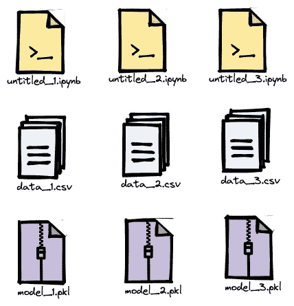

作者图片

经过大量的实验后，我们假设`model_2.pkl`给出了目前为止我们训练的三个模型中最好的结果。如果没有适当的方法来构建我们的数据科学项目，我们最终可能会问自己以下任何(如果不是全部)问题:

*   我们使用了哪些数据和预处理技术来训练这个模型？
*   我们用来获得这个模型的超参数设置是什么？
*   如果我们忘记了用于训练该模型的数据和超参数设置，那么有人如何能够再现该实验以获得相同的模型呢？

现在想象一下，我们项目的复杂性呈指数增长，在数据科学项目中重现任何实验都变得极其困难。

# 去救援吗？

为了解决上面的问题，我们可以使用 Git，这是一个版本控制来跟踪我们的代码。使用 Git，您可以在不同版本的代码之间来回切换。

然而，Git 并不是解决数据科学项目再现性问题的最佳解决方案，因为:

*   Git 主要设计用于存储文本文件，通常不能很好地跟踪二进制文件(例如数据集)的变化。
*   Git-LFS 使我们能够在 Git 上构建时存储大文件，它需要一个特殊的服务器，并且有文件大小限制，当我们想要存储巨大的数据集和模型时，这可能是一个问题。

相反，我们想要的是一个专门为数据科学问题设计的控制版本系统。这意味着控制版本系统:

*   允许我们选择存储服务来托管我们的数据和模型，同时还允许我们在不同版本的数据和模型之间轻松切换。
*   允许我们根据特定版本的数据集或模型重现数据科学问题的结果。

这也是 DVC 对我们非常有帮助的地方。

# 什么是 DVC？

DVC 代表**数据版本控制**。这是一个开源工具，允许我们轻松地对我们的数据、ML 模型、度量文件等进行版本控制。如果你了解 Git，那么就很容易理解 DVC 是如何工作的，因为 Git 和 DVC 有很多相似之处:

*   DVC 和 Git 有相似的概念和语法，但是它主要是被设计来跟踪我们的数据、ML 模型、度量等等。
*   DVC 与 Git 无缝协作，我们将看到如何利用两者来一次轻松地对源代码、数据和 ML 模型进行版本控制。

DVC 的一个主要优势是，它允许我们在自己选择的存储服务中存储不同版本的数据。这可以在亚马逊 S3，谷歌驱动，Azure，谷歌云存储，或者只是在我们的本地机器上。

DVC 通过生成一个指向数据或模型的特定版本的轻量级文本文件来跟踪我们的数据或模型的不同版本。每当我们想从远程存储或缓存中获取数据集或模型的特定版本时，DVC 都会使用这个文本文件。

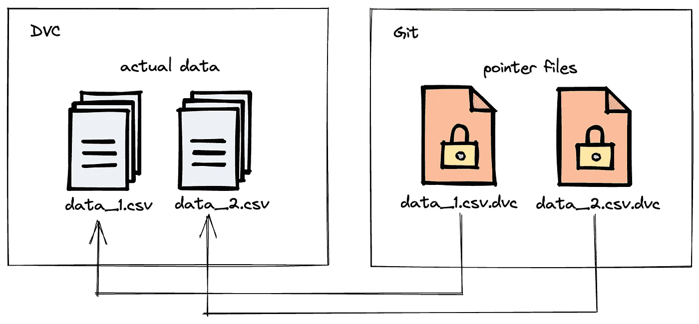

作者图片

我们通常用 Git 将这个小文本文件和所有代码存储在一起。所以最终，我们在 Git repo 中只有代码和这个轻量级的文本文件，而实际的数据和模型驻留在我们选择的远程存储中。

现在让我们开始实施 DVC。

# 入门指南

在本文中，我们将了解如何使用 DVC 跟踪不同版本的数据集和 ML 模型。此外，我们将了解如何使用它在不同版本的数据集和 ML 模型之间来回切换。

如果您还没有这样做，您可以使用 pip install 安装 DVC:

```
pip install dvc
```

我们首先需要做的是在本地计算机上创建一个空文件夹，作为我们的本地 repo。为了简单起见，我们称这个文件夹为`dvc-project`

接下来，要使这个文件夹成为本地 repo，我们需要在终端中使用以下命令初始化这个文件夹中的 Git 和 DVC:

```
$ cd dvc-project
$ git init
$ dvc init
```

如果一切顺利，您将在命令行中得到以下消息:

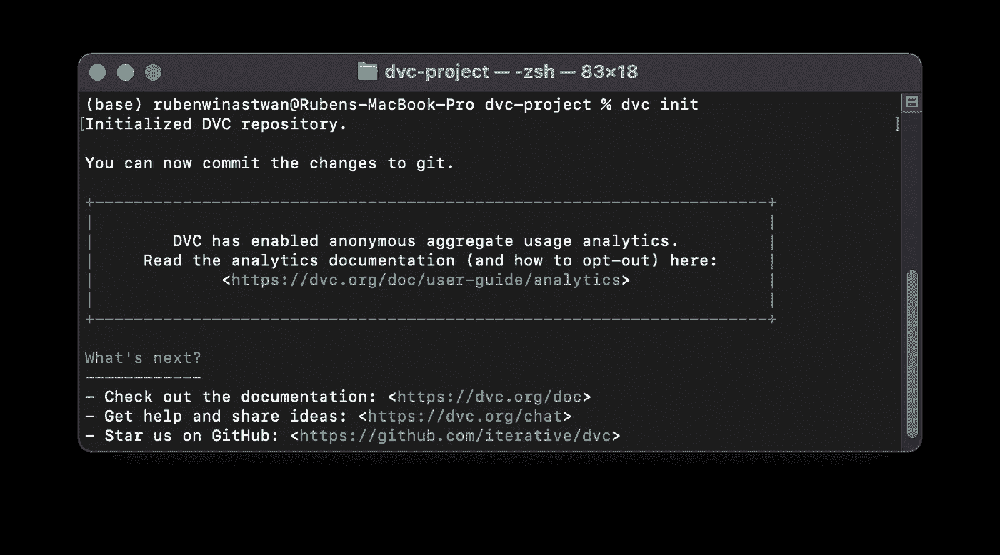

作者图片

在我们初始化 DVC 之后，在我们的`dvc-project`文件夹中创建了一个名为`.dvc/`的目录来存储配置文件、缓存位置和其他内部目录。当你输入`git status`命令时，你可以看到它们是在文件夹中创建的。

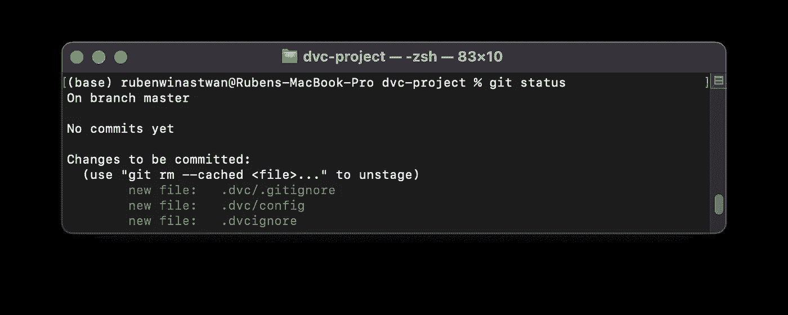

作者图片

接下来，我们需要指定我们的远程存储，即我们存储不同版本的数据和 ML 模型的实际存储。这可以是谷歌驱动、亚马逊 S3、谷歌云存储、Azure 存储，或者在你的本地机器上。通常，您可以使用以下命令设置远程存储:

```
$ dvc remote add -d remote path/to/remote
```

在本文中，我们将使用 Google Drive，因为我相信任何人都有 Google Drive。要用 DVC 在 Google Drive 上设置我们的远程存储，我们可以执行以下简单的命令:

```
$ dvc remote add -d remote gdrive://{random numbers+letters}
```

每当你打开 Google Drive 时，你在那里创建的任何文件夹的 URL 看起来都会像这样:

```
[https://drive.google.com/drive/u/0/folders/1v1cBGN9vS9NT6-t6QhJG](https://drive.google.com/drive/u/0/folders/1v1cBGN9vS9NT6-t6QhJGiNxshTu-7dFw)
```

只需将上面包含数字和字母组合的 URL 部分复制到上面的 DVC 命令中。在上面的例子中，这将是:

```
$ dvc remote add -d remote gdrive://[1v1cBGN9vS9NT6-t6QhJG](https://drive.google.com/drive/u/0/folders/1v1cBGN9vS9NT6-t6QhJGiNxshTu-7dFw)
```

要检查远程存储是否已正确设置，我们可以使用以下命令:

```
$ dvc config -l
```

最后，由于我们刚刚通知了 DVC 我们的远程存储在哪里，那么`.dvc/`目录中的配置文件也将被更新。为了跟踪这一更新，`git add`命令将完成这项工作。

```
git add .dvc/config
```

我们都准备好了！现在我们可以开始和 DVC 一起玩了。

# 数据版本化

我们将在本文中使用的数据是 [Twitter 情感数据集](https://www.kaggle.com/datasets/jp797498e/twitter-entity-sentiment-analysis)的子集。该数据集不受版权保护，因此您可以出于自己的目的使用它。我将数据集分成两部分:一部分叫做`twitter_1.csv`，另一部分叫做`twitter_2.csv`。

## 数据的第一版本

这个数据集的第一个版本就是最初的`twitter_1.csv`和`twitter_2.csv`。要获得这些数据，只需复制下面的两个`dvc get-url`命令:

```
$ dvc get-url [https://dagshub.com/marcellusruben/twitter_data/raw/00d21f134ed9449ab55d732dd8030a45284142df/twitter_1.csv](https://dagshub.com/marcellusruben/twitter_data/raw/00d21f134ed9449ab55d732dd8030a45284142df/twitter_1.csv)$ dvc get-url [https://dagshub.com/marcellusruben/twitter_data/raw/00d21f134ed9449ab55d732dd8030a45284142df/twitter_2.csv](https://dagshub.com/marcellusruben/twitter_data/raw/00d21f134ed9449ab55d732dd8030a45284142df/twitter_2.csv)
```

现在如果你看一下你的`dvc-project`文件夹，你会看到现在你有`twitter_1.csv`和`twitter_2.csv`。这两个文件都有大约 2,5 MB 的内存。

作为第一步，让我们将这些文件存储到我们的远程存储中，这是我们在上一节中设置的 Google Drive。要将我们的 CSV 文件推入远程存储，首先我们需要用`dvc add`命令跟踪这两个文件:

```
$ dvc add twitter_1.csv twitter_2.csv
```

当我们使用`dvc add`命令时，我们基本上是告诉 DVC，在我们将这两个文件上传到远程存储之前，我们希望 DVC 跟踪并准备好这两个文件。该命令类似于`git add`命令。

在这个`dvc add`命令之后，运行`git status`命令，您将看到类似的输出，如下所示:

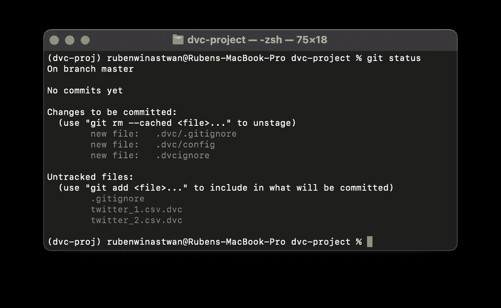

作者图片

在`dvc add`命令之后生成了 3 个新文件:一个`.gitignore`文件和与我们的数据集名称相似的文件，最后带有附加的`.dvc`扩展名。

*   `.gitignore`文件告诉 Git 忽略我们用 DVC ( `twitter_1.csv`和`twitter_2.csv`)跟踪的数据集
*   扩展名为`.dvc`的文件是文本文件，它将充当指向实际数据集的指针。例如，`twitter_1.csv.dvc`是指向`twitter_1.csv`数据的指针。

如前一节所述，Git 将跟踪这些指针文件。通过跟踪指针文件而不是实际数据，我们就不再在 Git repo 中存储大文件(比如实际数据集)。

接下来，我们可以使用`dvc push`命令将数据推入远程存储:

```
$ dvc push
```

如果你看一下你的 Google Drive，现在你应该有如下类似的文件夹:

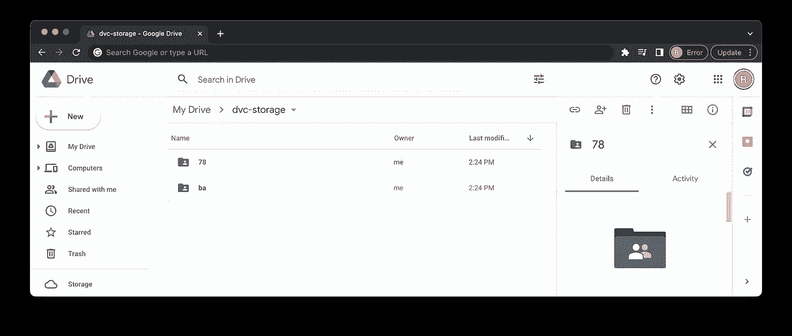

作者图片

使用`dvc push`命令推送数据集后，您在 Google Drive 或远程存储上看到的文件称为 blob，正如您在上面的截图中看到的。DVC 将原始数据集的内容存储在这个 blob 中。

现在，让我们保存数据的当前版本，以便以后我们可以随时访问它。以下是执行此操作的步骤:

*   使用`git add`命令用 Git 跟踪`.gitignore`文件和扩展名为`.dvc`的文件
*   用`git commit`提交文件，然后在提交过程中写一些有意义的消息
*   向 commit with `git tag`命令添加一个有意义的标记。这个命令很重要，因为当我们稍后想要在数据集的不同版本之间切换时，这个标签就是我们要参考的

```
$ git add .gitignore twitter_1.csv.dvc twitter_2.csv.dvc
$ git commit -m "Dataset V1.0"
$ git tag v1.0
```

这就是我们数据的第一个版本。以下是我们迄今为止所做工作的示例:

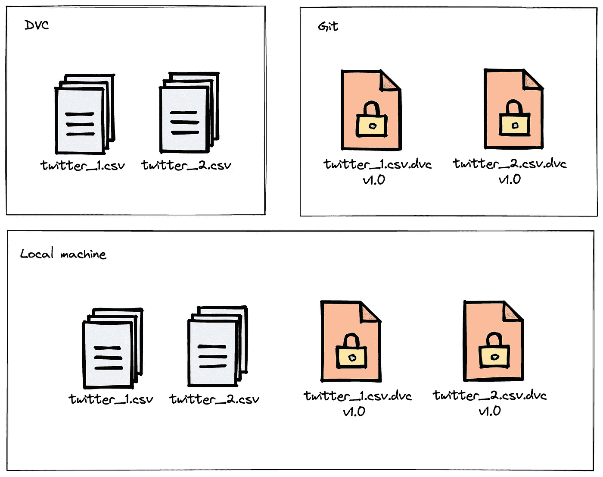

作者图片

## 数据的第二个版本

对于数据的第二个版本，假设我们想要修改我们的`twitter_1.csv`。也就是说，我们想要将`twitter_2.csv`的所有内容添加到`twitter_1.csv`中:

```
**With Mac/Linux**
$ cat <(tail +2 twitter_2.csv) >> twitter_1.csv**With Windows**
$ more +2 twitter_2.csv >> twitter_1.csv
```

如果你看看它的大小，`imdb_review_1.csv`现在有大约 5 MB 的内存，是以前数据的两倍。如果我们键入`dvc status`命令，您会看到一个通知，告知我们的`imdb_review_1.csv`数据已被修改。

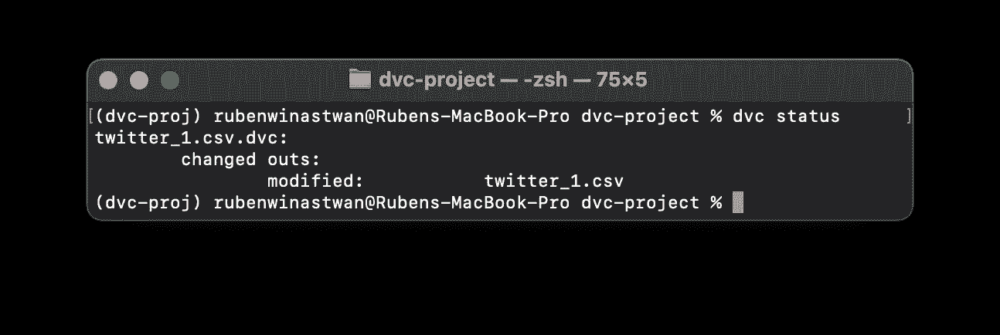

作者图片

接下来，让我们用 DVC 跟踪修改后的数据。和以前一样，我们使用`dvc add`命令来实现这个目的。

```
$ dvc add twitter_1.csv twitter_2.csv
```

现在让我们用`push`命令将修改后的文件推送到远程存储器。

```
$ dvc push
```

你应该会看到你的 Google Drive 上多了一个文件夹，而不是两个。这是因为只有`twitter_1.csv`被修改，而`twitter_2.csv`保持不变。

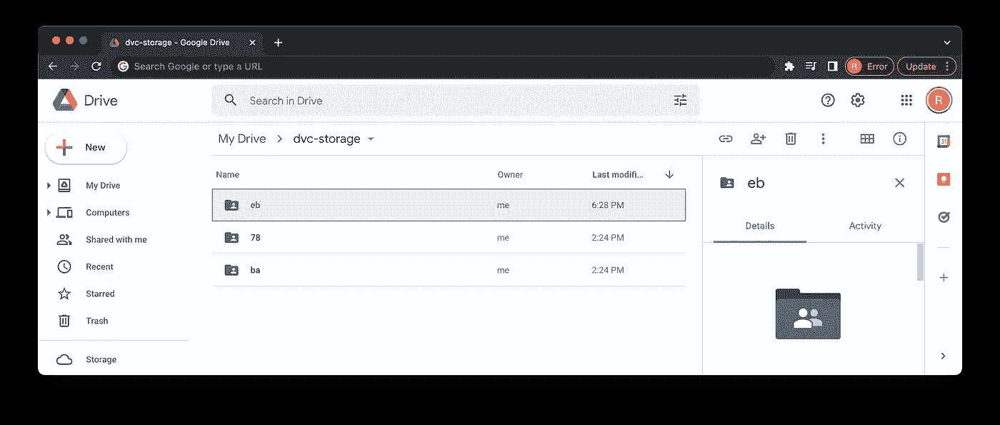

作者图片

在`dvc add`命令之后，可能会发生两件事:

*   如果我们添加/跟踪一个新文件(或者在我们的例子中是一个新的 CSV 文件)，那么对应于这个新文件的一个新的`.dvc`指针文件将被创建
*   如果我们添加/跟踪一个现有文件，但其内容已被修改，那么其现有的`.dvc`指针文件也将被修改，而不会创建新的文件

由于我们只修改了`twitter_1.csv`，那么它的`.dvc`文件也会被修改，而`twitter_2.csv`的`.dvc`文件保持不变。Git 会自动识别修改后的`.dvc`文件，如下所示:

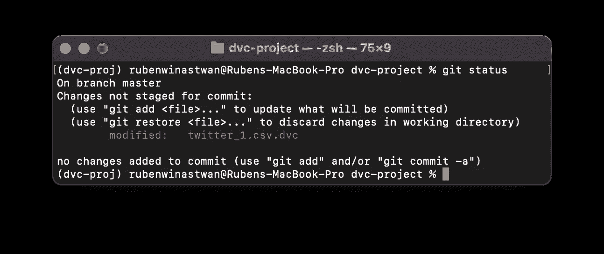

作者图片

我们需要再次用 Git 跟踪更新后的文件，提交它，然后在提交时添加一个有意义的标记，如下所示:

```
$ git add twitter_1.csv.dvc
$ git commit -m "Dataset V2.0"
$ git tag v2.0
```

这就是我们数据的第二个版本。以下是我们在拥有两个版本的数据后目前所拥有的数据的图示:

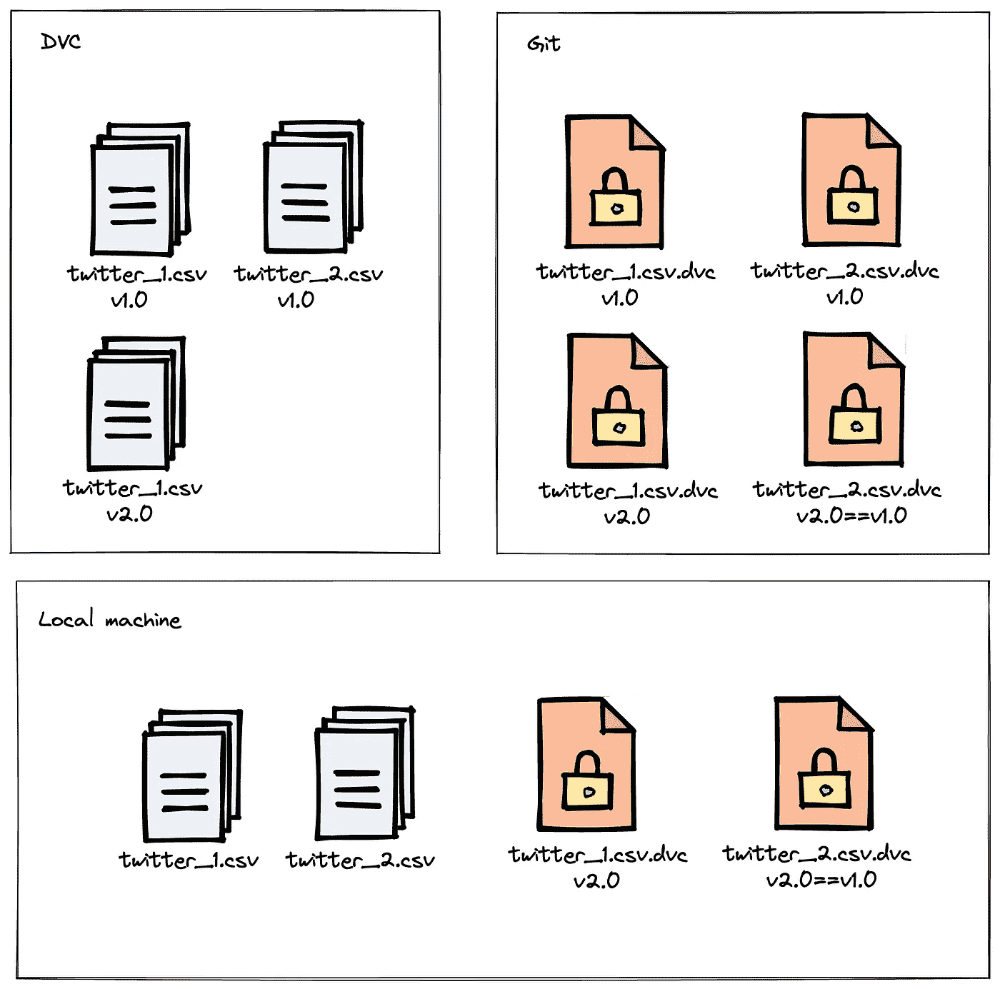

作者图片

## 切换不同版本的数据

现在，假设我们想要恢复到数据的第一个版本。我们可以通过输入`git checkout <tag>`命令来完成。

之前在第一次提交时，我们将标签`v1.0`包含在提交中。因此，我们可以使用以下命令获取数据的第一个版本:

```
$ git checkout v1.0
$ dvc pull
```

在执行完`dvc pull`命令后，您会注意到我们的`twitter_1.csv`数据集不再有 5 MB 的内存。相反，它有 2,5 MB 的内存，就像它在开始时一样。

就是这样！我们已经成功地将数据集恢复到了以前的版本。使用同样的方法，您可以通过以下方式恢复到数据集的较新版本(即添加`twitter_2.csv`后的`twitter_1.csv`):

```
$ git checkout v2.0
$ dvc pull
```

或者，如果您只想获取特定版本中的特定数据，例如`twitter_1.csv`1.0 版，但仍想将`twitter_2.csv`保留在 2.0 版中，您可以在`dvc pull`命令中添加您想要获取的数据的规格，如下所示:

```
$ git checkout v1.0
$ dvc pull twitter_1.csv
```

# 模型版本控制

同样的概念也可以应用于 ML 模型的版本化。为了演示如何做到这一点，我们将使用一个 ML 模型来预测一条推文的情绪:这条推文是正面情绪还是负面情绪。我们的数据集将是我们在上一节中使用的`twitter_1.csv`。

第一步，还是在我们的`dvc-project`文件夹中，让我们通过下面的命令下载源代码:

```
$ dvc get-url [https://dagshub.com/marcellusruben/twitter_data/raw/00d21f134ed9449ab55d732dd8030a45284142df/train_evaluate.py](https://dagshub.com/marcellusruben/twitter_data/raw/00d21f134ed9449ab55d732dd8030a45284142df/train_evaluate.py)
```

这个`train_and_evaluate.py`脚本执行以下操作:

*   使用所选数据集训练模型，在我们的例子中，这将是`twitter_1.csv`
*   将训练期间每个历元的精度值记录到名为`history.json`的 JSON 文件中
*   将训练好的模型保存为`.h5`格式
*   在测试集上评估训练模型的准确性，并将准确性结果写入名为`evaluation.json`的 JSON 文件中

为了确保您能够运行脚本，pip 安装以下要求:

```
nltk==3.6.5
numpy==1.23.3
pandas==1.3.4
PyYAML==6.0
scikit_learn==1.1.1
tensorflow==2.9.1
```

此外，我们还应该通过复制以下命令下载一个名为`params.yaml`的 YAML 文件:

```
$ dvc get-url [https://dagshub.com/marcellusruben/imdb-data/raw/3420f431a91b8bd7dc8952302338873af2d6e733/params.yaml](https://dagshub.com/marcellusruben/twitter_data/raw/7a6f7a4c6cf1506a22780c15b207c280c69c59ac/params.yaml)
```

该文件包含我们可以调整的 ML 模型的一个超参数值，即 LSTM 层数。

## 模型的第一个版本

对于模型的第一个版本，我们将使用`params.yaml`中的默认超参数值训练模型，其中 LSTM 的输出层设置为 16。

当我们有一个脚本，它将一些东西作为输入，然后输出结果，那么我们可以使用`dvc run`命令从 DVC 自动捕获:

```
$ dvc run -n train-and-evaluate -d train_evaluate.py -p train.lstm_out -o model.h5 --plots-no-cache history.json -M evaluation.json python train_evaluate.py twitter_1.csv
```

上面的命令中有很多参数，所以让我们逐个分析它们:

*   `-n`:给我们的管道起一个合适的名字，这样当我们想要重现结果或者以后改变什么的时候就可以很容易地调用它。在上面的例子中，我们称我们的管道为`train-and-evaluate`
*   `-d`:告诉 DVC 我们的管道`train-and-evaluate`依赖于哪个文件。在上面的例子中，我们的管道依赖于我们的`train_evaluate.py`脚本。
*   `-p`:指定`path`中参数文件的参数依赖关系。默认情况下，它会查看`params.yaml`中的参数。在我们的例子中，这将是我们之前下载的`params.yaml`中 LSTM 图层的数量。
*   `-o`:告诉 DVC 自动跟踪运行脚本后的输出。我们的`train-evaluate.py`脚本将生成一个名为`model.h5`的经过训练的模型。这类似于我们在上一节中看到的独立的`dvc add`命令
*   `-M`:指定一个度量文件，这样我们可以在测试集上用`dvc metrics`评估和比较模型性能。因为我们的脚本生成了一个名为`evaluation.json`的度量文件，所以我们可以使用这个命令
*   `--plots-no-cache`:指定一个绘图文件，以便我们稍后可以用`dvc plots`创建或比较一些可视化。我们的脚本在名为`history.json`的文件中生成训练期间每个时期的模型精度，因此我们可以使用这个命令
*   告诉 DVC 运行管道

在我们用上面的`dvc run`命令运行脚本后，您会看到一个名为`dvc.yaml`的新的重要文件。

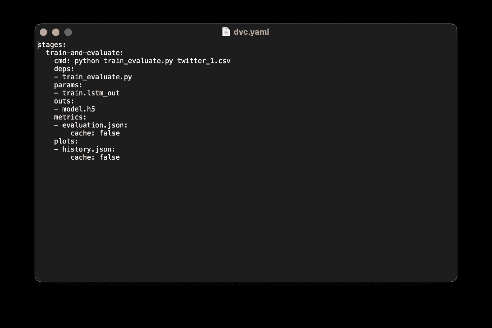

作者图片

这个文件为我们提供了关于`train-and-evaluate`管道的必要信息:它依赖于哪个脚本，它将生成和跟踪哪个输出文件，哪个文件将作为度量或绘图，等等。

除了`dvc.yaml`，还有一个叫做`dvc.lock`的附加文件，看起来像这样:

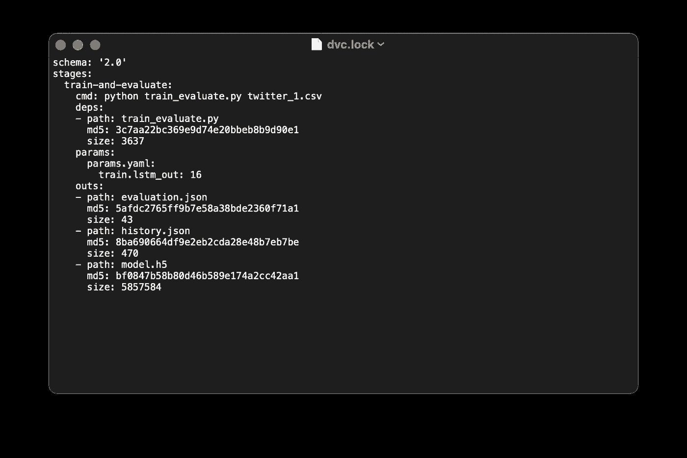

作者图片

`dvc.lock`文件允许 DVC 跟踪依赖值的变化，即与我们之前的运行相比，我们是否改变了`params.yaml`中的超参数值。它还跟踪特定 DVC 管道的每个输出文件的哈希。

现在，如果我们想在测试集上评估训练模型的性能，我们可以使用`dvc metrics`命令，如下所示:

```
$ dvc metrics show
```

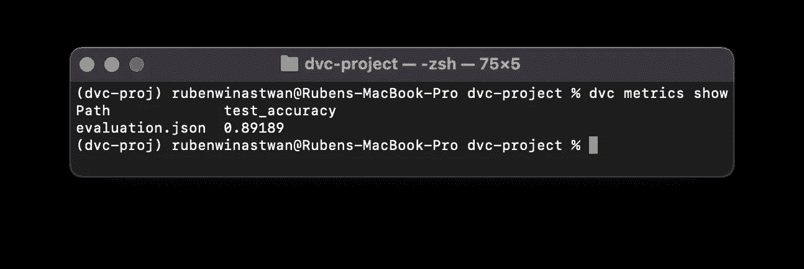

作者图片

我们还可以可视化我们模型的训练历史。首先我们需要告诉 DVC 哪个变量会在*轴和*轴。在`history.json`里面，我们有两个变量:*精度*和*历元*。我们将使用 x 轴*中的*历元*和 y 轴 中的*精度*。最后，我们用`dvc plot`来可视化剧情。***

```
**$ dvc plots modify history.json -x epochs -y accuracy
$ dvc plots show**
```

**在该命令之后，您应该会看到一个链接，在该链接中您可以在浏览器中看到可视化效果。**

**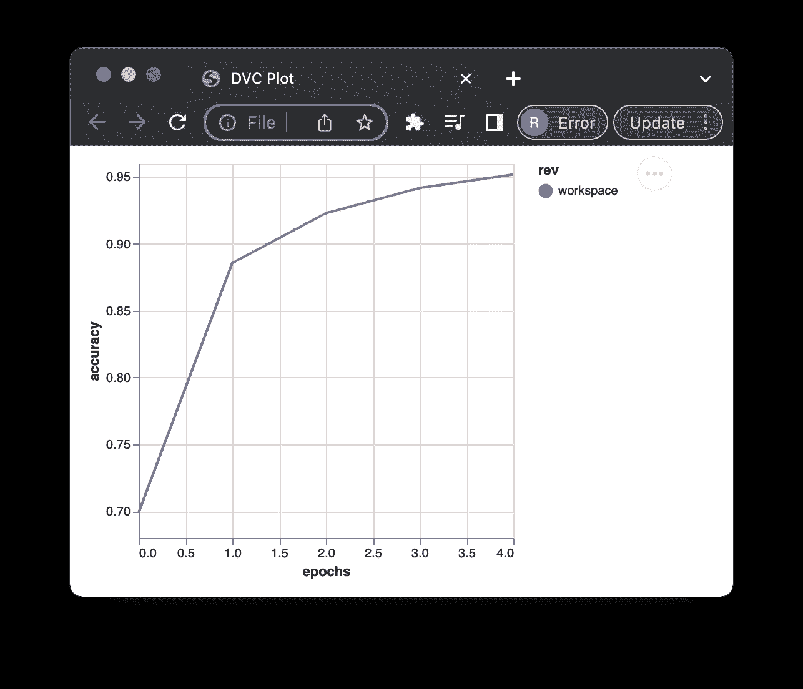**

**作者图片**

**现在让我们将自动跟踪的`model.h5`推入我们的 Google Drive，用 Git 跟踪所有其他文件(`dvc.yaml`、`evaluation.json`、`history.json`、`train_evaluate.py`、`dvc.lock`)，然后提交它们:**

```
**$ dvc push
$ git add .
$ git commit -m "data_model_v1"
$ git tag data_model_v1**
```

**这就是我们模型的第一个版本！**

## **模型的第二个版本**

**假设我们想做另一个实验，看看如果我们将`params.yaml`中的 LSTM 层从 16 层改为 2 层，模型的性能是否会提高。**

**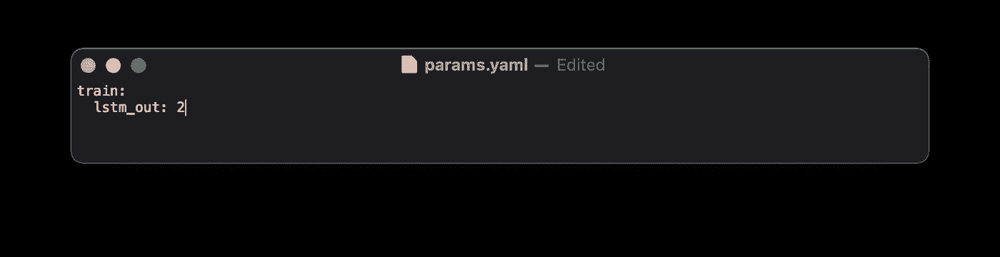**

**作者图片**

**现在，我们可以通过使用`dvc repro`命令调用`train-and-evaluate`管道，用新的超参数值重新训练我们的模型:**

```
**$ dvc repro train-and-evaluate**
```

**脚本运行完成后，我们将更新的`model.h5`推送到我们的 Google Drive，用 Git 跟踪其他更新的文件(`dvc.yaml`、`evaluation.json`、`history.json`、`train_evaluate.py`、`dvc.lock`)，然后提交它们:**

```
**$ dvc push
$ git add .
$ git commit -m "data_and_model_v2"
$ git tag data_model_v2**
```

**这就结束了模型的第二个版本！**

## **切换不同版本的模型**

**现在有趣的部分是，我们可以在使用 DVC 的提交之间比较不同版本的 ML 模型的性能。为此，我们可以使用以下命令:**

```
**$ dvc metrics diff [tag commit 1] [tag commit 2]
$ dvc metrics diff data_model_v2 data_model_v1**
```

**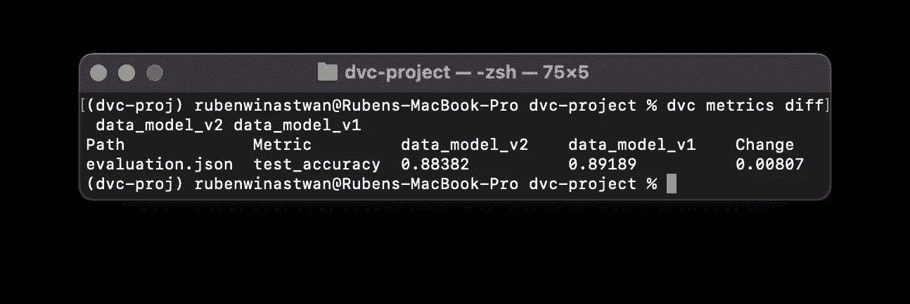**

**作者图片**

**我们还可以使用以下命令比较提交之间不同版本模型的培训历史的可视化:**

```
**$ dvc plots diff [tag commit 1] [tag commit 2]
$ dvc plots diff data_model_v2 data_model_v1**
```

**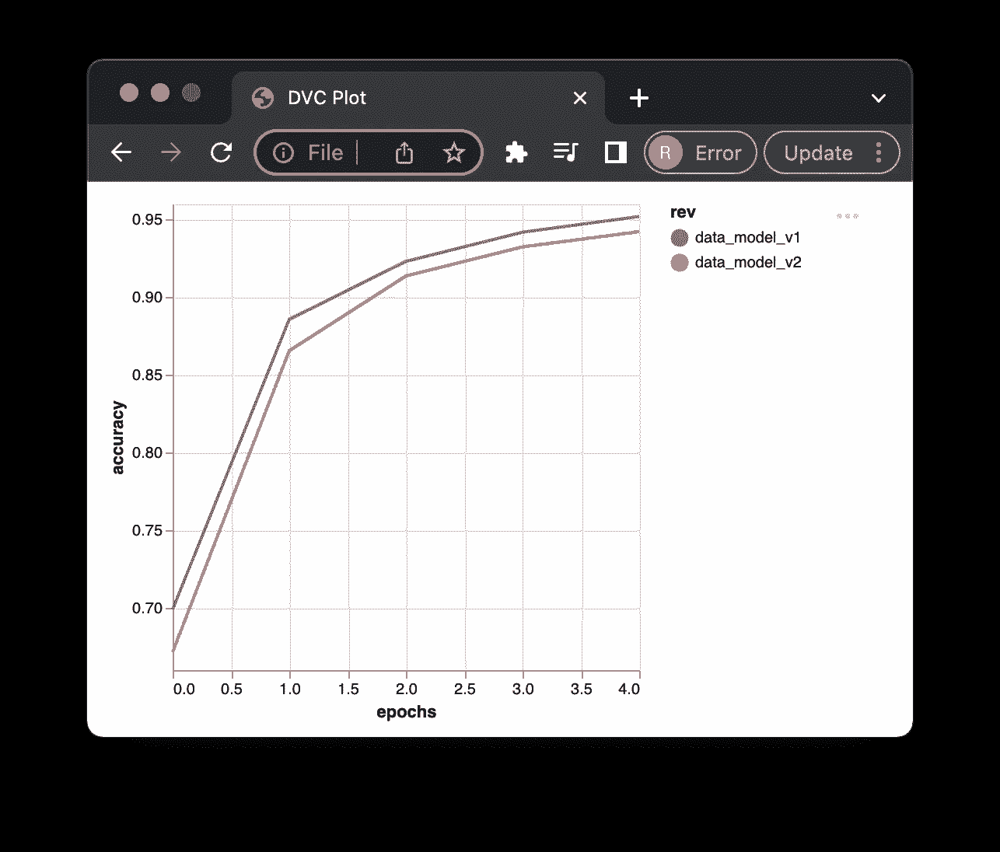**

**作者图片**

**正如你所看到的，我们以前的模型在训练集和测试集上都有更好的准确性。因此，我们想回到以前的版本是合乎逻辑的。正如你已经知道的，我们可以用`git checkout`和`dvc pull command`来做这件事。**

```
**$ git checkout data_model_v1
$ dvc pull**
```

**为了确保我们真的回到了之前的版本，让我们再次运行`dvc metrics`:**

```
**$ dvc metrics show**
```

**您会看到我们的模型的性能与我们的第一个模型相同，在我的例子中是 89.1%。**

**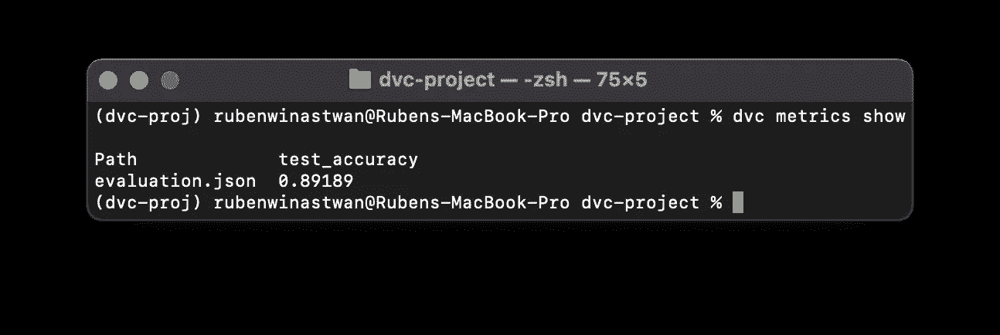**

**作者图片**

**如果你打开`params.yml`，你还会看到 LSTM 层输出的值转换回 16，这是我们的默认设置，也是我们第一个模型被训练的超参数值。**

# **结论**

**在本文中，我们看到了 DVC 如何以多种方式帮助我们组织数据科学项目:**

*   **DVC 将我们的数据科学项目与 Git 无缝集成。它也有和 Git 相似的语法，因此如果你已经知道 Git，学习曲线不会太陡**
*   **DVC 使用亚马逊 S3、Azure、谷歌云、谷歌驱动、HDFS 等流行的存储服务来存储不同版本的数据和模型**
*   **DVC 加强了可再现性，因为我们可以轻松地重新运行具有特定相关性的流水线，并再现结果，而无需考虑使用哪个数据、超参数值或代码版本。**
*   **DVC 让我们很容易与其他团队成员分享我们项目的进展**

**你可以自己探索 DVC 的更多功能，我希望这篇文章对你开始使用 DVC 有所帮助！**