# 将提高您工作效率的数据和系统可视化工具

> 原文：<https://towardsdatascience.com/data-and-system-visualization-tools-that-will-boost-your-productivity-e971c1aed5eb>

## 这些可视化工具将帮助您探索和管理复杂的文件、开发环境等，从而提高您的工作效率

米拉德·法库里安在 [Unsplash](https://unsplash.com/?utm_source=unsplash&utm_medium=referral&utm_content=creditCopyText) 上拍摄的照片

随着文件、数据集和配置的增长，浏览它们变得越来越困难。然而，有许多工具可以帮助您在处理大型 JSON 和 YAML 文件、复杂的正则表达式、混乱的 SQL 数据库关系、复杂的开发环境以及许多其他问题时更有效率。

# JSON

JSON 是适合计算机的格式之一，但不适合人类。即使相对较小 JSON 对象也很难读取和遍历，但是有一个工具可以帮助您！

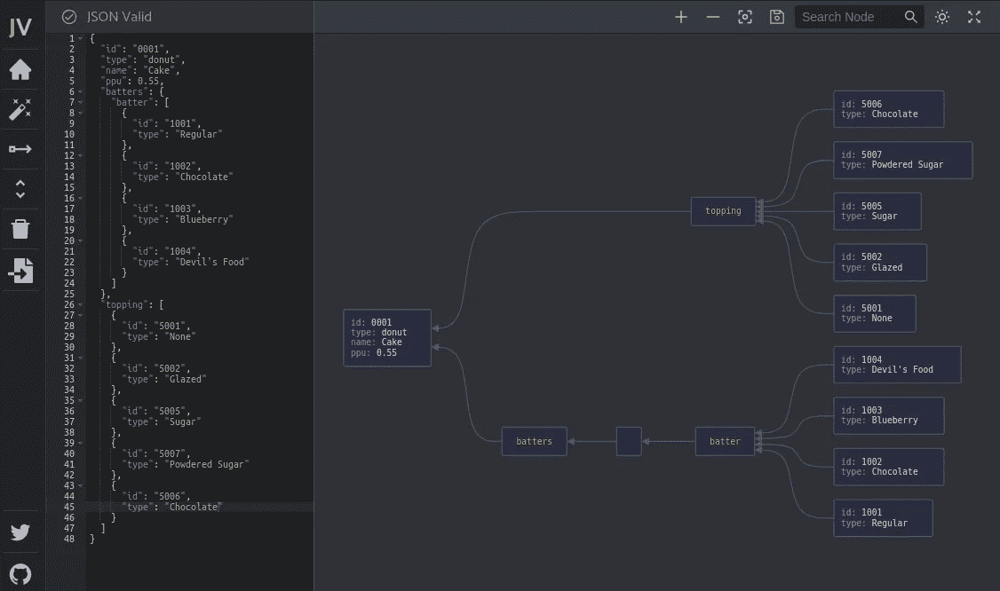

JSON 编辑器—作者图片

[JSON Visio](https://github.com/AykutSarac/jsonvisio.com) 是一个从 JSON 对象生成图表的工具。这些图表比文本格式更容易导航，为了使它更加方便，该工具还允许您搜索节点。此外，生成的图表也可以作为图像下载。

你可以在[https://jsonvisio.com/editor](https://jsonvisio.com/editor)使用网页版，也可以在本地作为 [Docker 容器](https://github.com/AykutSarac/jsonvisio.com#-docker)运行。

# 正则表达式

正则表达式(RegEx)因极其难以阅读而臭名昭著。我推荐两个工具来帮助理解复杂的正则表达式——第一个是 https://regex101.com/:

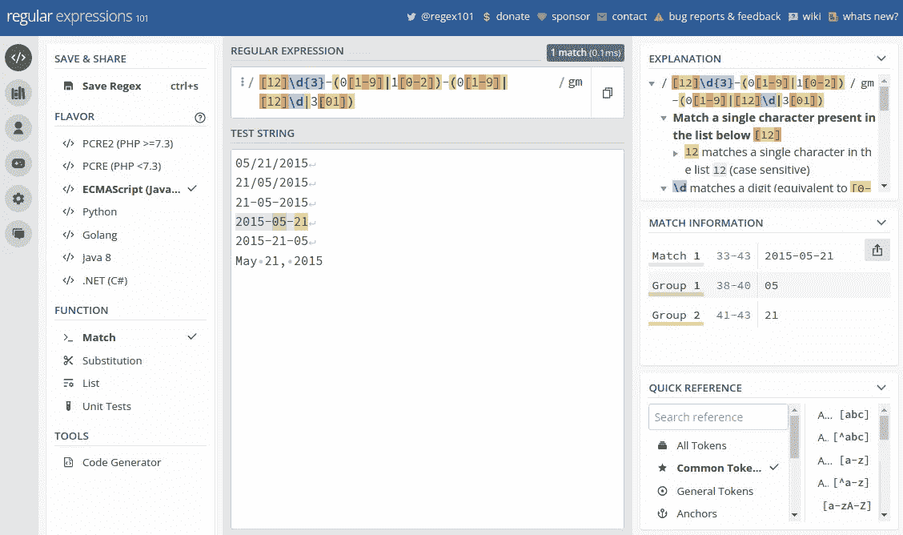

RegEx 101 —作者图片

这可以帮助您构建和测试正则表达式，以及分解它们并识别其各个部分。

第二个是[https://regex-vis.com](https://regex-vis.com)，它从一个正则表达式中生成一个图形，这对于理解表达式的实际作用非常有帮助:

RegEx-Vis —按作者分类的图像

# YAML

YAML，这种语言本应是可读的，但却常常不可读。众所周知，带有多级缩进的长 YAML 文档很难导航和排除故障。

为了避免花费不合理的时间试图找到一个错误的缩进，我建议您使用模式验证，并让您的 IDE 做所有的工作。您可以使用来自[https://schemastore.org/json](https://schemastore.org/json)的验证模式或者自定义模式，比如[这些](https://github.com/instrumenta/kubernetes-json-schema)来验证您的文件。这些将适用于 *JetBrains* 产品(例如 [Pycharm](https://www.jetbrains.com/help/pycharm/json.html#ws_json_using_schemas) 、 [IntelliJ](https://www.jetbrains.com/help/idea/json.html#ws_json_using_schemas) )以及 *VSCode* (参见[本指南](https://developers.redhat.com/blog/2020/11/25/how-to-configure-yaml-schema-to-make-editing-files-easier))

如果你喜欢使用`vim`作为你的编辑器，我推荐使用自定义格式，它可以帮助你发现错误。我的首选配置如下:

最终的格式如下所示:

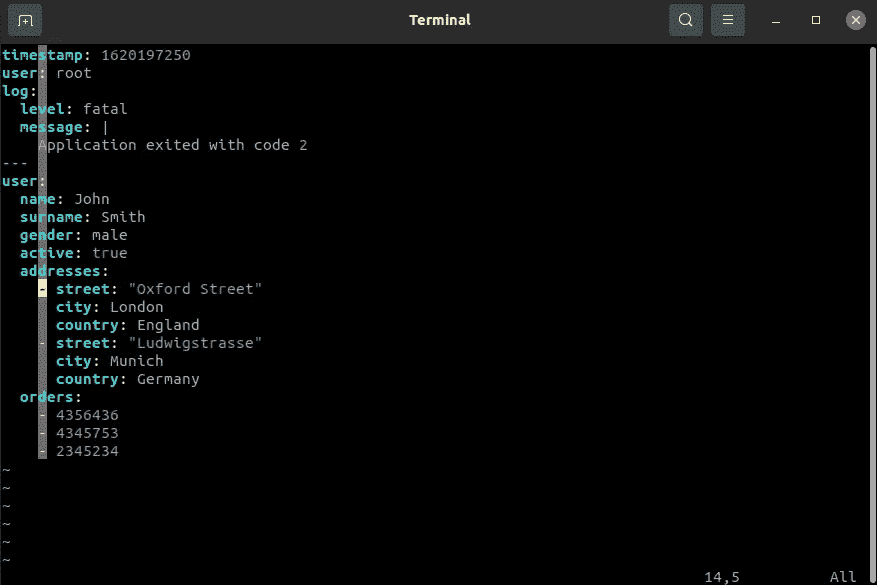

维姆·YAML——作者图片

除了上面提到的工具，使用 YAML linter 也是一个好主意，比如[this](http://www.yamllint.com/)或者它的 [CLI 等价物](https://github.com/adrienverge/yamllint)，它将验证和清理你的文档。

最后，如果你正在使用 OpenAPI/Swagger YAML 规范，那么你可以使用[https://editor.swagger.io/](https://editor.swagger.io/)来查看/验证/编辑你的模式。

# 结构化查询语言

有很多处理关系数据库的软件，但是大多数都集中在连接数据库实例和运行 SQL 查询上。这些功能非常方便，但是对于在可能有数百个表的数据库中导航会非常困难这一事实没有帮助。有一个工具可以解决这个问题，那就是*狱卒*:

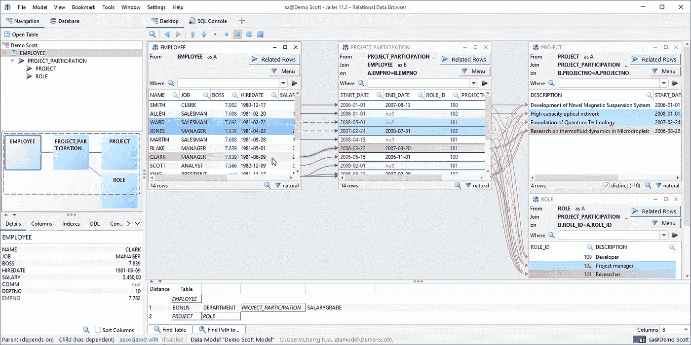

狱卒数据浏览器——图片来自[文档](https://wisser.github.io/Jailer/data-browsing.html)

Jailer 是一个工具，它可以——除了其他功能之外——通过跟随外键在数据库中导航。展示狱卒所有特征的几个视频可以在[这里](https://wisser.github.io/Jailer/videos.html)找到。

# 饭桶

git——一个我们每天都在使用的用户体验非常糟糕的软件——也可以使用一些工具来导航历史(日志)、暂存/提交文件、查看差异或例如重新调整分支。

我选择的工具是 IntelliJ/PyCharm 集成——在我看来，没有比这更好的工具来处理与 git 相关的东西了。

如果您不是 IntelliJ/PyCharm 用户，或者您更喜欢呆在终端中，那么下面的命令会让您的生活稍微轻松一些:

上面的命令将打印出一个可读性很好的提交历史图表，类似于:

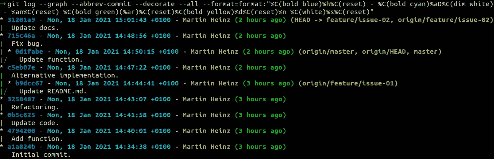

git 日志—作者图片

如果您还希望稍微改进一下区分功能，那么您可以使用`git diff ... --word-diff --color-words`:

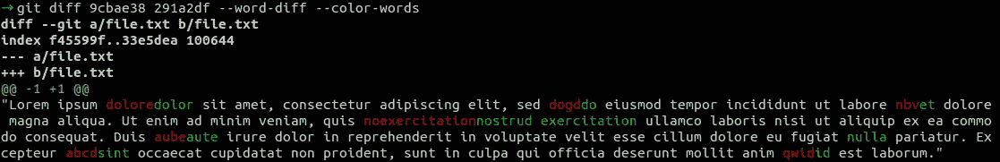

git word diff —按作者分类的图像

正如你从上面两个例子中看到的，只要付出足够的努力，你可能会让命令行`git`的体验变得可以忍受，更多类似的技巧请看我以前的文章:

<https://itnext.io/advanced-git-features-you-didnt-know-you-needed-ed8455c45495>  

如果你想完全避免基本的`git` CLI，你可以尝试使用`forgit`——一个交互使用`git`的 TUI:

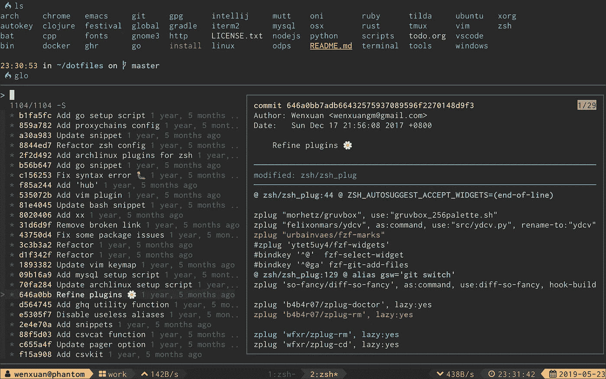

Forgit —图片来自[文档](https://github.com/wfxr/forgit#-features)

上图截图互动好看`git log`。该工具支持几乎所有的`git`子命令，最重要的是`rebase`、`cherry-pick`、`diff`和`commit`。关于特性的完整列表和更多截图，请参见项目的[资源库](https://github.com/wfxr/forgit#-features)。

除了使用`git`或者你的 IDEs 特性，你还可以使用其他工具来帮助完成复杂的文件区分。一个非常强大的工具就是<https://github.com/Wilfred/difftastic>*。支持多种语言的区分工具。关于该工具的演示，请参见本视频。*

*如果你想要一个专门用于区分结构化语言的工具，比如 JSON，XML，HTML，YAML，那么是一个很好的选择。Graphtage 从语义上比较文档，即使改变元素的顺序，它也能正确地发现差异。*

*最后，如果你更喜欢可视化工具，那么你可能会发现 [Meld](https://meldmerge.org/) 很有用，因为它提供了与 JetBrains 产品相似的体验。*

# *码头工人*

*从 DevOps 的角度来看，当使用 Docker 时，用`docker-compose`旋转一堆容器并以很难解决的混乱结束是很常见的。*

*[Lazydocker](https://github.com/jesseduffield/lazydocker) 是同时处理多个 docker 容器的绝佳工具。如果你不相信我，那就去看看项目库中的 [*【电梯间】*](https://github.com/jesseduffield/lazydocker#elevator-pitch) 。*

*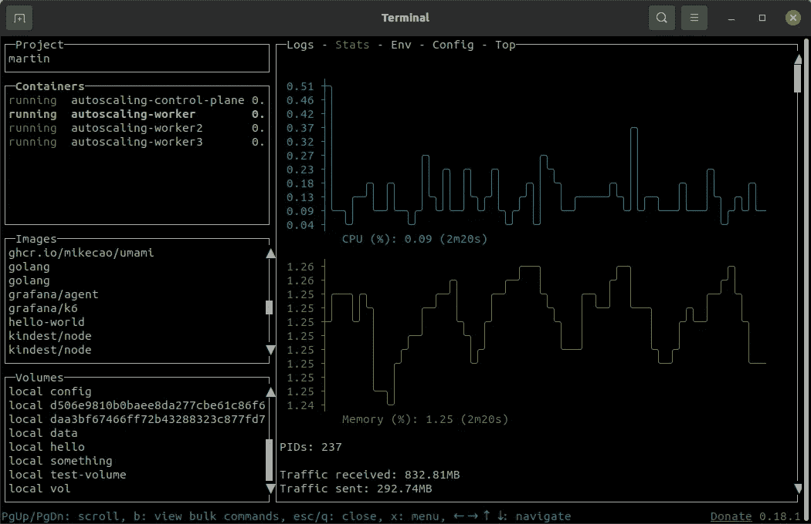*

*懒人——作者图片*

*如果你更喜欢基于浏览器的工具，你可能想试试 [Portainer](https://docs.portainer.io/v/ce-2.11/user/docker/containers/view) ，它提供了导航/检查 Docker 容器、卷、图像等的仪表板。*

*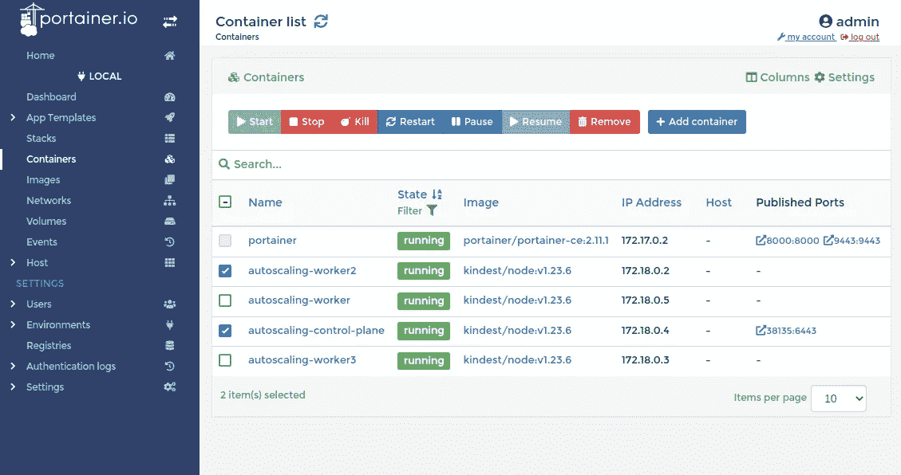*

*Portainer —作者图片*

# *库伯内特斯*

*考虑到每个 API 资源都可以使用一个可视化工具，当谈到 Kubernetes 时，需要涵盖很多内容。然而，有几个值得注意的领域(实际上是痛点)，经常需要可视化工具来有效地设置/管理。*

*第一个是*网络策略*，它可以可视化，也可以使用[https://editor.cilium.io/](https://editor.cilium.io/)进行配置。即使你更喜欢手工制作你的策略，我仍然建议用这个工具来直观地验证它们。*

*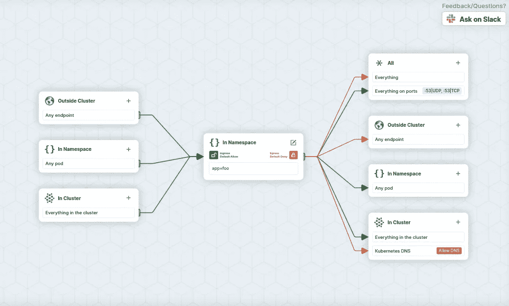*

*网络策略编辑器-作者图片*

*另一个类似的工具是[网络策略查看器](https://artturik.github.io/network-policy-viewer/)，它只关注策略的可视化，并且具有更简单、更易读的图表。*

*我推荐使用[这个网络策略方案的集合](https://github.com/ahmetb/kubernetes-network-policy-recipes)来测试这两个工具，看看它们如何对您的工作流程有所帮助。*

*配置 Kubernetes 的另一个痛点是 RBAC，更具体地说是*角色*、*角色绑定*以及它们的*集群*范围的替代品。有几个工具可以帮助解决这些问题:*

*[Krane](https://github.com/appvia/krane) 是一个可以生成显示所有角色和主题之间关系的图形的工具。Krane 还有许多其他功能，包括 RBAC 风险评估、报告和警报，以及使用 CypherQL 查询/询问 RBAC 规则。*

*Krane 更简单的替代方案是`[rbac-tool](https://github.com/alcideio/rbac-tool)`，它可以作为`kubectl`插件安装。它还可以分析、审核、询问 RBAC 规则，但最重要的是，它可以将它们可视化:*

*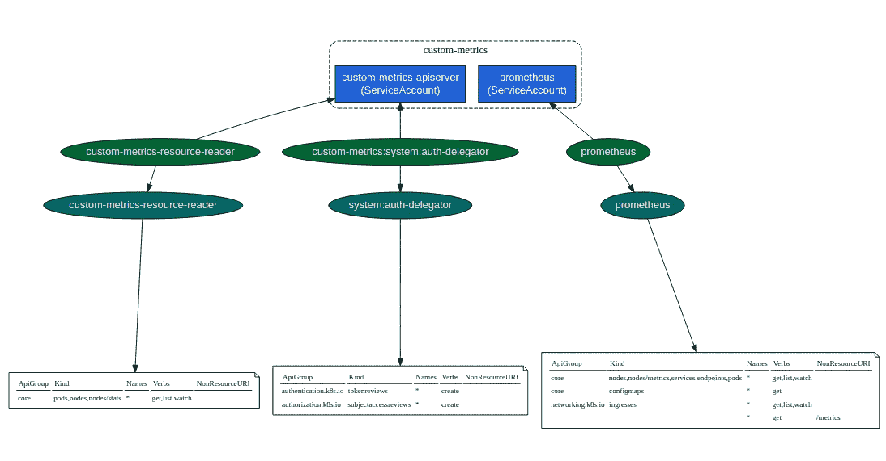*

*RBAC-工具-按作者分类的图像*

*最后，如果你更关心简单地配置 RBAC 而不是查看漂亮的图表，那么[权限管理器](https://github.com/sighupio/permission-manager)就是你的工具。参见 GitHub 库中的[gif，了解该工具的功能演示。](https://github.com/sighupio/permission-manager/blob/master/docs/assets)*

*除了网络策略或 RBAC 等专用工具，您还可以利用通用仪表板，例如:*

*   *[Lens](https://github.com/lensapp/lens)—Kubernetes IDE 为管理集群带来了一些健康，尤其是在与 [Lens Resource Map](https://github.com/nevalla/lens-resource-map-extension/) 配合使用时，后者将 Kubernetes 资源及其关系显示为一个实时的力导向图。*

*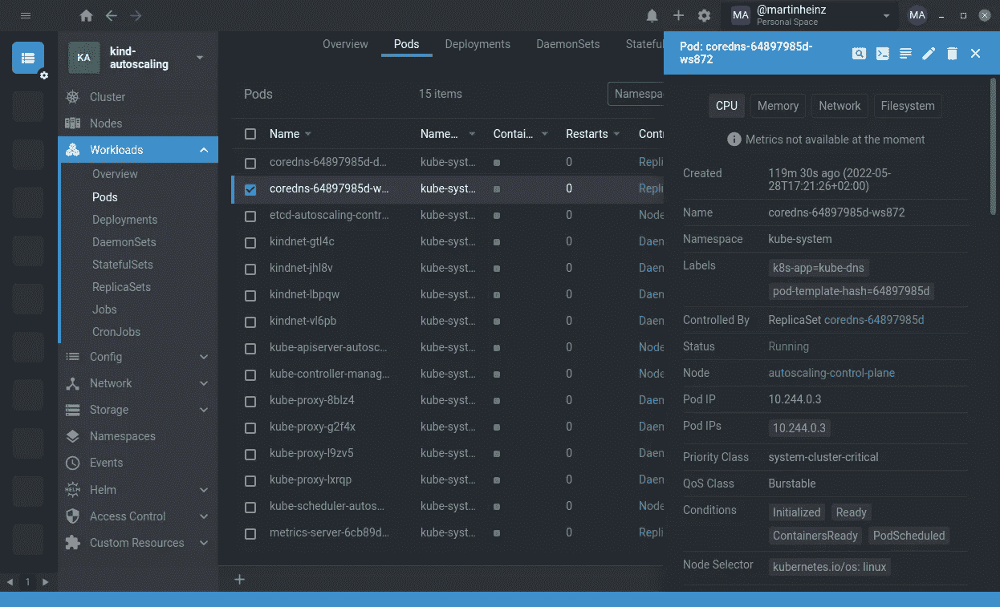*

*镜头 IDE —图片由作者提供*

*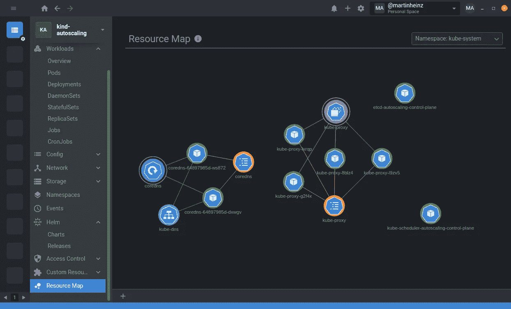*

*镜头资源图—图片由作者提供*

*   *像往常一样，也有基于 CLI 的工具，它提供了比光秃秃的`kubectl`更多的功能。它被称为`[k9s](https://k9scli.io/)`,它确实使在 Kubernetes 中导航、观察和管理您部署的应用程序变得更加容易:*

**

*k9s —作者图片*

# *结束语*

*本文主要关注开发人员/DevOps 工具，但是还有 2 件事情值得一提。首先是 [Mermaid.js](https://github.com/mermaid-js/mermaid) 用于创建漂亮的图表(作为代码)，这是[现在与 GitHub markdown](https://github.blog/2022-02-14-include-diagrams-markdown-files-mermaid/) 集成。另一个——*MathJax*——用于可视化数学表达式，最近[也得到 GitHub markdown](https://github.blog/2022-05-19-math-support-in-markdown/) 的支持。*

*这些是我喜欢的工具或我过去用过的工具，所以这绝不是一个详尽的列表。如果你发现了不同(更好？)工具，请一定要分享，这样别人也可以利用。*

**本文最初发布于*[*martinheinz . dev*](https://martinheinz.dev/blog/75?utm_source=medium&utm_medium=referral&utm_campaign=blog_post_75)*

*[成为会员](https://medium.com/@martin.heinz/membership)阅读媒体上的每一个故事。**你的会员费直接支持我和你看的其他作家。你还可以在媒体上看到所有的故事。***

*<https://medium.com/@martin.heinz/membership> * 

*你可能也喜欢…*

*<https://betterprogramming.pub/automate-all-the-boring-kubernetes-operations-with-python-7a31bbf7a387>  </python-f-strings-are-more-powerful-than-you-might-think-8271d3efbd7d> *