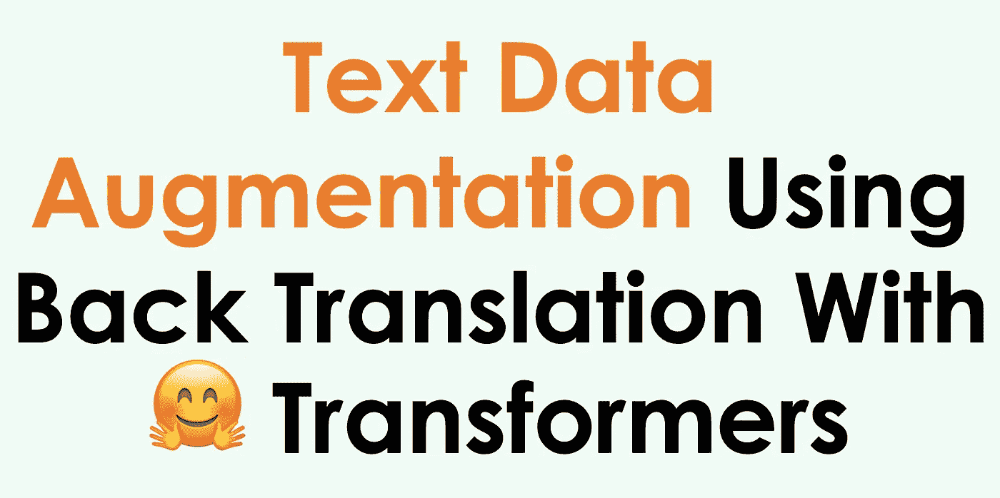
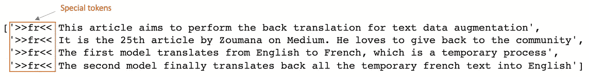
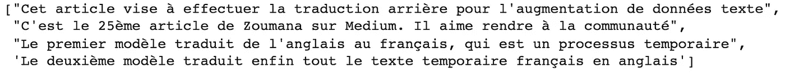
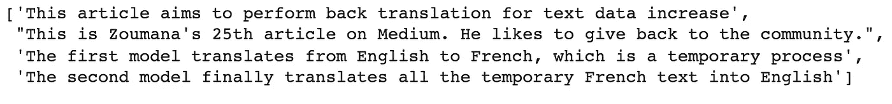
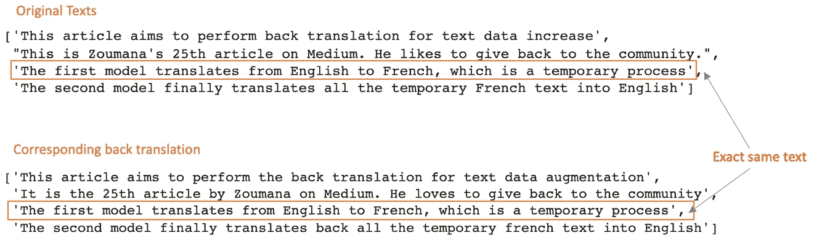
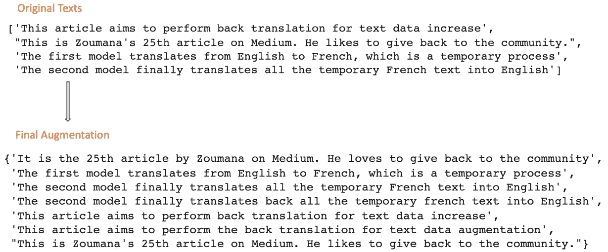

# 基于反向翻译和 MarianMT 的自然语言处理数据增强

> 原文：<https://towardsdatascience.com/data-augmentation-in-nlp-using-back-translation-with-marianmt-a8939dfea50a>

## 使用拥抱面部变形金刚的神经机器翻译框架增加你的训练数据的大小

文章标题(作者图片)

# 介绍

获得准确的模型不是一条简单的道路。事实上，已经确定了不同的方法来帮助改善模型的性能，其中一种方法是获得更多高质量的数据，这确实不是一个容易的过程。在本文中，我们将探讨数据扩充，这是一种从原始数据中创建新数据的方法。

存在不同的技术，但是我们将通过理解它如何工作和实现它来关注`**back translation**`这一个。

# 什么是反向翻译——为什么是马里亚姆特？

本节的目标是理解反向翻译的概念，并弄清楚[玛丽安娜特](https://huggingface.co/docs/transformers/model_doc/marian)如何有用。

## 回译

反向翻译的概念很简单，由三个主要步骤组成。

1.  **临时翻译**:将每个原始的训练标注数据翻译成不同的语言。在我们的例子中，是从英语到法语。
2.  **反向翻译**:将这些翻译后的数据翻译回原始语言，也就是从法语翻译成英语。
3.  **去重**:在这个过程的最后，我们将会得到每一个原始文本数据对应的回译。这里的目标是让每个副本只出现一次。

## 玛丽安山

如前一节的前两步所述，这是用于将原文翻译成目标语言的框架，反之亦然。

MariamMT 是一个高效的机器翻译框架。它使用了引擎盖下的 [MarianNMT](https://marian-nmt.github.io/) 引擎，这是由微软和许多学术机构如爱丁堡大学、波兹南的 Adam Mickiewicz 大学纯粹用 C++开发的。同样的引擎目前也在微软翻译服务的背后。

赫尔辛基大学的 NLP 小组在拥抱脸变形金刚上开源了多种翻译模型。MarianMT 是之前使用 Marian 在 Opus 收集的平行数据上训练的那些模型之一。

# 反向翻译的实施

在开始实现之前，理解以下先决条件是很重要的。

如果您喜欢视频，可以观看本文的视频演示:

## 先决条件和助手函数

本节的目标是安装、导入所有的库，设置所有的候选模型，并实现实验所需的辅助函数。

**有用的库**

总共有两个重要的库

*   `transformers`为了使用 MarianMTModel 和 MarianTokenizer
*   `sentencepiece`Marian mt 工作所需。

[Marian mt _ prerequisites . py](https://gist.github.com/keitazoumana/31dc2b0c4c5417f9d4e22909dbc0aa1f#file-marianmt_prerequisites-py)

**注意**:安装完这些库后，请务必重启笔记本，以便所有更改生效。

**候选车型**

《拥抱脸》中的所有模特名字都使用以下格式`Helsinki-NLP/opus-mt-{src}-{tgt}`，其中`{src}`和`{tgt}`分别对应源语言和目标语言。它们的值是代表语言的两位数代码。你可以在这里找到语言代码列表。对于我们的例子，我们将有两个候选模型。

每个模型的配置需要两个主要的类，`MarianTokenizer` 用于加载正确的标记器，`MarianMTModel`用于加载预训练的模型。

*   `Helsinki-NLP/opus-mt-en-fr` **第一个将法语翻译成英语的模型**。
*   `Helsinki-NLP/opus-mt-en-fr`、**、**第一个将英语翻译成法语的模式。

marianMT_first_model.py

*   `Helsinki-NLP/opus-mt-fr-en` **，** **第二种模式**将法语翻译成英语。

marianMT_second_model.py

现在我们已经完成了两个模型的配置，我们可以继续实现反向翻译特性了。

下面是将用于执行翻译的文本列表。

back_trans_texts.py

但是，为了能够正确地实现翻译特性，我们需要在每个需要翻译的文本前面添加特殊的标记`>>{tgt}<<` 。记住`{tgt}` 不是 **fr** 就是 **en** 。对于我们之前的列表，它看起来像这样:

back_trans_formated_texts.py

下面是完成这样一个任务的 helper 函数。它将原始文本作为输入，并在每个文本的开头添加特殊标记，如前所示。

marianMT_format_texts.py

下面是我们执行函数后得到的结果。

测试 _ 批处理 _ 格式化. py

带有特殊标记的格式化文本(图片由作者提供)

我们可以继续执行负责翻译该批文本的功能。它将待翻译的文本批次、目标语言模型和语言代码作为参数。

marian_perform_translation.py

这是由第 **14** 和第 **15** 行生成的从英语到法语的翻译结果。

从英语到法语的翻译(图片由作者提供)

完全相同的函数`perform_translation`可用于将之前的结果(法语)翻译回英语。我们只需要提供正确的参数，对应第二个模型的信息。

translate_back_fr_to_en.py

这是从英语翻译成法语的结果。

反向翻译从法语到英语(图片作者)

**我做了反向翻译，那又怎样？**

这里发生了一些有趣的事情。从反向翻译的结果可以看出，第三个文本的翻译和原文的完全一样。

原文及其回译(图片由作者提供)

这里是重复抑制功能出现的地方。它将两个列表(原始文本)作为参数，然后它们的反向翻译通过只保留重复文本的一次出现来组合它们。

marian_combine_two_lists.py

**最终增强功能**

我们可以将前面所有的辅助函数组合起来，创建一个返回扩充文本的函数，对应于原始文本和它们的反向翻译。

marian_augmentation.py

下面你可以看到相应于原始文本的增强的最终结果。我们将文本从 4 个增加到 7 个，相当于增加了 70%,这在大数据规模下是非常显著的。

原始文本和最终增强文本(图片由作者提供)

# 结论

恭喜你！🎉 🍾你刚刚学会了如何增加你的原始训练数据。我希望您喜欢阅读这篇文章，并且它给了您提高模型性能所需的技能。请在下面找到更多资源来帮助您进一步学习。

欢迎在 LinkedIn 上添加我，或者在 Twitter 和 YouTube[上关注我。讨论人工智能，人工智能，数据科学，自然语言处理的东西总是令人愉快的！](https://www.youtube.com/channel/UC9xKdy8cz6ZuJU5FTNtM_pQ)

[Github 上文章的源代码](https://github.com/keitazoumana/NLP-Data-Augmentation/blob/main/Data_Augmentation_in_NLP_Using_Back_Translation.ipynb)

[MarianMT 关于拥抱脸的文档](https://huggingface.co/docs/transformers/model_doc/marian)

[MarianNMT 文档](https://marian-nmt.github.io/)

再见🏃🏾