# 火炬视觉中的数据增强

> 原文：<https://towardsdatascience.com/data-augmentations-in-torchvision-5d56d70c372e>

## 这个博客旨在比较和熟悉研究团体使用的不同数据转换技术

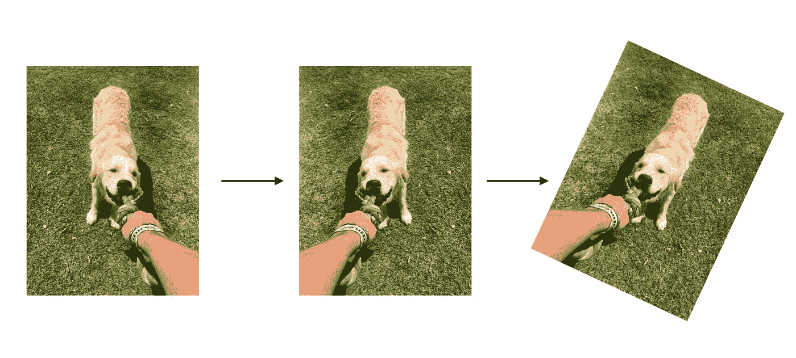

图片作者。

# 介绍

> 为什么我们需要数据增强？

数据扩充是深度学习项目的关键要素之一。证明了它在对抗 ***过拟合*** 和使模型 ***更好地泛化*** 方面的有效性。除了正则化特征之外，变换可以通过添加已经存在的图像的稍微修改的副本来人为地 ***放大*** 数据集。

> 如何选择正确的增强？

选择增强有两种方式: ***手动*** 或使用****优化*** *策略。正如*你可能认为的那样，如果没有数据集领域的广泛背景研究，手动设计只能产生*次优解决方案*。*

*另一方面，*自动化策略*经过优化，可以在没有人工干预的情况下获得特定任务的最高验证准确性。*

*在这篇博客中，我们将详细介绍这两种*方法*，以及`torchvision`代码。最后，我们将在 [CIFAR-10](https://www.cs.toronto.edu/~kriz/cifar.html) 数据集上比较使用*无增强*、*手动*和*自动*策略的三个设置的性能。*

*事不宜迟，让我们深入探讨一下吧！*

# ***手动增强***

*`torchvision.transforms`模块中有 30 多种不同的增强功能。在这一部分中，我们将重点介绍计算机视觉任务中最常用的五种技术。为了将它们结合在一起，我们将使用`transforms.Compose()`函数。在我们应用任何转换之前，我们需要使用`transforms.Normalize()`将 ***规范化*** 输入。该方案减少了模型的不稳定性，加快了收敛速度。*

*使用整个数据集的*平均值*和*标准偏差*对输入进行归一化。这些值是为每个通道(RGB)单独计算的。在这种情况下，我们使用特定于 **CIFAR-10** 的值。如果你想了解更多关于正常化的知识，你可以看看我的[文章](https://medium.com/nerd-for-tech/overview-of-normalization-techniques-in-deep-learning-e12a79060daf)。*

*`transforms.ToTensor()`命令将 PIL 图像格式转换为 torch `Tensor`,这样就可以将它传递给 PyTorch 模型。*

*现在我们来看看如何添加转换:*

## **1。随机翻转**

*—水平*

*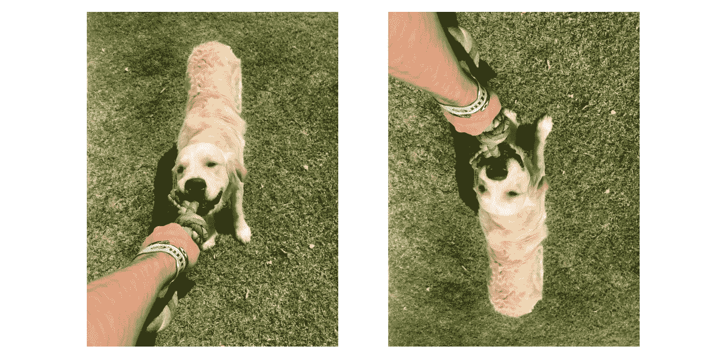*

***左**:原稿，**右**:放大。图片作者。*

*—垂直*

*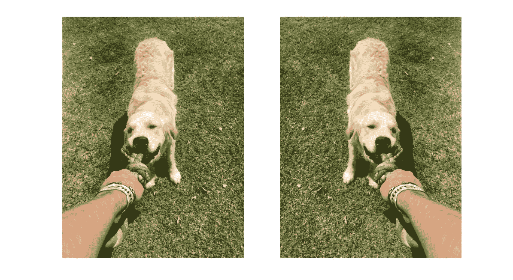*

*图片作者。*

*水平和垂直翻转是最简单的和最强大的 T21 变换之一。参数`*p*`表示反射发生的概率。*

## **2。填充**

*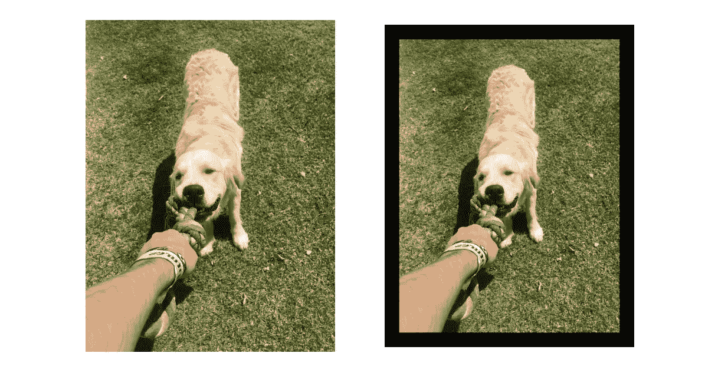*

*图片作者。*

*参数`pad`定义了输出的*高度*和*宽度*的额外像素。*

## **3。随机裁剪**

*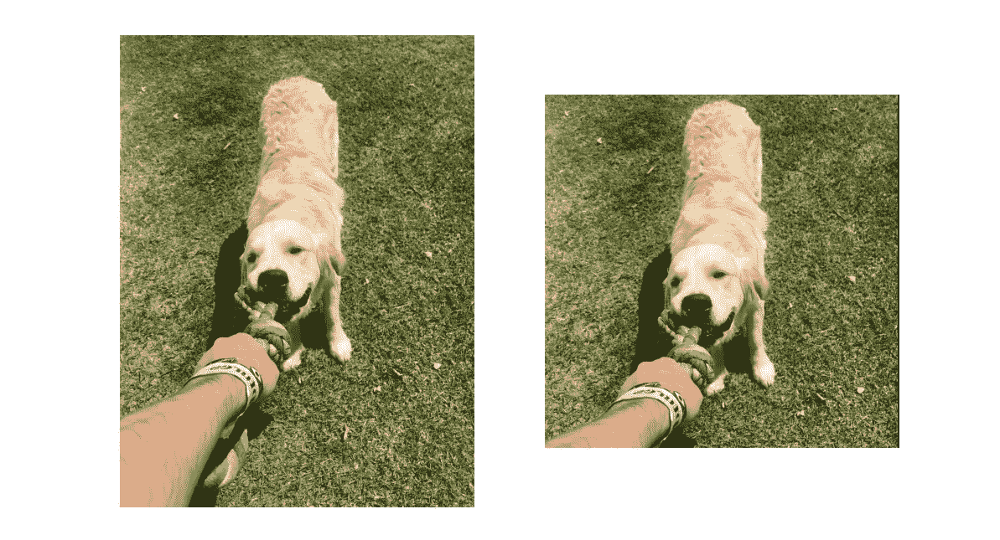*

*图片作者。*

*这个功能是将新图像裁剪成想要的`size`。`Padding`有助于保持输入的精确尺寸。*

## **4。颜色抖动**

*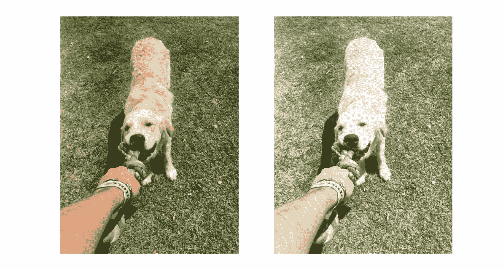*

*图片作者。*

*该功能随机操作`brightness`、`contrast`和`saturation`。这样，我们可以模拟白天和夜晚的情况，这有助于泛化。*

## **5。随机擦除**

*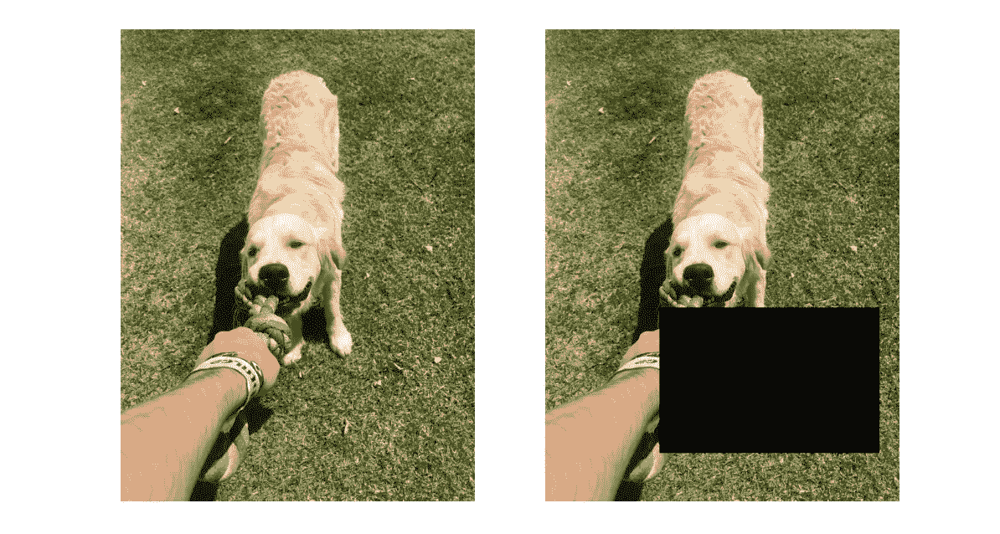*

*图片作者。*

*该功能随机选择矩形区域，'*'删除其像素值为 0 的像素。再次，`*p*`表示发生的概率。与其他变换不同的是`RandomErasing()`直接应用于张量；因此它在`toTensor()`之后。**

## *手工设计*

*`transforms.Compose()`功能允许我们链接多个扩展并创建一个*策略*。有一点需要记住，有些技术可能是无用的，甚至会降低性能。*

*最简单的例子就是*横向*翻转数字*‘6’*，变成*‘9’*。可惜标签做不到这一点。因此，只考虑数据集的相关扩充是值得的。*

# *自动增强*

## *自动增强*

*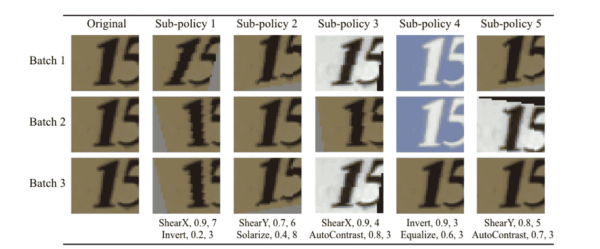*

*包含 5 个子策略的自动增强策略。每个子策略由 2 个转换以及这些操作的概率和大小组成。图片来自[自动增强:从数据中学习增强策略](https://arxiv.org/pdf/1805.09501.pdf)。*

*2017 年，谷歌开发了第一个算法， ***自动搜索*** 以改进数据扩充政策。手工设计的主要问题是耗时的*背景*研究和*次优*结果。新的解决方案建立在两个组件上，*搜索算法*和*搜索空间*。*

**

*搜索算法框架。图片作者。*

*在每一步中，*控制器*生成 ***5*** ***子策略*** 和 ***2* *采样* *操作*** 。它按顺序进行，首先选择*变换*，然后选择其 ***大小*** 和 ***概率*** 。扩充应用于数据集，并传递给原始网络的**较小版本(*子版本*)**。产生的 ***验证精度*** 使用 PPO 算法(奖励)进行修改，以更新控制器的权重。这个过程重复 15 000 次，根据结果选择最佳政策。*

*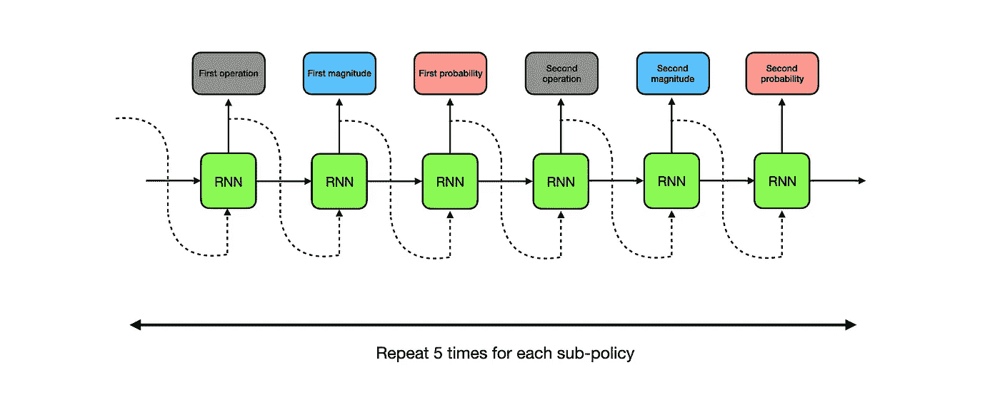*

*控制器生成的单个子策略。图片作者。*

**自动增强*击败了当时所有最先进的结果，但有一个警告:*计算成本*。有 16 种*可能的* *增强(如旋转、均衡* [*等*](https://arxiv.org/pdf/1805.09501.pdf) *)。)*、10 个*量级*值、11 个概率，这就产生了巨大的*(16 * 11 * 10)⁰****5 个子策略的搜索空间*** 。寻找最优的是一项计算量很大的重要任务。*

*幸运的是，`torchvision`为我们提供了针对 CIFAR-10、ImageNet 或 SVHN 等数据集的预训练策略。所有这些都在`AutoAugemntPolicy`封装中提供。*

*`Torchvision`只接受已经培训过的政策，不支持*学习*程序。假设您想要为数据集找到最佳扩充。在这种情况下，你需要一个带有*自动增强*的外部库或者重新实现算法。但是在考虑这个选项之前，先看看下面的方法，它不需要任何额外的包，计算量也更小。*

## *随机扩增*

*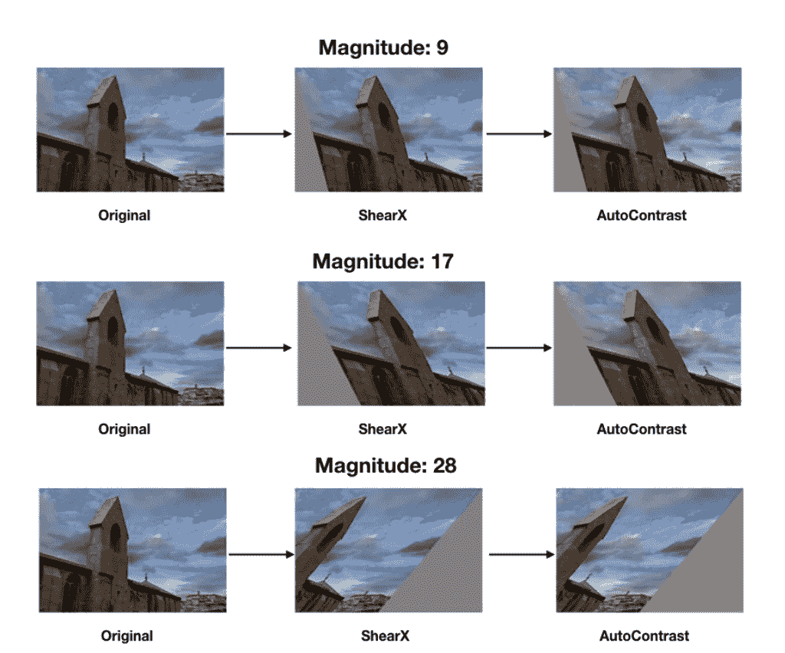*

*图片来自 [RandAugment:搜索空间缩小的实用自动数据扩充](https://arxiv.org/pdf/1909.13719.pdf)。*

*除了*自动增强*的计算负担之外，它在大型数据集上的表现也更差。子(*代理*)网络仅近似于原始模型性能；因此，它只能生成近似(*次优*)策略。*

**RandAugment* **删除**任何*学习*技术和代理任务，以找到最佳的扩充。*

> *等等，他们是怎么做到的？*

*首先，RandAugment 只接受两个参数， *N* 和 *M* 。 *N* 是 14 个可用的增强的**数([整个列表](https://sh-tsang.medium.com/review-randaugment-9a392e6911e9#:~:text=Given%20N%20transformations%20for%20a,%2Dx%2C%20translate%2Dy.))。 *M* 是这些操作的**量级**，范围为 1-10，定义图像旋转、平移等的程度。***

*我们可以通过执行简单的**网格搜索**来找到这些参数，网格搜索依赖于*数据集*和*主* *模型*，而不是自动增强中的“*子*”网络。*

*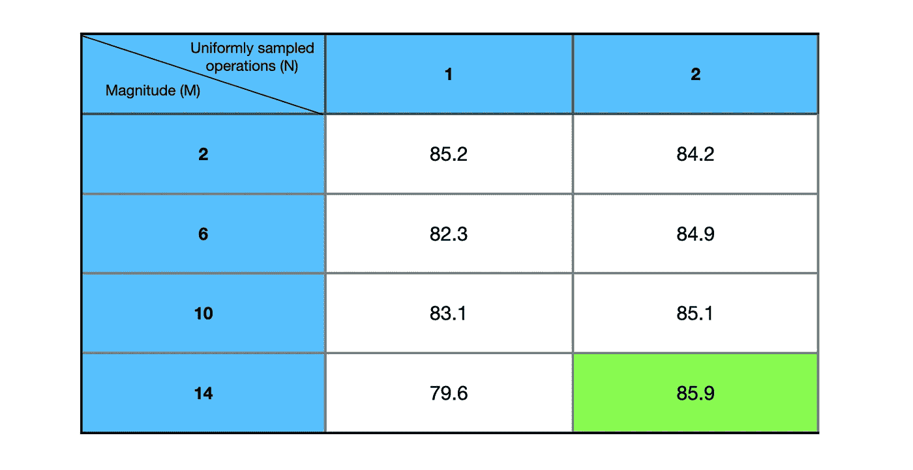*

*简单的网格搜索，验证精度为 N={1，2}和 M{2，6，10，14}。图片作者。*

*本质上，我们根据 N 和 M 的不同组合来训练网络，并选择一个具有最佳验证准确性的组合。听起来很简单，结果本身就说明了产生比*自动增强*更好或相等的*验证准确性*。*

*这是*随机增加*的`torchvision`代码。*

# *比较*

*在这一部分中，我们将最终看到三种增强系统的性能:*

*   ***普通** —仅应用`Normalize()`操作。*

*   ***基线**—`HorizontalFlip()`、`RandomCrop()`、`RandomErasing()`的组合。*

*   ***自动增强** — 策略，其中`AutoAugment`是基线配置的附加转换。*

## ***数据集***

*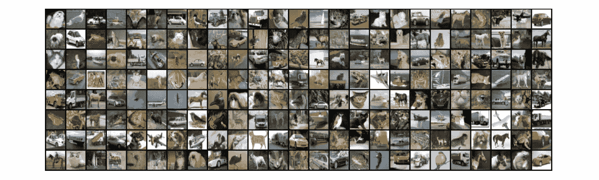*

*图片作者。*

***CIFAR-10** 由 10 类 60 000 幅 32x32 彩色图像组成，每类 60 00 幅图像。数据集分为 50 000 幅训练图像、2500 幅验证图像和 7500 幅测试图像。*

***仅增强训练图像。**

*对数据集应用转换的代码:*

## ***型号***

*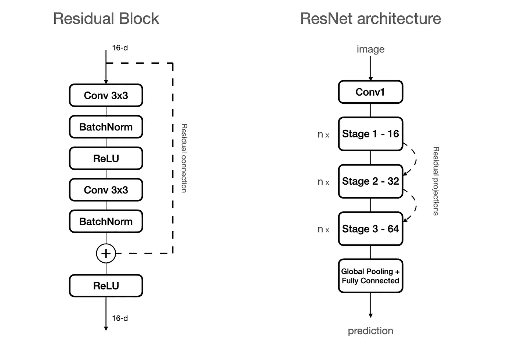*

*d —表示阶段{1，2，3}。图片作者。*

***ResNet-20** 是为 [**图像识别深度残差学习**](https://arxiv.org/pdf/1512.03385.pdf) 论文中提出的 CIFAR-10 数据集特别定制的 ResNet 版本。*

*第一层`**Conv1**`是具有 3x3 内核大小的卷积。接下来是 3 个**阶段**，其中每个阶段包含{16，32，64}个*过滤器*。参数 ***n*** 通过操纵每一阶段的 ***残差块*** 的数量*来控制网络的深度。在我们的例子中，它等于 3，这产生 9 个残差块和 18 个卷积层。**

**使用步长 2 对阶段之间的特征图*进行下采样，这分别给出了输出尺寸{32，16，8}。**残差投影**在这里使用 1x1 卷积来匹配下一阶段的通道。*

*网络以 ***全局平均池*** 和**完全连接的**层结束，导致 ***20*** **可训练** **层**。*

*下面是 PyTorch 中的实现:*

*如果你想了解更多关于 T42 的事情，可以看看我在 YouTube 上的视频。*

## ***超参数***

*这些是用于训练的一组*参数*:*

```
*learning_rate = 0.001
batch = 256
optimizer = Adam
loss = CrossEntropyLoss
epochs = 40
n = 3
weight initialization = Kaiming He*
```

*我还在模型中添加了*学习率调度器*。当验证损失*超过*时，它降低了学习率，这有助于防止*过拟合*。*

*我没有包括所有的训练、验证和测试循环，因为它们有点长，而且对理解主题并不重要。然而，你可以很容易地在我的 Github 上找到它们，并有一些直观的解释。*

## ***结果***

*现在是时候在训练 3 个不同的模型 40 个时期后比较结果了。要评估的主要指标是*精度*和*损失*函数，所以让我们看看它们是什么样的:*

*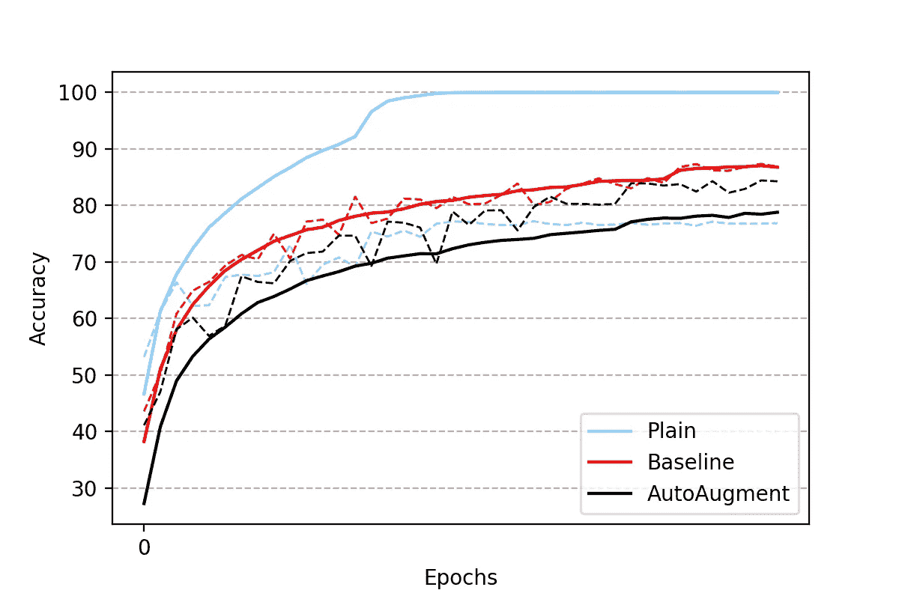*

*虚线表示验证准确性。图片作者。*

*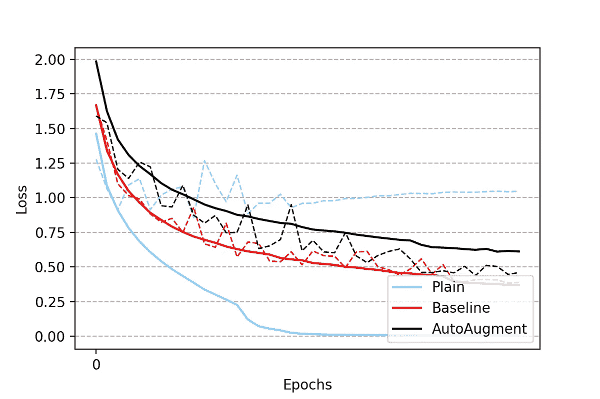*

*虚线代表验证损失。图片作者。*

*在*‘Plain’*模型中，训练准确度趋向 100%，而验证饱和并降低。此外，验证损失正在增加，这表明**过拟合**问题。*

**基线*配置似乎**处理**过拟合很好。令人惊讶的是，学习率一次也没有下降。验证准确度稳步向更高的值发展，没有显著下降。可能该模型可以被训练更长时间以用更低的学习率获得更好的结果。*

*最后但同样重要的是， *AutoAugment* 有趣地保持了验证精度高于测试精度。指出了**欠拟合**的问题，使模型过于泛化，不能很好地拟合数据。同样，该模型可以通过学习率时间表进行更长时间的训练，并可能获得更好的结果。*

*最终结果可能会令人惊讶，基线*增强给出了大约 87%测试准确度的最佳结果，而自动增强给出了大约 84%的测试准确度。它证明了随机翻转、裁剪和擦除是多么强大。**

*为自动增强辩护，我个人认为对于这样一个小网络有太多的转换。像 *ResNet50* 这样的大型模型将具有额外的学习能力，以覆盖更复杂的情况，并更好地进行归纳。*

# *结论*

*如果你设法到达那里，祝贺你。在这篇文章中，我们经历了深度学习中使用的大量不同的数据增强技术。我们比较了三种不同设置的性能。*

**简单的*配置证明了数据扩充对于提高模型的准确性至关重要。*

**手动*挑选转换似乎需要更多数据集背后的直觉，并且经常产生次优结果。尽管如此，即使是标准政策也能产生令人印象深刻的结果。*

*另一方面，*自动化增强*无疑是未来的变革，理论上应该在*最优*解决方案下表现更好。在我们的案例中,*学到的*策略实际上并没有改善手工设计的结果。然而，这是一个活跃的研究领域，只是最近才开始得到更多的关注，仍然有很大的潜力。*

*我希望这篇文章给你一个坚实的介绍，让你探索和试验更多的 torchvision 和测试一些其他的技术。欢迎在评论中提问。*

*如果你喜欢这篇文章，你应该看看我的 [**中的**](https://medium.com/@maciejbalawejder) 和 [**Github**](https://github.com/maciejbalawejder) 看看我正在做的其他项目。*