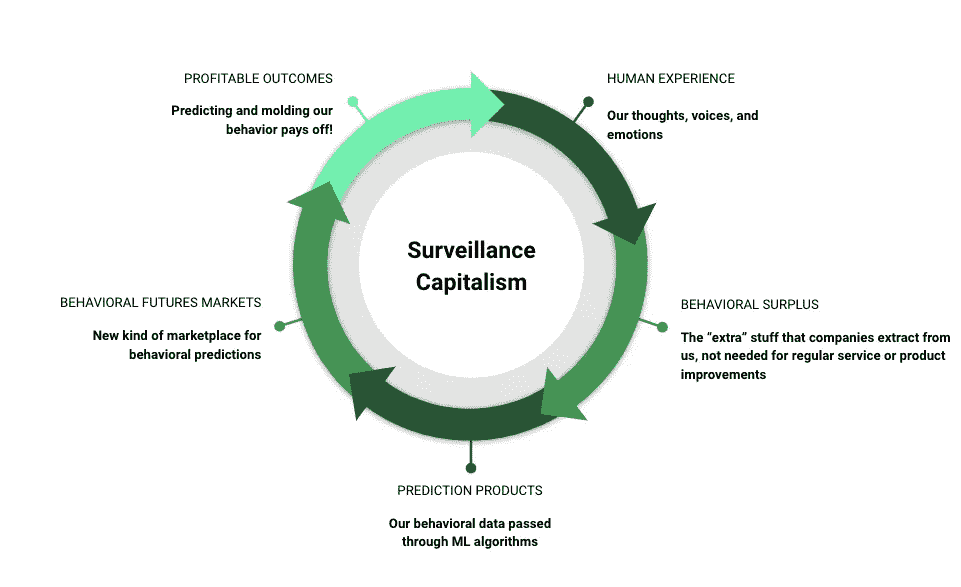

# 数据资本主义:创新、提取、社会良知

> 原文：<https://towardsdatascience.com/data-capitalism-innovation-extraction-social-conscience-3a30bf2c507b>

## 在一个日益被监督资本主义统治的世界里，如何推进社会资本？

大约一年前，我读了凯特·克劳福德(Kate Crawford)写的《人工智能图集》**，这是一篇关于管理机器学习领域的提取过程的精彩分析，从环境资源分配到收获我们的政治结构，再到侵犯数据隐私。这篇文章反思了从克劳福德的书中学到的东西。我想按下⏸按钮，思考一个万亿美元产业的含义，以及数据从业者在一个由算法统治的世界中的责任。数字用户如何成为定义新数字世界的积极参与者？数据驱动的公司需要培养什么样的社会良知？即使他们的使命不要求他们关心，他们有什么责任去发展社会资本？我希望这篇文章是数据社区开发一个新框架以将社会参与嵌入数据实践核心的对话的开始。**

****

**照片由[耶戈·古格莱塔](https://unsplash.com/@lazargugleta?utm_source=medium&utm_medium=referral)在 [Unsplash](https://unsplash.com?utm_source=medium&utm_medium=referral) 上拍摄**

# **什么是数据资本主义？**

**来自 AI Now Institute 的莎拉·迈尔斯·韦斯特(Sarah Myers West)在 2017 年的一篇文章中解释说， [**数据资本主义**](https://journals.sagepub.com/doi/10.1177/0007650317718185) 是一个系统，其中大数据的商品化有利于从数据中获利的行为者，导致了“不对称的权力再分配”。换句话说，大数据赚钱了，但并没有平等地创造财富。这是一个封闭的系统，其中盈利实体已经成功地提取、转换和利用数据，我们的数据。Milner 和 Traub 于 2021 年在 Demos 发表的一篇更近的文章使用了同样的定义，但强调了这种财富再分配造成的社会灾难，给受保护的阶层带来了特别沉重的负担。**

## ****监督资本主义和算法治理****

**虽然数据资本主义和监控资本主义有相似的特征，但它们并不完全相同。**监控资本主义**依赖于数据资本主义的基础。没有数据的提取，就没有监控系统可以建立。没有这些数据的货币化，就没有资金来建立这样一个监控系统。监督资本主义这个术语最初是由哈佛大学教授、《T2:监督资本主义的时代》(2018 年)的作者肖莎娜·祖博夫创造的。她将监督资本主义描述为一个过程:人类经验被用作原材料，并被转化为行为数据，这些数据可用于构建预测产品(我们的未来行为)，反过来由使用机器学习(ML)算法定制的公司进行交易，以产生有利可图的回报。**

****

**作者图片**

****算法治理**非常接近监视资本主义，因为它认可一种监视系统，在该系统中，我们的行为被 ML 算法跟踪和建模。但是，环境不同。洗钱被用来大规模地执行公共政策目标，以维护社会秩序(遵守法规、执行法律等)。).目标不是赚钱，尽管它可以作为代理发生，而是治理，并在一定程度上控制社会。算法治理是治理和控制之间的一次有趣的散步。这种紧张关系导致许多专家和公共政策专家质疑在这样一个体系中民主的未来。**

## ****数字封建主义****

**由伦敦大学学院(UCL)创新和公共目的研究所组织的一场 2021 年的演讲将祖博夫和奥赖利聚集在一起，讨论数据资本主义的未来，讽刺的是，这个术语被“**数字封建主义**”所捕捉封建主义是从中世纪借来的术语；这是一种政治、文化和经济体系，在 9 世纪到 15 世纪之间占据主导地位。在这样的体系中，有领主(即土地所有者)和封臣(即占有土地以换取商品和服务生产的臣民)。在这种交换体系中，臣民只有在付清房款的情况下，才被授予拥有家园和上帝保护的权利。同样，数字封建主义可以被认为是用户只有在同意交换个人信息的情况下才有权“免费”使用社交媒体平台。我们的个人数据由于社交媒体平台巨头、21 世纪中世纪的土地所有者而成为“租金”。**

# **数据资本主义是如何发展的？**

## **网络泡沫破裂了📉**

**本世纪初的网络泡沫破裂是创造“数据资本主义怪物”的关键时刻。在那之前，科技的焦点是创新。目标是设计新的、有创意的、未来的产品，让之前的十年看起来像是发生在中生代。当互联网泡沫破裂时，投资者威胁要撤回对硅谷科技初创公司的投资。因此，科技公司不得不寻找新的赚钱方式。为个人服务的创新不再足以吸引投资，个人成为新的商品，新产品，可以赌上赌下。这让科技公司赚了很多钱。**

## **数据可以赚钱💰**

**广告无处不在——科技公司意识到广告是赚钱(和留住投资者)的关键。广告不是一个新概念。然而，在广告牌、报纸或电视广告上看到它之前，它现在进入了社交媒体平台。由于大规模的数据收集实践，在线广告变得越来越个性化和有针对性。他们甚至可以预测一个人的需求。这方面的一个例子是[塔吉特百货](https://www.forbes.com/sites/kashmirhill/2012/02/16/how-target-figured-out-a-teen-girl-was-pregnant-before-her-father-did/?sh=38c9ed946668)对广告的侵入性使用，甚至在家庭内部宣布之前就暴露了一名青少年的怀孕。**

****“监督红利”——**Shoshana Zuboff 使用我们的数据描述了主要公司的盈利能力，称为“**监督红利**”在互联网泡沫破裂后，谷歌的人们意识到存在“数字废气”，这是一个不为任何特定目的收集的数据宝库，可以挖掘出预测消费者行为的信号。2001 年至 2004 年间，由于数字废气的利用，仅广告收入就跃升了 4486%。在那之前收集的数据盈余导致谷歌呈指数增长，谷歌在 2004 年首次公开募股后继续依赖我们的数据作为增长的手段。**

** [## 谷歌广告收入 2001 年至 2021 年

infogram.com](https://infogram.com/column-chart-1h8n6m359jpzj4x?live) 

# 从被动消费到社会良知

## 租金不合理

在 2021 年与 Zuboff 和 O'Reilly 的谈话中强调的一件重要事情是，盈利性公司收取的租金(即我们的数据)是不合法的。没有理由对大量数据进行提取、收集、转换和建模。收集的一些数据甚至是有问题的和高度歧视性的(例如，在保险费计算中用邮政编码作为替代衡量标准)。因此，公司预测消费者行为的数据收集做法受到质疑。然而，即使有主要的数据隐私法的支持，一个人怎么能与一家公司对抗以确保数据的公平和道德使用呢？我们如何真正确定我们提供给公司的数据仅限于服务和/或产品改进？数字用户如何在塑造数字世界中发挥积极作用？

## 主动参与

这种认为数据资本主义的未来是数字封建主义的想法不一定 100%正确。这是一个需要数字用户积极参与的选择，以防止数据驱动的公司放任自流。尽管数据资本主义将继续存在，但需要发生一种转变，让用户成为新的赚钱数据机器的积极参与者。首先要认识到，除非我们愿意投资，否则我们无法改变这个系统。

今天，我们享受免费的社交媒体平台，但它们是免费的，因为我们同意被展示有针对性的广告。如果我们不希望我们的行为数据被分析和操纵，我们需要同意基于会员的模式应该取代基于广告的模式。如果我们还没有准备好，另一个解决方案是加强现有的数据隐私法规。为了成为积极的参与者，数字用户可以在公开论坛和全民公决中分享改善数据隐私和安全的想法，在那里他们可以进行辩论。

## 社会良知

虽然用户在定义游戏规则方面可以发挥作用，但公司有更大的责任公平、合乎道德地使用数据。最终，公司是保存我们数据的金库。目前没有法律要求公司公开用户信息是如何被收集、分析和使用的。美国证券交易委员会于 2022 年 3 月 9 日提交的一项立法提案将要求上市公司披露安全数据泄露；但是，它只解决了数据安全性，而没有解决数据隐私。此外，尽管美国证券交易委员会的职责是监管上市公司，而拟议中的立法正是如此，但它不会给私营公司带来同样的负担，私营公司也使用、模拟和共享我们的数据。

除了制定强有力的数据隐私计划，企业还需要培养社会良知，将社会目标与经济目标一起重新排序。在 21 世纪，我看到四大主题:气候变化，财富不平等，政治极化和歧视。公司已经并继续助长社会问题。想想脸书(更名为 Meta)在加剧罗辛亚种族灭绝中扮演的角色，罗宾汉在保护做空 GameStop 股票的对冲基金中扮演的阴暗角色，亚马逊销毁数百万未售出的产品，等等。如果问题是由公司引起的，他们应该感到有责任解决这个问题。公司在保护我们的社会结构、鼓励言论、提供金融工具来平衡竞争环境、承诺使用可再生能源等方面都有自己的角色。

# 结论

数据资本主义将继续存在，但这并不意味着数字用户应该成为控制他们数据的系统中的被动消费者。他们应该有权塑造我们生活的不断变化的数字世界。然而，负担并不仅仅落在用户身上。公司有更大的责任以道德和公平的方式使用我们的数据。他们培养“社会良知”也变得越来越重要——许多社会、政治、经济和环境问题因大公司采取的行动而浮出水面。现在是注入同情和关怀的时候了，这样我们也可以增加我们社会资本的红利。

本帖最后编辑于 2022 年 5 月 29 日。这里表达的观点仅属于我自己，并不代表我的雇主的观点。**