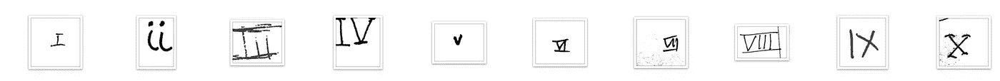

# 以数据为中心的人工智能

> 原文：<https://towardsdatascience.com/data-centric-ai-82fea1fc678d>

## **以及这对机器学习从业者意味着什么……**

图片来自 [Pixabay](https://pixabay.com/?utm_source=link-attribution&utm_medium=referral&utm_campaign=image&utm_content=2297961) 的 [Kanenori](https://pixabay.com/users/kanenori-4749850/?utm_source=link-attribution&utm_medium=referral&utm_campaign=image&utm_content=2297961)

## 介绍

如果你关注机器学习社区的新闻，你肯定听说过以数据为中心的人工智能。这个术语近年来越来越受欢迎，出现在主要的 ML 会议上，并被数据科学界的权威人士所提倡。

让我们看看以数据为中心的人工智能意味着什么，它与以前使用的一些方法有何不同，以及它对 ML 从业者意味着什么。

**以模型为中心与以数据为中心的方法**

如果您从事过数据科学项目，您可能会想起一些典型的 ML 模型创建步骤。直到最近，典型的步骤是:

1.  收集数据
2.  干净的数据
3.  尝试几种型号
4.  调整模型参数
5.  投入生产
6.  监控模型(或者在某些情况下忘记它)

大部分重点放在第三和第四步。通常，如果你在大学或一些在线训练营学习机器学习课程，重点将是学习这两个步骤。你将花大部分时间研究不同的 ML 模型(线性回归，支持向量机，树，聚类，人工神经网络等。).您将了解它们的优点、缺点、用例，以及如何对它们进行调优，以最大限度地发挥它们的性能。

图片由 [Gerd Altmann](https://pixabay.com/users/geralt-9301/?utm_source=link-attribution&utm_medium=referral&utm_campaign=image&utm_content=1989152) 来自 [Pixabay](https://pixabay.com/?utm_source=link-attribution&utm_medium=referral&utm_campaign=image&utm_content=1989152)

很少或没有时间用于数据部分。数据通常被清理、特征化，并被扔进算法中。这是一种以模型为中心的方法，在过去十年中一直运行良好。存储和计算能力的进步使得这种方法蓬勃发展，并导致了我们目前拥有的最先进算法的发展。

我们如此专注于算法开发，以至于忽略了过程中最基本的部分——数据本身。ML 算法的数据就像我们人类的食物。因此，我们需要为我们的算法提供尽可能高质量的数据，以实现最佳性能。

以数据为中心的方法主要关注提供高质量的数据。这意味着我们不能只专注于选择算法，我们必须花时间收集和注释数据，纠正错误标记的数据，扩充数据，并扩展这种类型的过程。

**以数据为中心的人工智能的最新发展**

以数据为中心的方法是最近在各种数据科学和机器学习会议上讨论的热门话题。去年的 NeurIPS 会议介绍了一个与此主题相关的新主题，名为“*数据集和基准*”。我在博客[的帖子](/neurips-2021-highlights-9b2df3cf43bf)中写了这件事。该课程旨在关注构建高质量数据集的挑战。

以数据为中心的方法也在数据科学和机器学习的知名研究人员中获得了支持。吴恩达是其中之一，他甚至组织了第一届以数据为中心的人工智能竞赛。在这次比赛中，参赛者必须解决一个罗马数字识别的问题。

作者照片

最初，有 3000 张图片和 10 个类，所以数据相对较少。模型是固定的，竞争对手只能应用以数据为中心的方法来改进或更改数据。最后，他们不得不提交最多包含 10，000 张图像的修改后的数据集。

你可以在这篇[文章](/how-i-won-andrew-ngs-very-first-data-centric-ai-competition-e02001268bda)中了解成功的方法。

**以数据为中心的 AI 对我们 ML 从业者意味着什么？**

对以数据为中心的方法的最新宣传意味着数据终于成为机器学习生命周期的重要部分。迟早，所有的数据科学家都会认同这样一个观点，即建立好的模型需要关注的不仅仅是选择算法和调整参数。

也意味着数据这个机器学习的丑小鸭，可能正在发展成为一只美丽的天鹅，成为构建 ML 产品的重要组成部分。我预计将会有更多的工具被开发出来，集中在注释、扩充和校正数据集上。

如果你想了解更多关于以数据为中心的人工智能，你可以听听我在伦敦为 ML 社区做的[演讲](https://www.youtube.com/watch?v=LlzZGcpzqVM)。

*PS:我正在 Medium 和***上撰写深入浅出地解释基本数据科学概念的文章。你可以订阅我的* [***邮件列表***](https://medium.com/subscribe/@konkiewicz.m) *每次我写新文章都会收到通知。如果你还不是中等会员，你可以在这里加入**[***。***](https://medium.com/@konkiewicz.m/membership)**

**下面是一些你可能会喜欢的帖子**

**       **