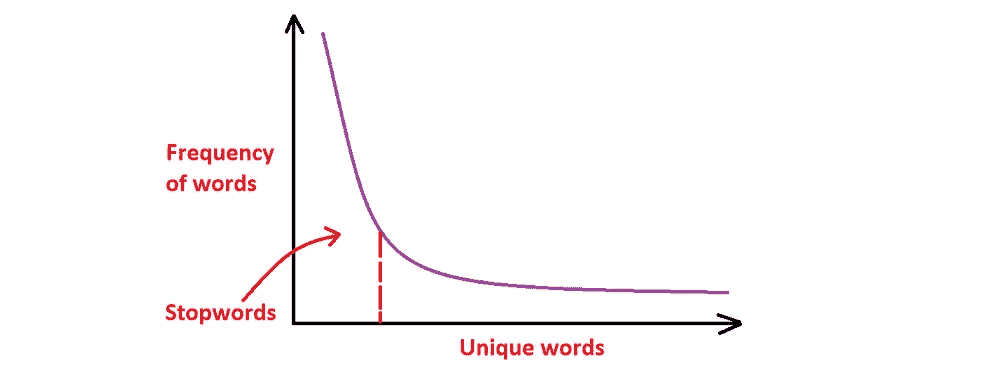
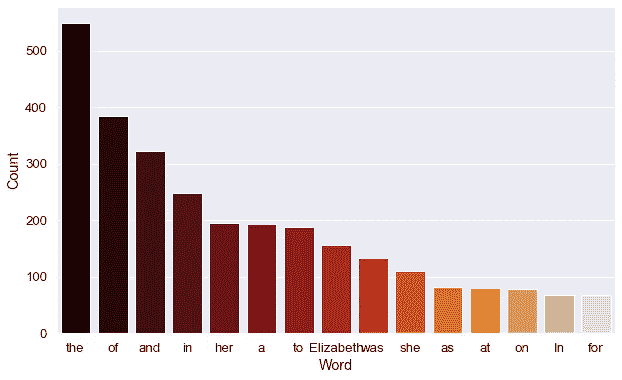
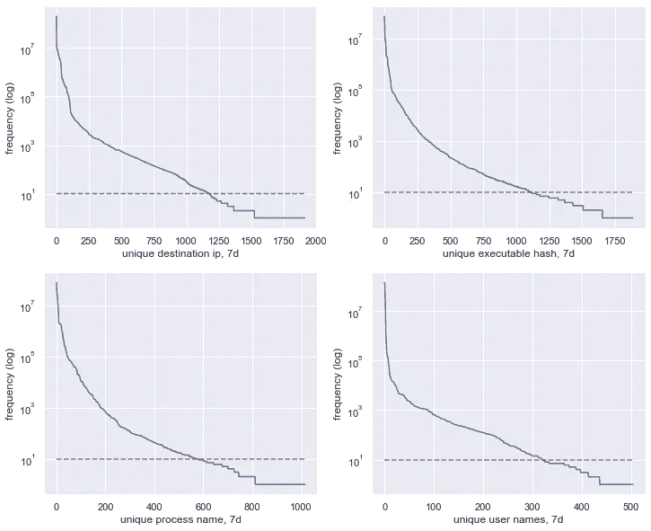
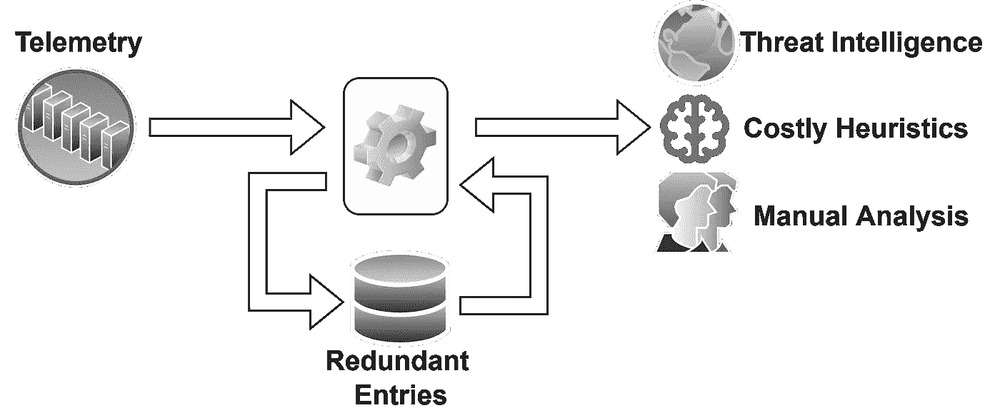
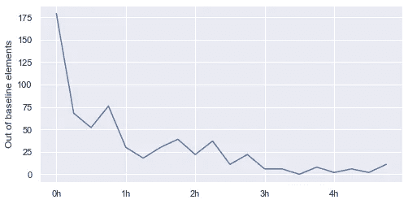
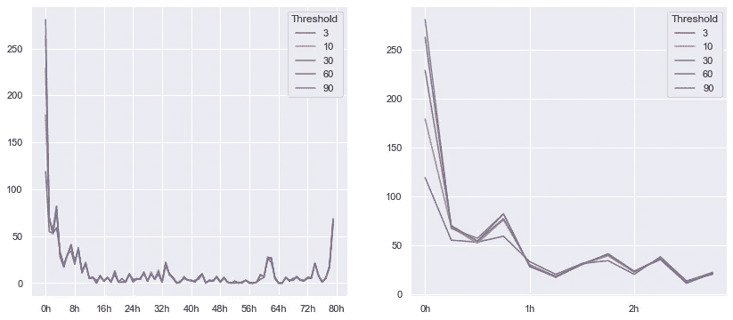
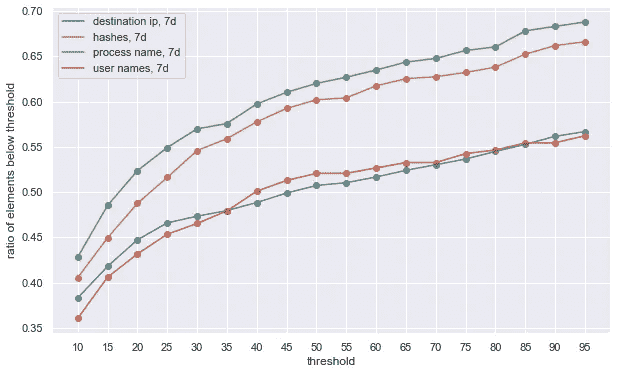

# 安全数据科学:基于 Zipf 定律从 Sysmon 日志中寻找威胁

> 原文：<https://towardsdatascience.com/data-centric-security-threat-hunting-based-on-zipfs-law-50ad919fc135>

## 企业安全遥测中基于普适 Zipfian 分布的异常检测工程


来自 [Unsplash](https://unsplash.com/photos/okVXy9tG3KY) 的封面照片类似 Zipf 定律曲线。

本文将关注“以数据为中心的安全”范式——利用统计知识满足网络安全需求。无论部署和环境特征如何，这种寻找威胁的方法都会产生相同的结果。我们将基于 Zipf 定律的统计模式，使用许多工具(如 Elasticsearch 或 Splunk)的内置功能来定义基线活动，并评估超出基线的元素。此外，我们在 Python 中共享了一个端到端的基于异常的检测实现来分析 Sysmon ID 1 进程创建事件，并对超出基线的可执行哈希进行威胁情报分析。

# 前言

从本质上讲，网络安全在目前的概念状态下似乎是无法解决的。在过去的几十年里，我们已经看到了进攻和防守技术之间永无止境的猫捉老鼠的游戏。今天，安全问题本质上是一个风险最小化的任务，整个行业通常成功的方法是避免成为最容易实现的目标之一。

然而，即使是顶级组织也面临着挑战。例如，在最近的 Lapsus$活动中，一个经验最少、资源一般的威胁参与者可以访问基础设施的敏感部分，如微软、NVIDIA、Okta 和 counting。这种情况暴露了传统安全操作中的灰色地带，如内部威胁或针对 MFA 旁路的弱点。

受 Dave 启发，一个据称有效的方法是关注基线活动，将超出基线(OOB)的行为视为具有调查潜力:

重点:“(..)了解基线行为至关重要”。

另一个用来描述 OOB 元素的术语是“异常”通常，在讨论异常时，安全从业者会将注意力集中在机器学习(ML)解决方案上。但是，大部分 ML 炒作都是为了营销需要而人为抽成的。事实上，ML 在网络安全领域有着巨大的潜力，对应用研究有着巨大的需求。然而，我们想强调的是，ML 并不是最重要的，经常是不需要的，而且经常是适得其反的。

ML 挑战的出现是因为，在新奇和异常检测问题中，在像企业网络这样的多维概念空间中基线的定义具有显著的挑战性，这是许多高成本异常检测解决方案的失败之处。这并不意味着我们不能将 ML 算法用于无监督的安全问题。尽管如此，我还是故意在本文中省略了对基于 ML 的异常检测算法的讨论(一些想法在这个 [Twitter 帖子](https://twitter.com/ditrizna/status/1504430088808538112?s=20&t=srgxiZAHwzkVOHQF4_lWfg)中分享了)，因为我们提出了一种更直接、更受广泛支持的统计方法。

# 齐夫定律

这里我们讨论一种基于 Zipf 定律定义基线的具体方法。通过设计，它*总是*产生超出基线(OOB)的元素。你不能直接把它们当作警报或者欢迎警报疲劳。因此，我们讨论解决 OOB 价值观的各种方法。

花哨的统计学词汇在文献中描述了[齐夫定律，但我们可以将其定义为特定封闭环境中的“一种元素分布的模式”。这种模式类似于反向指数曲线，如下图 1 中的紫色线所示:](https://en.wikipedia.org/wiki/Zipf%27s_law)



图一。自然语言处理(NLP)中 Zipf 定律的粗略概括。作者创造的形象。

最初，Zipf 定律是在自然语言处理(NLP)的范围内形成的，表示语料库中单词的分布。在上面的图 1 中，y 轴表示字数，x 轴表示按频率排序的唯一单词。例如，如果我们统计维基百科页面上出现的关于[伊丽莎白二世](https://en.wikipedia.org/wiki/Elizabeth_II)的单词，我们得到:



图二。任意自然语言语料库中的词频。作者创造的形象。

似乎在自然语言中，频繁出现的词(“the”、“to”、“of”、“a”、“and”等。)在文本中几乎没有意义。这样的词被称为“*停用词*”，通常在进一步的 NLP 处理中被省略。这就是为什么在 NLP 应用程序的开头经常会看到下面的代码:

```
**import** nltk
**from** nltk.corpus **import** stopwords
nltk_stopwords = stopwords.words('english')words = [word **for** word **in** text.**split()** **if** word.**lower()** **not in** nltk_stopwords]
...
```

在 NLP 中，为了训练一个模型，Zipfian 分布最有价值的部分是在中间的某个地方，而稀有词太独特了，不会影响训练过程。从上面的词频分布中考虑只出现一次的单词:

```
[('Tudor', 1),
 ('sovereign', 1),
 ('Jamaica', 1),
 ('cross', 1),
 ('argent', 1)]
```

虽然这些元素对 NLP 任务没什么兴趣，但是它们还是有点意思的，因为它们代表了超出基线的语言！我们的经验表明——这个 Zipf 的法律属性与防御安全问题高度相关。

# 企业模式

Zipf 定律代表了一种更普遍的模式，而不仅仅是英语语料库中的词频。我们在许多生产操作方面看到相同的元素外观结构。我们从代表一家中型企业的未公开安全合作伙伴网络中收集数据，具体如下:

*   外部出站连接*目的 IP 地址*来自 [Sysmon 事件 ID 3](https://docs.microsoft.com/en-us/sysinternals/downloads/sysmon#event-id-3-network-connection) 事件；“外部”指非专网 IP 范围和非自身[ASN](https://www.arin.net/resources/guide/asn/)；
*   进程二进制*名称*和可移植可执行文件(PE) *散列*来自 [Sysmon 事件 ID 1](https://docs.microsoft.com/en-us/sysinternals/downloads/sysmon#event-id-1-process-creation) 进程创建事件；
*   *用户名*来自账号登录[事件 ID 4624](https://docs.microsoft.com/en-us/windows/security/threat-protection/auditing/event-4624)；

这是这些数据类型在七天时间内基于计数的聚合后形成的模式(请注意，y 轴是对数轴):



图 3。七天以来，这是四种数据类型(目标 IP、可执行哈希、进程名称、用户名)的频率统计。作者创造的形象。

它们中的每一个都形成了一个已经熟悉的模式。这种方法的一个显著优点是，获取基于计数的统计数据非常简单，并且受到许多主要工具的支持。例如，您可以使用 ElasticSearch 的“ [rare_terms](https://www.elastic.co/guide/en/elasticsearch/reference/current/search-aggregations-bucket-rare-terms-aggregation.html) ”聚合来收集哈希值 Zipfian 分布的较低尾部。考虑到我们收集流程创建事件(EventID 1)和存储在“ *hash.sha256* ”字段中的流程可执行散列，精确的 Python 代码收集在过去 7 天内出现不到 100 次的散列:

在 Spark 中，我们可以使用[approx _ count _ distinct()](https://sparkbyexamples.com/spark/spark-sql-aggregate-functions/#approx-count-distinct)来获取相同的统计数据。在 Splunk [中，罕见的](https://docs.splunk.com/Documentation/Splunk/latest/SearchReference/Rare)运算符提供了相同的结果。这将为您提供以下统计信息:

```
[{'key': '935c1861df1f4018d698e8b65abfa02d7e9037d8f68ca3c2065b6ca165d44ad2',   'doc_count': 51564},  
{'key': 'fc10d47cb2dc511e648d3020a1f5789d1075be54dcacb6aa6d156f23561edf6c',   'doc_count': 25101},
...{'key': 'd51f88c09c3ed32243bb588177c159ecc3b2578a98cb09b6959eb134386ba2af',   'doc_count': 1}
```

# 检测工程框架

为了根据这些统计数据进行威胁搜索，我们定义了一个出现计数的阈值,以调查其下的独特元素。在上面的图 3 中，这被可视化为一条红色虚线，表示在七天内出现 10 次的阈值。

阈值 10 是任意选择的，通常，该值是可配置的超参数，取决于以下细节:

*   聚合窗口-与数据源同步的频率。查询窗口越大，概括越好(即基线元素出现的概率越小)。但是，您获得结果的频率较低，因此潜在的事件响应时间会增加。
*   元素的先前频率—对于登录等不太频繁的事件，阈值可能低于流程创建事件。
*   处理基线外元素的能力和资源。

我们成功使用的一般方法可以用下面的图来表示:



图 4。基于 Zipf 定律统计的检测工程综述。作者创造的形象。

伪代码示例:

```
instantiate_database()while True:
    stats = get_count_data() for element,count in stats:
        if count < THRESHOLD and not_in_database():
            is_malicious = analyze()
            if is_malicious:
                report() put_in_database() sleep(QUERY_WINDOW)
```

## Sysmon & VirusTotal & SQLite

为了简洁起见，我们使用了上面的伪代码，而[我们提供了一个在这个要点](https://gist.github.com/dtrizna/1d087913d54536fc6319a5a414da0d90)中定义的现成的解决方案。

它代表了一个使用 ElasticSearch 从 Sysmon ID 1 进行可执行哈希聚合的功能示例，并使用 VirusTotal (VT) API 分析 OOB 元素，将哈希存储在 SQLite 数据库中以避免冗余的 API 查询。

由于 VT 调用是一种有限的资源，因此我们在此报告该脚本对 VT API 进行了多少次调用的时序洞察:



图 5。一些 OOB 杂凑。作者创造的形象。

在自举高峰之后，API 查询稳定下来并保持在较低水平，平均每小时约 5 个查询。

## 阈值可变性

由于这是一个敏感的参数，我们报告了对该脚本在长期设置中发起的查询的深入分析，以及所有数据的比率。我们基于从一家中型企业获得的遥测数据，分析 OOB 元素的分析回合数的阈值可变性。以下是代表长期不同阈值下的 VirusTotal API 调用的时间序列:



图 6。每次查询的次数基于阈值选择。作者创造的形象。

没有发现显著的差异，只是在分析开始时增加了查询数量。

我们的检测工程框架对环境中其他数据类型的适用性表明，根据经验，设置“阈值=10”会检查所有元素的大约 40%:

```
destination ip, 7d: elements below threshold==10: 38.30%
executable hashes, 7d: elements below threshold==10: 40.54%
process names, 7d: elements below threshold==10: 42.81%
usernames, 7d: elements below threshold==10: 36.04%
```

由于比率与阈值直接相关，以下是可变阈值(x 轴)对所有四种数据类型的所有值(y 轴)比率的影响的直观表示:



图 7。调查的所有元素的比率基于不同数据类型的阈值设置。作者创造的形象。

因此，您可以通过了解哈希的总数量来考虑您的分析预算(例如，您的环境每月执行 25k 次唯一哈希)。由于将已经查询过的值存储在 DB 中，所以每个值只需要分析一次。

# 替代后处理试探法

除了虚拟仪器，还有无数选项可以执行半自动或全自动分析。首先，您最终可以利用那些提供威胁情报的第三方许可证(Recorder Future、FireEye、Flashpoint、Anomali、Maltego 等)。)你的 CISO 反复要求使用。

然而，聪明的内部逻辑可以产生同样重要的结果，因为 OOB 元素为选择性操作提供了基础，否则这些操作在完整基础架构的范围内是不实际的:

*   让你的 EDR / [迅猛龙](https://github.com/Velocidex/velociraptor)对照 YARA 规则库检查 OOB 二进制([由](https://github.com/Neo23x0/signature-base/tree/master/yara)[弗洛里安·罗斯](https://medium.com/u/2fdc032a69b3?source=post_page-----50ad919fc135--------------------------------)和合著者维护的这个集合是一个好的开始)；
*   在主机上执行[autorunsc.exe](https://docs.microsoft.com/en-us/sysinternals/downloads/autoruns)，对照预定义的程序列表进行检查，并在出现异常条目时发出警报；
*   根据一个 [lolbins](https://lolbas-project.github.io/) 列表查询进程名称，并逐渐过滤掉您的环境中常见的事件(基于进程的“命令行”)—警告所有其他事件；
*   进行*相关*分析(对 ElasticSearch 进行新的查询)，例如，分析具有 OOB PE 哈希的主机是否在执行的 5-10 分钟内与外部 IP 地址进行了网络通信，如果有，则向人工分析师发出警报。

# 结论

有时，该领域的远见者提出并实现令人着迷的想法，例如，以图形为中心的活动目录(AD)安全方法，使用由 [SpecterOps](https://medium.com/u/ef1838a28062?source=post_page-----50ad919fc135--------------------------------) 团队维护的 [BloodHound](https://github.com/BloodHoundAD/BloodHound) 等工具，这极大地提高了全球广告网络的质量。或者考虑一下[贾里德·阿特金森](https://medium.com/u/b206c297df42?source=post_page-----50ad919fc135--------------------------------)关于重新思考 MITRE TTPs 的有趣想法:

我们不会假装支持这样的观点。然而，我们希望这篇文章提供了安全专业人员如何在其环境中处理遥测技术的新观点，在(a)定义基线的平面和(b)如何处理 OOB 项目方面具有广泛的潜力。据推测，这种方法可能会照亮当代安全行动的灰色地带。

旁注——我们想强调的是，Zipf 的法律观察并不局限于前面提到的查询和数据结构——它更普遍。我们考虑在另一篇文章中分享额外的思维平面，Zipf 定律可能用于网络安全问题的基于异常的检测工程框架，但对于好奇的人来说，请考虑 [multi_terms](https://www.elastic.co/guide/en/elasticsearch/reference/current/search-aggregations-bucket-multi-terms-aggregation.html) 聚合。

作为一个提醒，一个完整的代码在这里是[这里是](https://gist.github.com/dtrizna/1d087913d54536fc6319a5a414da0d90)，它使用本地 SQLite 数据库对 VirusTotal 实施带外哈希分析，以避免不到 100 行代码中的冗余查询。