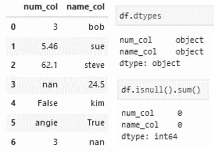
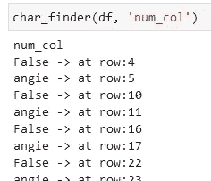
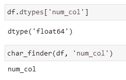
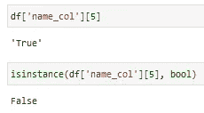
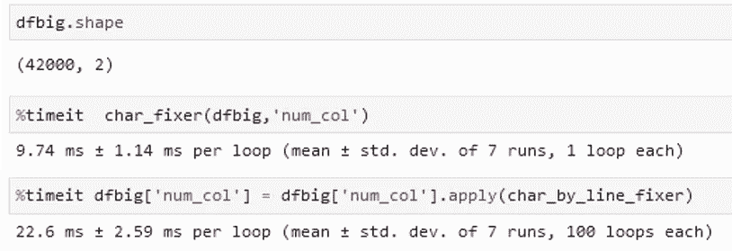

# 数据清理:自动删除坏数据

> 原文：<https://towardsdatascience.com/data-cleaning-automatically-removing-bad-data-c4274c21e299>

## 从数字和字符列中清除错误的数据类型条目

照片由[拍摄](https://unsplash.com/@norevisions?utm_source=medium&utm_medium=referral) [Unsplash](https://unsplash.com?utm_source=medium&utm_medium=referral) 上没有修改

导入数据集后，清理数据几乎总是您需要采取的首要步骤之一。熊猫有很多很棒的清洁功能，比如`isnull()`、`dropna()`、`drop_duplicates()`等等。然而，有两种主要情况没有被涵盖:

*   一个可能的数字列散布着字符串和布尔值
*   一个有抱负的字符列有零星的数值和布尔值

隔离和移除这些不良数据尤其具有挑战性——在这里，我将向您展示实现这一目标的工具。但是首先，在做任何进一步的分析之前，有另一个很好的理由删除这些坏数据… *对象类型*。

## 对象类型

虽然 pandas 通常在导入期间很好地解释了我们的列的数据类型，但是当坏数据引入非常不同的数据类型的元素时，它几乎总是出错。最终结果是列的数据类型(`dtype`)被设置为可怕的 ***对象*** 。

这有什么不好？首先，在排序、绘制和过滤数据，以及合并来自另一个数据框架的数据时，它会令人头疼。更糟糕的是，对象消耗了大量的计算资源，使得你处理数据的其他事情——包括 EDA 和机器学习——慢了很多。当然，要修复一个列的数据类型，我们首先需要所有的数据都与新的数据类型一致，否则我们会在转换过程中出错。这意味着清除所有不属于错误类型的数据。

不幸的是，在 Pandas 中根本没有清理混合类型数据的功能，这通常导致一系列排序方法来梳理它们的位置并逐个删除它们。相反，通过一些相当简单的自定义函数，我们可以自动化整个过程！

## 设置

为了给我们一些数据来玩，这里有一个包含重复元素的快速数据框架，第一列代表我们的未来数字列，第二列代表我们的未来字符列，但两者都有不同 dtypes 的大量坏数据。

检查`df.head()`和`df.dtypes`我们看到我们的数据，以及可怕的两列的**对象** dtype。还要注意，在这种对象形式中，我们无法直接检测 NaNs 这是我们在清理数据时需要注意的。

# 从数字列中清除字符和布尔值

首先，让我们创建一个简单的函数来列出`num_col`中包含非数值的所有行的内容和行号。这里需要注意的一点是，我们选择不报告空值(nan)。这就留给了用户稍后使用`dropna()`来删除它们，或者在清理完所有其他内容后，根据需要将它们转换为其他值。

为了实现这一点，我们遍历每一行并尝试将值转换成一个`float`。因为 NaN 被认为是一个浮点值，所以这些行被保留。同时，如果该值不是数字或安南，`float()`函数将返回一个 ValueError。在我们的函数中，它触发打印违规的值和行号。

如果我们在现有的数据帧上使用它，它会立即捕获两个重复的非浮点值:

太好了！我们现在知道所有非数字值隐藏在数据帧中的什么地方。检查之后，我们可以起草一个非常相似的函数来完全删除这些不匹配的行。一旦找到它们，我们现在可以简单地删除该行——当然，我们总是可以自定义 ValueError 后面的行，改为将它赋给我们喜欢的另一个(数字)值。

在循环完 dataframe 列之后，我们使用`astype()`试图将整列强制转换为`float` dtype。为什么？因为当我们在`try:`中调用`float()`时，我们正在做的就是……尝试。它没有做任何永久的改变。如果出现任何问题，`astype()`函数将抛出错误，让我们知道它在哪里遇到了问题。该语句还将那些非空的`'nan'`条目转换成我们可以检测到的适当的 nan。最后，我们重置索引，这样当我们在其他列上使用这个函数时，索引将是连续的，并与我们的`cnt`计数器一起工作。

在运行我们的函数之后，我们可以检查我们的列的 dtype，并且最后一次运行`char_finder()`来确保没有错误类型的值出现。瞧啊。

# 从字符列中删除数字和布尔值

硬币的另一面可能有点棘手。*技术上来说*‘8’是一个字符……*技术上来说*‘真’是一个词……但它们很可能不属于我们的字符列。我们在这里遇到的一个棘手的挑战是，尽管我们在创建它时在我们的`name_col`中输入了一个布尔值`True`和`24.5`，但是在 Panda 将列转换为对象时，它实际上把一切都当作字符串(`'True’`和`'24.5'`)。结果，就像我们之前的函数一样，`float()`实际上是在测试`float('True')`，这导致了 ValueError (p.s. `float(True)`等于 1.0)。如此处所示，我们的`'True'`元素没有被认为是类型`bool`的实例，因为它认为它是一个字符串。

为了克服这一点，我们必须加入额外的逻辑来显式测试`'True'`和`'False'`，因为像`bool()`这样的函数不像`float()`这样的数字函数那样特殊，并且会为任何字符的**赋予一个`True`值。**

同样，我们也特别注意将任何 NaNs 留在原位。为此，我们做了一个嵌套的`int(float())`转换。内部的`float()`像以前一样，试图把我们的字符串像‘24.5’变成 24.5。`int()`然后将像 24.5 这样的浮点数转换成 24，这对于这种检查算法来说很好——但是 nan 不是整数，会抛出 ValueError。这很好！我们希望 nan 被发送到 ValueError 部分，因为非错误(即数字)在底部的`else:`语句中被标记。考虑到这一点，我们的数字/布尔查找器函数和结果如下所示:

我们已经识别了所有的数值和布尔值！在我们创建 fixer 函数之前，请记住我们的 nan 仍然是这个列中的字符串。我们需要在我们的`elif`语句中显式地处理它，以便手动将它们转换回 nan。我们可以在我们的输出中看到这一点，因为`nan`现在被表示为`<NA>`，并且`df.isnull().sum()`能够检测到它们。

此时，我们的两个 dataframe 列有效地清除了所有错误类型的数据，如下所示。我们还将它们转换成适当的数据类型，这将允许所有进一步的清理、EDA 或机器学习。

现在，我们只需要决定如何处理 nan(现在我们可以检测它们了！)—如果它们构成了大量的行，我们可以考虑删除整列—否则我们通常使用`df.dropna()`来简单地删除所有 NaN 行。

# 额外积分—速度分析

通常，for 循环是我们在操作数据帧时最不想做的事情。For 循环在计算上可能非常慢。作为一个思考练习，这些相同的函数可以使用 panda 的`apply()`函数来实现，然后可以使用更加矢量化的实现。

然而，如果我们检查一下时间(当然是在重置两次之间的 df 之后)，我们会发现我们原来的解决方案非常快，即使对于具有 42，000 行的数据帧也是如此。更令人惊讶的是，它的执行速度比这个`apply()`解决方案快两倍多。

虽然其他矢量化解决方案确实存在，但我发现用几毫秒的时间清理每一列是非常容易管理的。

# 摘要

这里显示的所有代码，以及一个只有功能的 jupyter 笔记本都可以从我的 github 中获得。我还包括了将所有坏数据转换成 nan 的`char_fixer_nan()`和`num_fixer_nan()`，以防对您的目的更有用。使用`%run ColumnCleaner.ipynb`将这些功能保存到本地后，也可以很容易地导入到您的任何笔记本中。

搜寻和清除错误类型的数据并不有趣，这些功能是出于需要而产生的。我真的希望这能帮助每个人加快特别脏的数据集的清理过程。如果你觉得这个有用，请跟我来！ 欢呼声此起彼伏，快乐的编码声此起彼伏。