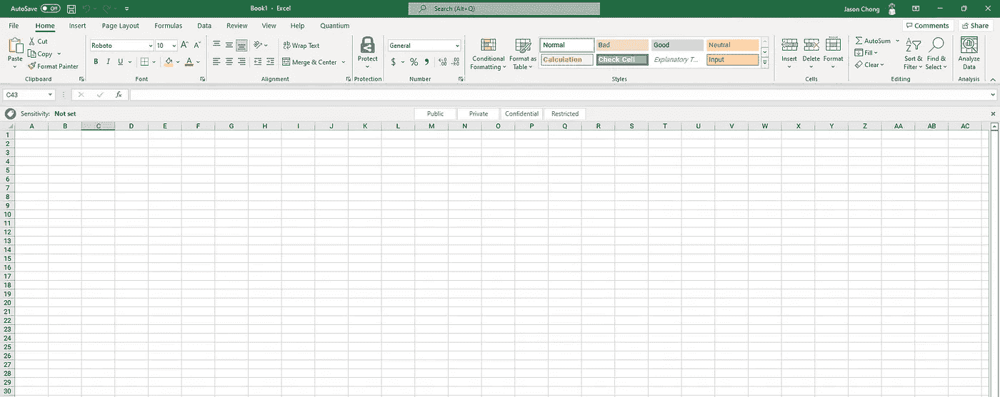
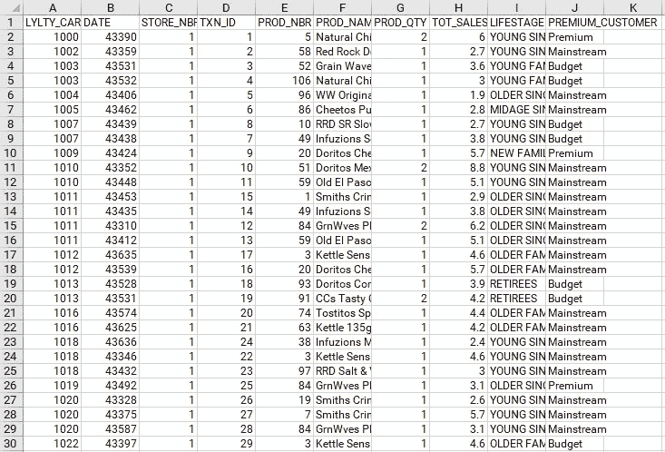
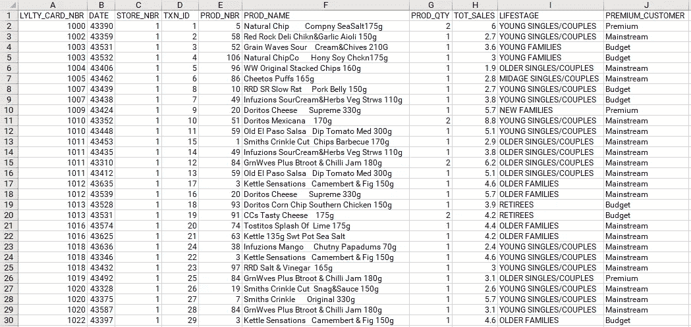
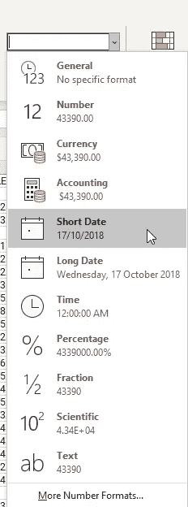
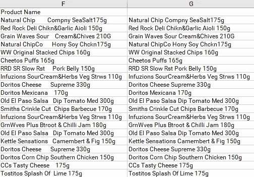
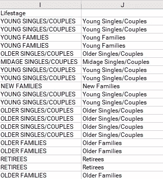
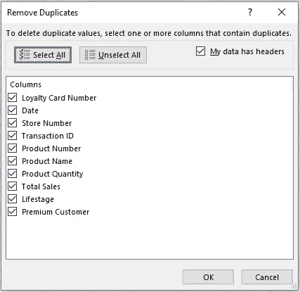
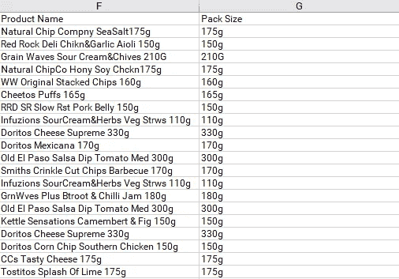
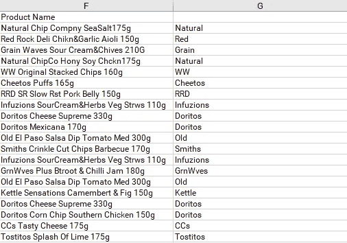
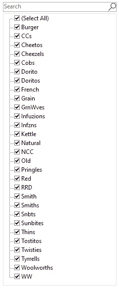

# 每个初学者都需要知道微软 Excel 中的这些数据清理技术

> 原文：<https://towardsdatascience.com/data-cleaning-techniques-in-microsoft-excel-you-need-to-know-4075cbb30731>

## 想要快速轻松地清理您的数据吗？不要再看了


照片由[海蒂·芬](https://unsplash.com/@heidijfin?utm_source=medium&utm_medium=referral)在 [Unsplash](https://unsplash.com?utm_source=medium&utm_medium=referral) 拍摄

接下来的两篇博文将作为我最近与墨尔本大学学生运营的公益咨询俱乐部 [BusinessOne](https://www.businessoneunimelb.com/) 联合举办的培训研讨会的总结。

该研讨会旨在帮助 BusinessOne 的项目团队学习使用 Microsoft Excel 的基本数据清理技术，并介绍 Microsoft Power BI 作为一种工具来构建交互式仪表盘，以交流数据集中的关键见解。

今天的博客帖子将重点关注研讨会的前半部分，即使用 Excel 执行简单的数据检查和数据清理。

查看以下研讨会的完整录音。

车间使用的材料也可以在我的 GitHub [这里](https://github.com/chongjason914/b1-workshop)找到。

# 介绍

Microsoft Excel 是 Microsoft Office 软件产品套件的一部分。这是一个电子表格，它不仅能够将数据以表格形式存储，即行和列，而且还具有计算功能、绘图工具、数据透视表等等。

出于本文的目的，我们将主要关注如何在 Excel 中处理数据，执行基本的检查和数据清理，以及一些基本的计算。



Microsoft Excel 中的“主页”选项卡；作者图片

电子表格中的每个单元格都用一个字母后跟一个数字来引用，例如单元格 A1、A2 等等。

# 调整列的大小



自动调整列宽前的表格；作者图片

假设客户给了我们这个特定的原始数据集，我们的任务是清理、分析和解释这些数据。

首先，我们应该立即注意到列的大小不合适，这使我们无法看到每个单元格中的完整值。为了解决这个问题，我们可以调整每一列的大小，使它们变得足够宽，以捕获每一列中最长的单词。

我们首先需要通过 Ctrl+A 突出显示整个表格，一旦表格被突出显示，按 Alt，然后按 H、O 和 I，这将自动调整所有列以适合它们的宽度。



自动调整列宽后的表格；作者图片

# 了解数据集

在我们开始任何清理或分析之前，关键是我们首先要很好地理解我们正在处理的数据集。

在这里，我们可以观察到一个看起来像是交易数据集的表，其中每一行都表示客户在给定日期在特定商店购买的单个产品。在各列之间移动，我们会得到更多信息，如产品名称、数量、总销售额，以及客户属性，如他们的生命阶段和保费水平。

首先检查数据集的行和列总是一个好的做法，特别是我们以前没有见过或处理过的数据，因为这将有助于我们了解在执行数据检查和随后的数据清理时需要注意什么。

# 重命名列名

要重命名或替换单元格中的值，只需选择您想要更改的单元格，然后开始键入新值。

假设我们想重命名表中的所有列名:

*   **LYLTY_CARD_NBR:** 积分卡号码
*   **日期:**日期
*   **店铺 _ 编号:**店铺编号
*   **TXN_ID:** 交易 ID
*   **产品编号:**产品编号
*   **产品名称:**产品名称
*   **产品数量:**产品数量
*   **总销售额:**总销售额
*   **生命阶段:**生命阶段
*   **优质客户:**优质客户

# 将数据类型常规转换为短日期

Excel 中的每个单元格都被分配了一种数据类型，该数据类型决定了数据的存储和显示方式。

我们可以在 B 列中看到，日期没有按预期显示，这是因为它们被设置为数据类型 general。为了解决这个问题，我们需要将列转换成短日期。

首先，突出显示 B 列，并将数据类型从 general 更改为 short date。



将数据类型从常规更改为短日期；作者图片

# 微调功能

在 F 列中，我们可以看到产品名称中出现了不寻常的间距模式。为了清理这个问题，我们可以使用 Excel 中的 trim 函数，并传入产品名称作为它的参数。



trim 函数删除所有不寻常的间距模式；作者图片

# 本征函数

此外，在列 I 中，我们观察到文本都是大写字母。使用适当的函数，我们可以只大写每个单词的第一个字母，其余的都是小写字母。



适当的函数将每个单词的第一个字母大写；作者图片

# 删除重复项

重复项是数据集中相同记录的精确副本，它们应该被删除，因为它们没有增加任何附加值。

在 Excel 中删除重复项非常简单。在数据选项卡下，选择删除重复项。



删除重复项；作者图片

这里，我们将重复定义为表中所有字段的精确副本，这也是我们在上面的选择列表中包含所有列的原因。

单击“确定”后，Excel 将通知您找到的重复项的数量，并自动将它们从表中删除。

# 向总销售额列添加美元符号

因为总销售额是美元数字，所以在数字旁边加上美元符号才有意义。

为此，只需突出显示该列，并将该列转换为会计数字格式，用 Home 选项卡下的美元符号表示。

# 产品名称中的快速填充包装尺寸

Flash fill 是 Excel 中一个强大的预测功能。它可以感知您正在尝试的逻辑模式，并自动将该模式应用于整个列。

为了演示这一点，假设我们想从 f 列中的产品名称中提取包装尺寸。我们可以看到，包装尺寸，例如 175 克、150 克、210 克等，出现在每个产品名称的最末尾。因此，我们可以利用 flash fill 来识别这种模式，然后用相应产品的包装尺寸填充新列。

实际上，要启动 flash fill，我们必须首先键入第一个包装尺寸，在本例中为 175g，然后继续下一行。当您开始为下一个产品名称键入 150g 时，您应该会看到一个弹出选项，Excel 正在尝试用所有包装尺寸填充整个列。只需按下键盘上的回车键来应用闪光填充。

或者，如果该选项没有出现，请按 Ctrl+E，这是 flash fill 的键盘快捷键。



产品名称中的闪光填充包装尺寸；作者图片

# 从产品名称中提取第一个单词

假设我们并不真的关心产品的味道，相反，我们只想要品牌名称。最简单的方法是从每个产品名称中提取第一个单词。为此，我们需要两个独立的函数:left 和 find。

Left 从文本字符串的开头返回指定数量的字符。另一方面，Find 返回一个文本字符串在另一个文本字符串中的起始位置。

结合使用这两个函数的公式如下:

```
LEFT([Product Name], WHICH(" ", [Product Name])-1)
```

用简单的英语来说，这个公式基本上是说找到第一个空格字符之前的位置，并返回从产品名称到该位置的所有字符。结果，我们得到以下结果:



从产品名称中提取第一个单词；作者图片

# 查找并替换不一致的产品名称

从产品中获得品牌名称后，我们可以发现一些产品标签上的几个不一致的名称。一些例子包括:

*   Infzns 和 INF uz
*   Snbts 和 Sunbites
*   WW 和 Woolworths
*   RRD 和红石熟食店



产品名称标签不一致；作者图片

作为一名勤奋的数据科学家，我们需要在进行任何进一步分析之前妥善解决这个问题。

有几种方法可以做到这一点，但我在研讨会上演示的方法是使用查找和替换，键盘快捷键 Ctrl+H。

指定要查找的单词和要替换的单词，让 Excel 完成剩下的工作。但是，请记住，如果这个单词出现在同一个电子表格的其他地方，这个方法也会覆盖它。小心行事。

# 移除异常值

说到成为一名勤奋的数据科学家，在执行数据检查时要注意的另一件事是离群值。

离群值是明显偏离其余数据分布的数据点。重要的是，我们要去除它们，因为它们不仅扭曲了我们对变量的看法，而且在我们构建模型时会对我们的模型产生负面影响。

在我们的交易数据集中有两个异常值。这可以通过产品数量和总销售额列看到。具体来说，一个拥有 226000 号积分卡的顾客在两个不同的场合购买了 200 包筹码，总销售额为 650 美元。

出于本次研讨会的目的，我们将从表中删除这些异常值。

# 缺少日期

最后但并非最不重要的是，我们的数据中有一个缺失的日期，我必须承认，对于初学者来说，发现这一点很有挑战性，但尽管如此，这是我们努力彻底清理数据集的关键一步。

为了找到丢失的日期，我们需要将整个日期列传递给一个名为 unique 的函数，该函数只返回给定数组中的唯一值。然后，将日期从最早到最新排序。

尽管在 Excel 中没有直接找到遗漏日期的方法，但我们仍然可以想出自己的零碎方法来得到我们需要的东西。具体来说，我们可以构造一个 if-else 语句，如下所示:

```
IF([Tomorrow] - [Today] = 1, "Yes", "No")
```

这意味着如果明天的日期和今天的日期之差等于 1，则该日期是连续的，因此是正确的。否则，就会错过日期。

如果操作得当，我们应该会看到丢失的日期是 2018 年 12 月 25 日，也就是圣诞节。这是合理的，因为零售商店可能在假日期间关闭，因此，在特定的一天没有登记任何销售。

虽然 Excel 可能不是最通用和最全面的数据清理工具，但它确实提供了一种非常快速和简单的方法来检查数据集和完成一些基本任务。

为了补充这篇文章，我强烈推荐在我的 YouTube 频道上观看完整的视频，在那里我将更详细地演示这里涉及的每个步骤。

如果你从这篇文章中发现了任何价值，并且还不是一个媒体会员，如果你使用下面的链接注册会员，这对我和这个平台上的其他作者来说意义重大。它鼓励我们继续推出像这样的高质量和信息丰富的内容——提前感谢您！

[](https://chongjason.medium.com/membership)  

不知道接下来要读什么？这里有一些建议。

[](/what-makes-bagging-algorithms-superior-4a3882dab59f)  [](/10-most-important-sql-commands-every-data-analyst-needs-to-know-f0f568914b98)  [](/beginners-introduction-to-time-series-analysis-and-forecasting-c2c2918603d9) 