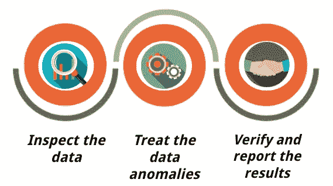
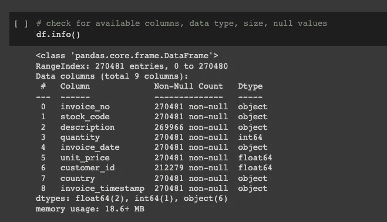
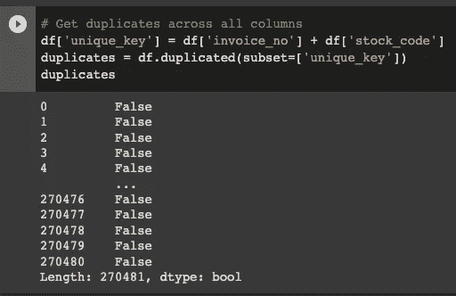
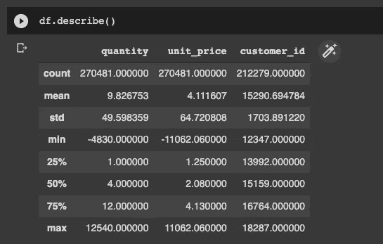
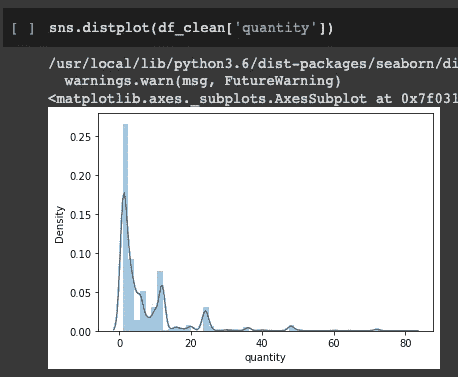
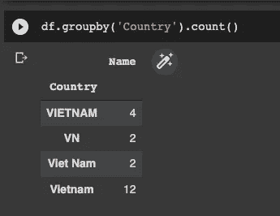

# 数据清理工具箱

> 原文：<https://towardsdatascience.com/data-cleaning-toolbox-e0c6a1b94684>


由[谷仓图片](https://unsplash.com/@barnimages?utm_source=medium&utm_medium=referral)在 [Unsplash](https://unsplash.com?utm_source=medium&utm_medium=referral) 上拍摄

## 在分析您的数据之前，编译要注意的方面

在分析中，洞察的质量在很大程度上取决于所用数据的质量。正如已知的计算机科学谚语“[垃圾输入，垃圾输出](https://en.wikipedia.org/wiki/Garbage_in,_garbage_out)”，对于分析上下文，它可以被翻译为“*垃圾数据输入，垃圾见解输出*”。为了确保这些垃圾不会污染用于分析的优质数据，需要在开始数据争论或转换过程之前进行一些预处理。

引用[维基百科](https://en.wikipedia.org/wiki/Data_cleansing)的说法，数据清理/清除是**从记录集、表格或数据库中检测并纠正(或删除)损坏或不准确记录**的过程，指的是识别数据中不完整、不正确、不准确或不相关的部分，然后替换、修改或删除脏的或粗糙的数据。消除这一过程可能会导致不正确的、有偏见的和误导性的分析见解。

# 数据清理框架

数据清理的过程非常简单。

1.  **检查**数据:识别数据质量异常(即不正确、不一致的数据)
2.  **处理**数据异常:以不误导分析的最佳方式修复数据异常。这可以通过移除、转换或插补来完成。
3.  **验证**并报告清理结果:检查数据质量异常是否通过处理得到修复，并记录处理&结果。



数据清理框架(图标向量由 freepik.com 宏向量创建)

# 数据清理要找哪些方面？

数据清理本质上是指对数据进行预处理，使其具有最佳分析质量。因此，在进行数据清理时，我们应该寻找并检查数据质量的各个方面。

## 准确(性)

代表一条信息**反映现实**的程度。

评估准确性可能特别棘手，因为您可能无法用数据本身来评估准确性。比方说，您正在评估客户数据，其中包括他们的地址。这个地址可能是一个假地址(根本不存在)，或者部分是假的(城市或邮政编码在那里，但街道名称或建筑不存在)。为了评估这一点，你需要外部数据来验证，比如谷歌地图坐标。

这个外部数据源可能并不总是可用的，所以作为数据分析师，有时候你需要**依赖你的领域知识**。例如，如果发现一个几秒钟的交货时间数据，而当时距离应该是几公里远，那么你就有权利质疑这个数据的准确性。

## 有效期

以特定格式收集信息的程度，**遵循特定的业务规则**。

这些规则可以从数据类型约束(即年龄值的整数)、范围约束(即出生日期不能是未来日期)到正则表达式约束(即电话号码或电子邮件格式)不等。

尽管这些规则可以在数据输入/收集时实施(并防止额外的数据清理工作)，但有时它们无法建立(即出于设计或用户方便的目的)或存在一些后端错误。这包括从各种来源/输入方法收集的数据，在整合时存在有效性错误。

## 一致性

检查存储在一个位置**的信息是否与存储在其他位置**的相关数据相匹配。

一致性可以是数据定义或引用的形式(即一个表中的“客户 ID”数据需要引用组织内其他表中的相同“客户 ID”实体)，也可以是指标和格式的单位(即每个数据源的所有日期/时间引用相同的时区)。

这与有效性高度相关，因为在某些方面，可以有适当的规则来确保数据源的一致性。

## 完全

代表数据在多大程度上满足了你对全面的期望；是否具备所有必要的措施。

这在很大程度上依赖于数据收集，一旦有丢失的数据，可能很难重新填充。当然，我们可以寻找其他数据来源，看看是否有任何准确的副本，或者可以回去收集(即发电子邮件给客户再次填写)。

在数据清理中，我们需要非常小心地处理完整性，因为它可能会扭曲分析结果，并产生误导性的见解。

## 独特性

检查实体**是否是数据集中存在该信息的唯一实例**。

检查唯一性也受数据上下文的影响。有时需要唯一性(即只能有一个客户有这个特定的社会安全号码)，但是**有时也不能保持唯一性**(即一个电话号码可以列在两个客户下面，因为他们是同一个家庭的一部分)。我们需要了解上下文以及何时应用这条规则。

# 检查数据异常的工具和技术

## 通用数据属性

我们可以首先检查通用数据属性(行数、数据类型),了解是否有任何问题。具体来说，在 Python 中，我们可以使用`[dataframe.info](https://pandas.pydata.org/docs/reference/api/pandas.DataFrame.info.html)`函数来获取数据集中的可用列、非空计数和数据类型。



Python Pandas 中的数据帧信息

该函数将帮助我们快速了解是否有我们需要的所有字段(列名)，是否有任何缺失数据(非空计数)，以及数据是否是预期的数据类型(即项目数量的数值)。

## 缺失数据

上面的 dataframe info 函数可以为我们提供缺失值的高级概述。为了对丢失的数据进行更广泛的评估，我们还可以使用`[missingno](https://github.com/ResidentMario/missingno)`库将其可视化。

库中的`matrix`函数提供了空数据的可视化，让我们了解空数据是如何分布的。我们还可以在可视化数据帧之前对其进行排序，以检查一列中缺失的数据是否与其他列相关(例如，如果空的客户 ID 数据都来自某个特定的国家，则该国家可能存在数据收集问题)。


使用 missingno 的缺失数据可视化

## 独特性

在 Pandas 中使用`[duplicated](https://pandas.pydata.org/docs/reference/api/pandas.DataFrame.duplicated.html)`功能可以评估唯一性。您可以定义要检查重复的列(或者让它检查所有列),函数将输出一个布尔值，不管该特定行是否重复。



在 Python 中评估重复项

## 范围约束

由于不同的数据字段可以根据上下文而处于不同的范围约束中(即，出生日期只能是过去的日期值，而计划约会日期只能是未来的值)，因此可以以各种方式来评估范围约束。对于数据分析师来说，使用他们的领域知识来调整这一点是很重要的。

为了识别这样的问题，我们可以探索数据集的统计分布并对其进行评估。一个常用的函数是`[Dataframe.describe()](https://pandas.pydata.org/docs/reference/api/pandas.DataFrame.describe.html)`。该函数提供数据集的描述性统计数据，包括集中趋势和分散性。



探索数据集的描述性统计数据

使用`describe`函数，我们可以很容易地识别出`quantity`和`unit_price`字段中不寻常的最小值，该值在某种程度上小于零。

除了上面的数字描述性统计，我们还可以使用数据可视化来了解数据集分布，并识别出超出预期数据范围值的分布。可以用于这种可视化的一个功能是`distplot`。



分布图，用于确定范围约束中的问题

使用分布图，我们可以清楚地看到有些值超出了范围；低于 0。我们还可以看到，与整个数据集相比，低于 0 的值非常低。这有助于确定可以采取哪些措施来解决这个问题。

## 一致性

有各种各样的一致性问题需要不同的工具来检测。

最常见的一致性问题之一是**不一致的分类标签**值。例如，在“客户国家”列中，对于同一个国家越南，我们可以找到不同的值:“越南”、“越南”、“VN”、“越南”等。

另一个首要的一致性问题是**格式问题。**这可以是日期栏(即 YY 月/日 vs YYY 月/日等)、电话号码(即+12345678890 vs+1–234–567–8890)或网址(即[http://hello.com](http://hello.com)vs[www . hello . com)。](http://www.hello.com).)

为了识别这个问题，我们可以使用`[Dataframe.groupby](https://pandas.pydata.org/docs/reference/api/pandas.DataFrame.groupby.html)`功能。使用这个函数，我们可以研究一个列中可用的不同值以及相关的值计数。这将有助于找到需要更新和修复的值。



确定与 groupby 的不一致

# 处理数据异常

关于如何处理上面列出的数据异常，没有唯一正确的答案。但是有三个主要选项可以用来处理这些异常，并为分析准备更好的数据。

## 1.删除/丢弃数据

对于任何数据异常问题，我们都可以执行数据删除。在这种处理中，当我们发现一个问题时，我们丢弃整个观察(即数据集上的整行)。

但是，如果我们确定要删除的**数据不是信息性的**，则只能 ***执行此操作。信息不足可能是因为数量相对较少(即百万行中的一行)、值重复(只需要保留一条记录)或损坏太严重(即 90%的字段值丢失或不准确)。在其他情况下，我们应该在执行数据删除之前考虑其他处理方案。***

```
# dropping the problematic data : description_id is nulldf.dropna(subset = ["description"], inplace=True)
```

在 Python 中，我们可以使用`[Dataframe.drop](https://pandas.pydata.org/docs/reference/api/pandas.DataFrame.drop.html)`及其相关函数(`[dropna](https://pandas.pydata.org/docs/reference/api/pandas.DataFrame.dropna.html#pandas.DataFrame.dropna)`、`[drop_duplicates](https://pandas.pydata.org/docs/reference/api/pandas.DataFrame.drop_duplicates.html#pandas.DataFrame.drop_duplicates)`)来实现这一点。

## 2.均匀化

对于数据不一致的问题，通常可以进行均匀化。为了进行统一，我们需要充分理解数据背景——可用的不一致性(即国家案例:“越南”、“越南”、“VN”、“越南”)和期望的最终统一结果(即“越南”)。

虽然在大多数情况下，我们需要在个案的基础上进行一致化(因为不同数据集的分类变量不同)，但有一些工具可以用来格式化不一致。

*   对于日期/时间:使用`[Pandas.to_datetime](https://pandas.pydata.org/docs/reference/api/pandas.to_datetime.html)`以编程方式将多种不同格式的数据转换为统一的日期时间格式
*   对于电话号码:使用 Python 中的`[phonenumbers](https://pypi.org/project/phonenumbers/)`库获得标准化的国家代码和国家电话号码
*   对于 URL:自定义函数定义[ [*示例*](https://stackoverflow.com/questions/3285295/canonical-url-compare-in-python)

## 3.替换/插补

对于具有超范围值和/或缺失值问题的数据，可以进行替换。具体来说，对于数值数据类型的缺失值问题，可以从数据集中指定的统计值进行替换，我们通常称之为[插补](https://en.wikipedia.org/wiki/Imputation_(statistics))。

为了能够替换数据值，我们需要像数据分析师一样利用我们的领域知识。对于超出范围或无效的数据，替换源可以来自数据集之外(即根据城市值更新国家/州值)，也可以来自数据集之内(即使用出现次数最多的电话号码作为客户电话号码的真实值)。

对于插补，有一些统计值选项可以插补到数据集。当该值中的数据频率与其他值相比明显较高，并且丢失的数据看起来像它的可能性很高时，最好的方法是使用**模式值**。另一种选择是使用中间值。当数据集不是高度倾斜时，我们可以使用**均值/平均值**，或者当数据集更加倾斜时，可以使用**中值**。

在工具方面，我们可以使用 Python 中的`[scikitlearn.impute](https://scikit-learn.org/stable/modules/impute.html)`库，根据定义的插补类型自动对数据集进行插补。查看这篇来自 Analytics Vidhya 的关于详细输入技术的文章。

# 报告和总结

对数据集进行的任何处理都可能改变从数据分析中产生的见解。因此，记录所有发现的质量问题和对这些异常情况的处理是很重要的。


[斯科特·格雷厄姆](https://unsplash.com/@homajob?utm_source=medium&utm_medium=referral)在 [Unsplash](https://unsplash.com?utm_source=medium&utm_medium=referral) 上的照片

该报告/文档对于以下情况尤其有用:

*   **改进数据收集流程**。我们可以添加业务规则来验证数据输入或评估发现大量缺失数据的数据管道。
*   **重现分析**如果将来有任何数据修正可用。

由于不适当的/标准化的业务流程或数据管道中的谬误，数据异常很容易被发现。由于数据分析师负责从给定的数据集产生最大的洞察力，因此进行数据清理以确保数据具有最佳的分析质量是正确的。

这将通过(1)识别可用的异常，(2)相应地处理它们，以及(3)验证/报告清洁过程和结果来完成。