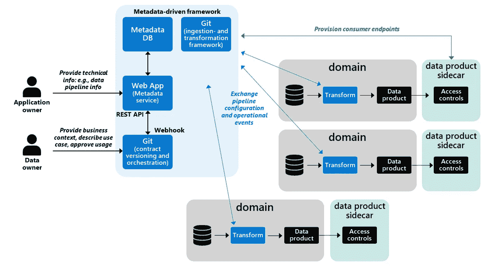

# 数据契约—确保数据网格体系结构的稳健性

> 原文：<https://towardsdatascience.com/data-contracts-ensure-robustness-in-your-data-mesh-architecture-69a3c38f07db>

在联合架构中，职责分布在[域](/data-domains-where-do-i-start-a6d52fef95d1)之间，很难监督依赖性并获得数据使用方面的见解。这就是数据契约发挥作用的地方。为什么数据契约很重要？因为它们提供了对谁拥有什么样的[数据产品](/data-domains-and-data-products-64cc9d28283e)的洞察。他们支持制定标准并满怀信心地管理您的数据管道。它们提供了关于哪些数据产品正在被消费、由谁消费以及消费目的的信息。一句话:数据契约对于健壮的数据管理是必不可少的！

在您继续阅读之前，我鼓励您从两个维度来看待数据产品的分布和使用。首先，存在技术问题，如数据管道处理和对数据稳定性的共同期望。第二，还有业务方面的考虑，比如就数据共享的目的达成一致，这可能包括使用、隐私和目的(包括限制)目标。通常，每个维度都有不同的角色。对于技术问题，您通常依赖于应用程序所有者或数据工程师。对于业务问题，您通常依赖于产品所有者或业务代表。

## **数据合约**

数据契约类似于数据交付契约或服务契约。它们很重要，因为当数据产品变得流行和广泛使用时，您需要实现版本控制和管理兼容性。这是必要的，因为在一个更大的或分布式的架构中，更难监督变更。从其他应用程序访问或使用数据的应用程序总是会受到耦合的影响。耦合意味着高度的相互依赖。例如，对数据结构的任何更改都会对其他应用程序产生直接影响。在许多应用程序相互耦合的情况下，有时会看到级联效应。即使是对单个应用程序的微小更改也可能导致同时对许多应用程序进行调整。因此，许多架构师和软件工程师避免构建耦合架构。

数据契约被定位为这个技术问题的解决方案。数据契约保证接口兼容性，并包括服务条款和服务水平协议(SLA)。服务条款描述了如何使用数据，例如，仅用于开发、测试或生产。SLA 通常还描述数据交付和接口的质量。它还可能包括正常运行时间、错误率和可用性，以及弃用、路线图和版本号。

在许多情况下，数据契约是元数据驱动的摄取框架的一部分。例如，它们作为元数据记录存储在集中管理的 metastore 中，并在数据管道执行、数据类型验证、模式、互操作性标准、协议版本、缺失数据的默认规则等方面发挥重要作用。因此，数据契约包含了大量的技术元数据。

数据契约的元数据架构

对于分布式架构，我的建议是将您的数据管道框架分布在不同的域中。在这种方法中，域遵循一种通用的工作方式。域自己处理数据，这意味着控制和责任属于您的域。然而，框架和元数据仍然在中央治理之下。

当实现联合工作方式时，另一个建议是从小处着手。从基础开始，比如在共享元数据存储库中存储用于模式验证的元数据、企业标识符和对其他数据集的引用。为可视化数据移动添加数据沿袭支持。接下来，使用像[远大前程](https://greatexpectations.io/)这样的库来验证技术数据质量，引导您的过程并实现控制。使用 Azure Synapse 和权限构建动态数据管道的最佳实践可在此处找到:[https://Piet hein . medium . com/modern-data-pipelines-with-Azure-Synapse-analytics-and-Azure-view-Fe 752d 874 c 67](https://piethein.medium.com/modern-data-pipelines-with-azure-synapse-analytics-and-azure-purview-fe752d874c67)

所有的控制都应该是持续集成过程的一部分。您应该捕获所有运行时信息，比如度量和日志记录，并使其成为您的元数据基础的一部分。这种方法提供了对数据管道稳定性的可见性。因此，从您的域到中央管理驾驶舱有一个反馈回路。

当实现所有数据移动的稳定性时，通过捕获哪些数据消费者使用哪些数据属性(如表和列)来继续扩展。您可以对该信息使用相同的 metastore。这种关于使用的输入是检测突破性变化所必需的。是你的机制让你决定对生产者或消费者的影响。如果数据产品数据集没有被任何人消费，您可以允许破坏性的变化发生。控制数据提供者和消费者之间的握手。我见过一些公司使用源代码控制来管理这个过程，比如 Git。

## **数据共享协议**

数据共享协议是数据合同的延伸。它们涵盖了预期用途、隐私和目的(包括限制)。它们独立于接口，让用户深入了解哪些数据用于何种特定目的，并作为数据安全控制的输入。例如，这些协议可以是对什么数据应用什么过滤器或安全保护。

数据共享协议还可以防止数据使用上的误解。在数据共享之前，域应该讨论数据共享和数据使用问题。当他们达成合作共识时，他们应该在数据共享协议中记录这种共识。您的数据共享协议可能还包括功能数据质量、历史化、数据生命周期管理和进一步分发等项目。这种达成共识的方法不仅从法规的角度来看很重要，而且还能为您的组织带来价值。

您还希望对数据应用分类和条件，如敏感度标签或过滤条件。这成为保护数据时的一个问题。在上一节的图表中，您可以看到一个“数据产品边车”。 [Zhamak](https://martinfowler.com/articles/data-monolith-to-mesh.html) 将此称为注入策略执行的组件或层，如数据访问控制或数据消费的输出方法。在我之前的角色中，我设计了一个类似的模式:**数据产品访问层**。它是对您的域数据的安全抽象，用于处理您的安全实施。它是从数据契约中生成的安全层，用于安全地访问数据。它可以是 ACL 或无服务器视图，这是在达成共识后从您的数据契约存储库动态创建的。或为特定消费者选择和过滤的重复数据集。您的最终目标必须是以完全自动化的方式从您的数据契约中获得这些安全视图。

最后，我鼓励您在数据契约属性和文档之间建立联系。确保提供了语义上下文，并与您的术语表建立了关系。这使得消费者能够理解从业务需求到实际实现的转换是如何进行的。如果与业务术语的关系对您很重要，请考虑实施策略。例如，只有当所有数据产品属性都链接到业务术语实体时，才能建立合同。相同的策略也可能适用于上下文变化，例如关系和定义调整。

## **启动时的最佳实践**

如何开始使用数据契约？怎么把东西变得实用？我的建议是慢慢开始。这主要是一个组织上的挑战。相互之间不要引入太多的变化。数据契约是一种文化转变。用户需要熟悉并理解数据所有权的重要性。这种转变也是为了在太少和太多的元数据属性之间找到最佳平衡点。关于过渡:

1.  首先，创建技术数据管道的稳定性。如果它们是不稳定的，并且容易受到意想不到的和破坏性的变化，那么你的用例将不会进入生产。
2.  对于您的数据共享协议，通过建立一个简单实用的流程开始。不要把事情复杂化。例如，您可以从用 Microsoft Forms 设计的简单表单或模板开始。你应该用简明易懂的语言起草。接受手动流程。限制您的初始元数据需求。你的第一阶段是关于文化转变和收集需求。迭代，直到您的元数据需求变得稳定。
3.  在您完成第一个流程后，尝试用基于 web 的应用程序、数据库和/或消息队列来替换您的手动表单。在此阶段，您的中央数据治理团队仍将进行监督。数据访问的粒度级别通常是粗粒度的，文件夹或文件也是如此。尝试利用 REST APIs 来自动提供数据访问策略或 ACL。
4.  您的下一个阶段是实施更强大的处理批准的工作流程。让您的数据所有者或数据管理者处于领先地位。您的中央数据治理团队将在后座进行监督。该团队定期审查所有数据合同。在这个阶段，您还应该有一个数据目录，显示所有现成的数据产品。提高您的数据安全性和执行能力。允许更细粒度的选择和过滤。考虑像动态数据屏蔽这样的技术来防止数据重复。
5.  在您旅程的终点，一切都将是自助服务和全自动的。这包括自动安全执行和预测数据批准的机器学习。例如，安全视图在获得批准后会自动部署。

数据契约是一种相对较新的数据网格方法。它们很重要，因为它们提供了依赖关系和数据使用的透明性。从小处着手，首先关注技术稳定性和标准化。通过使用吸取经验教训的过程进行迭代。数据治理是必不可少的，但是过多会造成开销。慢慢建立和自动化。这些是我学到的教训。