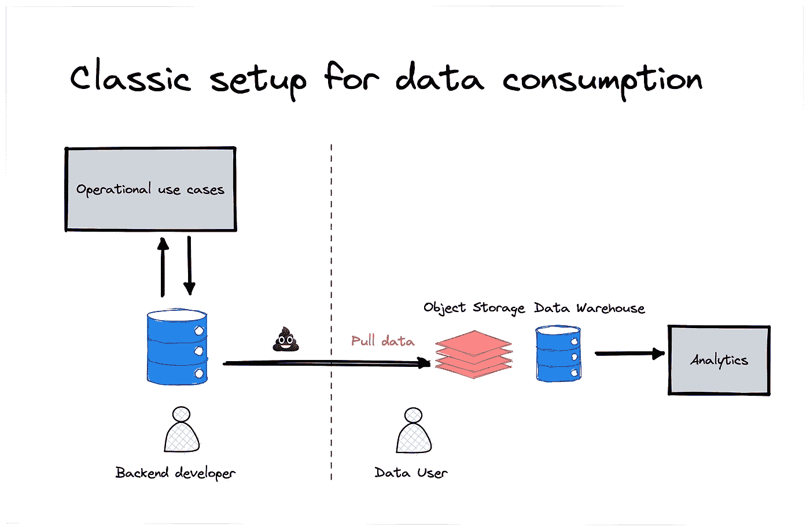
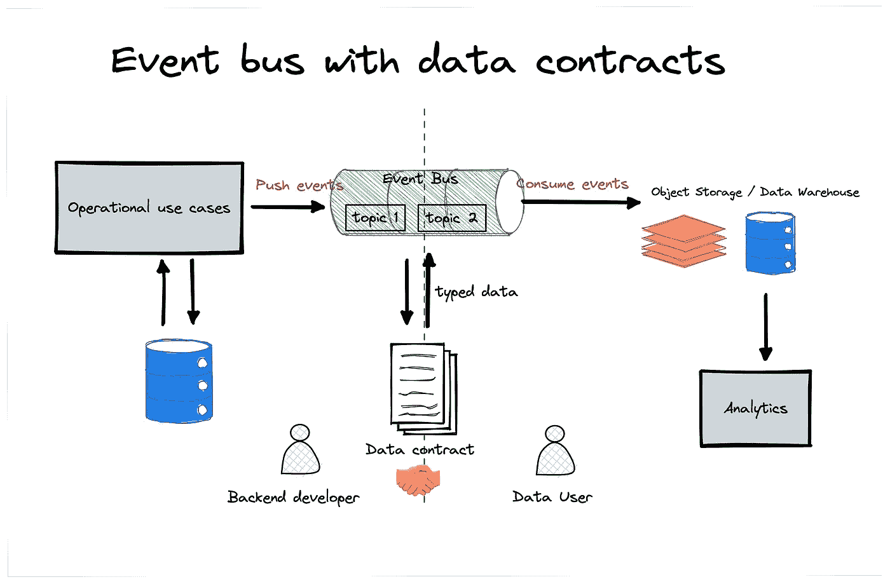
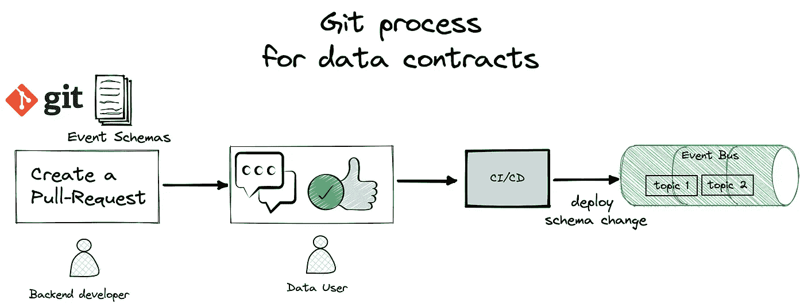

# 数据契约—从零到英雄

> 原文：<https://towardsdatascience.com/data-contracts-from-zero-to-hero-343717ac4d5e>

## 数据契约的实用方法

书写数据契约——作者图像，稳定扩散生成。

最近，社交媒体上围绕数据合同有很多噪音。一些数据从业者[分享了关于利弊的观点](https://www.youtube.com/watch?v=4BEpYAp3Qu4)，但主要是关于它是什么及其定义。虽然我认为数据契约是一个疯狂的话题，但我想分享我的经验和如何开始的实用技巧。数据契约是真实而有价值的东西，你现在就可以用比你想象的更少的努力开始利用它。但是我们为什么首先需要它们呢？

# 🔥数据契约有什么模糊之处？

## 积极主动而不是被动

如果你从事数据工作，你很可能会多次遇到这个问题:数据是错误的，而你不知道为什么。数据上游似乎有问题，但你的内部同事都不知道为什么，那么我们该怎么办？我们应该联系谁？

> 我们怎么会在那里结束？

随着数据不再是头等公民，数据团队大多开始在服务于其他初始目标的现有基础架构上进行分析。他们将根据现有的操作数据库“插入”他们的管道，将数据卸载到一个仓库，并处理其余的。

作者图片

数据团队被困在锤子(他们无法控制的操作数据库)和大声疾呼其需求的业务之间。

他们可以在某种程度上变一些魔术，但是[垃圾进垃圾出](https://en.wikipedia.org/wiki/Garbage_in,_garbage_out)。上游的问题越多，对数据团队的挑战就越大。

这就是数据契约可以发挥作用的地方。数据团队有一个明确的方法来询问他们需要什么，并提出一个更严格的过程来处理变更管理。

# 📎我们如何实现这样的契约？

## 如果我们能从头开始重新做每件事会怎么样？

起初这似乎不现实，因为你很少有机会从绿地基础设施开始。然而，以今天的云技术，这并不那么遥不可及。

事件驱动的架构有助于支持数据契约，原因有多种:

*   事件可以是强类型的，每个事件都可以与一个模式版本相关联。
*   如果你使用一个无服务器的事件流，并且基础设施是自包含的(每个主题)，那么它是便宜的。
*   事件平台(又名发布/订阅)为传统的下游数据消费(对象存储、数据仓库)提供了内置的连接器。

像 AWS Kinesis 或 Kafka(有像 AWS MSK 或 Confluent 这样的托管 Kafka)这样的技术，云发布/订阅是让你开始的好选择。

这个想法是与后端创建一个全新的合同，并就(数据)消费者的最佳需求达成一致。

后端人员通常有分析之外的事件驱动模式的用例。例如，微服务之间的通信。这里有两个选项:

1.  对模式做出妥协，使其既适合数据分析又适合他们的用例
2.  创建一个专门针对数据分析使用情形的活动

争取 1。避免在源头创建爆炸式的事件类型，但是由于涉及到更多的利益相关者，讨论变更可能会有点困难。

作者图片

## 定义创建/修改合同的流程

像 Kafka 或 AWS MSK 这样的大多数事件平台都有自己的模式注册中心(在 AWS 中是 AWS 胶合注册中心)。对于创建的每个主题，您都需要注册一个模式。

在数据生产者和数据消费者之间实现这样一个过程的简单方法是重用一个 **git 过程**。

作者图片

所有模式创建/更改/删除都可以通过 git pull 请求来完成。有了主题的明确的所有权和消费者，您可以很快知道谁可以批准对模式的更改。CI/CD 管道在合并时用相应的模式选择并部署变更。

这一过程的美妙之处在于**它迫使讨论在做出任何改变之前发生**。

# 🚀生产清单

当用事件总线实现数据契约时，这里有一些东西值得推荐。

## 技巧 1:请使用类型化模式

维护 JSON schema 是一件痛苦的事情。太多自由了。类型化事件的通用标准是使用 [Avro](https://avro.apache.org/) 。它受到所有模式注册中心的支持，并且与其他处理引擎(Flink、Spark 等)有很多互操作性。)进行进一步改造。

## 提示 2:不要在筑巢领域疯狂

因为我们通常以列格式分析数据，所以拥有太多嵌套的复杂字段对于模式演化来说是一个挑战，处理起来也很昂贵。如果您有许多嵌套字段，可以考虑将事件分成多个具有特定模式的事件。

## 技巧 3:但是你可以在嵌套字段上做一些妥协

如果生产者不确定所有模式的定义(例如，他们依赖于第三方 API)，您可以在定义中尽可能地深入，将其余的未知部分作为 JSON 字符串。展开/访问这样的字段会在计算上花费更多，但是它在数据生产者方面留下了更多的灵活性。

## 技巧 4:在事件中设置额外的元数据字段。

类似于`owner`、`domain`、`team_channel`，或者用特定的字段标识 PII 列将有助于以后明确所有权、血统和访问管理。

Schemata 是一个很好的资源，可以用来使用模式事件建模或从中获得灵感。

## 提示 5:不要改变给定字段的数据类型。

最好用新类型重命名字段。虽然我们可以在下游建立一个机制来检测模式版本，但是允许在没有重命名的情况下对字段进行类型更改总是会导致令人头疼的问题。如果你接受一个案子，你将不得不处理所有其他的。所以如果把一个`int`改成一个`string`不伤人；当你把一辆`int`换成`float`或者把一辆`float`换成`int`会发生什么？

## 技巧 6:没有事件总线，您仍然可以实现数据契约

如果您在`git`中为您的操作数据库保存了所有的 DDL 语句，您仍然可以实现上面的大部分内容。例如，在对数据库进行任何更改时，都会有一个 git 流程提醒需要批准的消费者。然而，这有点困难，因为当创建模式时，数据团队没有机会发言。

# 🪃把所有权还给数据生产者

数据契约只是将所有权还给数据生产者的一种趋势，而不是让数据团队承受我们扔给他们的任何数据。

这很棒。它让下游的一切变得更容易，并且**避免了产品和数据之间的孤岛**。

最大的挑战是组织。数据团队必须**跨越障碍，并与后端讨论新流程**，这可能会令人害怕。强调当前的棘手问题并让人们了解数据的使用方式有助于推动讨论。

对于工具本身来说，可以使用事件平台**发布/订阅服务**、**模式注册表、**和 **git** 为数据契约流程逐步进行设置。

在你的公司内找到一个合适的项目发起人，并从头到尾实现管道。没有必要进行大爆炸式迁移；从小事件开始，接下来延伸格局！

## 📚进一步阅读

[实施数据契约:](https://barrmoses.medium.com/implementing-data-contracts-7-key-learnings-d214a5947d5e)[巴尔·摩西](https://www.linkedin.com/in/barrmoses/)的 7 条关键经验

[数据合约的兴起](https://dataproducts.substack.com/p/the-rise-of-data-contracts)作者[查德·桑德森](https://www.linkedin.com/in/chad-sanderson/)

# 迈赫迪·瓦扎又名迈赫迪欧·🧢

感谢阅读！🤗 🙌如果你喜欢这个，**跟随我上**🎥 [**Youtube**](https://www.youtube.com/channel/UCiZxJB0xWfPBE2omVZeWPpQ) ，🔗 [**LinkedIn**](https://linkedin.com/in/mehd-io/) 了解更多数据/代码内容！

**支持我写作** ✍️通过加盟传媒通过本[**链接**](https://mehdio.medium.com/membership)