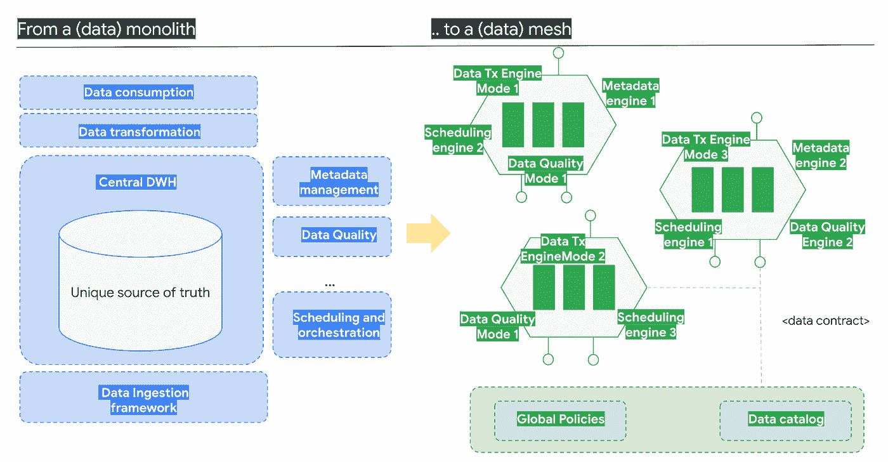
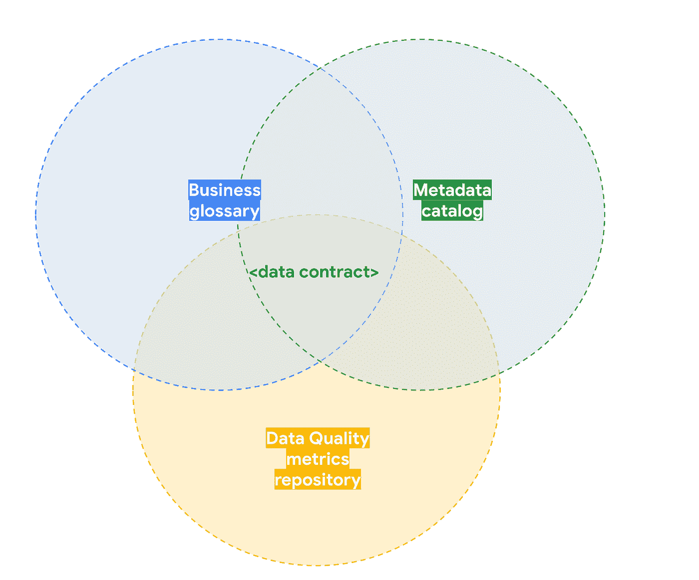
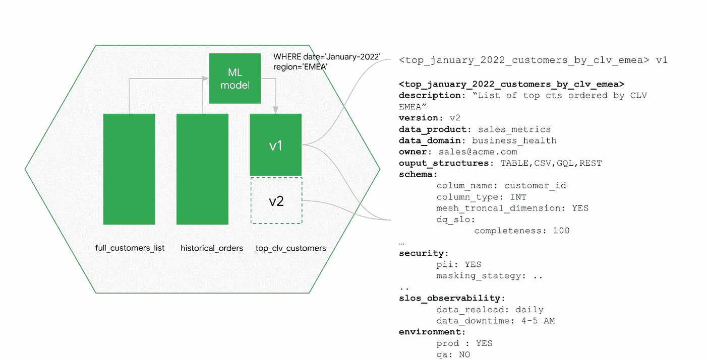
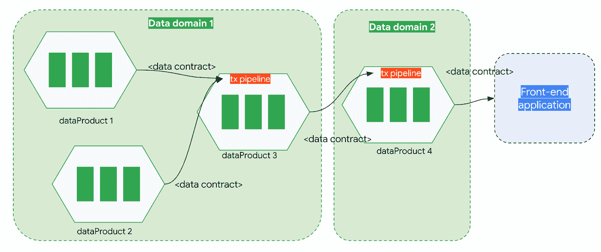
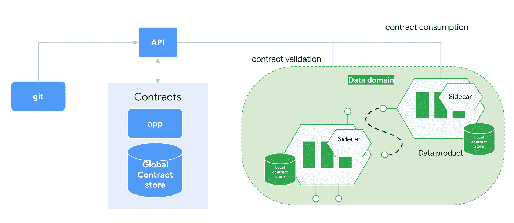
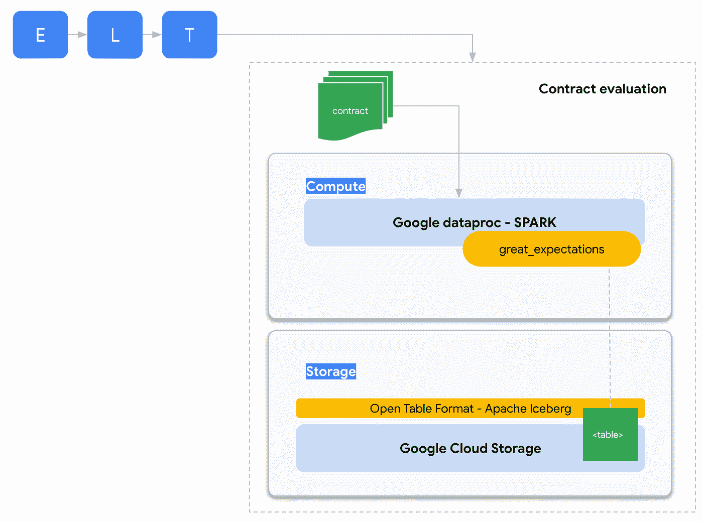
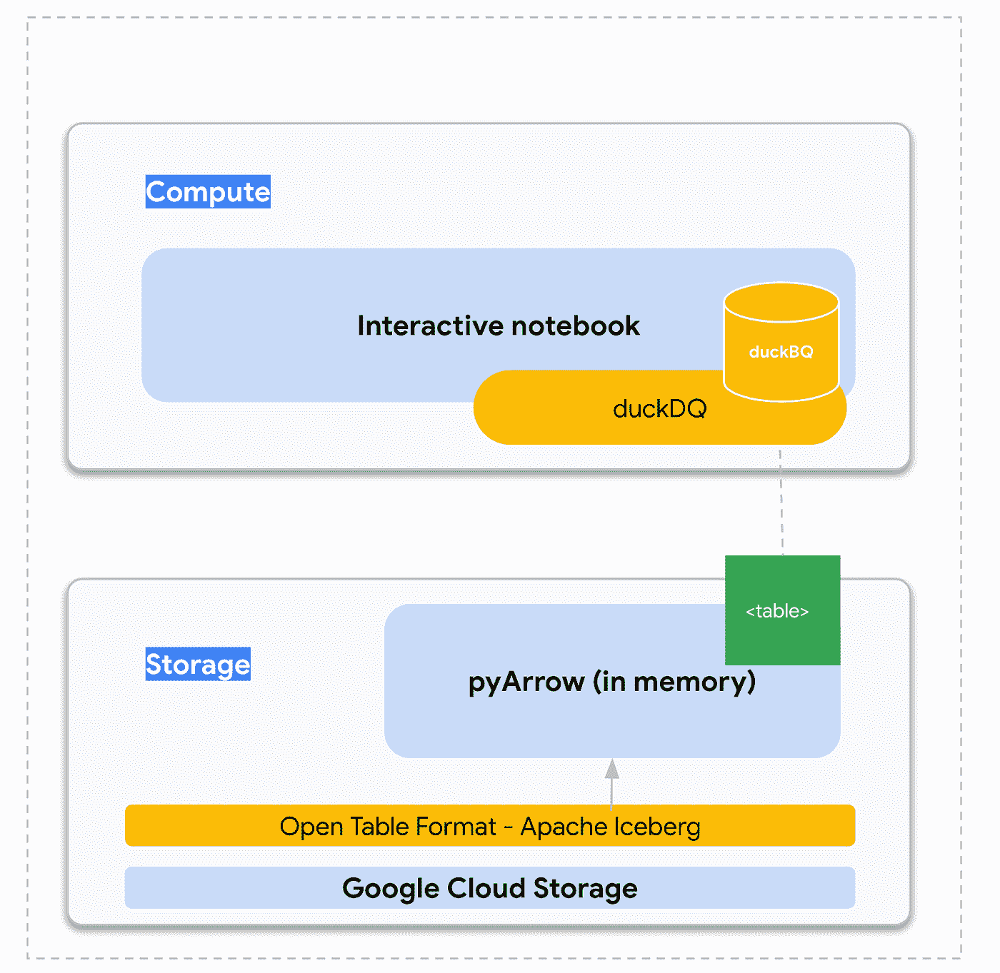

# 数据契约:网状粘合剂

> 原文：<https://towardsdatascience.com/data-contracts-the-mesh-glue-c1b533e2a664>

## 实用定义和实施准则

# **背景和动机**

F ar 来自一个独特的整合数据平台——a*datalith——*数据网格的分布式本质提倡一组松散耦合的数据产品，它们可以相互交互。

在本文中，我们将探索**数据契约**，这是在我们将大数据分割成碎片后保持一致性的工件。

不仅数据本身会中断，一些支持平台的组件也会中断，比如摄取框架、元数据存储库或调度引擎。正如 Zhamak Dehghani 在她的[基础“数据网格”书](https://www.oreilly.com/library/view/data-mesh/9781492092384/)中解释的那样，数据网格“*工程思维状态*”应该从多年来软件工程学科中积累的知识中学习。例如，从众所周知的 UNIX 设计原则中汲取灵感:

*   写<programs>做一件事并把它做好。</programs>
*   写<programs>一起努力。</programs>

把*程序*换成*“数据产品”*你会得到数据网格数据分解哲学，再把它换成*数据工程组件*你会得到工程思维方式。

此外，正如我们在[“剖析数据网格技术平台:公开多语言数据”](https://medium.com/towards-data-science/dissecting-the-data-mesh-technical-platform-exposing-polyglot-data-9fe414feb672)中看到的，我们不仅要设计非常模块化的组件来处理粒度任务，还要实现相同模块的不同变体来适应不同的用户需求和期望。例如，不同的数据产品可能使用不同的摄取框架，或数据转换技术，这很好，在某种程度上，甚至是可取的。

数据网格架构的转变旨在打破整合的数据整体——按作者分类的图像

这种方法的缺点是显而易见的:**维护成本上升。**

我认为数据网格范例中一个关键的未回答的问题是明确定义什么时候提升一个中心平台组件，什么时候给业务域自由来实现它们自己的部分。很明显，有些部分本质上是全球性的，例如在数据产品搜索组件中，但也有一些灰色区域，如元数据存储库或数据质量引擎，其中的决策并不那么简单。

回到数据，通过将**分段**并将不同数据产品的实现细节嵌入到数据域中，从而将责任转移到业务域，我们满足了第一个 UNIX 原则(..做一件事，并且*希望*——把它做好..).

但是，我们如何确保各种数据产品能够无缝地协同工作呢？这里不需要重新发明轮子:**一个以契约形式明确定义的 API 和期望就是解决方案**。

现在，让我们试着理解数据契约的概念，并深入研究不同用户需求所需的多模态技术实现。我们将使用一些我认为完全符合数据网格理念的开源组件。

# 那么，什么是数据契约呢？

**的最终目标是在“其他人的”数据产品**上建立信任，数据契约是位于(a) *业务术语表*交叉点的工件，提供丰富的语义，(b)*元数据目录*提供关于结构的信息，(c)*数据质量存储库*设置关于不同维度内容的期望。

数据契约从业务术语表、元数据目录和数据质量指标存储库中拖出碎片—按作者排序的图像

无法给出一个规范的定义，我宁愿尝试*“duck type”*一个数据契约(例如描述它的属性)。

因此，数据契约…

**旨在简化和促进数据共享—** 数据契约在某种程度上是数据产品的外部和可观察的视图，它应该被设计为“*引诱*🥰*”*潜在的数据消费者清楚地传达数据产品的底层业务语义。

> 数据契约不是一堆不相交的表的技术元数据。

以面向对象编程为代表，我设想数据契约类似于类接口(例如，公共类方法的列表)，而不是私有类属性的列表。作为一个例子，我们应该公开一个类似`*top _ January _ 2022 _ customers _ by _ CLV _ EMEA*的接口，而不是公开类似` *full_customer_list* 和` *historical_orders* 的表。我相信这一特性与数据产品的“自身有价值”原则是一致的。

自然，契约不仅需要有商业意义，还需要在技术上提供关于其基础结构的丰富元数据:表、事件、图..、数据模式或支持的消费格式。

使用版本控制来保证界面稳定性的数据契约示例—图片由作者提供

**保证消费稳定性—** 数据产品远非静态的，因此数据契约的一个关键用例是通过接口版本化提供回溯兼容性。正如我们对编程 API 所做的那样，数据契约是有版本的——维护和支持数据产品的旧版本是数据产品所有者的责任。

**设定预期—** 数据契约传达数据产品的全球和本地政策执行结果，显示 KPI 的 SLOs 值，如数据停机时间或空字段百分比等。

**是可消费的和可丰富的** —合同应该是下游流程可消费的，合同可以作为数据转换管道等软件流程的输入。

数据契约可以由作者组合和丰富—图片

最后，绑定和维护数据产品内部的合同是数据产品所有者的责任。

现在，从技术角度来看，数据契约归根结底是需要管理的表元数据。实现可以像共享存储库中的 MS Excel 文件一样简单，一直到 noSQL 数据库(文档存储)，一个大趋势是**用数据产品源存储库下版本化的 YAML/JSON 文件**来表达数据契约。

# 需要不同的合同验证执行策略

数据契约生命周期中的一个关键方面是实际的契约验证过程，到目前为止，我们已经将**数据契约描述为声明性对象。**提供关于其描述的数据产品的可信信息的对象。

但是在某些时候，我们需要*【填充契约】*，并确保我们的数据资产验证契约预期。这意味着根据合同描述的数据来评估合同，并确保结果不会超出预期。例如，如果合同规定某些列值最多有 10%可以为空，那么我们需要实际执行，并在每次数据产品获得新数据或修改数据时计算表中的空行数。结果应该存储在本地或全球合同信息库中。

全球和本地商店之间数据契约的潜在分离——按作者分类的图片

那么，平台如何验证合同呢？

正如我们在简介中看到的，数据网格的美妙之处在于承认不同的角色/旅程在涉及到合同评估时会有不同的需求。然后我们应该让用户选择**不同的**实现来满足他们的特定需求。为了说明这一点并希望能启发读者，我们将把重点放在两组相反需求的实现上。在现实生活中，这些“极端”的场景之间会有非常不同的灰色阴影。

*   **场景# 1——自动化转换管道**:这可能是最经典的场景，我们每天加载一个大表，并且需要确保新的表状态符合数据契约。在这种情况下，需求可能是以自动化方式高吞吐量处理大型数据集的能力。记住这一点，并以使业务领域的开发人员能够自动化合同验证为目标，我们可以设计一个如下所示的软件组件。

大规模评估数据契约的架构示例—图片由作者提供

想法是同意一个合同 YAML 格式，可以自动馈入大期望+ SPARK 组合来执行大规模验证。 [Great expectations](https://greatexpectations.io/) 是一个执行数据期望的神奇工具，它基于定义关于你的数据的[断言](https://greatexpectations.io/expectations)。这些断言是以简单的、人类可读的 Python 方法的形式在声明性语言中表达的，因此在解析带有契约的简单 YAML 文件后生成预期是很简单的。

下面的代码片段是使用这种方法执行列验证的 SPARK 作业(使用*` expect _ column _ to _ exists `*断言):

*   **场景# 2——交互式开发:**在第二个场景中，数据产品是通过像 Jupyter Notebooks 这样的 ide 以交互式方式生成的，这与数据科学家的个人工作更加一致。由于开发往往是迭代式的，所以需要快速地反复评估合同，而不需要让大型集群提交批处理作业。这种情况的一个具体考虑是数据往往适合内存。考虑到所有这些，如下所示的组件将会很有用:

用于快速和本地合同评估的示例架构—图片由作者提供

想法是在本地嵌入每个组件。感谢 Apache Arrow 和 [duckdb](https://duckdb.org/) 这样的技术，我们可以使用进程内 OLAP 数据库高效地查询内存中的分析数据。特别感谢 [duckDQ](https://github.com/tdoehmen/duckdq) ，这是一个奇妙的 python 库，它提供了一个流畅的 API 来定义和执行数据检查，遵循 scikit 的估计器/转换器范式，在像 pandas dataframe 或 Arrow tables 这样的结构中学习。

以下代码片段说明了这一过程:

注意:在撰写本文时，冰山表的 python 接口( [pyIceberg](https://github.com/apache/iceberg/tree/master/python) )正处于非常早期的开发阶段，因此在代码片段中，我们直接加载底层的 parquet 文件。

# 结论

在本文中，我们探讨了“数据契约”的概念，这是确保跨不同数据产品传播的信息可以被共享和重用的关键构件。**信任是在数据网格范式下将不同数据资产结合在一起的粘合剂**，数据契约是克服消费非来自中央实体的数据资产的恐惧的精髓。

我们还分析了一些使用开源组件的技术实现，用于数据契约生命周期中的一个基本过程:**它的评估**。