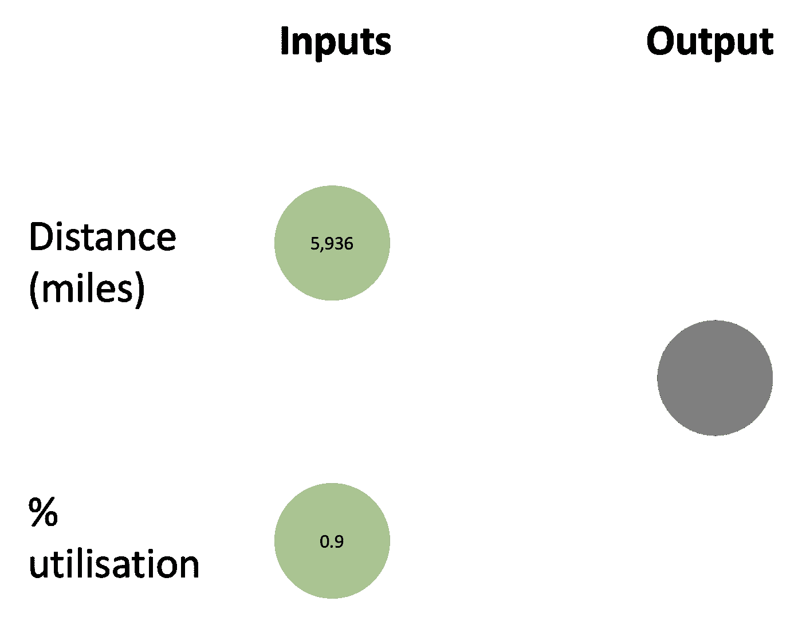
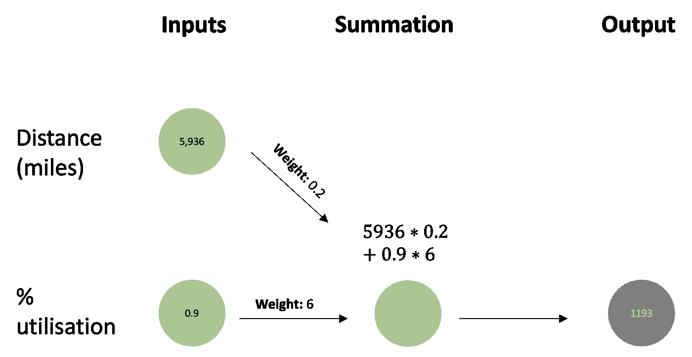
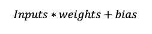
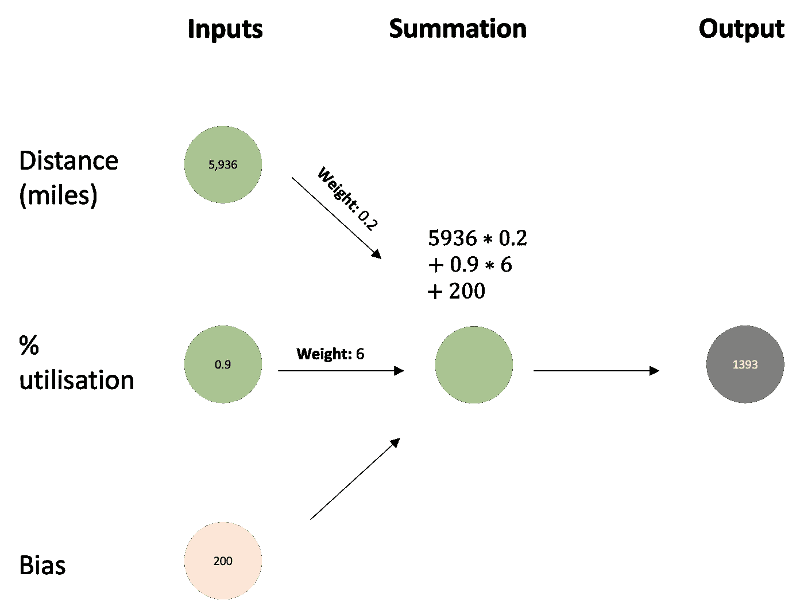
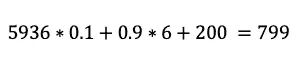
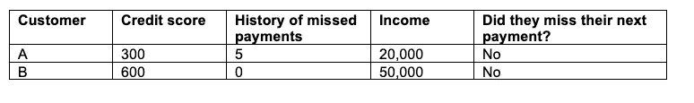
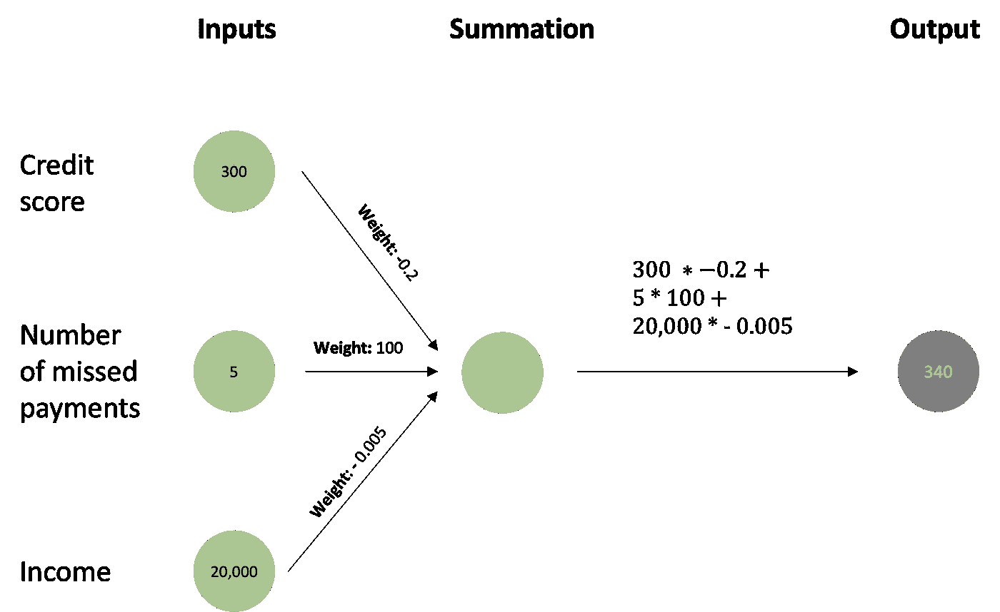
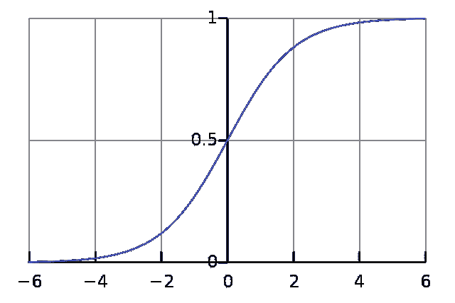
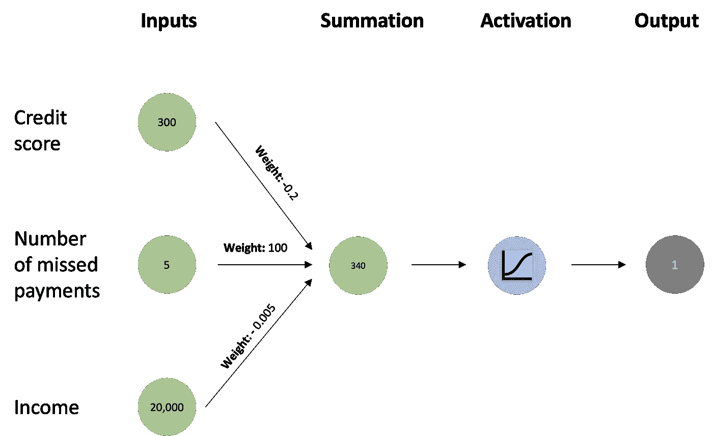
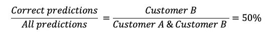

# 数据去神秘化:神经网络——它们是如何工作的？

> 原文：<https://towardsdatascience.com/data-demystified-neural-networks-how-do-they-work-45bad6a92327>

## 没有术语和复杂数学的神经网络如何工作的执行官指南

照片由 [JJ 英](https://unsplash.com/@jjying?utm_source=unsplash&utm_medium=referral&utm_content=creditCopyText)在 [Unsplash](https://unsplash.com/s/photos/network?utm_source=unsplash&utm_medium=referral&utm_content=creditCopyText)

神经网络、深度学习、强化学习——所有这些看起来都很复杂，理解这些东西如何工作的门槛似乎太高了。在本文中，我将使用一个工作实例，以直观的方式解释神经网络的机制。

许多解释试图将大脑中的神经元如何工作与人工神经网络(ANN)联系起来。然而，除非你的学位是生物学、医学或神经科学，否则你可能不知道神经元在大脑中是如何工作的，所以这对你没有帮助。我攻读了神经科学专业的医学学位，我发现对神经元识别直线和环路的解释完全令人困惑，所以不要感到沮丧。对我来说，只有当我能够理解网络正在完成的基本计算时，这才有意义。

我将使用两个示例，一个用于预测航班的价格(回归问题)，一个用于确定某人是否会拖欠下一次信用卡付款(分类问题)。

## **回归示例——预测航班价格**

**第一步:收集输入信息**

首先，我们要考虑我们可以使用哪些数据来帮助我们预测航班的价格。对于我们的例子，我们将使用 2 个输入；以英里为单位的飞行距离和该航线上预订座位的典型比例(即利用率)。

我们将从伦敦和东京之间的航班开始，这个航班的实际价格是 900 英镑。伦敦和东京之间的英里距离是 5，936 英里，通常这条航线上 90%的座位都被预订了。

作者图片

**第二步:分配权重**

我们需要对这些投入做些什么来达到 900 的价格。为此我们引入了权重。网络将从随机分配权重给每个输入开始。现在，我们将从距离 0.2 开始，航班利用率 6。然后，我们将输入乘以权重，并将它们相加。

作者图片

初步猜测，这并不可怕，但我们可以做得更好。

**步骤 3:引入最小阈值**

当我们更多地考虑它时，因为固定成本，运营一个航班有一个最低价格。无论航班是飞往爱丁堡还是东京，希思罗机场都会向航空公司收取固定的着陆费、着陆税以及行李搬运工/候机楼的费用(暂时忽略短途和长途英国航空税的细微差别！).这意味着，虽然里程和价格之间的关系应该大致是一条直线，但它不会在 y 轴上穿过 0。

作者图片

我们把这个加入到我们的神经网络中，这叫做偏见。现在的计算是:

**第四步:计算误差**

我们知道从伦敦到东京的航班花费 900 英镑，但是我们的网络目前预测它花费 1393 英镑。这意味着 493 太高了。我们越接近 900，模型的表现越好。

**第五步:调整重量。**

现在模型将调整权重。让我们看看，如果我们使用 0.1 的距离并保持 6 的利用率，会发生什么。

更好，但仍不完美。该模型将继续调整权重，直到它尽可能接近 900。

为了保持简单易懂，我在这个例子中省略了一些东西。在这个模型中，航班的距离比利用率有更大的影响，因为数量更大。通常情况下，您会缩放这些数据，因此所有的输入都是相同的范围。我也没有谈到如何调整权重——因为这方面的数学计算确实很复杂。

## **一个分类例子——预测某人是否会拖欠信用卡付款**

上面的例子本质上是一个线性回归问题。神经网络用于回归问题，但更常见的是用于分类问题。这意味着我们要识别图像/客户/卡交易等属于哪个类别。

我们希望预测客户是否会拖欠下一次信用卡付款。

**第一步:收集输入信息**

我们首先确定可以帮助我们预测客户是否会违约的数据。对于这个例子，我们将使用 3 个输入；客户的信用评分、错过付款的历史以及他们的收入。

有 2 个客户；一个直觉上看起来有风险，另一个没有。

我们从顾客 A 开始。他们直觉上看起来有风险，他们的信用评分相当低，收入低于平均水平，并且他们之前有 5 次错过付款。

**步骤 2:分配权重和偏差**

接下来，我们像以前一样给每个输入随机分配权重。我们将输入乘以权重，然后将它们相加。

***客户甲***

作者图片

这导致了 340 分。

接下来让我们看看客户 b 的情况。这个客户直观上看起来风险更小；他们的信用评分为 600 分，没有拖欠还款，收入为 5 万英镑。

***客户 B***

作者图片

这导致分数为-370。

**第三步；激活**

在回归解决方案中，输出像元中的数字是一个有意义的数字，即航班的价格。在这个例子中，340 代表什么？他们有可能拖欠下一笔付款吗？

为了回答这个问题，我们使用一个 sigmoid 激活函数。这听起来很复杂，但它所做的只是接受给它的数字，并确保输出在 0 和 1 之间。这意味着我们可以用它作为一个概率，所以数字越大，客户越有可能错过他们的下一次付款。

当我们为顾客 A 计算时。我们可以看到输出是 1。该模型预测客户可能会拖欠下一次付款。

作者图片

相反，客户 B 的输出为 0，这意味着模型预测他们不太可能在下次付款时违约。

作者图片

**第四步；计算损失并调整权重**

接下来，我们需要计算出预测的准确性。对于客户 B，我们是正确的，客户没有拖欠他们的下一次付款。对于客户 A，尽管有信号，客户也没有拖欠他们的下一次付款。现在，让我们简单地计算一下我们正确预测的客户数量。

我们只正确预测了一半的客户，这不是很好。该模型将自动调整权重，直到正确识别的客户数量最大化。这种方法非常复杂，所以我暂时不在本文中讨论。

与回归示例类似，这个分类示例在某些方面过于简单。我们的两个培训案例都没有拖欠下一次付款。神经网络需要您想要预测的所有输出的示例，并且要从中学习的训练示例明显多于 2 个。我们给模型的所有输入都是数字的。然而，在现实世界中，数据是分类的，例如城市、头发颜色、性别。分类数据必须转换成可以应用权重的形式，即转换成数字。有几种不同的方法来确定模型的性能，正确的度量标准取决于数据类型和模型类型。在将输入传递给模型之前，我们也没有横向扩展输入，这意味着其中一些输入对模型有更大的影响。

**参考文献**

Purkait，N. (2019) *使用 Keras 设计和创建使用深度学习和人工智能原理的神经网络*。可从以下网址获取:[https://portal . ig publish . com/iglibrary/obj/packt 0005217 . html](https://portal.igpublish.com/iglibrary/obj/PACKT0005217.html)(访问时间:2022 年 8 月 19 日)。

_________

我喜欢为商业用户写关于数据科学的文章，我热衷于使用数据来提供切实的商业利益。

您可以通过 LinkedIn 与我联系，并通过 Medium 关注我，了解我的最新文章。