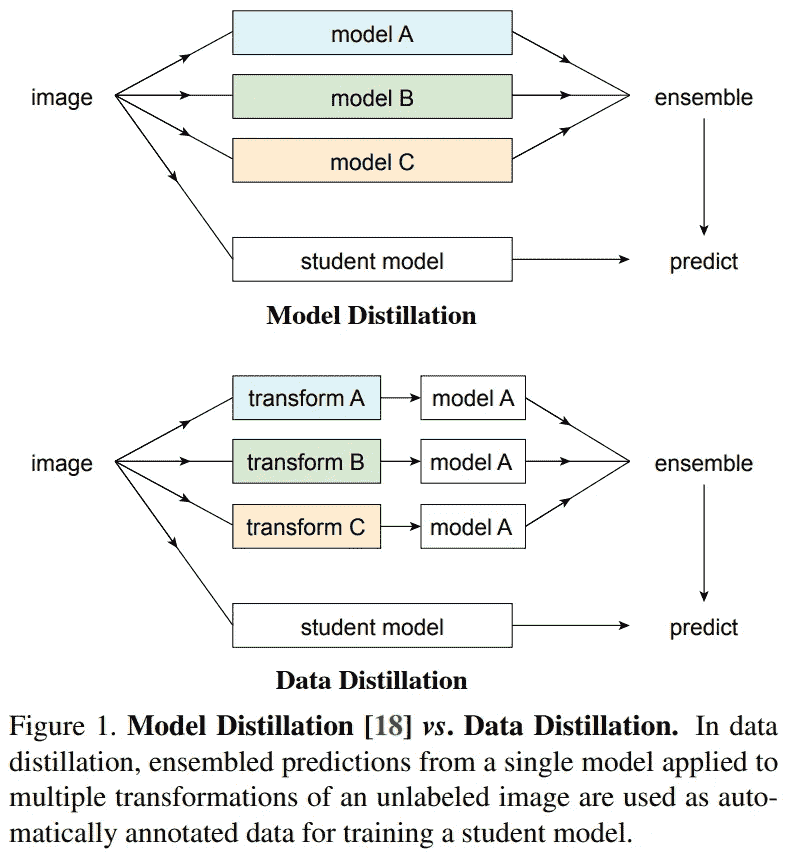
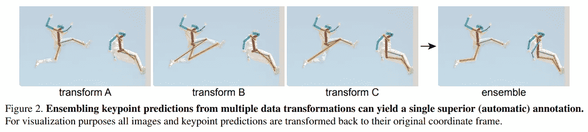
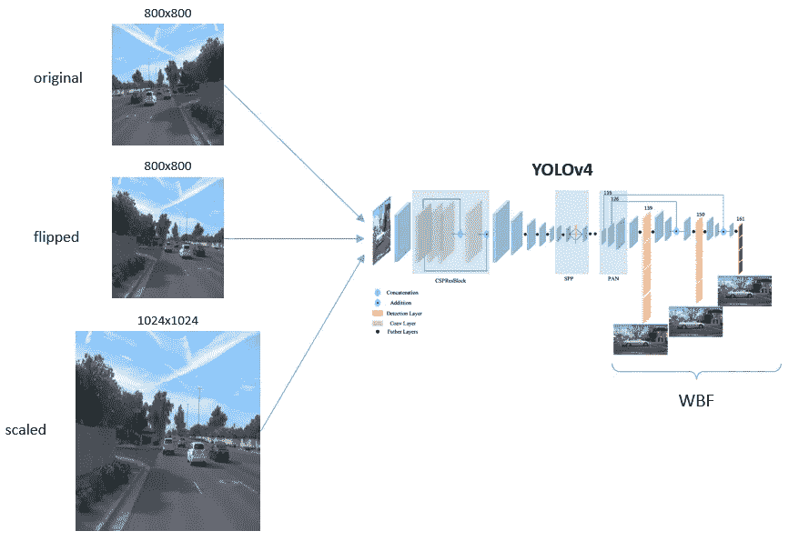
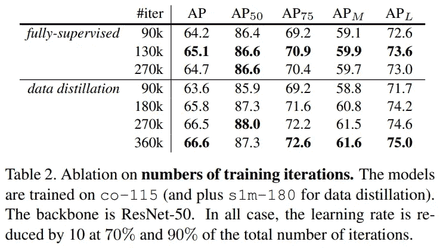
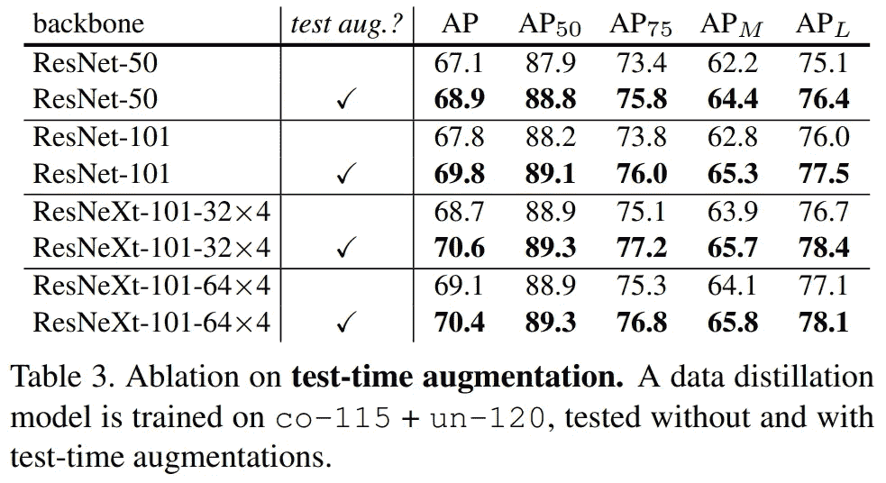
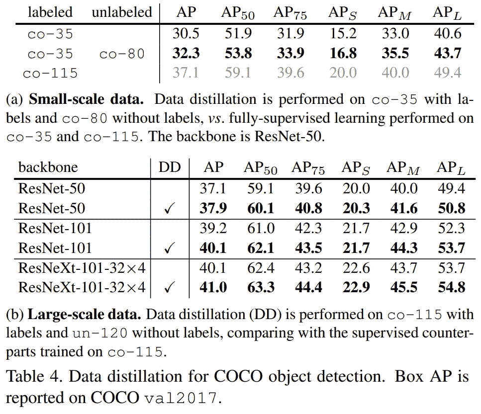
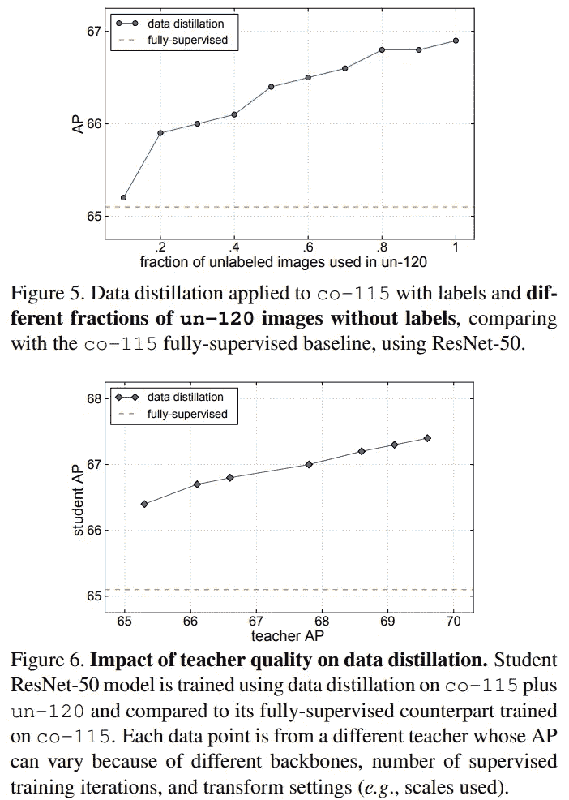
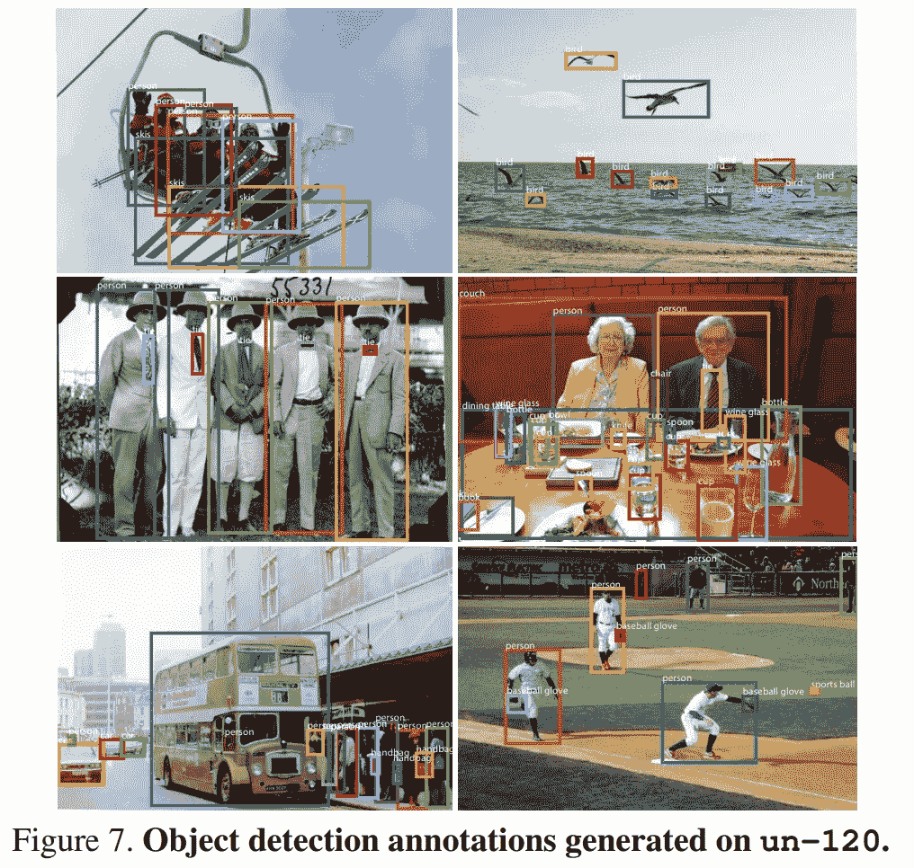

# 用于目标检测的数据提取

> 原文：<https://towardsdatascience.com/data-distillation-for-object-detection-92a89fe5d996>

## 从不同的角度学习

Robina Weermeijer 在 [Unsplash](https://unsplash.com?utm_source=medium&utm_medium=referral) 上的照片

# 知识的升华

知识提取(KD)，也称为模型提取(MD)，是深度学习之父杰弗里·辛顿(Geoffrey Hinton)提出的一种令人印象深刻的神经网络训练方法，以获得神经网络的性能。如果你从未听说过 KD，你可以通过这个[链接](https://pub.towardsai.net/a-gentle-introduction-to-knowledge-distillation-6240bf8eb8ea)到达我的帖子。

简而言之，知识发现的核心思想是从大型模型(教师)或神经网络模型集合中提取知识，并使用这些知识作为软标签来指导(训练)较小的神经网络(学生)，以便学生可以更有效地学习，从而提高其性能，这是通过从头开始训练学生无法实现的。

尽管 KD 很有潜力，但它在训练阶段有局限性，因为它需要大量的硬件资源和长时间来训练大型教师模型或笨重的模型集合，以实现生成用于指导学生模型的良好伪标签(软标签)的目标。为此，来自 AI Research (FAIR)的 Ilija Radosavovic，He 等人提出了数据提取，该方法应用半监督学习，通过利用有限数量的标记数据和互联网规模数量的未标记数据来提高 CNN 在对象检测中的性能。你可以在 [arXiv](https://arxiv.org/abs/1712.04440) 上轻松找到整篇论文。

# 数据提炼

## 数据提炼与知识提炼

来自纸张的数字

上图比较了数据提取和模型提取(知识蒸馏)的区别。模型提取利用模型 A、B、C 的集合来生成软标签，该软标签随后用于训练学生模型。集合中的每个模型可以大于或等于学生模型。部署模型提取的一种流行方式是独立地训练每个模型，这是耗时且计算效率低的。

或者，数据提取仅训练一个教师模型 A，然后应用多变换推理来合成伪标签。多变换推理可以被认为有点类似于测试时间增加过程，并且它可以被应用于改善神经网络的性能。多变换推理也是一种简单的方式，既不需要修改损失函数，也不需要改变模型结构。此外，根据单次变换图像上的预测重新训练模型通常不会带来太多的性能改进价值。因此，输入的多个几何变换可以帮助生成用于训练学生模型的良好伪标签。

来自纸张的数字

## 如何进行数据提炼

数据提炼包括 4 个主要步骤:

1.  根据标记数据训练模型(如监督学习)
2.  使用训练好的模型对未标记数据的多次转换进行预测
3.  集合预测以生成未标记数据的伪标记
4.  在真实标签和伪标签的并集上重新训练模型，直到收敛

为了澄清，我给出了一个例子，说明如何使用 YOLOv4 为对象检测部署数据提取。

*   首先，像常规的监督学习一样，在一组标签数据上训练 YOLOv4。
*   之后，使用经过训练的 YOLOv4 对未标记数据的多个几何变换进行预测，如下图所示，我应用了一个原始图像、一个翻转版本和一个升级版本，就像测试时增强过程一样。
*   然后，输出将采用加权盒融合(WBF)方法进行处理，您可以在这里应用任何包围盒后处理方法，例如非最大值抑制。我们都知道输出总是包括真阳性、假阳性和假阴性；我们必须为伪标签选择“好的”预测。一种简单但有效的方式是挑选置信度得分高于某个阈值的预测。以及如何选择一个门槛？在这篇论文中，作者利用了一个阈值，使无标签图像中的平均对象数量等于真实标签图像中的平均对象数量。这可能不是在所有情况下都有效，但至少是有效的！
*   最后，结合真实标记数据和生成的伪标记数据来重新训练(或微调)YOLOv4 模型。

按作者分列的数字

# 物体检测的结果

文中给出了在基准数据集 COCO 上的数据提取性能。我想总结如下:

来自纸张的数字

来自纸张的数字

来自纸张的数字

来自纸张的数字

来自纸张的数字

详细内容可以看[全文](https://arxiv.org/abs/1712.04440)。

# 结论

在这篇文章中，我简要回顾了数据提取，这是一种提高 CNN 性能的半监督学习方法。通过利用未标记数据的多重几何变换，该方法生成可以与人工标记数据相结合的高质量伪标记，以提高神经网络模型的学习效率。数据提取的能力已经在人类关键点检测和物体检测任务的基准数据集上得到验证。

欢迎读者访问我的脸书粉丝页面，分享关于机器学习的事情:[深入机器学习](https://www.facebook.com/diveintomachinelearning)。更多值得注意的帖子可以在这里找到:

*   [约洛夫 4–5D 评论](/yolov4-5d-an-enhancement-of-yolov4-for-autonomous-driving-2827a566be4a)
*   [达克拉斯](/darkeras-execute-yolov3-yolov4-object-detection-on-keras-with-darknet-pre-trained-weights-5e8428b959e2)
*   [EFPN](/efpn-extended-feature-pyramid-network-for-small-object-detection-980af794a093)
*   [数据增强](/data-augmentation-compilation-with-python-and-opencv-b76b1cd500e0)
*   [雾霾数据合成](/synthesize-hazy-foggy-image-using-monodepth-and-atmospheric-scattering-model-9850c721b74e)

感谢您抽出时间！