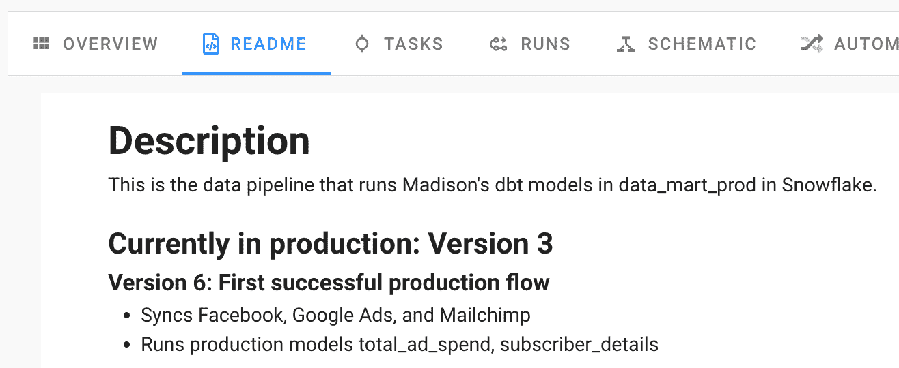
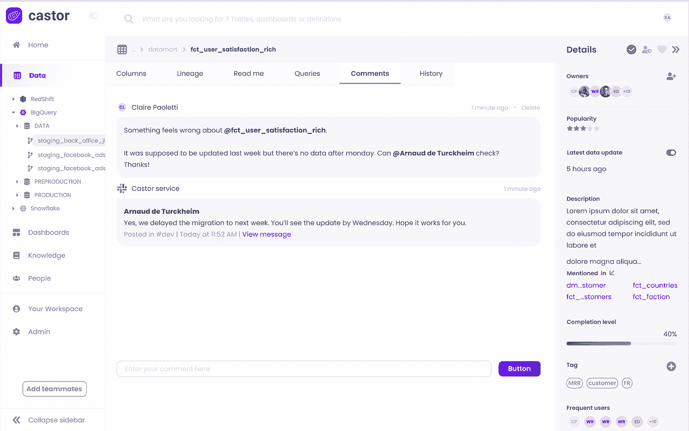

# 数据记录最佳实践

> 原文：<https://towardsdatascience.com/data-documentation-best-practices-3e1a97cfeda6>

## 节省时间，提高透明度，并提供高质量的数据


在 [Unsplash](https://unsplash.com/s/photos/libraries?utm_source=unsplash&utm_medium=referral&utm_content=creditCopyText) 上由 [Luisa Brimble](https://unsplash.com/@luisabrimble?utm_source=unsplash&utm_medium=referral&utm_content=creditCopyText) 拍摄的照片

作为一名[分析工程师](/analytics-engineer-the-newest-data-career-role-b312a73d57d7)，我一直在追踪我在旧数据模型中看到的各种数据集的所有者。有大量的谷歌表单四处流动，被用于复杂的数据模型，然而没有人真正知道它们是如何被使用的。我通常必须向来自每个业务领域的多个团队成员发送消息，以便最终找到了解旧数据集的人。即使这样，他们也可能不知道最初为什么要创建它，或者它是否仍在使用。这是一个永无止境的循环，试图记录公司内部使用的所有数据。

这个问题的解决方案不必很复杂。事实上，这相当简单。从开发的一开始，您就需要记录所有的数据源和数据模型。许多团队认为文档是在数据被完美地结构化和组织后做的事情。但是，您的数据会是最佳的吗？

如果我们等到一切都“完美”了才实施最佳实践，那么我们就是在给企业造成巨大的伤害。在构建数据栈时记录数据源和模型将有助于实现最佳的数据文化。数据文档是*的*解决方案，而不是从解决方案中产生*的东西。*

# 为什么数据文档很重要

数据文档为您的业务提供了其他方式无法获得的好处。它培养了更好的数据文化，节省了您的数据团队的宝贵时间，并增加了业务的透明度。

## **节省时间**

预先记录你的数据集可以减少未来的技术债务。不用在构建堆栈后回顾过去并试图记住所有数据的意义，您可以随时记录。你正在做的事情背后的*为什么*仍然历历在目。每当我等到完成构建某个东西来记录它时，我就会忘记数据的复杂细节。在构建数据模型的过程中，您学到了如此多的部落知识，值得尽一切努力去记住它们。

## **增加透明度**

当您记录所有数据集时，业务中的每个人都有一个了解他们可用数据的窗口。利益相关者很少会问哪些事情可以做，哪些事情不能做，哪些事情不能做。这还意味着，分析工程师和数据分析师不必每次去使用不同数据集时都去寻找它们的所有者。一旦数据集被记录下来，所需的信息就随时可供参考。

## **确保高质量数据**

作为数据从业者，没有什么比数据质量更重要的了。记录您的数据可确保数据始终以正确的方式使用。KPI 将跨模型保持一致，相同的时区将用于不同的日期字段，并且可以跟踪代码更改(或者至少这是目标)。文档有助于跟踪数据集的新鲜度、潜在的错误以及模型之间的依赖性——所有这些都是数据质量的关键因素

# 数据记录最佳实践

既然我们知道数据文档是游戏规则的改变者，那么让我们来讨论一些现在就可以在数据栈中实现的技巧和诀窍。

## **为您的数据模型创建 dbt 风格指南。**

在阅读了 [dbt](/what-is-dbt-a0d91109f7d0) 网站上的大量博客文章后，我发现了创建风格指南的最佳实践。即使不使用 dbt 编写数据模型，也应该创建一个风格指南，详细说明您希望遵循的不同代码和命名约定。

这是我做的第一件事，甚至在建立任何数据模型之前。我很感激我这样做了，因为它给了我一个可以严格遵循的标准。你可以想把所有的事情都记在脑子里，但是在记到某个地方之前，很容易忘记。每当我在编写我的数据模型时遇到问题，我都能够查看指南并回答它，而不必查看其他数据模型并猜测我想要什么标准。

你的风格指南中应包含哪些内容:

*   命名约定(列名的大小写和时态)
*   SQL 最佳实践(注释代码、cte、子查询等。)
*   模型的文档标准
*   日期、时间戳和货币列的数据类型
*   所有日期的时区标准

下面是我的风格指南中的几个部分的例子，你会想要模仿你的风格:

**dbt 约定**

```
Only base_ models should select from sources.All other models should only select from other models.
```

**测试**

```
At a minimum, unique and not_null tests should be applied to the primary key of each model.Run the drop_old_relations script after completing a model in order to delete old views/tables
```

**命名和字段约定**

```
Schema, table and column names should be in snake_case.Each model should have a primary key.The primary key of a model should be named <object>_id, e.g. account_id – this makes it easier to know what id is being referenced in downstream joined models.
```

# **建立模型时记录列定义。**

我们已经谈到了在构建数据模型时记录数据将如何节省您的时间。但是，这也有助于提高数据的质量。为列创建定义时，您希望确保它们是一致和准确的。当你正在处理数据时，而不是在事后，你通常对数据有最深刻的理解。这是因为在编写数据模型时，您已经了解了数据中的细微差别。

我强烈推荐直接在 dbt 中进行文档化。如果您不熟悉 dbt 中的源文件，这是您记录模型及其列的地方。dbt 允许您直接在这些文件中定义表、模型和列描述。直接在代码旁边编写和存储文档可以确保分析工程师和数据分析师的工作流程顺畅。

像 [Castor](https://www.castordoc.com/) 这样的数据目录工具允许您跨不同数据集自动填充 dbt 中定义的这些定义，从而将文档化向前推进了一步。这样，如果在多个数据集中有相同的列名，就不必一直定义它。Castor 只需点击一个按钮就可以完成这项工作，节省了您的宝贵时间，让您可以专注于数据模型的编码。

# **对您的数据模型和数据管道使用版本控制。**

版本控制是一项重要的软件工程最佳实践，也可以引入到您的分析工作流程中。大多数团队使用 Github 来跟踪任何代码的变更。然而，我也喜欢在像 dbt 和[perfect](/tired-of-airflow-try-this-c51ec26cd29d)这样的工具中直接记录不同的版本。这些工具使得在代码旁边显示文档变得容易。

## dbt

在 dbt 中，每个源文件都有一个“版本”块。在这里，您可以在每次进行更改时更改版本。它是如此简单，但在记录数据随时间的变化方面却非常重要。


src_marketing.yml(图片作者)

## 长官

Prefect 是我自动化和部署数据管道的首选工具。这是一个基于 Python 的工具，有一个非常干净的用户界面，易于使用。使用 UI 部署管道时，可以在管道运行代码旁边添加一个自述文件。我利用这个自述文件记录我所有不同的管道版本，包括它们同步的数据和它们运行的模型。

这是一个非常权宜的解决方案，但它并没有淡化它的重要性。有时文档可以简单到保存一个包含一堆关键信息的文档！用你能得到的来凑合没有错。



作者图片

如您所见，我记录了版本号以及该版本中所做的更改、正在同步的数据源和计划运行的数据模型。

# 将数据目录工具集成到您的堆栈中。

虽然我的其他数据文档最佳实践更多的是使用您已经使用的工具，但是您也可以在您的堆栈中实现一个专门关注数据文档的工具。数据目录集成在您的数据堆栈中，将来自不同工具(如[【雪花】](/how-i-organize-my-snowflake-data-warehouse-996965fe51dc?source=your_stories_page-------------------------------------)、dbt 和 Looker)的文档跨您的堆栈同步到一个位置。我们很幸运，市场上有很好的解决我到目前为止提到的具体痛点的产品。

数据目录允许您为数据集和标签资源分配所有者。这确保了当你对数据或数据质量状况有疑问时，你知道该找谁帮忙，消除了不必要的来回奔波。标记资源还允许您基于数据集的业务领域来分离数据集。当业务团队只想查看其领域中的数据集时，这很有帮助。当用于限制谁可以查看某些数据集时，标记也是一种数据治理形式。

虽然这些是数据目录的核心功能，但不同工具之间还有一些强大的文档功能。我觉得非常有趣的一点是 Castor 的“部落知识”自动化。有多少次你发现自己在一个团队松弛渠道发帖，询问某个数据集？对该数据集了解最多的人会回复一个松散的线程，告诉你所有你需要知道的。



作者图片

[Castor](https://www.castordoc.com/) 实际上是在一个松散的线程上提取评论，并将它们存储在目录中数据集的一个部分中。这样,“部落知识”就永远不会丢失！它将永远与您其他有价值的文档保存在一起。

# 结论

实话实说吧。记录我们的数据一点也不“迷人”。对于分析工程师或数据分析师来说，这不是最有趣的事情。但是，我认为这是最重要的。这是改变公司内部数据文化的最佳方式。

当您专注于文档时，利益相关者可以更快地做出决策，数据团队在试图完成工作时会经历更少的摩擦，并且每个人都有可以依赖的数据。不要仅仅为了在将来为你自己和你的团队创造更多的工作而推掉文档。现在优先考虑它，你会很高兴你做了。

关于分析工程、现代数据堆栈和最佳实践的更多信息，[订阅](https://madisonmae.substack.com/)我的免费每周简讯。