# 数据漂移的可解释性:用 NannyML 进行可解释的移位检测

> 原文：<https://towardsdatascience.com/data-drift-explainability-interpretable-shift-detection-with-nannyml-83421319d05f>

## 提醒有意义的多元漂移并确保数据质量

照片由[飞:D](https://unsplash.com/@flyd2069?utm_source=medium&utm_medium=referral) 在 [Unsplash](https://unsplash.com?utm_source=medium&utm_medium=referral)

**模型监控**正在成为机器学习的热门趋势。随着关于 MLOps 的活动越来越多，我们记录了关于该主题的工具和研究的兴起。

其中最有趣的肯定是由[**【NannyML】**](https://www.nannyml.com/)开发的<https://nannyml.readthedocs.io/en/main/how_it_works/performance_estimation.html>****【CBPE】**基于置信度的性能估计算法。他们实施了一个新的程序来**评估未来模型在缺乏基础事实的情况下的性能下降**。它在检测性能下降方面具有很大的优势，因为在实际应用中，收集标签的成本可能很高，并且可能会延迟。**

****CBPE** 算法可在 [**NannyML 包**](https://github.com/NannyML/nannyml) 中找到，同时还有一些**有趣的移位检测策略**。从标准的单变量漂移检测方法到更先进的多变量特征漂移方法，我们拥有强大的武器库**来自动检测无声模型故障**。**

**在这篇文章中，我们主要关注多元移位检测策略。我们想研究**如何检测多元特征转移**。我们与单变量情况进行了比较，以说明为什么后者在某些情况下不足以警告数据漂移。最后，我们更进一步，**引入了** **一种混合方法来提供可解释的多元漂移检测**。**

# ****单变量对多变量 D** 裂缝**

****单变量漂移**发生在变量在分布中出现显著差异时。实际上，我们独立地监控每个特性，并检查其分布是否随时间而变化。这可以通过比较新观测值和过去观测值之间的统计数据来直接实现。由于这些原因，单变量检测易于交流，完全可以理解。**

**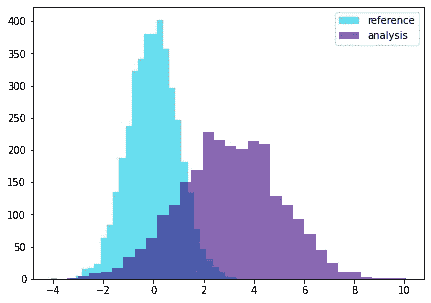**

**单变量数据漂移(图片由作者提供)**

****多变量漂移**发生在输入数据之间的关系改变时。检测多变量变化可能更难解释，但通常需要克服单变量检测的缺陷。**

**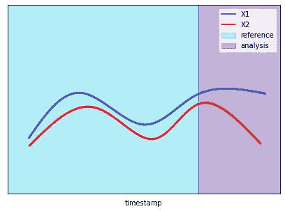**

**多元数据漂移(图片由作者提供)**

**单变量和多变量漂移背后的原因可能因使用情形而异。无论何种应用，**单变量特征漂移的结果可能会产生误导**。我们来调查一下原因。**

# **单变量漂移检测的局限性**

**假设我们有四个系列的数据(通过模拟获得):两个相关的正弦曲线和两个随机噪声特征。我们还考虑了两个数据子集(时段)来进行我们的实验。在“*参考*时期，我们指的是我们所掌握的历史数据。在“*分析*期间，我们指的是我们想要分析的新样本。**

**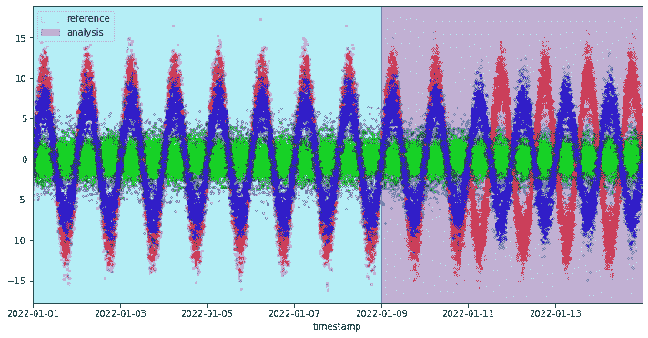**

**模拟特征(图片由作者提供)**

**在我们的*参考*时期，数据遵循相同的模式，保持它们的关系不变。在“*分析*期间，我们观察到蓝色正弦曲线和红色正弦曲线之间关系的变化。更准确地说，这两个特征在“*参考*周期中是正相关的，而在“*分析*周期结束时它们变成负相关的。**

**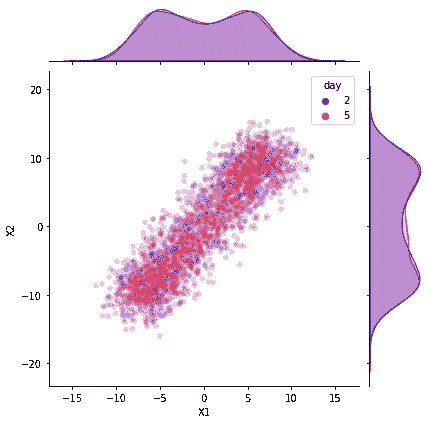**

**X1 与 X2 的相关性(图片由作者提供)**

****

**X1 与 X2 的相关性(图片由作者提供)**

****关系发生变化，但单变量分布保持不变**。我们的单变量漂移检测能有效吗？**

**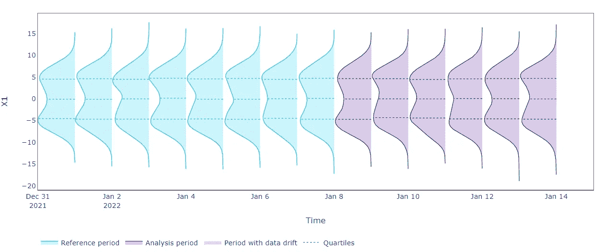**

**X1 随时间的单变量分布(图片由作者提供)**

**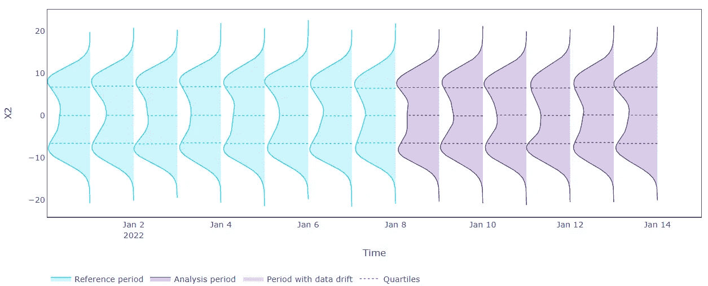**

**X2 随时间的单变量分布(图片由作者提供)**

**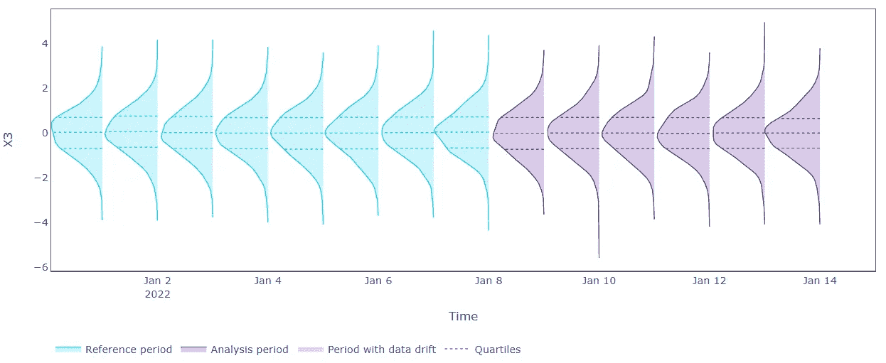**

**X3 随时间的单变量分布(图片由作者提供)**

****

**X4 随时间的单变量分布(图片由作者提供)**

**正如预期的那样，单变量数据漂移检测算法不会显示所有分析要素的任何漂移。从上面的图中，我们可以看到，单变量分布不随时间变化，因此 Kolmogorov-Smirnov 测试不能提醒变化。我们需要更有效的方法。**

# **基于主成分分析的多元特征漂移**

**上过基础机器学习课程的大家，都已经遇到过**主成分分析(PCA)** 。这是一种对表格数据集进行降维以保留最显著的交互的技术。同时，我们可以使用主成分分析将压缩后的数据还原为原始形状。这种重建过程可以仅保留数据中有意义的模式，同时消除噪声。**

**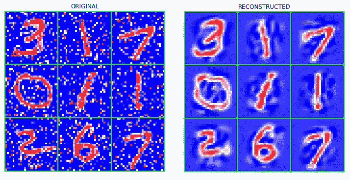**

**PCA 重构能力。左边是有噪声的原始数据。右图为降维后 PCA 重构的数据(图片由作者提供)**

**[**NannyML**](https://www.nannyml.com/) **利用 PCA 的重构能力，开发了一种简单有效的多变量漂移检测方法。****

**一组数据首先被压缩到一个较低的维度空间，然后被解压缩以返回到原始的特征维度。这个转换过程是重建我们的数据的关键，只保留相关的相互作用。此时，可以计算原始数据和变换后的对应数据之间的一系列重构误差(简单的欧几里德距离)。**来自一系列重建误差的任何有意义的尖峰可以被视为数据关系的变化**，也称为多变量漂移。**

**让我们看看这种方法在我们的数据上的应用。**

**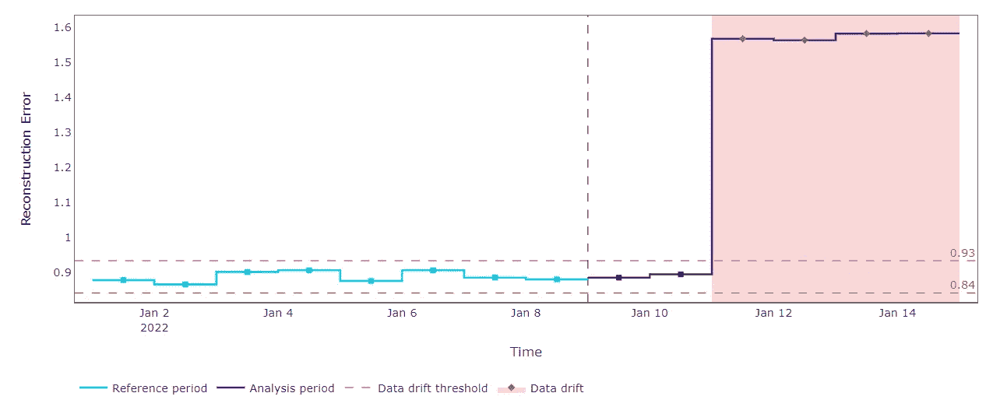**

**(图片由作者提供)**

**我们在我们的“*参考*”数据集上拟合 PCA，并计算重建误差。这有助于建立用于检测未来"*分析*数据变化的上限和下限。当新数据变得可用时，我们只需使用拟合的 PCA 来压缩和重建它们。如果重建误差落在预期阈值之外，我们应该记录特征关系的变化。这正是我们的数据所发生的情况。**

**PCA 方法为多元漂移检测提供了有用的见解。**通过单一 KPI，我们可以控制整个系统的状态。同时，分离每个特征的贡献可能是增值的。****

# **可解释的多元特征漂移**

**使用 PCA，我们的目标是在单一的学习步骤中学习模式。这很好，并且显示出在大多数情况下和一些应用中是有效的。如果我们的目标是发现特性之间的未知关系，我们可以用一种简单的方式来做同样的事情。**

****我们可以把关系发现想象成一项受监督的任务。**换句话说，给定一组特征，我们可以使用它们来预测彼此，并使用生成的残差作为漂移的度量。如果残差随着时间的推移而变化，我们通知一个转变。**

**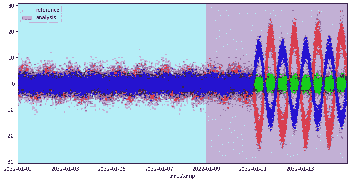**

**残留特征(图片由作者提供)**

**回到我们的模拟场景，我们根据“*参考*”数据为我们所能支配的每个特性拟合一个模型。每个模型都适合使用所有其他特征作为预测器来预测期望的特征。然后我们在“*参考*”和“*分析*数据上生成残差。有了可处理的残差序列，我们就可以用单变量方法来检测漂移。**

**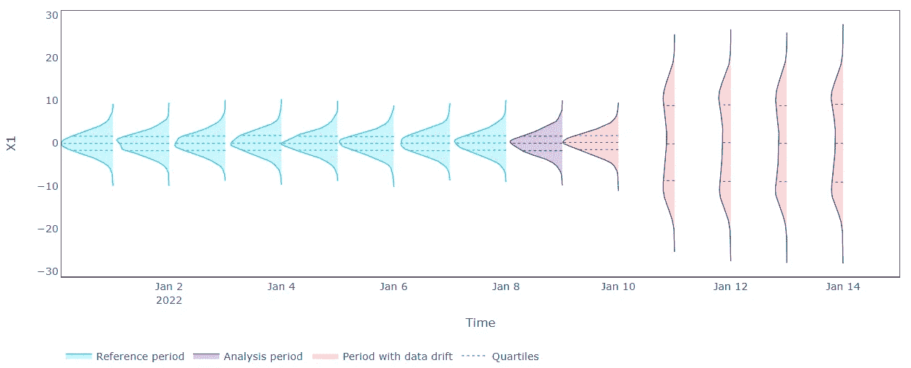**

**X1 随时间的单变量残差分布(图片由作者提供)**

**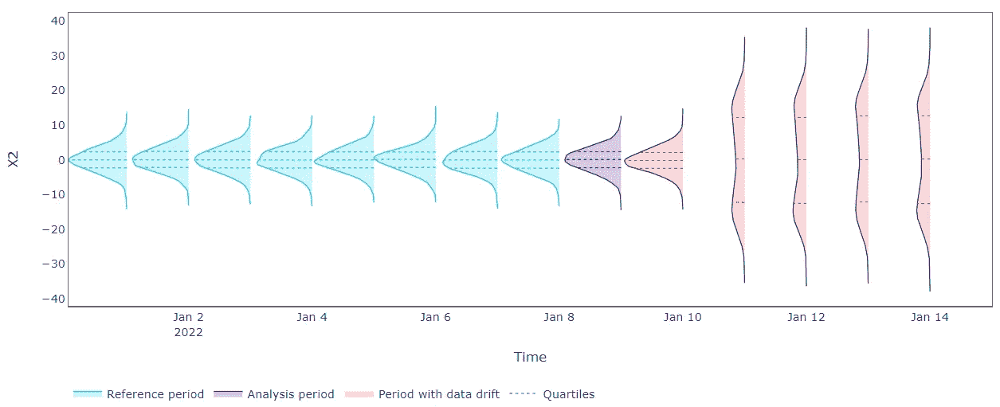**

**X2 随时间的单变量残差分布(图片由作者提供)**

**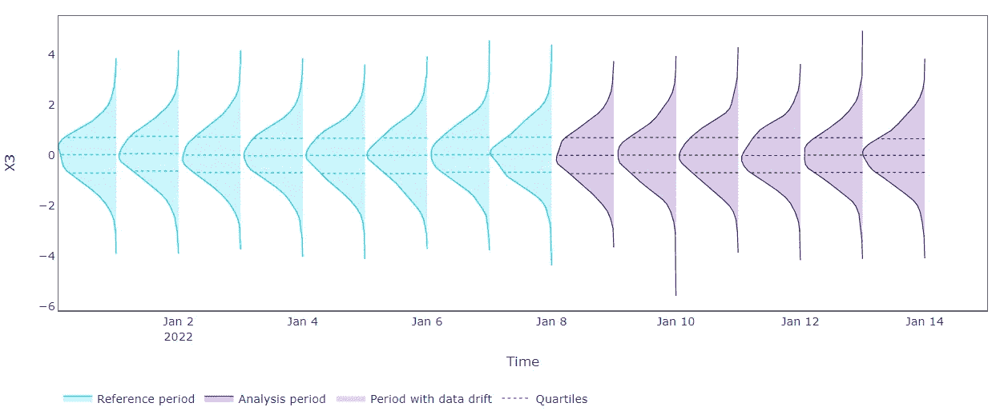**

**X3 随时间的单变量残差分布(图片由作者提供)**

**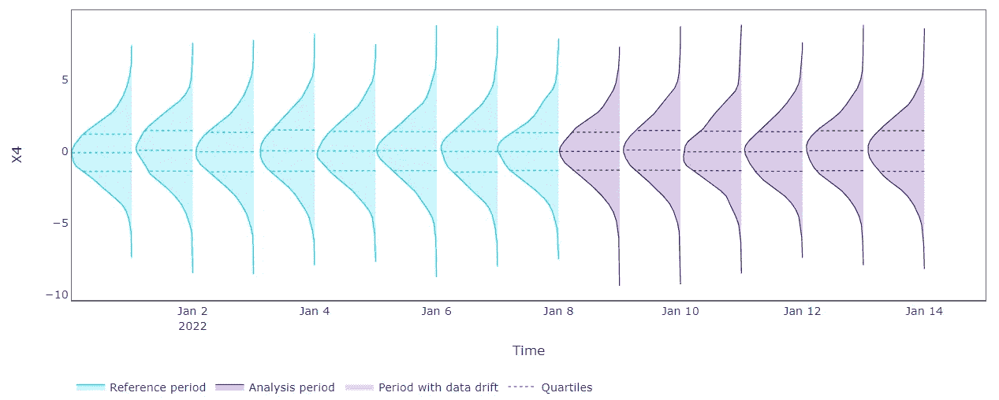**

**X4 随时间的单变量残差分布(图片由作者提供)**

**使用单变量方法检测漂移现在更加有效。在“*分析”*周期结束时，我们记录了 X1 和 X2 的高错误。更准确地说，我们没有证据表明 X1 和 X2 在同一时期存在单变量分布漂移。由于这个原因，高误差可以指示 X1 和输入数据的其余部分之间的关系的变化(对于 X2 也是如此)。换句话说，单变量重建误差分布的变化可以揭示所涉及的特征已经改变了它们的相互作用。**

# **摘要**

**在这篇文章中，我们介绍了一些有效监控数据漂移的最新技术。我们也明白为什么只有单变量方法会受到影响。我们发现了多元特征转移的重要性，并试图提供一种可解释的方法来识别可能的多元漂移的来源。**

## **参考**

**要发现检测无声模型故障的**的尖端技术，请查看 **NannyML** 项目:[https://github.com/NannyML/nannyml](https://github.com/NannyML/nannyml)****

***内容是我自己的，自己写的，按本人意愿发表(一如既往)。感谢 NannyML 团队收到的反馈***

**[**查看我的 GITHUB 回购**](https://github.com/cerlymarco/MEDIUM_NoteBook)**

**保持联系: [Linkedin](https://www.linkedin.com/in/marco-cerliani-b0bba714b/)**