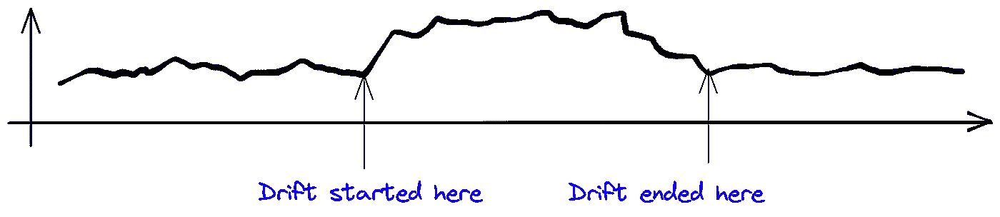
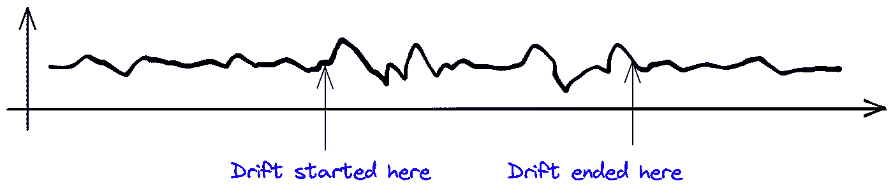
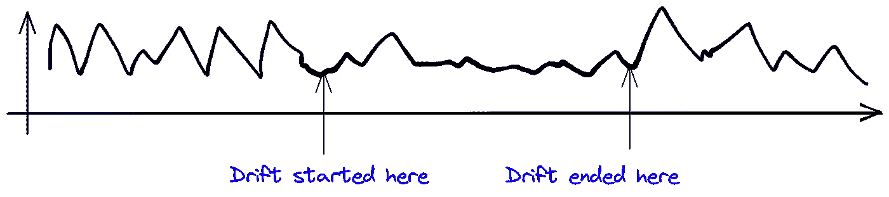
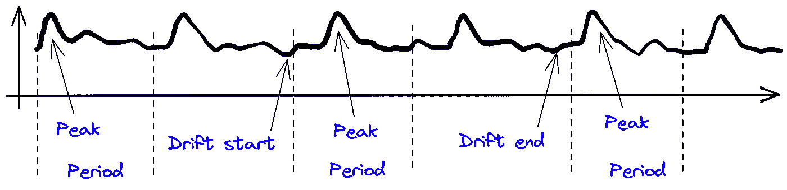
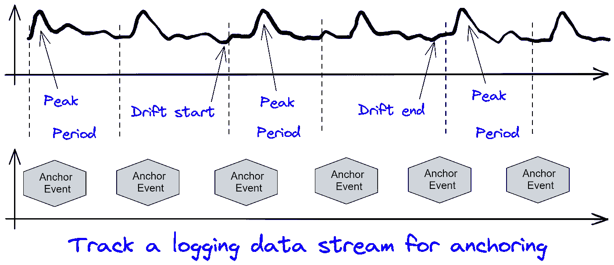
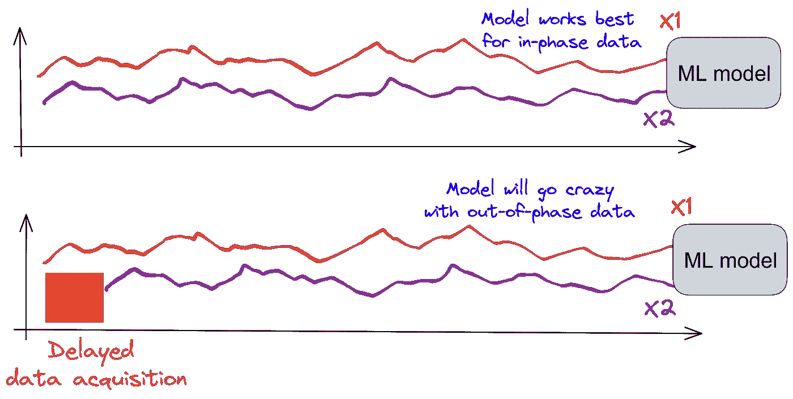
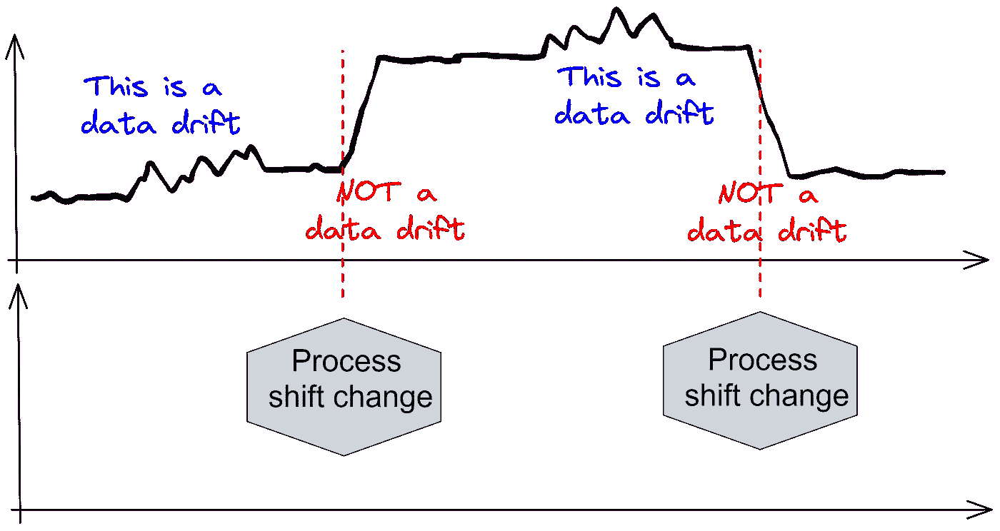
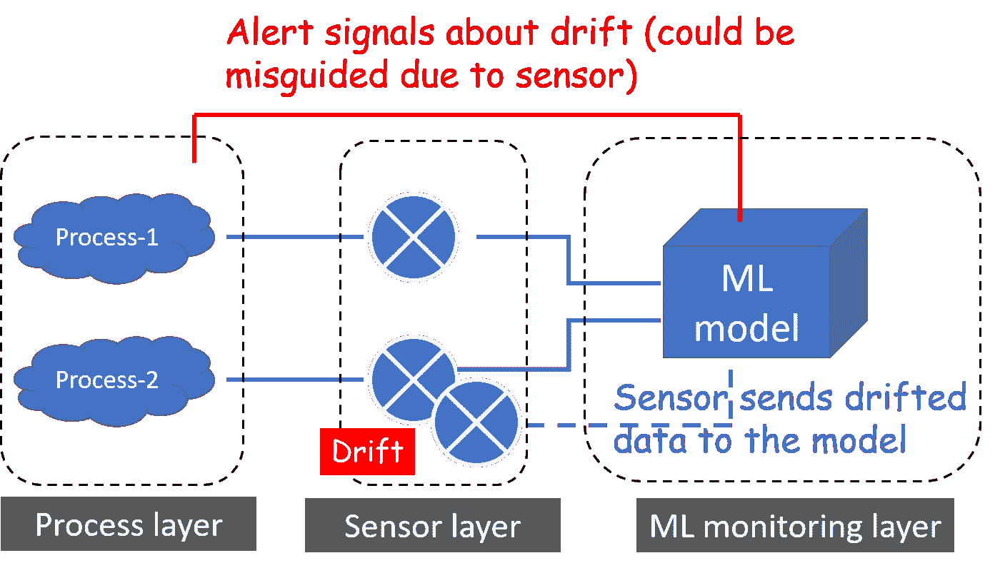

# 数据漂移:它可能从任何地方向你袭来

> 原文：<https://towardsdatascience.com/data-drift-it-can-come-at-you-from-anywhere-b78eb186855>

## 数据漂移的概念以各种形状和形式直观地展示出来。

图片来源:作者创作

# 数据漂移简介

机器学习(ML)模型，至少在其目前的化身中，只不过是 [**强大的归纳机器**](https://medium.com/tech-cult-heartbeat/introduction-to-inductive-learning-in-artificial-intelligence-dafc2796405b) 。他们的崇高目标是从一个小例子集合到一个更广泛的归纳概括。

自然，为了成功(和可靠)的运行，它们需要依赖于关键的假设— *输入数据分布不会随时间漂移太多*。

因为，如果发生这种情况，那么**一个成功的模型只在单个时间点**成功。随着时间的推移，该模型将根据与其训练时不完全相同的分布进行归纳概括，性能将会下降。

因此，我们需要监控和(及时)检测 **MLOps 或 ModelOps 管道**中的任何数据漂移，以确保任何(持续)成功的 ML 模型部署。除了常规的 MLops，数据漂移的概念对于 ML 可解释或 [**可解释 AI (xAI)**](https://www.ibm.com/watson/explainable-ai) 领域也很重要。

*数据漂移监控模块在端到端 MLops 周期中的确切位置*在以下文章中有很好的描述。

  

关于这个主题的许多文章讨论了输入分布的形状和统计特性。在本文中，我们将以(一个或多个)数据流为例，这些数据流以时间序列的形式进入 ML 模型，并可视化这些变化以清楚地理解这个概念。此外，我们还将讨论工业环境中一些不太明显的数据漂移来源。

# 数据漂移就像一盒巧克力…

你永远不知道你会得到什么！让我们看看一些明显和不那么明显的例子…

## 电平转换？明显地

这是一个明显的数据漂移。在许多无监督的模型设置中，这也将被称为' ***异常值*** '或' ***异常值*** '。还要注意，漂移可能不是永久的，而是短暂的。漂移的起点和终点都应该很快确定。

图片来源:作者创作

## 方差转移？微妙的

这比电平转换稍难检测。请参见下图。

图片来源:作者创作

## 方差减少？那也是一种漂移

在高层次上，业务/流程人员(或您的客户)会告诉您，高方差是不好的。是的，他们几乎总是对的。但是从数据漂移的角度来看，你必须注意任何机会——甚至是方差的突然减少。从统计上看，这也是分布特性的变化。

图片来源:作者创作

## 一段时间内的峰值移动

这个更微妙，难以察觉。我试图用附加注释来说明这种漂移，比如峰值*和 T2 期。你看到这里到底发生了什么吗？数据以周期性的方式出现，每个周期内都有一个峰值。**那个峰值的相对位置(在一段时间内)移动了一段时间**，然后才恢复正常。*

**

*图片来源:作者创作*

*你看出问题了吗？简单的统计特性可能无法捕捉这种漂移。均值和方差(其他矩也是)可能看起来相似。那你是怎么抓住它的？有趣的是，一些简单的**光谱分析**会显示出一个转变。因此，你必须引入一些信号处理**知识来捕捉这种数据漂移。***

## *上下文数据——捕捉趋势的另一种方式*

*如果您还在监视具有固定时间指示器的日志记录流，如轮班开始或机器重置，这有时有助于以直观的方式捕捉这些临时轮班。当然，数据监控必须确保良好的时间同步。在下图中，锚点事件和峰值与这些锚点的相对距离将指示漂移。*

**

*图片来源:作者创作*

## *相移/延迟*

*这是一个真正意义上的杀手。对于对时间序列数据进行训练和推理的 ML 模型，轻微的相位延迟就可能产生完全错误的预测。基本上，模型被训练成“如果 *X* 1 和 *X* 2 相似，则预测 *Y* 0，否则预测 *Y* 1”。*

*现在，看看下面的情况，意识到异相数据流会发生什么。上面的数据流很好，下面的有点漂移。有可能数据流是正常的，只是采集被延迟，失去了同步。*

**

*图片来源:作者创作*

## *有些是漂移，有些不是*

*在工业或制造业场景中，工艺配方和设置一直在变化。也可能有一个预定的变更日志。需要监控这种上下文数据，以识别正确的数据漂移。这是直观的插图，*

**

*图片来源:作者创作*

## *测量/传感器漂移*

*这也是最难检测和管理的问题之一。输入数据流和生成过程可能是好的，但是传感器上可能有漂移(即测量输入数据并馈送到 ML 模型或监控系统)。*

*监控系统(由 ML 模型和警报生成模块组成)可能检测到漂移，并认为基本过程已经偏移，向核心过程层发送错误的推荐信号。这将是一个错误的判断和糟糕的建议。*

*这也是一个将**概念漂移(传感器本身的模型或物理动态)误认为数据漂移**的例子。这是一个无论如何都要避免的错误。*

**

*图片来源:作者创作*

# *摘要*

*我们通过展示一些可视化的例子，讨论了时间序列意义上的数据漂移的概念。很明显，即使在最简单的一维设置中，捕捉和分析数据漂移也不是一个微不足道的问题。可能需要信号处理或与上下文数据合并等其他技术来正确识别数据漂移的开始和性质。*

*缓解措施是什么？没有一个答案，这完全取决于行业和具体的应用领域。本文系统地介绍了其中的一些。读一读。*

* * 

**喜欢这篇文章吗？成为* [***中等成员***](https://medium.com/@tirthajyoti/membership) *继续* ***无限制学习*** *。如果你使用下面的链接，我会收到你的一部分会员费，* ***而不需要你额外付费*** *。**

* *