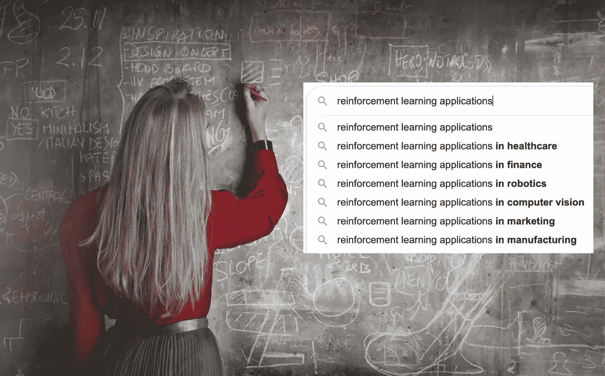
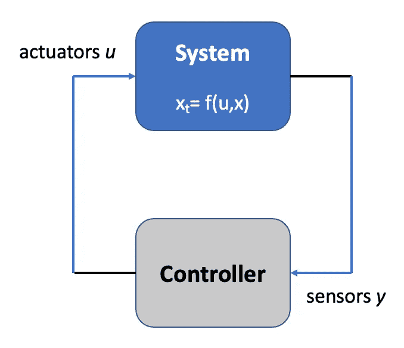
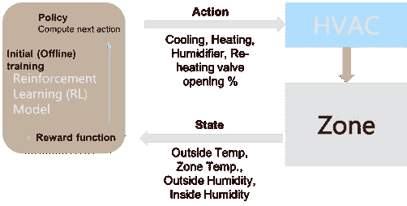

# 数据驱动(基于强化学习)控制

> 原文：<https://towardsdatascience.com/data-driven-control-d516ca28047c>

## 为什么强化学习是控制系统优化问题的热门话题

图:强化学习(基于来自[像素](https://www.pexels.com/photo/woman-in-red-long-sleeve-writing-on-chalk-board-3769714/?utm_content=attributionCopyText&utm_medium=referral&utm_source=pexels)的[安德里亚·皮亚卡迪奥](https://www.pexels.com/@olly?utm_content=attributionCopyText&utm_medium=referral&utm_source=pexels)的图片)

# 介绍

数据驱动控制。那些基于强化学习(RL)的控制策略，是工业工程的新术语。RL 似乎是所有控制问题的最佳范例，从控制内燃机，到切割金属的机械臂，再到建筑中的空调系统。(这在这些公司发布的与 RL 相关的招聘广告的数量上也很明显。)我们看到了深度学习模型如何破坏图像识别和分割的传统计算机视觉技术的类似破坏。

> 我们将数据驱动控制定义为应用于控制系统的简单机器学习(ML)技术。

为了理解这一趋势背后的驱动因素，我们首先需要理解现实系统控制理论的局限性。

# 控制理论的局限性

在非常基础的层次(和高层次)，控制系统实际上由系统和控制器组成:

*   *系统*来控制
*   *控制器*应用控制策略以最佳方式控制系统。

在这种情况下，我们还需要考虑另外两件事情:控制器可以应用的任何策略都受到

*   它对系统状态的了解——在大多数情况下，由系统传感器提供；
*   以及它可以控制的系统参数，也称为系统执行器。例如，发动机只能在一定的速度范围内以一定的加速度驱动汽车。

外部/环境因素在控制策略中也起着关键作用，但是这种作用更多的是作为一种“输入”参数，而不是一种约束。例如，室外温度在决定空调制冷多少时起着关键作用；然而，空调的功能不受它的限制。

下图说明了一个控制系统，其中 x_t 是非线性函数 *f* 的时间导数。

图:(简化)控制系统设计(图片由作者提供)

> 设计控制策略包括求解表征系统行为的方程——通常以线性方程的形式建模。大多数控制理论的目标是解决线性方程。

不幸的是，现实世界的系统(大部分)是非线性的。例如，甚至捕捉钟摆运动的方程也是非线性的。关于线性化方法已经有了很多研究，基本上是将非线性方程转换成线性方程，然后尝试使用线性状态空间控制理论来解决它们的技术。不幸的是，这种线性化方法非常局限于特定类别的非线性方程，并且不容易推广。

除了求解非线性方程的困难之外，我们当然首先需要知道如何对一个系统(其相应的方程)建模。这就是传统控制策略(也称为**模型驱动控制**)仍然排除大量我们不知道如何建模的系统(其系统方程未知)的原因。而且，这种系统的复杂性与日俱增，我们希望解决超大规模的问题，例如气候控制、疾病控制、自动车辆、金融市场等。

总结传统控制理论/模型驱动控制的局限性:

*   系统模型/方程未知
*   不适用于大规模非线性领域
*   考虑到这些系统的高维数，模拟它们也是非常困难的

关于这个主题的详细讨论，请参考史蒂夫·伯顿关于控制系统的优秀教程[1]。

# 曼梯·里来营救了

鉴于传统控制理论面临的上述挑战，现在让我们试着理解为什么基于 ML/Data 的方法在这种情况下显示出很大的前景。

> 这里的潜在逻辑是，即使对于我们无法建模的非常高维的系统，也存在表征系统行为的主导模式——机器学习(深度学习)非常擅长学习这些模式。

这(很可能)是一个近似值，虽然我们仍然不能完全理解该系统，但除了一些例外情况，对于大多数现实生活中的用例(包括预测)来说，这已经足够好了。

在这篇文章中，我们关注的是基于控制系统的强化学习方法。我们也将触及监督 ML 和非/半监督 RL 之间的关键区别，以及这如何使 RL 成为潜在的任何控制优化问题的良好选择。

## 强化学习

RL 能够通过实时最大化奖励函数来实现复杂的目标。奖励功能的工作原理类似于用糖果和打屁股来激励孩子，这样算法在做出错误决定时会受到惩罚，在做出正确决定时会受到奖励——这就是强化。强化方面还允许它更快地适应用户情绪的实时变化。有关 RL 框架的详细介绍，感兴趣的读者可以参考[2]。

图:强化学习(RL)公式(作者图片[3])

一些关于 RL 的有趣观察，不涉及太多技术细节:

*   *奖励和策略不一样*:奖励功能和 RL 代理策略的角色和职责没有很好地定义，并且在不同的架构之间可能有所不同。一个天真的理解是，给定每个国家行动对的相关回报/成本，政策总是试图最小化总成本。显然，似乎有时保持生态系统处于稳定状态比最小化成本更重要(例如，在气候控制用例中)。同样地，RL 代理策略目标不需要总是与奖励函数一致，这就是为什么需要两个独立的函数。
*   与机器学习/深度学习中的监督方法类似，最适合企业采用的 *RL 方法是“基于模型的 RL”*。在基于模型的 RL 中，可以开发问题场景的模型，并基于模型模拟值引导初始 RL 训练。例如，对于能源优化用例，建筑物供暖、通风和空调(HVAC)系统的蓝图用作模型，其模拟值可用于训练 RL 模型。对于复杂的场景(如游戏、机器人任务)，不可能建立问题场景的模型，但仍有可能基于历史值引导 RL 模型。

> *这被称为‘线下培训’，在没有模型的情况下被认为是一个很好的起点。这也是为什么 RL 经常被认为是监督和非监督学习的混合，而不是纯粹的非监督学习范式的原因。*

*   *在线和无模型的 RL 仍然是最具挑战性的*，其中 RL 代理试图在没有任何监督的情况下实时学习和反应。这方面的研究现阶段似乎缺乏理论基础。研究人员正在尝试不同的方法，通过简单地投入更多的数据和计算能力来解决问题。因此，这仍然是 RL 最“有趣”的部分，当前的研究主要集中在高效的启发式和分布式计算上，以加速的方式覆盖搜索空间。将 DL(神经网络)应用于不同的 RL 方面，例如政策、奖励，也仍然是一个热门话题——称为深度强化学习[4]。
*   鉴于 RL 的基本性质，似乎有许多有趣的概念可以从*决策科学和人类心理学*的现有研究中借鉴。例如，Tom Griffiths 在他的演讲“人类和机器中认知资源的合理使用”中引用了一段有趣的话[5]:

> *虽然模仿人脑似乎是 AI/RL 研究的圣杯；在心理学研究中，人类一直被认为是本质上有缺陷的角色。所以我们真正想做的当然是模仿人脑的“理性行为”。*

总结当然是，如果我们想要机器达到真正人类智能的水平，我们需要将这两个领域结合在一起。

## 案例研究:基于 RL 的暖通空调优化

D.比斯瓦斯。*基于强化学习的工厂能源优化*。(迈向数据科学— [链接](/reinforcement-learning-based-energy-optimization-dea8fb687cda))，也发表在 2020 年 6 月第 11 届 ACM [e-Energy](https://dl.acm.org/doi/10.1145/3396851.3402363) 会议论文集上。

> 在我们当前讨论的背景下，上述文章是一个有趣的案例研究。它展示了过去 10 多年来由传统 PID 控制器运行的工业控制系统向更高效的基于 RL 的控制器的成功过渡。

在这种情况下，工业控制系统是指负责维持工厂(一般建筑物)中温度和湿度设置的加热、通风和空调(HVAC)单元。传感器对应于室内(和室外)温度和湿度传感器；并且致动器对应于 HVAC 单元的冷却、加热、再加热和加湿器阀。部署的 RL 模型如下图所示:

图:暖通空调强化学习公式(图片由作者提供)

这是一个复杂的问题，因为它需要计算考虑多个可变因素的最佳状态，例如，占用、制造进度、运行机器的温度要求、建筑物内的气流动态、外部天气条件、节能等。

*初始状态*:当我们最初开始探索基于 RL 的方法优化 HVAC 控制器的可行性时，HVAC 单元由 PID 控制器控制。PID(比例积分微分)[8]是一种用于优化问题的流行控制技术，它使用控制回路反馈机制来控制过程变量。

这种情况已经持续了 10 多年，HVAC 装置以非常稳定和稳健的方式将工厂的温度和湿度保持在理想的设定值。因此，基于 RL 的探索主要是受其降低能耗和二氧化碳排放的潜力的推动。(研究表明，暖通空调几乎占建筑能耗的 50%，占全球用电量的 10%。)

*解决方案*:考虑到建模此类系统的难度，我们从随机 RL 模型的初始部署开始(在某种意义上，它只取决于最后的状态)。在下一阶段，我们扩展了 RL 模型以适应“长期回报”，用 RL 术语中的 Q 值来量化。假设在状态 *s* 采取动作 *a* ，状态-动作对 *(s，a)* 的 q 值被定义为从当前状态 *s* 开始的所有未来步骤的期望回报值的加权和。这个 RL 模型在一个连续的空间环境中运行。该设置中的每个事件对应于室内温度和(或)湿度开始偏离其各自设定值的时间，以及室内条件返回其各自设定值的时间——这是打开相关阀门的结果。

*目标状态(进行中)*:在为期 6 个月的试点中，我们能够开发并实施基于 RL 的 HVAC 控制器，该控制器能够学习并适应真实的工厂设置，无需任何离线培训。基准测试结果显示，在能效方面有可能节省高达 *25* %(与 PID 控制器运行时相比)。

# 结论

总之，RL 到目前为止经历了一段有趣的旅程。从无人监管的 RL 代理击败 AlphaGo 棋手产生的炒作，到努力在企业世界中找到一席之地/效用。在研究方面也有类似的起伏旅程，随着深度学习模型的进展饱和，对 RL 模型的兴趣在过去几年达到顶峰；到现在，重点再次转移到自我监督系统。

说到这里，RL 似乎找到了工控系统的甜蜜点。在将 RL 技术应用于推荐器[3]、聊天机器人[9]方面已经有了一些进展；然而，控制优化是他们“最适合”的地方。在本文中，我们强调了传统控制理论的挑战，并指出基于 RL 的控制器有可能解决/改善该领域的许多复杂问题。这是一个参与这一旅程的激动人心的时刻，希望您也有同样的感受——期待您的反馈！

# 参考

[1]史蒂夫·伯顿:*控制训练营*，[https://www.youtube.com/watch?v=Pi7l8mMjYVE&list = plmrjakhiennr 20 mz-vpzgfqs 5 zryi 085m](https://www.youtube.com/watch?v=Pi7l8mMjYVE&list=PLMrJAkhIeNNR20Mz-VpzgfQs5zrYi085m)

[2] A .巴尔托，R.S .萨顿:*强化学习:导论*。麻省理工学院出版社，麻省剑桥，2018，[http://incompleteideas.net/book/RLbook2018.pdf](http://incompleteideas.net/book/RLbook2018.pdf)

[3]比斯瓦斯。基于强化学习的推荐系统。 ( [中链](/reinforcement-learning-based-recommender-systems-492a2674fcc) —走向数据科学)，也发表在 2020 年 9 月第 24 届欧洲人工智能大会(ECAI)的“‘医疗保健人工智能进展’专题讲座”上。

[4]w·达布尼:*分布式强化学习的进展及其与规划的联系，* 2020，[https://www.youtube.com/watch?v=iqIGHSgYtbs](https://www.youtube.com/watch?v=iqIGHSgYtbs)

[5] T. L .格里菲斯，f .利德，N. D .古德曼。*认知资源的合理使用:计算和算法之间的分析层次。*[https://cocolab . Stanford . edu/papers/griffithsetal 2015-tics . pdf](https://cocolab.stanford.edu/papers/GriffithsEtAl2015-TiCS.pdf)

[6] F. Oldewurtel 等人*使用随机模型预测控制和天气预测进行节能建筑气候控制*。事故赔偿委员会，2010 年。

[7] Y. Ma 等*建筑制冷系统运行的模型预测控制*。IEEE 控制系统技术汇刊，20(3):796–803，2012。

[8] F .皮科克。*PID 算法的白痴指南*。[https://www.pidcontrol.net/index.html](https://www.pidcontrol.net/index.html)

[9] Ricciardelli，e .，Biswas，D.: *基于强化学习的自我改进聊天机器人*。([中环节](/self-improving-chatbots-based-on-reinforcement-learning-75cca62debce) —走向数据科学)In:第四届强化学习与决策多学科会议(2019)。