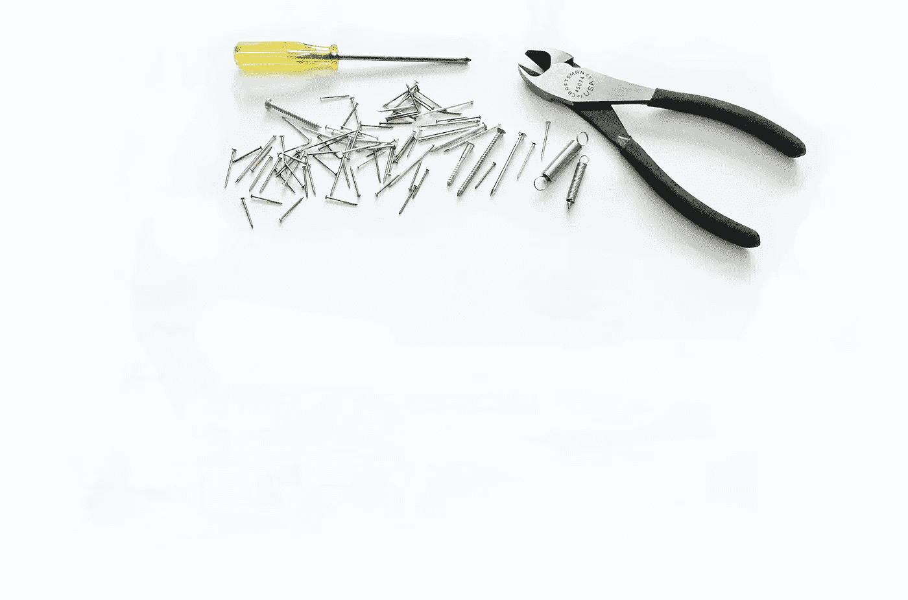

# 数据工程师的工具

> 原文：<https://towardsdatascience.com/data-engineer-tools-c7e68eed28ad>

## 数据工程工具箱的基础

朱莉·莫里弗在 [Unsplash](https://unsplash.com/s/photos/toolbox?utm_source=unsplash&utm_medium=referral&utm_content=creditCopyText) 上的照片

## 介绍

在过去的十年里，各种组织试图雇佣大量的数据和机器学习科学家，以便从他们的数据中提取有价值的信息，最终帮助他们做出明智的决策，并构建数据驱动的产品。不幸的是，这种策略对于这些公司中的大多数都失败了，因为在许多情况下，预测模型由于数据质量低而受到影响。数据是分散的，有时甚至不适合分析。

此外，即使当模型运行良好时，由于缺乏可扩展的架构、自动化和最佳实践的应用，它们在生产中的实现和部署也将是一场噩梦。这就是数据工程发挥作用的地方。

数据工程领域包含一套技术和原则，允许工程师通过配置所需的过程从各种不同的来源收集数据。此外，数据工程师有责任确保消除任何损坏的数据，以便使用这些数据的业务用户能够访问干净、准确的信息。

与此同时，数据工程师是现代数据驱动组织中最有价值的人之一，这些组织旨在通过利用他们最有价值的资产来构建或增强产品，即..数据！

为了以高效、可扩展和经济高效的方式实现这一点，数据工程师必须确保他们使用正确的工具，最终帮助他们构建组织所需的工具。

## 数据库

数据工程师应该能够处理和执行包括 SQL 和 NoSQL 数据库在内的数据库系统的某些操作。数据库是存放大量数据的地方，不同的用户可以在其中查询和提取信息，甚至可以使用数据库作为存储手段或甚至查找某些记录的其他应用程序。

对于大规模系统，数据工程师通常必须建立和维护**数据仓库**和**数据湖**。我不打算深入讨论这些概念以及它们与传统数据库的不同之处，但是如果您有兴趣了解关于这个主题的更多信息，请务必阅读我最近在下面分享的一篇文章。

 [## 数据湖与数据仓库

### 数据湖和仓库有什么区别？

towardsdatascience.com](/data-lakes-vs-data-warehouses-47444228604c) 

## (大)数据处理工具

如前所述，数据工程师应该设置所有必要的流程，以便清理和聚合来自多个来源的数据。因此，利用工具以可扩展、高效和容错的方式实现此类流程至关重要。

Apache Spark 是几乎每个行业都普遍使用的这种技术的一个例子。它是最广泛使用的可扩展计算引擎之一，可以执行批量处理、ML 模型训练和大规模数据分析等数据工程任务。此外，它支持多种语言，包括 Python、Scala、Java 甚至 r。

## (近)实时数据流

除了对历史数据进行传统的批处理，许多组织还需要实时和大规模地处理数据**。例如，考虑当特定事件发生时应该执行特定动作的用例。数据工程师应该能够构建**事件流架构**，从而实现这些特性。**

**在我看来，实时数据流之王是**阿帕奇卡夫卡**。这项技术最初是作为 LinkedIn 中的消息队列实现的，并迅速发展成为一个开源的实时数据流平台。简而言之，Kafka 可以用来从事件流中产生和消费数据，也可以作为一个临时的消息存储库。此外，它可用于实时处理事件流[，甚至追溯处理](https://kafka.apache.org/intro#intro_platform)。**

**在上一节中，我们讨论了 Apache Spark 以及它如何大规模处理批处理。除了批处理之外，Spark 本身还可以通过使用本地支持批处理和流工作负载的 **Spark 流**处理系统进行数据流处理。**

**这个 Spark API 扩展允许数据工程师执行来自多个来源的实时数据处理，包括 Apache Kafka 和 Amazon Kinesis。**

## **调度工具**

**对数据工程师非常有用的其他重要工具是调度机制，它允许在特定的时间间隔执行特定的管道或动作。**

**此外，当执行多个相互依赖的操作时，这些工具还可以让您的生活变得更加轻松。例如，在加载所需的特定数据之前，不能运行分析操作。因此，调度工具可以帮助您确保一旦动作 A 也成功执行和完成，就执行动作 B。**

**调度工具的一个例子是 **Apache Airflow** ，它是设置、调度、执行和监控数据工作流时最常用的平台之一。**

## **监控工具和警报**

**最后，数据工程师工具箱的另一个重要方面是**监控**。在今天的文章中，我们讨论了许多需要启动和运行的概念和工具，以便能够以可伸缩和及时的方式执行某些流程。**

**因此，重要的是要有适当的机制，使我们能够在各种系统上执行运行状况检查，此外，在发现异常情况时通知特定的目标组(例如，特定的开发人员或开发团队)，比如某个 Spark 节点，甚至整个集群都出现故障。**

**大多数现代数据工程工具都可以配置为高度可用，但这并不意味着集群在任何给定时间都 100%健康。高可用性仅仅意味着系统应该不间断地工作，即使发生了不寻常的事情。但是，我们应该能够对我们的系统健康状况进行 360⁰，以便在问题出现时让需要调查问题的团队参与进来。**

## **最后的想法**

**数据工程是组织的核心，旨在利用他们的数据来发布新产品，更新现有产品，并根据从一段时间甚至实时收集的数据得出的结论来改进他们的整体决策。**

**因此，招募合适的人来组建团队并帮助组织将其产品和决策提升到一个新的水平是非常重要的。**

**在今天的文章中，我们讨论了数据工程师应该使用的一些最重要的工具，以便以高效、优雅的方式执行日常任务，实现可扩展且经济高效的解决方案。**

**[**成为会员**](https://gmyrianthous.medium.com/membership) **阅读介质上的每一个故事。你的会员费直接支持我和你看的其他作家。你也可以在媒体上看到所有的故事。****

** [## 通过我的推荐链接加入 Medium-Giorgos Myrianthous

### 作为一个媒体会员，你的会员费的一部分会给你阅读的作家，你可以完全接触到每一个故事…

gmyrianthous.medium.com](https://gmyrianthous.medium.com/membership)** 

****相关文章你可能也喜欢****

** [## 卡夫卡不再需要动物园管理员了

### 2.8.0 版本让你提前接触到没有动物园管理员的卡夫卡

towardsdatascience.com](/kafka-no-longer-requires-zookeeper-ebfbf3862104)** ** [## 加快 PySpark 和 Pandas 数据帧之间的转换

### 将大型 Spark 数据帧转换为熊猫时节省时间

towardsdatascience.com](/how-to-efficiently-convert-a-pyspark-dataframe-to-pandas-8bda2c3875c3)** ** [## Kafka UI 监控工具(2021 年更新)

### 探索 Apache Kafka 集群的一些最强大的 UI 监控工具

towardsdatascience.com](/kafka-monitoring-tools-704de5878030)**