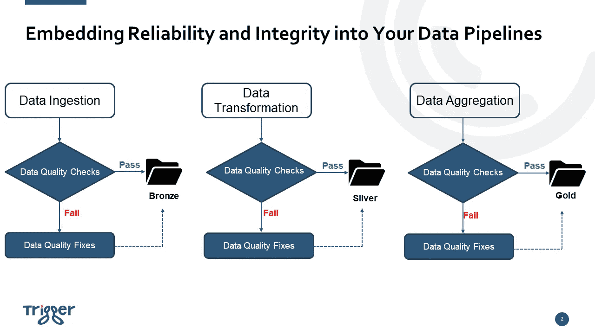

# 数据工程最佳实践—将可靠性和完整性嵌入您的数据管道

> 原文：<https://towardsdatascience.com/data-engineering-best-practice-embedding-reliability-and-integrity-into-your-data-pipelines-45d72bda832f>

## 构建高度可靠和值得信赖的数据管道，为下游数据消费者提供高质量的数据和信息

## 数据质量和数据可靠性的重要性

不言而喻，数据对于当今许多组织的运营和应用程序来说绝对至关重要。对于数据工程师来说，这不仅仅是通过提取、转换和加载(ETL)管道来交付数据，更重要的是交付可靠的数据，以便企业可以做出有效和明智的数据驱动型决策，数据科学家可以开发值得信赖的机器学习(ML)模型，数据密集型应用程序可以运行，而不必担心数据损坏。

我不得不说，管理和维护数据质量需要多个团队的共同努力，但数据工程师在这方面肯定要发挥作用。因此，本文的重点是在实践中，数据工程师如何在数据管道中嵌入数据质量控制和验证。

以下是今天文章的提纲:

*   数据质量管理的关键组成部分以及每个关键组成部分的范围；
*   medallion 设计模式——端到端管道流设计模式，具有适当的数据质量控制；
*   将数据质量检查嵌入数据管道的实施指南。我将深入探讨 3 个框架— [great_expectations](https://greatexpectations.io/) 、 [deequ 和 pydeequ](https://github.com/awslabs/deequ) 以及 Databrick 的 [Delta Live Table (DLT)](https://www.databricks.com/product/delta-live-tables) —对于每个框架，我将解释每个框架的工作原理，并分享每个框架的实现指南和编程模型。

乔恩·泰森在 [Unsplash](https://unsplash.com?utm_source=medium&utm_medium=referral) 上的照片

## 数据质量管理的关键组成部分

*   为了通过数据概要分析和数据探索性分析来理解数据，数据工程师有必要真正理解他们的管道正在处理什么数据。对数据的理解有两个层次。第一个层次是从技术和统计的角度去理解数据，比如每批数据的平均大小(记录数)，最小值，最大值，平均值，唯一性，完整性。另一个层次是从业务角度理解数据，比如理解数据是如何被使用的，哪些列是关键的，以及对数据所需的任何计算。
*   定义数据质量规则、检查和期望。数据工程师可以从您从前面的点中获得的数据剖析和分析结果中进行开发。他们还需要与业务所有者和他们使用的数据集的最终用户交谈，以了解他们对数据质量的要求。
*   基于上述定义的数据质量约束，通过数据管道以自动方式实施检查和验证，以确保每批新到达的数据在到达数据存储位置之前都经过所需的检查和验证。
*   与主要利益相关方达成一致，如果数据管道检测到任何违反数据质量规则的行为，应采取何种措施。例如，如果您的管道正在处理的数据集是非常关键的业务，并且不应该有任何数据质量问题，任何数据质量违规都应该保证管道故障，并向关键人员发送严重警报，以便可以立即修复这些数据质量问题。然而，如果您所支持的用例能够容忍一些数据质量问题，而不是让管道失败，那么您可以丢弃那些坏记录，或者将它们放在不同的位置，以后再处理它们。
*   向监控解决方案报告和记录数据质量检查结果。围绕数据质量定义和监控关键性能指标(KPI)，如通过记录的数量和失败记录的数量，不仅可以提供更好的可见性和可观察性，更重要的是，监控数据质量可以让人们清楚常见的数据质量问题在哪里，以便可以采取相应的措施来解决坏数据的根本原因。从长远来看，总体数据质量应该有上升趋势。

## 数据质量控制到位的端到端管道流

下图显示了数据管道将经历的典型端到端数据流，包括接收原始数据、数据转换和数据聚合。

将可靠性和完整性嵌入您的数据管道|作者图片

关键信息是，在将数据保存到存储层(青铜级、白银级、黄金级)之前，数据必须通过数据质量检查，对于未通过数据质量检查的损坏数据记录，在将它们写入存储层之前，需要单独处理。在本文的下一部分，我将分别使用 [great_expectations](https://greatexpectations.io/) 、 [deequ 和 pydeequ](https://github.com/awslabs/deequ) 以及 Databrick 的 [Delta Live Table (DLT)](https://www.databricks.com/product/delta-live-tables) 来演示如何实现 a 管道。然而，在我进入实施部分之前，您可能想知道“铜、银、金”在这里是什么意思。

“青铜= >白银= >黄金”模式是一种数据流设计，也称为奖章式架构。medallion 架构的设计是为了在数据流经架构的每一层时，逐步提高数据的结构和质量。这就是为什么它与今天关于数据质量和可靠性的文章相关。

下面总结了每一层——青铜色、银色和金色——在圆形建筑下的内容:

*   青铜(原始数据)-青铜层也称为原始数据层，是数据工程师接收和保存来自外部数据源的所有原始数据的地方。这一层中的表结构与源系统表结构“原样”相对应，还有任何捕获加载日期/时间、流程 ID 等的附加元数据列。
*   银层(清理和符合的数据)—在银层中，来自铜层的数据被匹配、合并、符合和清理，以便银层可以提供其所有关键业务实体、概念和交易的全局视图。(例如，主客户、商店、非重复交易和交叉引用表)。通常，银层中的数据结构与原始层保持相同
*   黄金层(策划的业务级表)—黄金层中的数据通常组织在消费就绪的“特定于项目/产品/用例”数据库中。黄金层用于报告，使用更多非规范化和读取优化的数据模型，连接更少。这里应用了数据转换和数据质量规则的最后一层。例如，商业智能(BI)报告和仪表板通常直接使用黄金层的数据。

一般来说，随着数据从原始到青铜到白银再到黄金的流动，数据质量要求变得越来越严格，因为黄金层直接服务于业务。到目前为止，您应该已经对什么是 medallion 数据设计模式以及它为什么与数据质量讨论相关有了较高的理解。如果你想了解更多关于梅达莲建筑模式的细节，你可以访问[这里](https://www.databricks.com/fr/glossary/medallion-architecture)。

从下一部分开始，我将解释如何利用不同的数据质量框架在端到端数据管道中实现数据质量检查。

先说远大前程。

## [殷切期望](https://greatexpectations.io/)实施指导

Great Expectations 是一个开源的 Python 库，它通过数据测试、文档和概要分析提供数据质量管理功能。《远大前程》的三个关键组成部分如下:

*   期望——期望是关于数据的声明性陈述。预期具体来说是计算机可以计算的数据质量规则，但人类也可以理解，例如……expect _ column _ values _ to _ not _ be _ null。《远大前程》自带预定义的期望库，支持包括 Pandas、Spark、MySQL、MSSQL、SQLite、PostgreSQL、Trino、Redshift、BigQuery、Snowflake 等多种数据源。另一点值得一提的是，伟大的期望允许用户创建自己的定制期望。
*   数据源——Great Expectations 提供了一个 Datasource 类来与底层数据系统进行交互。Datasource 类为数据连接器和执行引擎协同工作提供了一个接口。被远大前程支持的执行引擎有熊猫、Spark、SqlAlchemy。有 3 种类型的数据连接器用于大期望。第一个是 InferredAssetDataConnector，它通过使用 regex 来推断 data_asset_name，该 regex 利用了文件名或文件夹结构中存在的模式。第二个是 ConfiguredAssetDataConnector，它允许用户进行最大程度的微调，并且需要您想要连接的每个数据资产的明确列表。第三个是 RuntimeDataConnector，它是一种特殊的数据连接器，使您能够使用 RuntimeBatchRequest 在运行时直接提供批处理数据。RuntimeBatchRequest 可以包装内存中的数据帧、文件路径或 SQL 查询，并且必须包含唯一标识数据的批处理标识符，例如工作流编制器调度的作业的 run_id。
*   验证和检查点—当您第一次验证数据时，会为您创建一个检查点，对此我们寄予厚望。检查站是可重复使用的。一旦您创建了检查点，根据您的规范对其进行了配置，并根据验证结果指定了您希望它执行的任何操作，您今后需要做的就是通知检查点运行。

以下是远大前程的编程模型:

1.  第一步是启动数据上下文。您可以将数据上下文视为 YAML 文件或 python 字典，其中包含运行 Great Expectations 验证作业所需的所有配置。这些配置包括数据源、元数据存储(预期存储、验证存储、评估参数存储、检查点存储、配置文件存储)和数据文档站点。满怀期望，您可以使用 CLI 初始化新的数据上下文，或者可以在笔记本或工作流工具中实例化数据上下文，而无需 YAML 文件。数据上下文是《远大前程》的核心。没有它，您无法运行任何作业。
2.  第二步是根据您在数据上下文文件中定义的数据源配置连接到数据。你的数据可以是内存中的 Pandas 或 Spark data frame，也可以来自文件系统、数据库(MySQL、PostgreSQL、MSSQL、Redshift、BigQuery 等)，或者云存储位置(AWS S3、Google 云存储(GCS)、Azure Blob 存储)。
3.  第三步是开发期望，并将配置的期望添加到数据上下文文件中定义的期望存储中。有多种方法可以创建数据质量预期。例如，您可以从领域知识中创建这些期望。您还可以使用 onboarding data assistant 来分析您的数据，并自动生成期望套件，然后您可以对其进行调整以适合您的特定需求。
4.  第四步(也是最后一步)是验证您的数据。在运行数据验证过程之前，您需要首先创建一个检查点文档。配置检查点时，您可以添加额外的验证数据，或者设置检查点，以便必须在运行时指定验证数据。您可以添加额外的期望套件，并且可以添加检查点在完成数据验证时将执行的操作。常见操作包括更新数据文档、发送电子邮件、发布时差通知或发送其他自定义通知。

## [PyDeequ](https://github.com/awslabs/python-deequ) 实施指南

Deequ 是一个构建在 Apache Spark 之上的库，用于定义“数据的单元测试”，测量大型数据集中的数据质量。Deequ 的目的是在数据进入消费系统或机器学习算法之前，对数据进行“单元测试”，以尽早发现错误。Deequ 处理表格数据，例如 CSV 文件、数据库表、日志、扁平的 json 文件，基本上是任何可以放入 Spark 数据框架的东西。

在这里，您会注意到 Deequ 和 Great Expectations 之间的一个主要区别是，Deequ 仅适用于 Spark 数据框架，而 Great Expectations 同时支持 Spark 和 Pandas 计算引擎。这未必是一件坏事。原因是，Deequ 构建于 Apache Spark 之上，旨在处理通常位于分布式文件系统或数据仓库中的非常大的数据集(想想几十亿行)。

Deequ 有一个名为 [PyDeequ](https://github.com/awslabs/python-deequ) 的 Python 接口，编写这个接口是为了支持 Deequ 在 Python 中的使用。以下是 PyDeequ 的主要组成部分:

*   分析器和配置文件—分析器和配置文件模块都有助于探索大规模的大数据，计算制定数据质量约束所需的指标。例如，您可以使用 analyzer 来计算列的近似计数清晰度、列的近似分位数以及计算出的完整性值。Analyzer 还可以用来进行符合性检查，测量符合给定的
    列约束的行的比例。
*   约束建议 PyDeequ 提供预定义的规则和约束，以便对您的数据提出建议。这些预定义的规则包括建议列的分类范围约束、非空约束、数据类型约束和唯一约束。
*   约束验证—一旦定义了约束，就可以对新数据运行验证测试。验证结果、成功指标以及检查状态可以保存为数据帧或 JSON 文件。
*   指标存储库——PyDeequ 允许用户将 spark 数据帧上计算的指标和验证结果以 JSON 格式保存在一个中央指标存储库中。PyDeequ 支持两种类型的度量存储库，一种是 InMemoryMetricsRepository，另一种是 FileSystemMetricsRepository。FileSystemMetricsRepository 还支持 HDFS 和 S3。计算的每组指标都需要由 ResultKey 索引，result key 包含一个时间戳，并支持键值对形式的任意标签。有了度量存储库，用户以后可以用不同的方式从存储库中检索度量。

PyDeequ 非常容易启动，并支持 Spark 作为计算引擎，但是 Great Expectations 是一个更全面的数据质量管理框架。

## [δ现场表](https://www.databricks.com/product/delta-live-tables)实施指导

Delta Live Table (DLT)是 Databrick 的内部 ETL 框架，它可以轻松构建和管理可靠的数据管道，在[三角洲湖](https://delta.io/)上提供高质量的数据。DLT 的重点之一是数据质量管理。它提供了通过验证和完整性检查来防止坏数据流入表中的机制，并通过预定义的错误策略来避免数据质量错误。它还提供了一个控制面板来监控数据质量随时间的变化趋势，以深入了解您的数据是如何演变的，以及哪里可能需要进行更改。

与远大期望类似，您可以使用期望来定义数据集的数据质量约束。期望由一个描述、一个不变量和一个当记录不符合不变量时要采取的行动组成。当记录违反预期预定义的预期时，DLT 提供 3 种类型的策略:

*   expect——当您想要保留违反预期的记录时，可以使用 *expect* 操作符。违反预期的记录将与有效记录一起添加到目标数据集中。
*   expect 或 drop——您可以使用 *expect 或 drop* 操作符来防止处理无效记录。违反预期的记录将从目标数据集中删除。
*   期待或失败—当无效记录不可接受时，使用*期待或失败*操作符在记录验证失败时立即暂停执行。如果操作是表更新，系统自动回滚事务。

## 摘要

如今，越来越多的业务应用程序和操作系统使用数据，并对数据进行隐式假设，例如，一些列必须具有特定的数据类型，一些列不应包含任何缺失值。如果违反了这些假设，应用程序可能会崩溃，ML 驱动的系统的性能可能会下降，或者，基于数据的业务决策可能会有偏差，甚至是错误的。

因此，无论您最终选择哪种数据质量框架(或者如果适合您组织的需求，您甚至可以构建自己的数据管理解决方案)，最重要的事情是将数据可靠性和完整性检查构建到您的数据管道中，以确保您为数据消费者提供高质量的数据。

我希望你喜欢阅读这篇博客。如果你想在有新博客发表时得到通知，请随时关注我。我一般每周都会发表 1-2 篇关于数据和 AI 的文章。

如果想看到更多围绕现代高效数据+AI 栈的指南、深度潜水、见解，请订阅我的免费简讯— [***高效数据+AI 栈***](https://yunnawei.substack.com/) ，谢谢！

## 参考

*   [https://www.databricks.com/glossary/medallion-architecture](https://www.databricks.com/glossary/medallion-architecture)
*   [https://docs.greatexpectations.io/docs/](https://docs.greatexpectations.io/docs/)
*   [https://github.com/awslabs/deequ](https://github.com/awslabs/deequ)
*   [https://github.com/awslabs/python-deequ](https://github.com/awslabs/python-deequ)
*   [https://docs . databricks . com/workflows/delta-live-tables/index . html](https://docs.databricks.com/workflows/delta-live-tables/index.html)

注:以防万一你还没有成为媒体会员，并希望获得无限制的媒体访问权限，你可以使用我的[推荐链接](https://medium.com/@weiyunna91/membership)注册！我可以免费给你一点佣金。非常感谢你的支持！