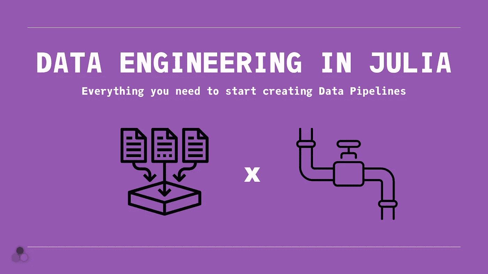
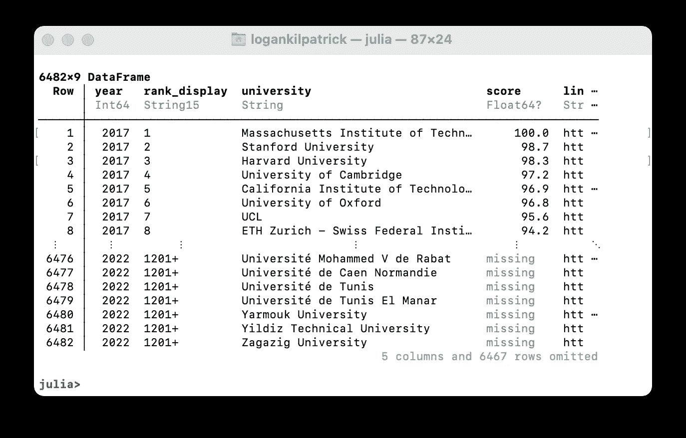
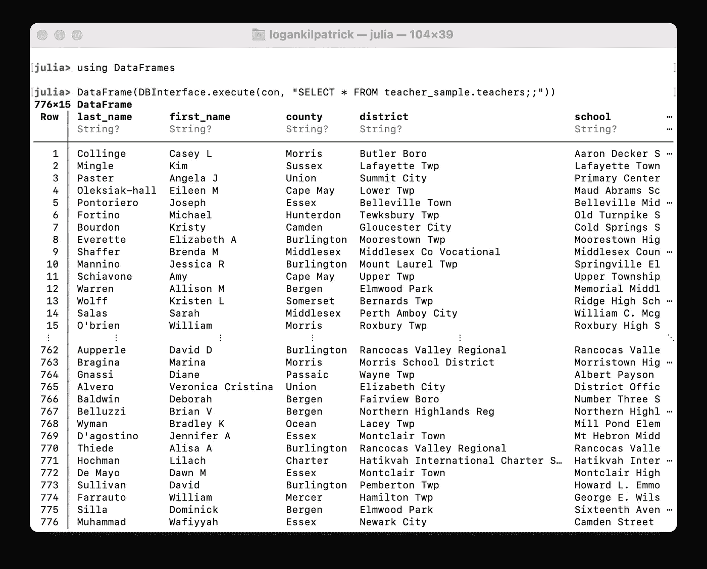

# Julia 中的数据工程

> 原文：<https://towardsdatascience.com/data-engineering-in-julia-3fd37eaa618a>

## 开始创建数据管道所需的一切🪠🧑‍🔧



作者图片

朱莉娅是数据科学和机器学习的自然选择？但是数据工程呢？在这篇文章中，我们将介绍如何使用 Julia 完成各种数据工程任务，从基础到创建管道。正如您将看到的，Julia 的性能和易用性可以轻松地跨整个 ML 和 DS 堆栈使用。

接下来，我们将探讨以下主题，并了解如何使用 Julia:

*   阅读🤓在茱莉亚写✍️的文件
*   使用数据库💽
*   其他工具概述

如果您想了解 Julia 为什么非常适合数据科学，请查看这篇文章:

<https://betterprogramming.pub/why-you-should-invest-in-julia-now-as-a-data-scientist-30dc346d62e4>  

如果你对为什么 Julia 是机器学习的未来感兴趣，请查看:

</the-future-of-machine-learning-and-why-it-looks-a-lot-like-julia-a0e26b51f6a6>  

# 什么是数据工程？🧐

在我们深入细节之前，有必要回顾一下数据工程到底是什么。如果你已经知道这些东西，并且想深入了解 Julia，请随意跳过这一部分。在尽可能高的水平上，数据工程是将数据从一个源移动到另一个源。举例来说，您有一个在生产环境中运行的网站，有多台服务器，每台服务器都存储特定产品销售的数据。检查总销售额的一种方法是在生产数据库上运行查询，并聚合结果以获得总销售额。但是如果你想做一个更复杂的分析呢？

在这种情况下，数据工程师可能会将所有生产数据库连接到一个专门用于分析目的的不同数据库。到目前为止，我们已经介绍了数据工程的提取和加载功能。然而，在许多情况下，我们可能希望数据采用不同于原始格式的格式。也许您正在记录总交易，但现在想要逐行的项目成本。这是数据工程师执行数据转换的地方，这是数据工程的第三个主要功能。


斯蒂芬·道森在 [Unsplash](https://unsplash.com?utm_source=medium&utm_medium=referral) 上拍摄的照片

那么从数据工程的角度来看，我们在这个例子中实际上做了什么呢？嗯，我们定义了一个管道！为了让这个例子发挥作用，我们有一个数据源(原始生产服务器),我们在那里进行提取，然后扩充/转换数据，接着将数据加载到数据仓库(存储),数据科学团队现在可以在那里做进一步的分析。

现在，您已经对数据工程流程有了大致的了解，可能会更清楚为什么让数据科学团队和数据工程团队使用相同的工具(即 Julia)对每个人都有好处。

编辑:我和我的合著者很高兴地告诉大家，我们的新书《朱丽亚速成教程》已经开始预售了:

<https://logankilpatrick.gumroad.com/l/juliacrashcourse>  

# 阅读🤓在茱莉亚写✍️的文件

一种常见的数据存储技术是将信息保存为逗号分隔值(CSV)。让我们来探索如何用 Julia 加载、修改和写入 CSV 格式的数据。为此，我们将使用 DataFrames.jl 和 CSV.jl 包。我们从添加包开始:

```
**(@v1.7) pkg>** add DataFrames # type "]" to enter pkg mode**(@v1.7) pkg>** add CSV # type "]" to enter pkg mode
```

如果您从未使用过 Julia 中的包管理器，并且需要一个快速概览，请查看这篇文章:

<https://blog.devgenius.io/the-most-underrated-feature-of-the-julia-programming-language-the-package-manager-652065f45a3a>  

现在我们已经安装了数据帧和 CSV，我们将加载它们:

```
**julia>** using DataFrames, CSV
```

接下来，让我们将 CSV 文件加载到 DataFrames.jl 中:

```
julia> df = DataFrame(CSV.File("/Users/logankilpatrick/Desktop/QS World University Rankings combined.csv"))
```

在这个例子中，我们将在 Kaggle 数据集[上使用](https://www.topuniversities.com/university-rankings/world-university-rankings/2022) [QS 世界大学排名 2017–2022，该数据集在
公共域](https://www.kaggle.com/prasertk/qs-world-university-rankings-2021?select=QS+World+University+Rankings+combined.csv)中。我们可以看到如下结果:



作者捕获的图像

如果您想选择一个特定的列，您可以这样做:

```
**julia>** df.university 6482-element Vector{String}:"Massachusetts Institute of Technology (MIT) ""Stanford University""Harvard University""University of Cambridge"⋮
```

要获得所有的列名，我们可以使用`names`或`propertynames`函数:

```
**julia>** names(df)9-element Vector{String}:"year""rank_display""university""score""link""country""city""region""logo"
```

如果我们想逐一遍历所有的行，我们会这样做:

```
for row in eachrow(df) print(row)end
```

好了，现在我们知道了如何进行一些基本操作，接下来让我们看看如何修改数据帧，然后将其写回 CSV 文件。在 DFs.jl 中，我们可以通过执行`df[index, columns]`来访问特定的行，所以在这种情况下，如果我们想要访问第二行以及属于它的所有列，我们应该执行`df[2, :]`。现在让我们创建一个新变量:

```
**julia>** new_row = df[2, :]**julia>** new_row.university = "Julia Academy""Julia Academy"**julia>** new_row.city = "Remote""Remote"**julia>** new_row.link = "juliaacademy.com""juliaacademy.com"
```

然后要将新行添加回数据框，我们可以使用`push!`函数:

```
**julia>** push!(df, new_row)
```

现在我们有了更新的数据帧，我们可以通过执行以下操作将其写入 CSV:

```
**julia>** CSV.write("/Users/logankilpatrick/Desktop/QS World University Rankings combined and Edited.csv", df)
```

您可以在本地确认这创建了一个新的 CSV 文件，并在最后更新了值。这应该能让你很好地处理 CSV 格式的数据。当然，还有很多我们无法在这篇文章中涵盖的内容，但是我希望这个例子能让你相信在 DataFrames.jl 中使用 CSV 是非常容易的。如果您想了解更多信息，请查看 DataFrames.jl 文档或观看来自 JuliaCon 2021 的研讨会教程:

# 使用数据库💽在朱莉娅

让我们从在 Julia 中使用 MySQL 开始这个数据库部分。就像我们对其他包所做的那样，要添加 MySQL.jl，我们只需输入`] add MySQL`。然后，运行`using MySQL`来加载包。

请注意，本节假设您已经在计算机上创建并运行了一个 MySQL 数据库。我们可以通过以下方式连接到该数据库:

```
**julia>** con = DBInterface.connect(MySQL.Connection, "localhost","root", "my_password", db = "teacher_sample")MySQL.Connection(host="localhost", user="root", port="3306", db="teacher_sample")
```

在上面的代码中，我们使用用户名“root”、密码“my_password”和模式名“teacher_sample”连接到目的地“localhost”的数据库。同样，其中一些属性是我在创建 MySQL 数据库时预先设置的。

为了正确地查看我们可以从 SQL 命令返回的结果，我们还需要通过以下方式加载 DataFrames.jl 包:

```
using DataFrames
```

然后，我们可以尝试执行一个简单的命令，比如`SELECT *`:

```
**julia>** DataFrame(DBInterface.execute(con, "SELECT * FROM teacher_sample.teachers;"))
```

这会产生以下数据帧:



`DBInterface.execute()`功能有两个输入:

*   光标，它是指向我们最初定义的要使用的数据库的指针
*   字符串格式的 SQL 命令(就像 Python 中的 MySQL 一样)

从这里开始，您可以通过对不同的 SQL 字符串使用相同的`execute`函数来执行几乎任何您想要的 SQL 命令。这包含了您将从数据库包中获得的核心功能。

## Julia 中的其他数据库

除了 MySQL，还有很多其他用 Julia 写的数据库绑定。你可能想看看 TypeDB.jl:

或者 JuliaDB(纯 Julia 数据库):

还有很多其他的！我建议查看一下 https://github.com/JuliaData 的[和 https://github.com/JuliaDatabases 的](https://github.com/JuliaData/JuliaDB.jl)[以获得 Julia 中所有可用数据库的完整列表。](https://github.com/JuliaDatabases)

# 其他数据工程工具⚒️

你用什么进行数据工程实际上取决于你在做什么。让我们简单回顾一下如何在 Julia 中使用一些最常见的数据工程工具:

## Julia 中的红移

如果想在 Julia 中连接 AWS 红移，可以[使用 LibPQ.jl](https://invenia.github.io/LibPQ.jl/stable/pages/faq/)

## Julia 中的 BigQuery

Google 的 BigQuery 可以通过 GCP.jl 访问[。](https://github.com/rana/GCP.jl)

## 朱莉娅中的画面

虽然不完全支持，但您可以通过以下扩展在 Julia 中连接 Tableau:

## 朱莉娅的阿帕奇火花

Apache Spark 的 Julia 绑定[存在于 Spark.jl](https://github.com/dfdx/Spark.jl)

## 《朱丽亚》中的阿帕奇·卡夫卡

在 RDKafka.jl 中可以找到`librdkafka`的包装器

## 朱莉娅的达斯克

虽然不完全相同，Dagger.jl 提供了并行性，这很受 Dask 的启发:[https://github.com/JuliaParallel/Dagger.jl](https://github.com/JuliaParallel/Dagger.jl)

## 朱莉娅的阿帕奇蜂房

Hive 通过 Hive.jl 可用

# Julia 会是数据工程的未来吗？🧐

这篇文章的主要目的是强调，你需要的很多工具，如果不是全部的话，都以这样或那样的形式存在。虽然这里或那里可能会有尖锐的边缘，但许多构建块现在已经就位，因此学习 Julia 并希望使用它的人们拥有了他们高效工作所需的东西。

我认为 Julia 在数据工程领域的优势在于模糊了那些想从事软件工程、数据工程和数据科学的人之间的界限。现在，因为许多工具是特定于上下文的，没有多少人在这个领域工作。但是我看到了一个未来，即“全栈数据工程师”使用 Julia 作为帮助他们的单一工具，跨所有三个学科工作。

虽然我已经完成了相当多的高级数据工程，但在这篇文章中，我仍然有很多不知道的东西，并且可能已经错过了。您可能也有兴趣阅读关于使用 Lathe.jl 的 ML 管道。

欢迎在 Twitter 上联系我，分享你的想法:[https://twitter.com/OfficialLoganK](https://twitter.com/OfficialLoganK)