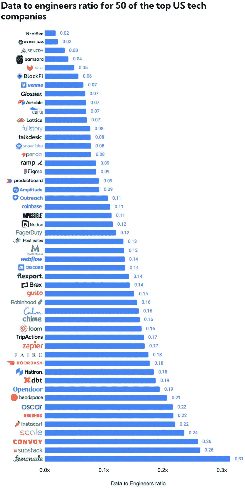
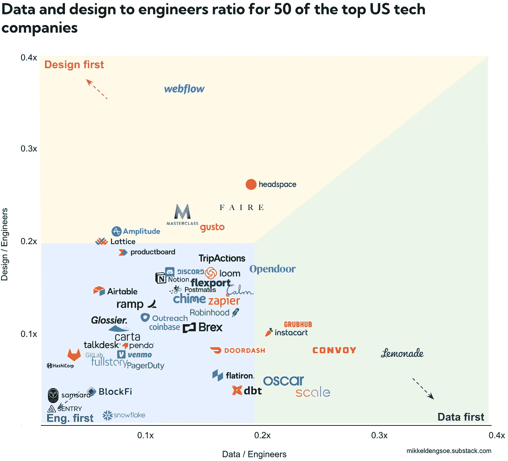
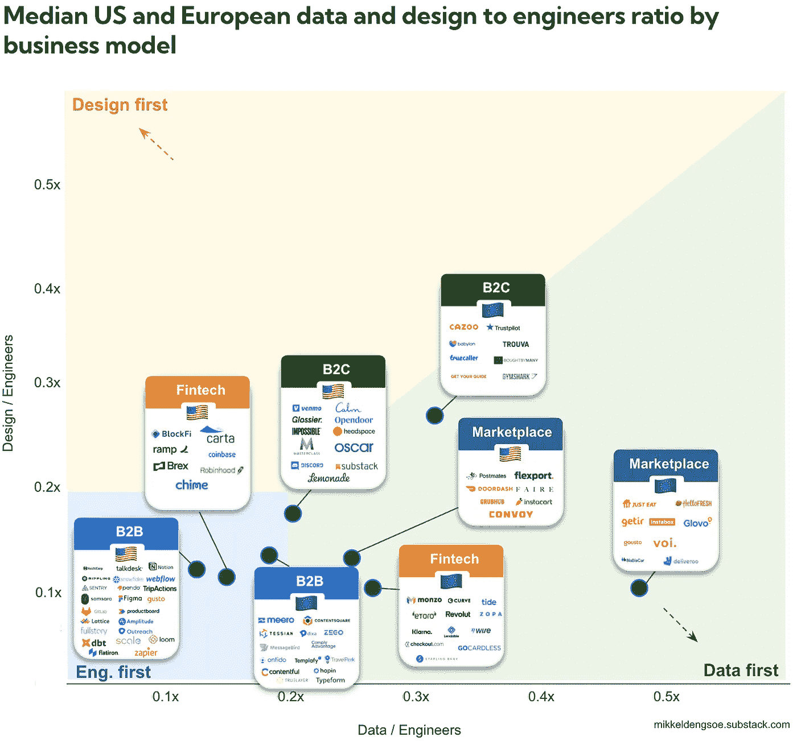
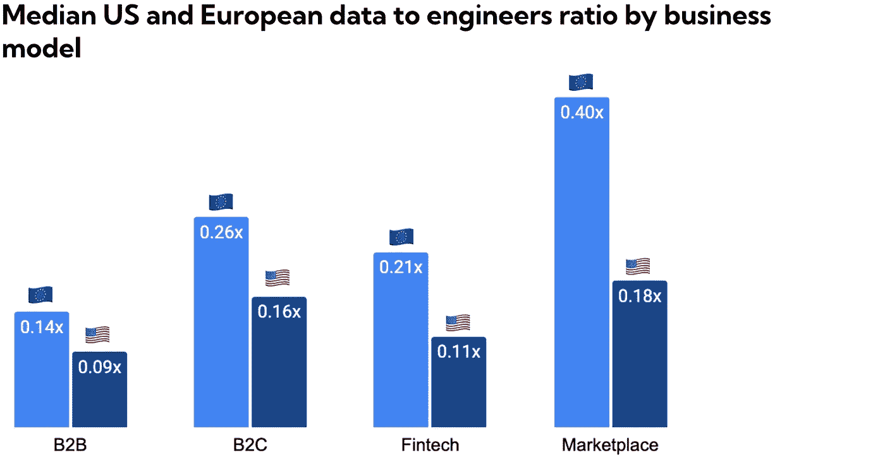

# 数据、工程师和设计师:美国与欧洲的比较

> 原文：<https://towardsdatascience.com/data-engineers-and-designers-how-us-compares-to-europe-e1ce6f0a8908>

早些时候，我声称随着公司加倍招聘数据，数据与工程师的比率[接近 1:2，一些欧洲顶级科技公司](https://medium.com/p/58abc23e36ca)，数据正迎来它的时刻。

它和池塘那边相比怎么样？🇺🇸

**我观察的美国公司的数据与工程师比率的中位数是 1:7，而欧洲公司是 1:4。**两组的设计与工程师比例均为 1:9。

这篇文章给出了为什么会这样的一些答案，但也留下了一些没有答案的问题。

让我们开始吧！

作者图片

这是处于不同等级的公司之间的巨大差距。

**分析公司实际上并不擅长分析**。令人失望的是，像 Amplitude、Pendo、Snowflake 和 Fullstory 这样的分析公司并不擅长分析。上述所有公司只有约 2%的员工从事数据工作，超过一半的员工根本不从事技术工作。

开发工具公司确实是为开发人员服务的。当谈到每个工程师的数据人员和设计师数量时，HashiCorp、Sentry 和 Gitlab 都在名单上垫底。这是有道理的，他们都有大型的工程团队——有些超过了员工总数的 50%。

# 数据是德州的秘密辣酱

给工程师绘制一个设计和数据的矩阵告诉我们一个有趣的故事，公司关注哪里。

作者图片

这与它对欧洲公司的看法有什么不同吗？相当多！

只有 50%的美国公司的数据人员多于设计师，相比之下，我观察的欧洲公司有 80%的数据人员多于设计师。

这并不意味着欧洲人对设计的投资减少；他们只是在数据上投入更多。对于美国和欧洲的公司来说，设计与开发者的比例中位数是 1:9。这与 Nielsen Norman Group 在对 500 家公司的研究中发现的相差不远，该研究显示 50%的公司的目标是设计与开发者的比例至少为 1:10。

美国公司通常是工程第一。与 19 家欧洲公司相比，36 家美国公司属于这个象限。

这是巧合还是有什么结构性的东西在这里发生？让我们深入🇺🇸🤺 🇪🇺.

# 曲奇还是饼干？美国公司与欧洲公司相比如何

从[上周的分析](https://mikkeldengsoe.substack.com/p/data-to-engineers)中，我们知道商业模式是数据与工程师比率的最佳指标之一；例如，与 B2B 相比，市场中每个工程师的数据人员数量是 B2B 的 2-3 倍。我只是从美国的低数据比率商业模式中挑选了更多的公司吗？或许如此，但即使在相同的商业模式下，美国和欧洲公司的数据工程师比率也有很大不同。

作者图片

画面清晰。在所有商业模式中，欧洲公司的每位工程师拥有的数据人员明显多于美国公司。

**美国是一个更大的市场，拥有更大的工程团队。Doordash & Deliveroo。** deliver oo(🇪🇺)的数据与工程师比率为 0.42，是 Doordash (🇺🇸)的两倍多，为 0.18。这并不意味着 Doordash 更少数据驱动；事实上，从绝对意义上讲，他们的数据人员比 Deliveroo 多，而且他们的团队中不乏出色的数据工作人员。他们的工程团队比 Deliveroo 大得多。

在我的分析中，纵观所有 100 家公司，美国公司的工程师占总劳动力的比例是 21%，而欧洲是 17%。

欧洲有更多的深度技术，美国有更多的开发工具。哈希公司& Onfido。
Onfido (🇪🇺)的数据工程师比率为 0.16，相比之下，HashiCorp (🇺🇸).)的数据工程师比率为 0.02 如果你是瘾君子，那就说得通了。机器学习是你的产品的核心部分，对数据进行更多投资是一个好主意。欧洲有很多类似的深度科技创业公司。相比之下，开发工具与工程师的数据比率非常低，美国目前拥有 DevOps 工具市场的最大份额。

如果我们将数据与工程师的比率并排放在一起，对比是鲜明的，某些垂直行业的差距超过 2 倍。

作者图片

虽然美国更大的工程团队和欧洲对深度技术的关注有助于解释这一点，但还有其他因素在起作用。以下是我的一些(推测的)假设

1)美国市场更大，竞争更激烈，有更多经验丰富的销售主管。因此，美国的 B2B 公司拥有相对较大的销售队伍。

2)欧洲的创业公司通常从一开始就分散在许多市场。这带来了独特的数据挑战，需要更大的数据团队。

3)越来越多的美国公司由工程创始人领导，他们创造了一种更加注重工程的文化。

为了保持良好的秩序，我还研究了公司规模与数据工程师比率之间是否存在关联，因为我的样本中的美国公司略大一些(美国公司的平均规模为 2100 家，而欧洲公司为 1500 家)。我没有发现显著的相关性。

让我知道你的想法。

# 关于数据

我查看了 LinkedIn 上的关键词，包括了所有匹配项(例如，产品工程师将与*工程师*项匹配)

*   **数据**:数据分析师、数据科学家、机器学习、数据工程师、数据经理、分析工程师、产品分析师、商业智能、数据主管/经理/总监/副总裁
*   **工程:**工程师(不含数据工程师)，技术/技术负责人
*   **设计:**设计(er)，用户体验，UX，用户研究

我故意没有包括所有分析师角色，这意味着诸如财务分析师、销售分析师和策略分析师等角色不被算作数据角色，尽管您可以将他们的一些工作归类为数据工作。