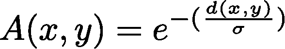
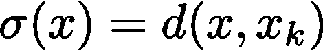
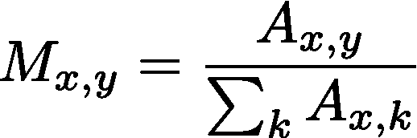
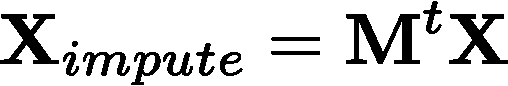
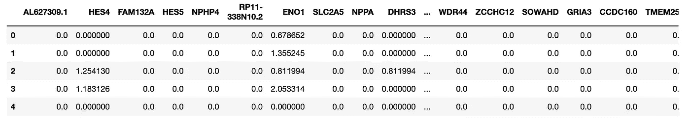
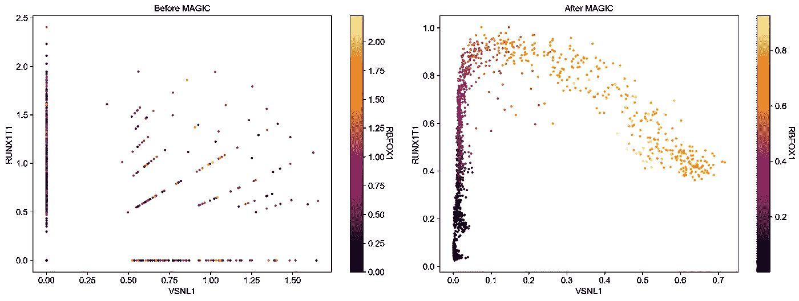
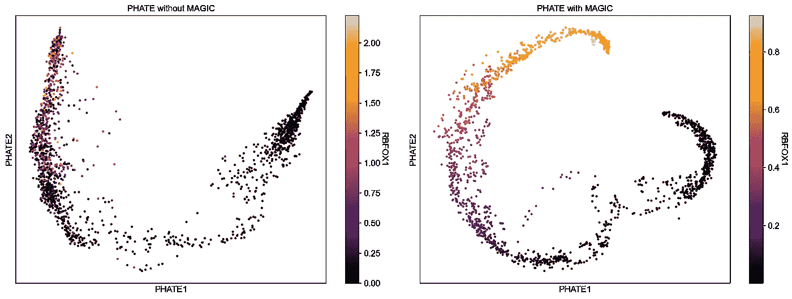

# 魔法数据插补

> 原文：<https://towardsdatascience.com/data-imputation-with-magic-85263d09a43f>

## 凯西-卡达布拉-阿拉卡赞！像变魔术一样消除数据中的噪音！

佩吉·科迪在 [Unsplash](https://unsplash.com/s/photos/magic?utm_source=unsplash&utm_medium=referral&utm_content=creditCopyText) 上拍摄的照片

在单细胞 RNA 测序数据(scRNA-seq)中，记录了单个细胞基因组中 mRNA 分子的数量，我们经常遇到这些分子的低计数或零计数。这是因为测序机器对更稀疏表达的基因的检测效率较低，导致它们被错误地标记为 0。这给 scRNA-seq 数据增加了许多噪声，这可能使下游分析如维度减少、差异基因表达和轨迹推断潜在可疑。具体来说，这种噪音可以掩盖感兴趣的基因的已知生物关系。

消除这些数据的噪声并绕过这个障碍不是很好吗？这就是归罪的由来。插补是一种填充或估算缺失数据(即零计数)的方法，通过对这些缺失数据条目的真实值进行有根据的猜测。去噪是一种插补模式，在这种模式下，您可以估计噪声并相应地移除噪声。实现这一点的一个简单而有效的方法是来自 Krishnaswamy 实验室的算法(该实验室开发了 [PHATE](https://www.nature.com/articles/s41587-019-0336-3) ，一种与更常用的 UMAP 具有竞争力的降维算法)，称为 [MAGIC](https://www.cell.com/cell/fulltext/S0092-8674(18)30724-4?_returnURL=https%3A%2F%2Flinkinghub.elsevier.com%2Fretrieve%2Fpii%2FS0092867418307244%3Fshowall%3Dtrue) 。MAGIC 代表**M**arkov**A**f 基于 **G** 图 **I** 计算的 **C** 单元。这种方法在单个单元格数据的图形表示上使用数据扩散来消除噪声。

如果您已经阅读了我的文章，下面的步骤将会非常熟悉，但简单地说，该算法从一个单细胞数据的矩阵开始(但您可以很容易地在您自己的数据集中替换这种矩阵格式)，并计算细胞之间的欧几里德距离，创建一个细胞到细胞的距离矩阵(根据数据的维度，我们通常在 PCA 空间中用大约 10-100 个主成分来确定这些距离)。这个矩阵然后从距离转换成亲和力。这度量相似性并且与距离成反比，例如两个细胞在欧几里得空间中越接近(即，它们的距离越小)，它们的亲和力越大。该计算使用指数内核实现:

作者图片

其中 *x* 和 *y* 各自对应于 PCA 空间中的细胞坐标， *d(x，y)* 是 *x* 和 *y* 之间的欧几里德距离， *σ* 是带宽参数，并且测量由该核捕获的邻域的“扩散”或半径。这是捕捉邻域单元内局部变化的关键。 *σ* 的选择因每组单元格而异，以校正单个单元格图中的密度差异。例如，一些细胞可能占据具有很少相邻细胞的稀疏区域，而其他细胞则挤满了一堆细胞。因此，我们希望稀疏区域的带宽“更宽”,而密集区域的带宽更短，以校正这种邻域变化。因此，我们将 *σ* 设为 x 与其第 *k* 个最近邻居之间的距离:

作者图片

其中 *xₖ* 是单元 *x* 的第 *k* 个最近邻。MAGIC 的作者建议这个 k 应该很小，以确保整个图的连通性。然而，因为 *σ* 是细胞特定的，我们的亲和矩阵不再是对称的(即，可能存在一对 *x，y* 使得 *A(x，y)* *≠ A(y，x)* )。这可以很容易地通过将我们的亲和矩阵的转置添加到原始矩阵 **A** 中来纠正。

作者图片

在我们计算了我们的亲和矩阵之后，我们通过行标准化将这些值转换成概率，在一个步骤中为所有单元获得从单元 *x* 到单元 *y* 的马尔可夫转移概率。

作者图片

因为退出效应呈现出一种形式的技术变异，这种变异通常与生物变异难以区分，随机采样特征(在这种情况下，每个基因的 mRNA 分子计数)可能导致已知*先验*相同的细胞(例如，干细胞或红细胞)之间的可疑变异。但是，将这些数据想象成一个图，其中节点表示单元，边表示相似单元之间的连接，您可以假设相似单元共享许多邻居，而不同单元具有较少的共同邻居。有没有一种方法可以让我们利用这些信息，让计数稀少的细胞可以从它们噪音较小的朋友那里学习？这就是数据扩散的用武之地，它为我们的马尔可夫概率矩阵求幂 *t* 。这可以直观地认为是在随机行走的 *t* 步内从单元格 *x* 转换到单元格 *y* 的概率。这个 *t* 被称为扩散时间。因此，在确定其基因表达谱时，细胞有更多的邻居可以遍历和学习。矩阵的这种动力增加了相似细胞的亲和力，同时消除了更嘈杂的连接。在图形信号的上下文中，您可以将它视为一个低通滤波器，当我们增加 t 时，我们不仅通过亲和力加强相关单元之间的连接，还通过降低稀疏性中出现的错误连接的权重来消除噪声。

这个乘方矩阵然后直接乘以 scRNA-seq 数据的原始矩阵，以获得滤除噪声的估算矩阵。

作者图片

其中 **M** *ᵗ* 为扩散时间驱动的概率矩阵， *t* ， **X** 为 *m* 细胞和 *n* 基因的原始单细胞矩阵， **X** *_impute* 为估算的基因表达矩阵。

概括地说，我们首先从预处理的原始数据计算细胞到细胞的距离矩阵，将距离转换为亲和力，将亲和力归一化为概率，然后对得到的概率矩阵求幂并乘以原始数据矩阵。很简单，对吧？我非常欣赏这个算法的一点是，从数学的角度来看，它是多么的简单和优雅。但是足够的数学，让我们看看这个算法在行动！

为了测试 MAGIC，我们将使用 pip 安装 Python 版本:

`pip install --user magic-impute`

我们还将安装一些用于预处理数据的单细胞分析包，以及用于可视化的 PHATE:

`conda install -c bioconda scvelo`

`conda install -c conda-forge scanpy`

`pip install scprep phate`

我们将使用[神经元分化](https://www.nature.com/articles/s41586-018-0414-6)的 scRNA-seq 数据集来说明神奇之处。如果你感兴趣的话，你可以阅读我的 [RNA velocity 文章](/rna-velocity-the-cells-internal-compass-cf8d75bb2f89)，了解更多关于生物学的细节。

原始数据的摘录，其中列对应于基因，行是单个细胞；注意零的大量存在。作者图片

将 MAGIC 应用于神经元分化的 scRNA-seq 数据集的结果。(左)插补前的像元散点图。(右)用魔法插补后的细胞散点图。作者图片

让我们看一下这些图，x 轴是神经元中表达的基因的 mRNA 丰度，称为 VSNL1y 轴是一个叫做 RUNX1T1 的基因的 mRNA 丰度，它出现在前体细胞类型中。每个点都是一个单独的细胞，由另一种叫做 RBFOX1 的神经元标记的表达来着色。我们预计随着细胞沿 x 轴转化为神经元，RUNX1T1 的表达会有明显的下降趋势，RBFOX1 的表达证实了这一点。左图太吵了，无法欣赏这一趋势，但右图用魔法插补成功地再现了这一生物现象。

我们还可以使用 PHATE 可视化原始数据和估算数据，如下所示:

原始(左)和估算(右)数据集之间的 PHATE 比较。作者图片

在这里，细胞根据 RBFOX1 mRNA 的表达被着色，我们可以在右边的图中看到一个清晰的梯度，因为细胞变成了神经元。

# 结论

在本文中，我们学习了 MAGIC，这是一种简单而有效的去噪方法。虽然在设计时考虑了生物数据，但这种方法也可以应用于其他类型的数据，其中缺失值和噪声也可能是常见的。值得注意的是，在选择幂马尔可夫矩阵的指数 *t* 时应该小心。指数过高会导致过度平滑，这会消除现有的生物变异，导致下游分析得出错误的结论。为此，对它的常见批评强调了它如何不区分真正的生物零和假阳性，而是转换整个矩阵，而不仅仅是丢失的值。然而，我欣赏这个算法的一点是，从数学的角度来看，它是多么的简单和优雅。单细胞生物学中的插补领域是一个非常受欢迎的分支学科，在过去的几年里，它催生了大量的算法(下面的参考文献中列出了一些例子)，MAGIC 是开创性的方法之一，至今仍被[广泛应用于该领域](https://scholar.google.com/scholar?cites=17010796872179619829&as_sdt=5,34&sciodt=0,34&hl=en)。

感谢您阅读这篇文章。如果您还不是中级会员，请考虑在此注册，以便充分使用该平台提供的所有功能:

<https://medium.com/@jashahir?source=entity_driven_subscription-56690d914eaf------------------------------------>  

## 参考资料:

[1] D. van Dijk，R. Sharma，j . nay ns，K. Yim，P. Kathail，A. J. Carr，C. Burdziak，K. R. Moon，C. L. Chaffer，D. Pattabiraman，B. Bierie，L. Mazutis，G. Wolf，S. Krishnaswamy，D. Pe'er，[利用数据扩散从单细胞数据中恢复基因相互作用](https://www.cell.com/cell/fulltext/S0092-8674(18)30724-4) (2018)，*细胞*
[2] 以及 S. Krishnaswamy，[将高维生物数据中的结构和跃迁可视化](https://www.nature.com/articles/s41587-019-0336-3) (2019)，*Nature Biotechnology*
【3】m . Huang，J. Wang，E. Torre，H. Dueck，S. Shaffer，R. Bonasio，J. I. Murray，A. Raj，M. Li 和 N. R. Zhang， [SAVER:用于单细胞 RNA 测序的基因表达恢复(2018)](https://www.ncbi.nlm.nih.gov/pmc/articles/PMC6030502/) ， *Nature [单细胞 RNA-seq 数据的精确稳健插补方法 sci compute](https://www.nature.com/articles/s41467-018-03405-7)(2018)*Nature communication s*
【5】g . La Manno、R. Soldatov、A. Zeisel、E. Braun、H. Hochgerner、V. Petukhov、K. Lidschreiber、M. E. Kastriti、p . lnnerberg、a .、J. Fan、L. E. Borm、Z. Liu*