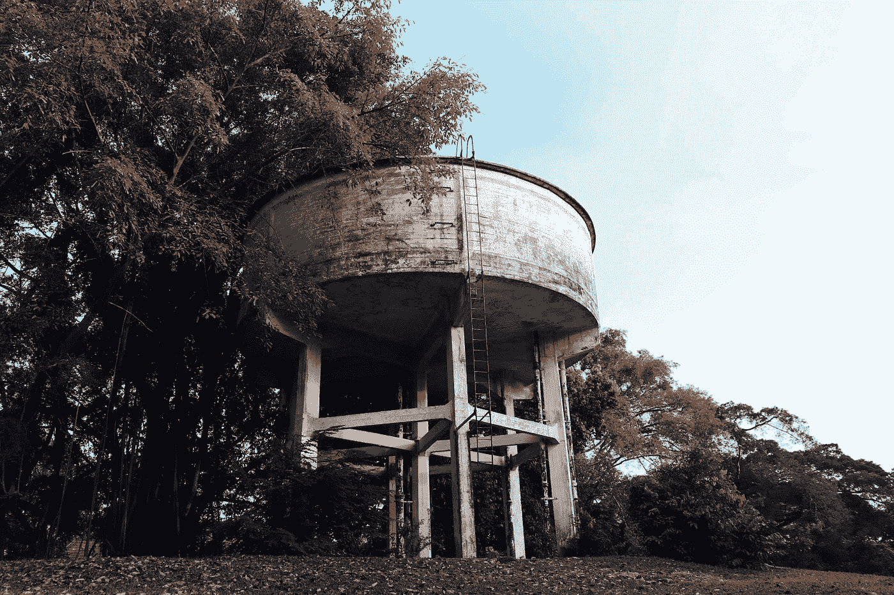

# 数据湖与数据仓库

> 原文：<https://towardsdatascience.com/data-lake-vs-data-warehouse-2e3df551b800>

## 了解数据存储架构中的两种不同方法

[flo·雷吉](https://unsplash.com/@floregi?utm_source=unsplash&utm_medium=referral&utm_content=creditCopyText)在 [Unsplash](https://unsplash.com/s/photos/data-lake?utm_source=unsplash&utm_medium=referral&utm_content=creditCopyText) 上的照片

数据湖和数据仓库被广泛用于存储大量数据。然而，它们不是可互换的术语。您会惊讶地发现，这两种方法是相辅相成的。下面分段让我们深入了解这两个术语。

# 数据湖简介

照片由[亚伦·伯顿](https://unsplash.com/@aaronburden?utm_source=unsplash&utm_medium=referral&utm_content=creditCopyText)在 [Unsplash](https://unsplash.com/s/photos/lake?utm_source=unsplash&utm_medium=referral&utm_content=creditCopyText) 上拍摄

众所周知，数据湖是一个集中的存储库。它使你能够积累所有已知的和未成形的数据。最好的事情之一是，它可以在任何规模下做到这一点。它允许您存储非结构化的数据，并构思各种类型的分析。从可视化和仪表板到大型游行，机器学习引导你做出更好的决定。

> *数据湖的结构化程度较低，更像是一个先转储所有数据，然后再发现用途的湖*

# 为什么企业需要数据湖？

成功从数据中获取商业价值的组织和公司，会积极地超越他们的同行。在各种调查中，人们注意到许多实施了数据湖的组织比熟悉的公司高出 10%(大约。)的真实收入增加。这些公司设法进行独特的分析，如来自点击流、社交媒体、日志文件和存放在数据湖中的互联网对应设备的数据。

最终，它通过保留和吸引客户、提高生产力和做出明智的决策，帮助他们认识到并抓住机会，实现业务的快速增长。

# 数据湖在企业中有什么价值？

在最短的时间内存储来自大量来源的大量数据的能力，以及让用户能够以各种方式联合和检查数据的能力，通常有助于更好、更快地做出决策。以下是一些实例，将使你清楚:

数据湖能够通过 CRM 平台组合所有的客户数据。社交媒体分析恰好就是如此。然后，它创建一个由购买历史和“发生”门票组成的营销平台，以便委托企业认可最有价值和最有前途的客户群、客户流失背后的原因以及将提高客户忠诚度的奖励和其他促销活动。

数据湖使你的 R&D 小队能够检查他们的论文，提炼推论并相应地分析结果。它可以包括在你的产品创造中选择合适的材料，使性能更快，基因组研究最终导致药物的改进。

# 在云端定位数据湖

从本质上讲，数据湖是一种示例性的工作负载，恰好部署在云上，因为云引入了实施、可靠性、可伸缩性、可用性以及一组独特的分类分析引擎。

此外，客户认为云是数据湖的优势的主要原因。这是由于更好的安全性、更快的可用性、部署、经常的功能更新、地理覆盖范围、弹性以及与现有利用率相关的成本。

> *数据湖的一个很好的例子是谷歌云存储或亚马逊 S3*

# 数据仓库简介

*照片由* [*约书亚苏*](https://unsplash.com/@joshdatsu?utm_source=unsplash&utm_medium=referral&utm_content=creditCopyText) *上* [*下*](https://unsplash.com/s/photos/water-tank?utm_source=unsplash&utm_medium=referral&utm_content=creditCopyText)

数据仓库是一个中央信息库，可以对其进行分析以做出明智的决策。通常，数据从事务系统和其他来源流入数据仓库。

> *数据仓库更加结构化，更像一个水箱，你首先定义用途，然后放入数据*

# 数据仓库是如何工作的？

您可能会在一个数据仓库中发现多个数据库。每个数据库都有自己的数据，这些数据被组织成表和列。和每一列，数据的描述能够被相应地定义。另一方面，表可以组织在模式中，这就是所谓的文件夹。最后，当数据被接收时，它被简单地存储在不同的表中。

# 数据仓库为什么重要？

当涉及到像数据湖这样的明智决策时，数据仓库具有巨大的价值。不仅如此，它还设法整合大量来源的数据。除此之外，历史数据分析、数据质量、准确性和一致性是数据仓库附带的一些元素。此外，将分析处理从跨国数据库中分离出来最终会增强两个给定系统的性能

> *数据仓库的一个很好的例子是谷歌的大查询或者亚马逊的红移*

# 数据湖和数据仓库有两种不同的方法——下面是方法

奥利弗·鲁斯在 Unsplash 上的照片

根据不同的需求，组织需要有一个数据仓库和数据湖，因为它们提供了不同的需求和用例。

数据仓库与数据湖截然不同。数据仓库是为了分析来自事务系统和企业应用程序线的关系数据而优化的数据库。

另一方面，数据湖有不同的用途，因为它存储来自一系列企业应用程序的关系数据。不同之处在于，它还存储来自移动应用程序、社交媒体和物联网设备的数据。也就是说，它存储了所有给定的数据，没有任何精心的设计。

此外，数据仓库主要用于批量报告、可视化和结构化数据的 BI 分析。而数据湖可以潜在地用于解决机器学习、数据发现、预测分析和用大量数据进行剖析的问题

拥有数据仓库的组织碰巧看到了数据湖的好处。为了最大化他们的利益，他们正在发展他们的仓库，使其也包括数据湖。它不仅保证了多样化的查询能力，还保证了发现新信息模型的高级能力

# 数据湖和数据仓库是如何协同工作的？

由 Pawan Kawan 在 Unsplash 上拍摄的照片

这些方法是相辅相成的。数据仓库通过显著增加的并发性来管理结构化和打包数据的质量、一致性和性能。另一方面，data lake 确保专注于原始原始数据承诺和永久存储。它以合理的成本做到了这一点，同时提供了新的分析灵活性。

这两种不同但互补的解决方案被推荐为任何

**如果你对更多细节感兴趣，请查看我的 youtube 视频**

数据湖 vs 数据仓库 [Anuj Syal](https://www.youtube.com/channel/UCO8XsgcjqArk_mAd1VGBMfg?sub_confirmation=1)

*最初发表于*[T5【https://anujsyal.com】](https://anujsyal.com/data-lake-vs-data-warehouse)*。*