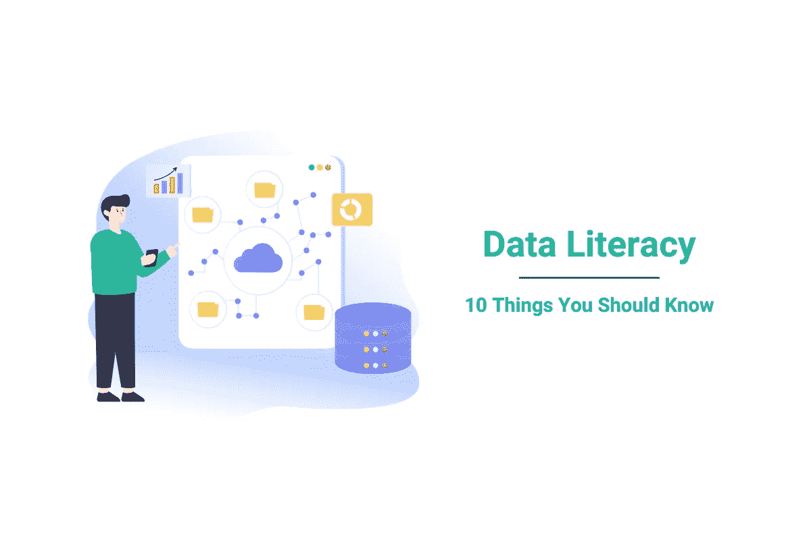

# 数据素养——你应该知道的 10 件事

> 原文：<https://towardsdatascience.com/data-literacy-10-things-you-should-know-f59c3b744d03>

## *什么是数据素养？要成为数据素养的人，你应该知道些什么？我们将要回答这两个可能会困扰你一段时间的问题。*

作者在 [Canva](https://canva.com/) 上创建的图片

你喜欢读书，对吗？如果你没有，你就不会读这篇文章。好吧，你是对的:看了这篇文章不代表你爱读书。但是阅读它肯定意味着你至少是部分识字的。

阅读的“问题”是，一旦你学会了阅读，你就无法忘记它。不仅如此，一旦你的目光与字母相遇，你就不会心甘情愿地不去阅读。你觉得你可以吗？让我们做一个小实验，好吗？

看看下面的图片，还有…不要看上面说的！啊，太晚了；你已经做了。

作者在 [Canva](https://canva.com/) 上创建的图像

我很抱歉。你实验失败只是证明了当你的眼睛看到字母时，你的大脑不能决定关闭你的阅读技能。好了，你读了一些东西，然后才想到不去读它。

阅读只是读写能力的一部分，第二部分是写作。

数据素养也是这样吗？

# 什么是数据素养？

正如维基百科所说，数据素养是阅读、理解、创建和交流数据信息的能力。

与一般的读写能力一样，数据读写能力也包括读写能力。在这种情况下，它读取数据并创建数据。这意味着你应该能够谈论数据，使用分析程序并解释这些分析的结果。

# 什么造就了数据素养？

您可能听到周围的人都在提到它，不管是知道什么是数据素养的人还是不知道的人。为了确保您属于第一个阵营，我将讨论包含数据素养的十件事。

关于数据素养，您需要了解的内容可以分为三个部分:

*   存储数据
*   处理数据
*   呈现数据

虽然我将谈到的 10 点在多大程度上需要取决于你的工作，但你至少应该有一些关于它们的基本知识，以达到数据素养。

# 存储数据

这里我不是在谈论存储数据的工具的技术细节。这更多的是概念层面，是成为数据素养的必要的第一步。

# 1.数据是不完美的

在深入了解数据的细节之前，您应该知道的第一件事(并且永远记住！)就是数据不完美。

当我说不完美时，我想到了两件事。首先，没有完美的方法来存储数据。[公司](https://www.stratascratch.com/blog/11-best-companies-to-work-for-as-a-data-scientist/?utm_source=blog&utm_medium=click&utm_campaign=medium)正在成长，改变他们的经营方式，并根据他们可用的技术创新而发展。这不是一条单行道，因为业务变化也会推动技术变化。请记住，数据会不断变化，而且存储数据必须满足许多不同用户的需求，因此您不能期望数据会完全符合您的需求。

以关系数据库为例，它是最常见的数据存储方式之一。它们的性质迫使数据尽可能分段，这导致数据存储在多个表中。也许将您每天使用的几个列简单地存储在一个表中对您来说是理想的。然而，数据不只是为你准备的，你需要克服这种不便。怎么会？这就是我们稍后要讨论的。

数据不完善的第二个方面是指数据本身的不完善。数据总是毫无例外地充满错误和不一致。如果你没有注意到他们，并不意味着他们不在那里。这是你应该永远记住的事情。所以如果你在寻找能给你 100%正确答案的数据，你永远不会得到。不要做那种问员工他们提供给你的数据是否 100%准确的老板。不是，也永远不会是。

数据的意义在于给你你能得到的最合理的正确答案。你是怎么做到的？这是我们的第二点。

# 2.了解数据质量的目的

从数据中获取可靠的信息取决于数据质量。虽然数据并不完美，但您应该始终努力使其尽可能无误。

您还应该知道数据质量(或缺乏数据质量)如何反映在数据上。这里可以说说数据不一致的问题。例如，客户的地址可能来自不同的来源，您可能最终得到的数据显示某些客户的一个地址，而另一个表显示不同的地址。

这也可能意味着您的数据不完整。你可以有客户的地址，但是没有他们的城市。

数据准确性不是指有没有数据，而是你拥有的数据实际上是否正确。您是否有客户的正确地址，或者这些地址中的一些已经不再有效？

数据也必须精确。你的唱片销量是四舍五入，还是只存储日期而不存储时间？你可能会错过很多。

最后，您的数据可能只是丢失了，或者可能是未知的。好吧，假设你没有你客户的联系方式或者没有记录他们以前的购买。在这种情况下，你不可能尝试向他们提供特别优惠，故意留住他们，或者向他们提供任何有用的信息。

# 3.数据类型

懂数据的人都知道，存储的数据有很多种类型，而这些数据往往需要特定类型的数据。

当选择了正确的数据类型时，它使数据适合使用。您应该知道有数值，通常一种数值数据类型并不总是合适的。例如，如果你在卖书，你可以将售出的书的数量存储为一个整数。但是如果你卖的是原材料，也许一个十进制的数字会更好，这样你就可以记录售出材料的重量。知道您可以在多种类型的数字数据和精度级别(例如，您想要查看多少个小数位)之间进行选择对于数据素养至关重要。

有些日期只能作为日期存储，因为除此之外你不需要任何其他信息。如果你正在记录你的应用程序的登录时间呢？你可能想看看时间。但是有多精确呢？应该只有几个小时，还是几小时几分钟，甚至几秒或几毫秒？

文本数据也存储在数据库中。根据您想要的文本，您还必须知道您可以决定您存储的字符类型或您想要存储的字符数量。

虽然详细了解这些数据类型对您的工作来说可能是必要的，也可能不是必要的，但至少要意识到，无论数据的格式如何，它们都不能简单地放在一起。

# 处理数据

作者在 [Canva](https://canva.com/) 上创建的图像

数据素养的下一步是了解如何处理数据。不仅在理论上而且还要应用某些[技能](https://www.stratascratch.com/blog/what-skills-do-you-need-as-a-data-scientist/?utm_source=blog&utm_medium=click&utm_campaign=medium)去做。

处理数据意味着创建、操作和分析数据。三种技能类型使你能够做到这一点。

# 4.技术

这些[技能](https://www.stratascratch.com/blog/most-in-demand-data-science-technical-skills/?utm_source=blog&utm_medium=click&utm_campaign=medium)包括选择合适的技术来分析数据。但是首先，你必须知道你想进行什么类型的分析。是描述性分析还是诊断性分析？甚至可能是预测性的或规范性的？

描述性分析查看历史数据并描述发生了什么。诊断分析做同样的事情，但是它试图给出一个问题的答案，“发生了什么？”。

正如你所想的，预测性和规范性分析展望未来。预测分析使用历史数据和机器学习来回答未来会发生什么。预测分析的下一个层次是规范分析。你用预测分析知道会发生什么。规定性分析试图回答“你应该怎么做？”避免或受益于将要发生的事情。

为了执行数据分析，您应该使用正确的统计技术。它们是:

*   描述性统计分析
*   推断统计分析
*   预测统计分析
*   规定性统计分析
*   探索性数据分析
*   偶然分析
*   机械分析

# 5.选择和使用合适的工具

你不太可能只用一支笔和一张纸来做分析。不，你必须选择最合适的工具来实现你想要的。为了做出正确的决定，你必须知道哪些工具适合什么。当然，你应该知道如何使用它们。

你应该只使用一种工具还是结合几种？有时候使用工具并不需要编码知识，但仍然需要了解工具的可能性以及使用它们的经验。这样的工具有 Excel 或 GoogleSheets、Power BI、Tableau 和其他 BI 工具。

但是通常情况下，他们需要了解至少一门编程语言。一些最受欢迎的是:

*   结构化查询语言
*   计算机编程语言
*   稀有

# 6.商业技能

虽然技术和工具知识是必不可少的，但这些不是独立的技能。它们需要与商业知识相结合。否则，你可能不明白你要解决的是什么业务问题。而如果你不理解问题，你只会偶然提供正确答案。

业务知识包括了解你的公司及其产品，知道不同部门是做什么的，业务流程是什么样子的，每个部门和公司都面临哪些挑战。这也意味着你需要了解公司所处的行业本身，以及与竞争对手相比，公司所处的位置。

例如，如果你想提高销售额，你需要知道市场是什么，竞争对手在做什么，你可以做得更好或不同，你的客户是谁，什么可以吸引他们到你的业务。你看，数据本身并不存在，就其本身而言，它是一种商业工具，应该如此使用。

# 呈现数据

虽然演示不代表一切，但它肯定是有意义的。数据很少以原始形式呈现。那有什么用？我提到过，在商业中，数据只是一种工具。对于一个可用的工具(意思是:基于它做出商业决策)，数据及其洞察力的呈现方式应该是视觉友好的。

# 7.视觉技能

视觉技能包括创建和阅读以可理解的方式呈现的数据。

如果你是一个执行分析的人，你应该对如何可视化地显示数据有一定的感觉，以便那些阅读它的人尽可能容易地理解它。是的，这包括有轻微的空间感和色彩感。当你以漂亮的小表格、亮点和图表的形式展示你的见解时，这将非常有用。

另一方面，以这种方式呈现的数据对那些看不懂的人来说没有任何意义。这就是数据素养再次发挥作用的地方。如果你甚至不知道图表、趋势线、均值、平均值、增量、分布等是什么，也不知道它如何转化为业务，那么拥有一个包含图表、趋势线、均值、平均值、增量、分布等的仪表板又有什么意义呢？

# 8.社交技巧

社交技能归结为意识到其他人和你有不同的经历，不同的知识，不同的专业水平和类型。

这可以产生双重效果。第一，你的思考和理解方式不是唯一(正确)的。第二，知道是什么让别人成功可以让你做得更好。

这与数据素养有什么联系？比你想象的还要多！如果你是一名数据科学家，你的社交技能应该会让你适应力强。虽然意识到您不能向您的数据科学同事展示您的发现，但销售和管理委员会的人显然也是如此；相信我，许多人在实践中对此缺乏理解。

它也反过来了。也许你没那么懂技术，但是数据素养和社交技能的水平会让你理解那些与数据打交道的人是如何思考的。如果你这样做了，你对他们的要求会更加精确和直接；你可以理解他们的建议和顾虑。反过来，它会让你们更有效率地一起工作。当你要求一样东西，得到不同的东西，然后试图解释你的意思是别的东西，等等，所有那些没完没了的电子邮件都将一去不复返。

# 9.没有一个真正的答案

呈现的数据可以用几种方式来解释。对它的解释可能取决于数据本身。例如，如果您正在分析销售额，并且只有过去两年的数据，您可以得出一个结论。如果你有 5 年的销售历史，你会得出一些不同的结论，甚至完全相反的结论。

即使你有最详细的数据，也可能有不同的解释。例如，如果你的收入下降了 20%,而你从事的是酒店业，这可能会被视为一场灾难。如果你知道那一年有一个新冠肺炎疫情，创纪录的油价水平，该行业的平均收入下降了 70%，你的五个直接竞争对手中的三个关闭了业务，并且你没有解雇任何员工，收入下降 20%可以被视为成功。

# 10.批判性思维

随着所有可用的技术、数据质量的提高、数据量的庞大以及分析数据的方式，人们很容易忘记我们从哪里开始:数据是不完美的！

虽然批判性思维应该涉及数据素养的所有方面，但在基于数据做出决策时尤其重要。有一种倾向是支持数据驱动的决策，这可能导致决策时只依赖数据。虽然根据直觉做决定是偶然的，但只根据数据做决定而忽视理性和批判性思维是一种由数据驱动的灾难。如果你根本没有数据，你可能会过得更好。

在这种情况下，数据素养与一般素养是一样的。对你所读内容的解释，你从中学到什么，以及它如何改变你的所作所为都取决于你。根据数据做决定，不加思考，就像读了陀思妥耶夫斯基的《罪与罚》,认为你最好买一把斧子，然后…嗯，你知道这是怎么结束的！

## 结论

从这 10 个谈话要点中，你看到了数据素养与一般素养没有太大区别。它也包括读和写，但在数据方面。

数据素养包括对数据存储方式的一般理解。一旦你知道了这一点，你就应该建立处理数据的技术和其他技能。除此之外，您需要知道如何表示和读取数据。

你不需要专家级的知识。你需要它的程度取决于你的兴趣和工作细节。然而，如果你想称自己为数据专家，至少对这 10 点有一个基本的理解是至关重要的。