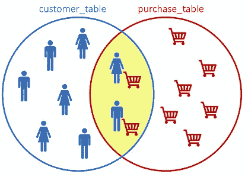
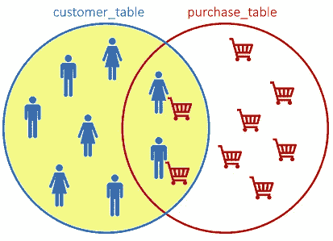
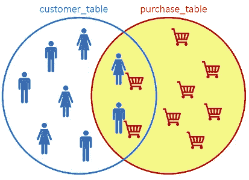
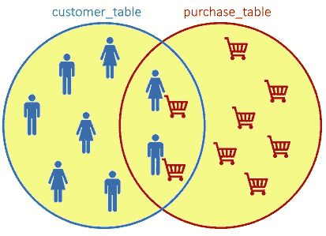

# SQL、Python 和 R 中的数据操作——比较

> 原文：<https://towardsdatascience.com/data-manipulation-in-sql-python-and-r-a-comparison-db63f72fa020>

## 对最常见的 SQL 语句及其用 pandas (Python)和 dplyr (R)编写的对应物的完整而友好的概述


克里斯托夫·高尔在 [Unsplash](https://unsplash.com?utm_source=medium&utm_medium=referral) 上拍摄的照片

# 目录

1.  [简介](#7a9f)
2.  [创建表格](#b12a)
3.  [插入](#3933)
    3.1 [插入单个观测值](#f54c)
    3.2 [插入多个观测值](#855c)
4.  [选择](#0a4b)
    4.1 [选择所有行和列](#9b1a)
    4.2 [选择有限数量的行](#9bdd)
    4.3 [选择特定列](#1fff)
    4.4 [选择不同的](#59c4)
5.  [WHERE 条件(过滤)](#8d5e)
    5.1 [一个过滤条件](#6d08)
    5.2 [多个过滤条件](#9193)
6.  [ORDER BY](#6d08)
    6.1[ORDER BY one column](#cb63)
    6.2[指定升序与降序](#8485)
    6.3[ORDER BY multiple column](#19a1)
7.  [聚合函数](#f6ae)
    7.1 [计数](#79ed)
    7.2 [AVG、最小值、最大值、…](#52aa)
    7.3 [聚合函数和 WHERE 条件](#9468)
    7.4 [加成:描述和总结](#613c)
8.  [分组依据](#1f6d)
9.  [更新/更改表](#c947)
    9.1 [修改现有列的值](#1e50)
    9.2 [添加新列](#3234)
    9.3 [删除列](#4d72)
10.  [加入](#6e85)
    10.1 [内加入](#f41c)
    10.2 [左加入](#406a)
    10.3 [右加入](#e3dc)
    10.4 [全加入](#8a70)
11.  [结论](#9f4d)
12.  [参考文献](#59be)

# 1.介绍

这篇文章的目的是分享用于数据操作的最常用的 SQL 命令，以及它们在 Python 和 R 语言中的对应部分。

通过提供实例，我们还想强调两种不同语言之间在逻辑和句法上的相似之处。

对于 SQL 语句，我们使用`PostgreSQL`，一个流行的开源关系数据库管理系统。对于 Python，我们使用`pandas`库，而对于 R，我们利用`dplyr`包。

为什么`pandas`:

1.  *事实上的*管理 Python 中表格数据结构的标准。
2.  一整套现成的数据操作方法。
3.  快速高效的`DataFrame` 对象。
4.  出色的数据表现。

为什么选择`dplyr`:

1.  更干净、更易读的代码:借助管道操作符`%>%`的函数链接允许更容易地读写 R 代码，并提供语义救济。
2.  简单高效的语法。
3.  速度:比 base R 或 plyr 快。

这篇文章是由 SQL commands⁴在分段中组织的，暗示 SQL 是逻辑入口点。然而，根据对每种语言的熟悉程度，也可以很容易地从其他角度阅读它。

# 2.创建表格

我们可以用`CREATE TABLE`指令创建一个 SQL 表:

```
CREATE TABLE IF NOT EXISTS customer_table (
 id SERIAL PRIMARY KEY,
 age NUMERIC NOT NULL,
 gender VARCHAR NOT NULL
);
```

SQL 表的`pandas`等价物是`pandas.DataFrame`，一个可以存储二维表格数据的对象。它可以按如下方式创建:

```
# the pandas library is imported first
import pandas as pdcolumns = {'id':int(),
           'age':int(),
           'gender':str()}customer_table = pd.DataFrame(columns, index=[])
```

r 也提供了一个数据帧，它可以通过基本的`data.frame()` ⁵函数创建:

```
# the dplyr package is imported first
library(dplyr)customer_table <- data.frame(id=integer(),
                             age=integer(),
                             gender=character())
```

# 3.插入

## 3.1 插入单个观察值

一旦我们创建了数据结构，无论是表还是数据框:

*   我们可以通过`INSERT INTO` ⁴语句向 SQL 表中添加行。
*   我们可以用`pandas.DataFrame.append()` ⁶方法向`pandas.DataFrame`添加行。
*   我们可以使用`add_row()` ⁷函数向 r 数据帧添加行。

SQL 语句:

```
INSERT INTO customer_table VALUES
  (1, 27, 'Female');
```

Python:

```
customer_table = customer_table.append(
   {'id': 1, 'age': 27, 'gender': 'Female'}, 
   ignore_index=True)
```

r:

```
customer_table <- 
  customer_table %>% add_row(id=1, age=27, gender='Female')
```

**注意**:当我们创建 pandas 数据帧时，我们指定了列数据类型。尽管如此，用户可以添加一个数据类型不同于最初为列指定的数据类型的记录，并且不会出现错误。

例如，这个 Python 语句完全有效，即使我们先前指定`gender`是字符串类型:

```
customer_table = customer_table.append(
   {'id': 1, 'age': 27, 'gender': 2})type(customer_table['gender'].values[0])# prints: 'int'
```

## 3.2 插入多个观察值

SQL 语句:

```
INSERT INTO customer_table VALUES
  (1, 27, 'Female'),
  (2, 27, 'Female'),
  (3, 45, 'Female'),
  (4, 18, 'Male'),
  (5, 23, 'Male'),
  (6, 43, 'Female'),
  (7, 28, 'Female'),
  (8, 27, 'Male'),
  (9, 19, 'Male'),
  (10, 21, 'Male'),
  (11, 24, 'Male'),
  (12, 32, 'Female'),
  (13, 23, 'Male');
```

Python:

```
customer_table = customer_table.append([
   {'id': 1, 'age': 27, 'gender': 'Female'},
   {'id': 2, 'age': 27, 'gender': 'Female'},
   {'id': 3, 'age': 45, 'gender': 'Female'},
   {'id': 4, 'age': 18, 'gender': 'Male'},
   {'id': 5, 'age': 23, 'gender': 'Male'},
   {'id': 6, 'age': 43, 'gender': 'Female'},
   {'id': 7, 'age': 28, 'gender': 'Female'},
   {'id': 8, 'age': 27, 'gender': 'Male'},
   {'id': 9, 'age': 19, 'gender': 'Male'},
   {'id': 10, 'age': 21, 'gender': 'Male'},
   {'id': 11, 'age': 24, 'gender': 'Male'},
   {'id': 12, 'age': 32, 'gender': 'Female'},
   {'id': 13, 'age': 23, 'gender': 'Male'}])
```

r:

```
id_list <- c(2, 3, 4, 5, 6, 7, 8, 9, 10, 11, 12, 13)
age_list <- c(27, 45, 18, 23, 43, 28, 27, 19, 21, 24, 32, 23)
gender_list <- c("Female", "Female", "Male", "Male", "Female",
                 "Female", "Male", "Male", "Male", "Male", "Female",
                 "Male")customer_table <- 
  customer_table %>% add_row(id = id_list,
                             age = age_list,
                             gender = gender_list)
```

# 4.挑选

## 4.1 选择所有行和列

一旦我们填充了数据结构，我们就可以查询它们:

*   我们可以用`SELECT *` ⁴.从 SQL 表中选择所有的行和列
*   在 Python 和 R 中，为了显示所有的行和列，只需提示数据框的名称。

SQL 语句:

```
SELECT *
FROM customer_table;
```

输出:

```
 id | age | gender 
— — + — — + — — — — 
 1  | 27  | Female
 2  | 27  | Female
 3  | 45  | Female
 4  | 18  | Male
 5  | 23  | Male
 6  | 43  | Female
 7  | 28  | Female
 8  | 27  | Male
 9  | 19  | Male
 10 | 21  | Male
 11 | 24  | Male
 12 | 32  | Female
 13 | 23  | Male
(13 rows)
```

Python，R:

```
customer_table
```

## 4.2 选择有限数量的行

*   在 SQL 中，我们可以使用`LIMIT` ⁴子句来指定要返回的行数。
*   `head()`函数允许返回要显示的顶部行数，即使在 Python⁸和 R⁹.使用的语法略有不同
*   此外，在 Python 和 R 中，可以通过指定索引位置来指定要返回的行数。

SQL 语句:

```
--top 3 rows
SELECT * 
FROM customer_table 
LIMIT 3;
```

输出:

```
 id | age  | gender 
 — — + — — -+ — — — — 
 1   | 27   | Female
 2   | 27   | Female
 3   | 45   | Female
(3 rows)
```

Python:

```
# top 3 rows with head
customer_table.head(3)# top 3 rows by index with iloc
customer_table.iloc[0:3,]
```

r:

```
# top 3 rows with head
head(customer_table, 3)# top 3 rows by index
customer_table[0:3,]
```

## 4.3 选择特定的列

SQL 语句:

```
SELECT age, gender 
FROM customer_table 
LIMIT 3;
```

输出:

```
age | gender 
 — -+ — — — — 
 27 | Female
 27 | Female
 45 | Female
(3 rows)
```

在 Python 和 R 中，可以通过名称或索引位置来选择列。

备注:

*   在 Python 中，应该在双方括号中指定列名，以返回一个`pandas.DataFrame`对象。否则，返回一个`pandas.Series`对象。
*   Python 从 0 开始计算索引，而 R 从 1 开始。例如，第二列在 Python 中的索引是 1，在 r 中是 2。

Python:

```
# select columns by name
customer_table[['age', 'gender']].head(3)# select columns by index
customer_table.iloc[:, [1, 2]]
```

r:

```
# select columns by name
customer_table[, c('age', 'gender')]# select columns by index
customer_table[, c(2, 3)]# dplyr
customer_table %>%
   select(age, gender)
```

## 4.4 选择不同的

*   `SELECT DISTINCT`允许在 SQL 中只返回不同的值。
*   在 Python 中，我们可以通过在数据帧上调用`pandas.DataFrame.drop_dupicates()` ⁰方法，或者通过在 r 中应用`dplyr`中的`distinct()`函数来获得相同的结果

SQL 语句:

```
SELECT DISTINCT age, gender 
FROM customer_table;
```

输出:

```
age | gender 
 — -+ — — — — 
 32 | Female
 28 | Female
 45 | Female
 27 | Female
 43 | Female
 23 | Male
 21 | Male
 18 | Male
 24 | Male
 27 | Male
 19 | Male
(11 rows)
```

Python:

```
customer_table.drop_duplicates()customer_table[['age', 'gender']].drop_duplicates()
```

r:

```
distinct(customer_table)customer_table[, c('age', 'gender')]
```

# 5.WHERE 条件(过滤)

*   `WHERE` ⁴子句可用于根据特定条件过滤行。
*   在 Python 中，我们可以在`pandas.DataFrame.iloc`方法中传递这个条件。该条件将返回一个布尔数组，其中`True`将指示匹配该条件的行的索引。随后，`iloc`将使用布尔数组作为输入对`pandas.DataFrame`进行过滤。
*   在 R 中，我们可以使用管道操作符`%>%`和`filter()`方法。

## 5.1 一个过滤条件

SQL 语句:

```
SELECT * 
FROM customer_table 
WHERE gender='Female';
```

输出:

```
id  | age | gender 
- — + — — + — — — — 
 1  | 27  | Female
 2  | 27  | Female
 3  | 45  | Female
 6  | 43  | Female
 7  | 28  | Female
 12 | 32  | Female
(6 rows)
```

Python:

```
customer_table.loc[customer_table['gender']=='Female']
```

r:

```
customer_table %>% filter(gender=='Female')
```

## 5.2 多重过滤条件

SQL 语句:

```
SELECT * 
FROM customer_table 
WHERE gender='Female' AND age>30;
```

输出:

```
 id | age | gender 
 — — + — — + — — — — 
   3 | 45  | Female
   6 | 43  | Female
  12 | 32  | Female
(3 rows)
```

Python:

```
customer_table.loc[(customer_table['gender']=='Female') & (customer_table['age']>30)]
```

r:

```
customer_table %>% filter(gender=='Female' & age>30)
```

# 6.以...排序

*   `ORDER BY` ⁴命令用于根据一列或多列的值对结果集进行升序或降序排序。默认情况下，它按升序对行进行排序。
*   在 Python 中，我们可以用`pandas.DataFrame.sort_values()`对结果进行排序，而在 r 中，可以使用`arrange()` ⁴函数。对于 Python 和 R，默认的排序条件是升序。

## 6.1 按一列排序

SQL 语句:

```
SELECT * 
FROM customer_table 
ORDER BY age;
```

输出:

```
 id | age | gender 
 — — + — — + — — — — 
 4   | 18  | Male
 9   | 19  | Male
 10  | 21  | Male
 13  | 23  | Male
 5   | 23  | Male
 11  | 24  | Male
 1   | 27  | Female
 2   | 27  | Female
 8   | 27  | Male
 7   | 28  | Female
 12  | 32  | Female
 6   | 43  | Female
 3   | 45  | Female
(13 rows)
```

Python:

```
# default ascending order
customer_table.sort_values(by='age')
```

r:

```
# default ascending order
customer_table %>% arrange(age)
```

## 6.2 指定升序还是降序

在 SQL 中，可以用`DESC`(降序)和`ASC`(升序)关键字指定顺序，如下所示:

```
SELECT * 
FROM customer_table 
ORDER BY age DESC;
```

输出:

```
 id | age | gender 
— — + — — + — — — — 
 3  | 45  | Female
 6  | 43  | Female
 12 | 32  | Female
 7  | 28  | Female
 1  | 27  | Female
 2  | 27  | Female
 8  | 27  | Male
 11 | 24  | Male
 13 | 23  | Male
 5  | 23  | Male
 10 | 21  | Male
 9  | 19  | Male
 4  | 18  | Male
(13 rows)
```

在 Python 中，我们可以将`ascending`属性设置为`False`来进行降序排列:

```
customer_table.sort_values(by='age', ascending=False) 
```

r:

```
customer_table %>% arrange(desc(age))
```

## 6.3 按多列排序

SQL 语句:

```
SELECT * 
FROM customer_table 
ORDER BY age DESC, id DESC;
```

输出:

```
 id  | age | gender 
 — — + — — + — — — — 
 3  | 45   | Female
 6  | 43   | Female
 12 | 32   | Female
 7  | 28   | Female
 8  | 27   | Male
 2  | 27   | Female
 1  | 27   | Female
 11 | 24   | Male
 13 | 23   | Male
 5  | 23   | Male
 10 | 21   | Male
 9  | 19   | Male
 4  | 18   | Male
(13 rows)
```

Python:

```
customer_table.sort_values(by=['age', 'id'], 
                           ascending=[False, False])
```

r:

```
customer_table %>% arrange(desc(age, id))
```

# 7.聚合函数

## 7.1 计数

SQL 语句:

```
SELECT count(*) 
FROM customer_table;
```

输出:

```
count 
— — — -
13
(1 row)
```

在 Python 中，我们可以利用`pandas.DataFrame.shape`方法，返回大小为 2(行 x 列)的元组，以及其他方法:

```
customer_table.shape[0]# a less efficient alternative to shape
len(customer_table.index)
```

在 R 中，我们可以通过使用`nrow`或`count`获得类似的结果:

```
nrow(customer_table)# as alternative to 'nrow', one may use 'count' from dplyr
count(customer_table)
```

## 7.2 AVG，最小值，最大值，…

*   SQL 支持大量的聚合函数，可以从列中直接获得有用的信息，比如 average ( `AVG`)、count ( `COUNT`)、standard deviation ( `STDDEV`)等等。
*   Python 和 R 都提供了现成的方法来计算这样的指标。

SQL 语句:

```
-- AVG used as example, other functions include: MIN, MAX, STDEV, …
SELECT AVG(age) 
FROM customer_table;
```

也可以用`ROUND`函数将结果四舍五入到第 n 位小数:

```
SELECT ROUND(AVG(age), 2) 
FROM customer_table;
```

输出:

```
-- without ROUND
avg 
— — — — — — — — — — -
27.4615384615384615
(1 row)-— with ROUND
round 
— — — -
27.46
(1 row)
```

Python:

```
customer_table['age'].mean()# round the result to the nth decimal
customer_table['age'].mean().round(2)
```

r:

```
customer_table %>% summarize(mean(age))# round the result to the nth decimal
customer_table %>% summarize(round(mean(age), 2))
```

## 7.3 聚合函数和 WHERE 条件

SQL 语句:

```
SELECT ROUND(AVG(age),2) 
FROM customer_table 
WHERE gender='Female';
```

输出:

```
round 
— — — -
33.67
(1 row)
```

Python:

```
customer_table.loc[customer_table['gender']=='Female']['age'].mean().round(2)
```

在 R 中，正是在必须执行多个操作的地方,`dplyr`的链接功能真正发挥了作用:

```
customer_table %>% 
  filter(gender=='Female') %>% 
  summarize(round(mean(age), 2))
```

## 7.4 奖金:描述和总结

Python 和 R 提供了可视化数据框及其结构的汇总统计数据的方法。

例如，`pandas.DataFrame.describe()` ⁵方法提供了对数字列的有用见解(输出中省略了非数字列):

```
customer_table.describe().round(2)
```

输出:

```
 | id    | age 
— — — + — — — + — — — — 
count | 13.00 | 13.00
mean  | 6.50  | 27.50
std   | 3.61  | 8.66
min   | 1.00  | 18.00
25%   | 3.75  | 22.50
50%   | 6.50  | 25.50
75%   | 9.25  | 29.00
max   | 12.00 | 45.00
count | 12.00 | 12.00
mean  | 6.50  | 27.50
```

同样的方法`pandas.Series.describe()`，也可以仅应用于感兴趣的特定列(`pandas.Series`):

```
customer_table['age'].describe().round(2)
```

相反，在 r 中，我们可以使用`summary` ⁶函数来实现类似的结果:

```
# summary statistics of the whole dataset
summary(customer_table)# summary statistics of a specific column
summary(customer_table['age'])
```

尽管这些本地方法在标准 SQL 中不可用，但是可以编写查询来实现类似的输出。例如:

```
SELECT 
 COUNT(age), 
 ROUND(AVG(age),2) AS avg,
 MIN(age),
 MAX(age),
 ROUND(STDDEV(age),2) AS stddev
FROM
 customer_table;
```

输出:

```
count | avg   | min | max | stddev 
— — — + — — — + — — + — — + — — — — 
13    | 27.46 | 18  | 45  | 8.29
(1 row)
```

# 8.分组依据

⁴命令允许你按组排列行。

SQL 语句:

```
SELECT gender, count(*) 
FROM customer_table 
GROUP BY gender;
```

输出:

```
gender  | count 
— — — — + — — — -
Female  | 6
Male    | 7
(2 rows)
```

例如，在 Python 中，可以使用:
1。返回要素唯一值计数的`pandas.Series.value_counts()` ⁷方法。
2。对要素上的数据进行分组并执行聚合操作的`pandas.DataFrame.groupby()` ⁸方法。

```
# return unique gender values (Male, Female) and respective counts
customer_table['gender'].value_counts()# return average age grouped by gender
customer_table.groupby(['gender'])['age'].mean().round(2)
```

在 r 中，我们可以利用方便的`group_by` ⁹从`dplyr`对数据进行分组，然后通过`summarize` ⁰方法计算指标:

```
# return both count and average age grouped by gender
customer_table %>% 
  group_by(gender) %>% 
  summarize(count=n(), round(mean(age), 2))
```

输出:

```
gender  | count  | round(mean(age),2) 
— — — — + — — — -+ - - - - - - - - - -
Female  | 6      | 33.67
Male    | 7      | 22.14
(2 rows)
```

# 9.更新/更改表

在 SQL 中，`ALTER TABLE`语句用于添加、删除或修改现有表中的列和约束，而`UPDATE`语句用于修改现有记录。

## 9.1 修改现有列的值

SQL 语句:

```
UPDATE customer_table 
SET gender = 'M' 
WHERE gender = 'Male';SELECT * FROM customer_table;
```

输出:

```
id  | age | gender 
 —  + — — + — — — — 
 1  | 27  | Female
 2  | 27  | Female
 3  | 45  | Female
 6  | 43  | Female
 7  | 28  | Female
 12 | 32  | Female
 4  | 18  | M
 5  | 23  | M
 8  | 27  | M
 9  | 19  | M
 10 | 21  | M
 11 | 24  | M
 13 | 23  | M
(13 rows)
```

在 Python 中，我们可以使用`pandas.DataFrame.replace()`方法来更新现有列的值:

```
customer_table.replace('Male', 'M')
```

我们也可以同时替换多个值:

```
customer_table.replace(['Male', 'Female'], ['M', 'F'] )
```

在 R 中，我们可以如下使用`mutate()`:

```
customer_table %>% 
 mutate(gender = case_when(gender == 'Male' ~ 'M',
                           gender == 'Female' ~ 'F'))
```

## 9.2 添加新列

SQL 语句:

```
-- create new column
ALTER TABLE customer_table
ADD COLUMN age_bins VARCHAR; -- populate column based on existing values
UPDATE customer_table 
SET 
 age_bins = CASE
 WHEN age < 20 THEN 'Teenager'
 WHEN age > 20 AND age < 30 THEN 'Between 20 and 30'
 WHEN age > 30 AND age < 40 THEN 'Over 30'
 WHEN age > 40 THEN 'Over 40'
 ELSE 'Unknown'
 END; -- observe result
SELECT * FROM customer_table;
```

输出:

```
 id | age | gender  | age_bins 
 — —+ — — + — — — — + — — — — — — — — — -
 1  | 27  | Female  | Between 20 and 30
 2  | 27  | Female  | Between 20 and 30
 3  | 45  | Female  | Over 40
 6  | 43  | Female  | Over 40
 7  | 28  | Female  | Between 20 and 30
 12 | 32  | Female  | Over 30
 4  | 18  | Male    | Teenager
 5  | 23  | Male    | Between 20 and 30
 8  | 27  | Male    | Between 20 and 30
 9  | 19  | Male    | Teenager
 10 | 21  | Male    | Between 20 and 30
 11 | 24  | Male    | Between 20 and 30
 13 | 23  | Male    | Between 20 and 30
(13 rows)
```

在 Python 中，我们可以通过`pandas.DataFrame.apply()`函数实现这一结果，该函数沿`pandas.DataFrame`的轴执行函数(`axis=0`将函数应用于每一列，而`axis=1`将函数应用于每一行):

```
def age_bins(row):
 if row['age'] < 20:
   return 'Teenager'
 elif row['age'] > 20 and row['age'] < 30:
   return 'Between 20 and 30'
 elif row['age'] > 30 and row['age'] < 40:
   return 'Over 30'
 elif row['age’] > 40:
   return 'Over 40'
 else:
   return 'Unknown'customer_table['age_bins'] = customer_table.apply(lambda row: age_bins(row), axis=1)
```

在 R 中，我们仍然可以使用`mutate`函数:

```
customer_table %>% 
 mutate(age_bins = case_when(
     age < 20 ~ 'Teenager',
     age > 20 & age < 30 ~ 'Between 20 and 30',
     age > 30 & age < 40 ~ 'Between 30 and 40',
     age > 40 ~ 'Over 40',
     TRUE ~ 'Unknown'))
```

## 9.3 下降柱

*   在 SQL 中，我们可以通过`ALTER TABLE .. DROP COLUMN`命令从表中删除一列。
*   在 Python 中，我们可以简单地将列名作为列表提供给`pandas.DataFrame.drop()` ⁵方法。
*   在 r 中，`select()` ⁶函数允许通过名称选择列，其中可以减去要删除的列。

SQL 语句:

```
ALTER TABLE customer_table 
DROP COLUMN age_bins;
```

Python:

```
customer_table.drop(['age_bins'], axis=1)
```

r:

```
select(customer_table, -'age_bins')
```

# 10.加入

让我们假设信息分布在多个表上。例如，我们可能有一个 customer 表和一个 purchase 表，我们可能希望跨这两个表检索信息，以便生成业务报表。

在 SQL 中，我们使用了`JOIN` ⁴表操作符，它允许根据两个(或更多)表之间的相关列来组合它们的信息。

在观察不同的连接条件之前，我们应该**创建第二个表/数据帧**进行实验。

SQL 语句:

```
-- create purchase table
CREATE TABLE IF NOT EXISTS purchase_table (
    purchase_id SERIAL PRIMARY KEY,
    product_id VARCHAR NOT NULL,
    price NUMERIC NOT NULL,
 customer_id NUMERIC NOT NULL
);-- populate purchase table with values
INSERT INTO purchase_table VALUES
  (1, 'SX145', 59.99, 1),
  (2, 'DE438', 19.99, 2),
  (3, 'TG671', 39.99, 4),
  (4, 'ZR565', 129.99, 8),
  (5, 'PO876', 200.00, 5),
  (6, 'LI657', 25.50, 12),
  (7, 'VF455', 69.99, 8),
  (8, 'WS130', 75.00, 8),
  (9, 'CV761', 120.00, 7);

-- observe table
SELECT * FROM purchase_table;
```

输出:

```
purchase_id  | product_id | price  | customer_id 
-------------+------------+--------+-------------
           1 | SX145      |  59.99 |           1
           2 | DE438      |  19.99 |           2
           3 | TG671      |  39.99 |           4
           4 | ZR565      | 129.99 |           8
           5 | PO876      | 200.00 |           5
           6 | LI657      |  25.50 |          12
           7 | VF455      |  69.99 |           8
           8 | WS130      |  75.00 |           8
           9 | CV761      | 120.00 |           7
(9 rows)
```

我们创建对应于新表的`pandas.DataFrame`:

```
purchase_table =pd.DataFrame({
    'purchase_id':[1, 2, 3, 4, 5, 6, 7, 8, 9],
    'product_id':['SX145', 'DE438', 'TG671', 'ZR565', 'PO876',       
                  'LI657', 'VF455', 'WS130', 'CV761'],
    'price':[59.99, 19.99, 39.99, 129.99, 200.00, 25.50,
             69.99, 75.00, 120.00],
    'customer_id':[1, 2, 4, 8, 5, 12, 8, 8, 7]
})
```

类似地，我们在 R 中创建一个`data.frame`:

```
purchase_table <- data.frame(
  purchase_id = c(1, 2, 3, 4, 5, 6, 7, 8, 9),
  product_id= c('SX145', 'DE438', 'TG671', 'ZR565','PO876','LI657',
                'VF455', 'WS130', 'CV761'),
  price = c(59.99, 19.99, 39.99, 129.99, 200.00, 25.50, 
            69.99, 75.00, 120.00),
  customer_id = c(1, 2, 4, 8, 5, 12, 8, 8, 7))
```

## 10.1 内部连接

`INNER JOIN`根据相关列返回在两个表中具有匹配值的记录:



内部联接。图片作者。

SQL 语句:

```
SELECT * 
FROM customer_table as customer 
 INNER JOIN purchase_table as purchase
   ON customer.id = purchase.customer_id;
```

输出:

```
id | age | gender | purchase_id | product_id | price  | customer_id 
---+-----+--------+-------------+------------+--------+-------------
 1 |  27 | Female |           1 | SX145      |  59.99 |           1
 2 |  27 | Female |           2 | DE438      |  19.99 |           2
 4 |  18 | Male   |           3 | TG671      |  39.99 |           4
 5 |  23 | Male   |           5 | PO876      | 200.00 |           5
 7 |  28 | Female |           9 | CV761      | 120.00 |           7
 8 |  27 | Male   |           4 | ZR565      | 129.99 |           8
 8 |  27 | Male   |           7 | VF455      |  69.99 |           8
 8 |  27 | Male   |           8 | WS130      |  75.00 |           8
 12|  32 | Female |           6 | LI657      |  25.50 |          12
(9 rows)
```

我们有 13 个客户和 9 次购买。由于`INNER JOIN`只返回匹配的值，我们只观察到 9 条记录。查询不会返回没有进行过购买的客户。

在 Python 中，我们可以如下使用`pandas.DataFrame.merge()` ⁷:

```
pd.merge(customer_table,
  purchase_table,
  left_on='id',
  right_on='customer_id')
```

默认情况下，`pandas.DataFrame.merge()`执行一个`INNER JOIN`。

在 r 中，我们可以使用⁸:的`dplyr`连接方法

```
customer_table  %>%
    inner_join(purchase_table, by=c('id' = 'customer_id'))
```

## 10.2 左连接

`LEFT JOIN`返回左表中的所有记录，以及右表中匹配的记录:



左接合。图片作者。

SQL 语句:

```
SELECT * 
FROM customer_table as customer 
  LEFT JOIN purchase_table as purchase
    ON customer.id = purchase.customer_id;
```

输出:

```
 id | age | gender | purchase_id | product_id | price  | customer_id 
----+-----+--------+-------------+------------+--------+------------
  1 |  27 | Female |           1 | SX145      |  59.99 |           1
  2 |  27 | Female |           2 | DE438      |  19.99 |           2
  3 |  45 | Female |             |            |        |            
  4 |  18 | Male   |           3 | TG671      |  39.99 |           4
  5 |  23 | Male   |           5 | PO876      | 200.00 |           5
  6 |  43 | Female |             |            |        |            
  7 |  28 | Female |           9 | CV761      | 120.00 |           7
  8 |  27 | Male   |           4 | ZR565      | 129.99 |           8
  8 |  27 | Male   |           7 | VF455      |  69.99 |           8
  8 |  27 | Male   |           8 | WS130      |  75.00 |           8
  9 |  19 | Male   |             |            |        |            
 10 |  21 | Male   |             |            |        |            
 11 |  24 | Male   |             |            |        |            
 12 |  32 | Female |           6 | LI657      |  25.50 |          12
 13 |  23 | Male   |             |            |        |            
(15 rows)
```

在 Python 中，我们总是可以利用`pandas.DataFrame.merge()`函数，但这次我们需要将`how`参数指定为`left`(其默认值为`inner`)。

```
pd.merge(customer_table,
         purchase_table,
         left_on='id',
         right_on='customer_id',
         how='left')
```

在 R 中:

```
customer_table  %>% 
   left_join(purchase_table, by=c('id' = 'customer_id'))
```

## 10.3 右连接

`RIGHT JOIN`返回右表中的所有记录，以及左表中匹配的记录:



向右加入。图片作者。

SQL 语句:

```
SELECT * 
FROM customer_table as customer 
 RIGHT JOIN purchase_table as purchase
   ON customer.id = purchase.customer_id;
```

输出:

```
 id | age | gender | purchase_id | product_id | price  | customer_id 
----+-----+--------+-------------+------------+--------+------------
  1 |  27 | Female |           1 | SX145      |  59.99 |           1
  2 |  27 | Female |           2 | DE438      |  19.99 |           2
  4 |  18 | Male   |           3 | TG671      |  39.99 |           4
  5 |  23 | Male   |           5 | PO876      | 200.00 |           5
  7 |  28 | Female |           9 | CV761      | 120.00 |           7
  8 |  27 | Male   |           4 | ZR565      | 129.99 |           8
  8 |  27 | Male   |           7 | VF455      |  69.99 |           8
  8 |  27 | Male   |           8 | WS130      |  75.00 |           8
 12 |  32 | Female |           6 | LI657      |  25.50 |          12
(9 rows)
```

在 Python 中:

```
pd.merge(customer_table,
         purchase_table,
         left_on='id',
         right_on='customer_id',
         how='right')
```

在 R 中:

```
customer_table  
    %>% right_join(purchase_table, by=c('id' = 'customer_id'))
```

## 10.4 完全加入

当左表或右表中有匹配时，`FULL JOIN`返回所有记录:



完全加入。图片作者。

SQL 语句:

```
SELECT * 
FROM customer_table as customer 
  FULL JOIN purchase_table as purchase
    ON customer.id = purchase.customer_id;
```

输出:

```
id  | age | gender | purchase_id | product_id | price  | customer_id 
----+-----+--------+-------------+------------+--------+------------
  1 |  27 | Female |           1 | SX145      |  59.99 |           1
  2 |  27 | Female |           2 | DE438      |  19.99 |           2
  3 |  45 | Female |             |            |        |            
  4 |  18 | Male   |           3 | TG671      |  39.99 |           4
  5 |  23 | Male   |           5 | PO876      | 200.00 |           5
  6 |  43 | Female |             |            |        |            
  7 |  28 | Female |           9 | CV761      | 120.00 |           7
  8 |  27 | Male   |           4 | ZR565      | 129.99 |           8
  8 |  27 | Male   |           7 | VF455      |  69.99 |           8
  8 |  27 | Male   |           8 | WS130      |  75.00 |           8
  9 |  19 | Male   |             |            |        |            
 10 |  21 | Male   |             |            |        |            
 11 |  24 | Male   |             |            |        |            
 12 |  32 | Female |           6 | LI657      |  25.50 |          12
 13 |  23 | Male   |             |            |        |            
(15 rows)
```

Python:

```
pd.merge(customer_table,
         purchase_table,
         left_on='id',
         right_on='customer_id',
         how='outer')
```

r:

```
customer_table  %>% 
    full_join(purchase_table, by=c('id' = 'customer_id'))
```

**备注**:

*   在关系数据库系统和 r 之间执行连接操作的方式上有一些微小的差异。
    例如，在数据库和 r 处理 NA/NaN 值的方式上:`dplyr`连接函数⁸将两个 NA 或 NaN 值视为相等，而数据库则不是这样。
    通过将值为`never`的`na_matches`参数传递给`dplyr`连接函数，可以修改这种行为，从而在 NA/NaN 处理方面产生与数据库连接更相似的结果。
*   `pandas`也提供`pandas.DataFrame.join()`来执行连接操作。虽然它与`pandas.DataFrame.merge()`非常相似，但这两种方法存在差异，这里将详细讨论⁹.

# 11.结论

1.  有不同的方法可以达到同样的结果。在本文中，我们总结了用于数据操作的最常见的 SQL 查询，并为每一个查询提供了 Python 和 R 语言中许多可能的对应查询之一。这篇文章的目的是分享有用的实例，以及了解 Python、R 和 SQL 之间相似之处的方法。
2.  SQL 查询是为`PostgreSQL`编写的，这是一个流行的开源关系数据库管理系统。不同的数据库可能呈现稍微不同的 SQL 风格。
3.  我们在这篇文章中探讨的语句是**不适当的**，这意味着它们**不会改变**底层数据结构。例如，用`customer_table.drop_duplicates()`选择不同的行不会从`customer_table`中删除重复的行。为了保持变化，我们应该**分配结果**，例如:`new_dataframe = customer_table.drop_duplicates()`。这也适用于 R。为了完整起见，我们提醒许多`pandas`方法通过接受设置为`True`的`inplace`参数也支持就地操作(默认情况下，该参数设置为`False`)。r 还通过将链操作符从`%>%`修改为`%<>%`来支持就地操作。例子如下:

Python:

```
# not in-place: customer_table is not filtered
customer_table.drop_duplicates()# in-place: customer_table is filtered
customer_table.drop_duplicates(inplace=True)
```

r:

```
# magrittr is the R package that provides the chain operator
library(magrittr)# not in-place: customer_table is not filtered
customer_table %>% 
  filter(gender=='Female')# in-place: customer_table is filtered
customer_table %<>% 
  filter(gender=='Female')
```

# 12.参考

[1][pandas.pydata.org/docs/index.html](https://pandas.pydata.org/docs/index.html)

[2][dplyr.tidyverse.org/](https://dplyr.tidyverse.org/)

[pandas.pydata.org/docs/reference/frame](https://pandas.pydata.org/docs/reference/frame.html)

[postgresql.org/docs/10/sql-commands](https://www.postgresql.org/docs/10/sql-commands.html)

[5][rdocumentation . org/packages/base/versions/3 . 6 . 2/topics/data . frame](https://www.rdocumentation.org/packages/base/versions/3.6.2/topics/data.frame)

[pandas.pydata.org/docs/reference/api/pandas.[6]DataFrame.append](https://pandas.pydata.org/docs/reference/api/pandas.DataFrame.append.html)

[7][rdocumentation . org/packages/tible/versions/3 . 1 . 6/topics/add _ row](https://www.rdocumentation.org/packages/tibble/versions/3.1.6/topics/add_row)

[8][pandas.pydata.org/docs/reference/api/pandas.DataFrame.head.html](https://pandas.pydata.org/docs/reference/api/pandas.DataFrame.head.html)

[9][rdocumentation . org/packages/utils/versions/3 . 6 . 2/topics/head](https://www.rdocumentation.org/packages/utils/versions/3.6.2/topics/head)

[10]pandas.pydata.org/docs/reference/api/pandas.[DataFrame.drop_duplicates](https://pandas.pydata.org/docs/reference/api/pandas.DataFrame.drop_duplicates.html)

【11】[dplyr.tidyverse.org/reference/distinct](https://dplyr.tidyverse.org/reference/distinct.html)

[pandas.pydata.org/docs/reference/api/pandas.DataFrame.iloc](https://pandas.pydata.org/docs/reference/api/pandas.DataFrame.iloc.html)

[【13】pandas.pydata.org/docs/reference/api/pandas.DataFrame.sort_values](https://pandas.pydata.org/docs/reference/api/pandas.DataFrame.sort_values.html)

[14][dplyr.tidyverse.org/reference/arrange](https://dplyr.tidyverse.org/reference/arrange.html)

[pandas.pydata.org/docs/reference/api/pandas.[15]data frame . description](https://pandas.pydata.org/docs/reference/api/pandas.DataFrame.describe.html)

[16][rdocumentation . org/packages/base/versions/3 . 6 . 2/topics/summary](https://www.rdocumentation.org/packages/base/versions/3.6.2/topics/summary)

[【17】pandas.pydata.org/docs/reference/api/pandas.Series.value_counts](https://pandas.pydata.org/docs/reference/api/pandas.Series.value_counts.html)

[【18】pandas.pydata.org/docs/reference/api/pandas.DataFrame.groupby](https://pandas.pydata.org/docs/reference/api/pandas.DataFrame.groupby.html)

[19][rdocumentation . org/packages/DP lyr/versions/0 . 7 . 8/topics/group _ by](https://www.rdocumentation.org/packages/dplyr/versions/0.7.8/topics/group_by)

[20][rdocumentation . org/packages/DP lyr/versions/0 . 7 . 8/topics/summary](https://www.rdocumentation.org/packages/dplyr/versions/0.7.8/topics/summarise)

[【21】pandas.pydata.org/docs/reference/api/pandas.DataFrame.replace](https://pandas.pydata.org/docs/reference/api/pandas.DataFrame.replace.html)

[22][dplyr.tidyverse.org/reference/mutate](https://dplyr.tidyverse.org/reference/mutate.html)

[23]pandas.pydata.org/docs/reference/api/pandas.DataFrame.apply

【pandas.pydata.org/docs/reference/api/pandas.DataFrame.drop 25】

[26][rdocumentation . org/packages/DP lyr/versions/0 . 7 . 8/topics/select](https://www.rdocumentation.org/packages/dplyr/versions/0.7.8/topics/select)

[pandas.pydata.org/docs/reference/api/pandas.DataFrame.merge](https://pandas.pydata.org/docs/reference/api/pandas.DataFrame.merge.html)

[dplyr.tidyverse.org/reference/mutate-joins](https://dplyr.tidyverse.org/reference/mutate-joins.html)

[29][pandas.pydata.org/pandas-docs/stable/user_guide/merging](https://pandas.pydata.org/pandas-docs/stable/user_guide/merging.html)