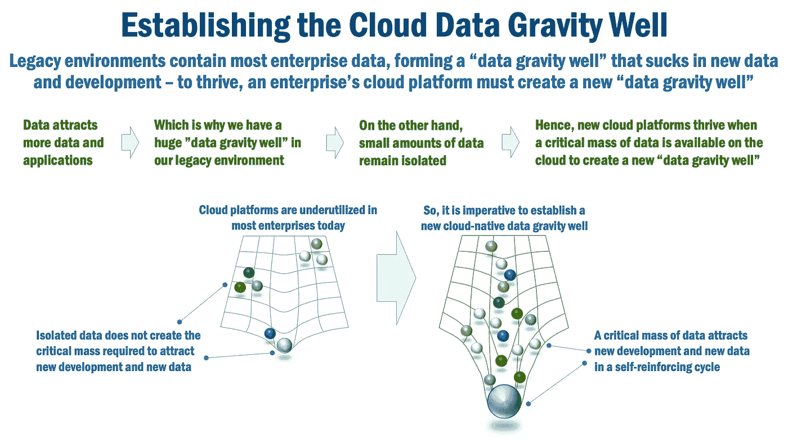
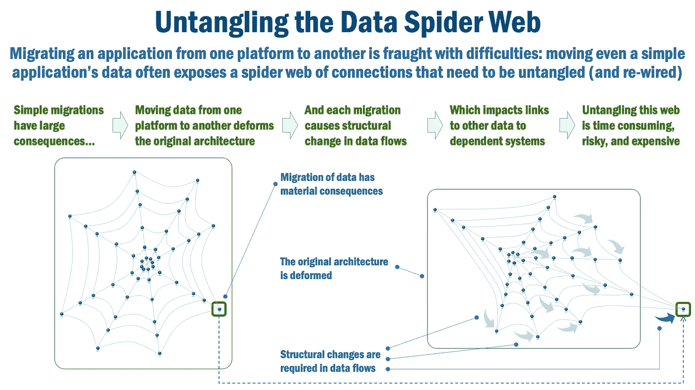
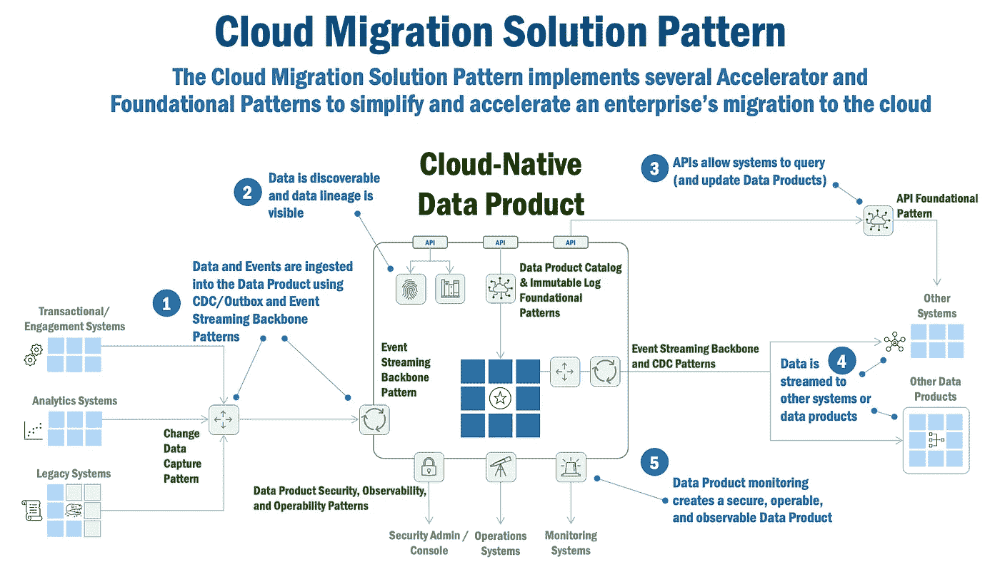

# 数据网格云迁移模式

> 原文：<https://towardsdatascience.com/data-mesh-cloud-migration-pattern-fcff598695e4>

## 企业中的云迁移速度太慢、成本太高且过于复杂。数据网格云迁移模式展示了如何加速云迁移。

格伦·卡斯滕斯-彼得斯在 [Unsplash](https://unsplash.com/s/photos/typewriter-laptop?utm_source=unsplash&utm_medium=referral&utm_content=creditCopyText) 上拍摄的照片

# 数据网格云迁移模式

云技术无处不在。它隐藏在每一个手机 app 的背后，它触及并存储着我们的每一封邮件、每一条信息、每一次社交。而且，云的价值主张似乎很明确:[根据麦肯锡的](https://www.mckinsey.com/business-functions/mckinsey-digital/our-insights/clouds-trillion-dollar-prize-is-up-for-grabs)报告，在所有行业中，云的采用可以释放 1 万亿美元的商业价值

然而，云在企业中的采用(尤其是核心应用和数据的迁移)非常缓慢，而且充满挑战。知名风险基金 A16Z[认为](https://a16z.com/2021/05/27/cost-of-cloud-paradox-market-cap-cloud-lifecycle-scale-growth-repatriation-optimization/)这是因为“考虑到这种努力的巨大规模，大多数公司发现很难证明将工作负载从云上转移出去是合理的，并且必要的重写看起来是如此不切实际以至于不可能。”因此，几乎每个行业的大多数系统仍然主要运行在内部数据中心就不足为奇了。

但是现在有了新的技术和模式，甚至更好的方法，可以将数据跨企业移动到云中。这就是数据网格出现的原因。

本文描述了**数据网格云迁移模式**，以及它如何解决基础数据挑战，从而帮助企业加速云迁移。

请注意，理解构建数据网格不仅仅是采用技术模式，这一点很重要。这还要求你对数据文化、组织行为和数据运营模式的看法发生巨大转变。 [Thinh Ha](https://www.linkedin.com/in/%E2%98%81%EF%B8%8F-thinh-ha-58945969/) (本文的合著者)曾在一篇名为[你还没准备好采用数据网格的 10 个理由](https://medium.com/google-cloud/10-reasons-why-you-should-not-adopt-data-mesh-7a0b045ea40f)的优秀文章中讨论过你在采用数据网格时可能遇到的文化和组织挑战。Thinh 是谷歌英国专业服务部门的战略云工程师，他曾与许多客户合作建立云原生数据网格环境。

最后一点:我们假设您对数据网格有很高的理解。如果你需要一些关于数据网格的背景信息，这里有一些很棒的文章可供参考[这里](/data-mesh-architecture-patterns-98cc1014f251)(模式)，这里(架构)，这里(原则)。对于感兴趣的读者，这里的[和这里的](/data-mesh-solution-and-accelerator-patterns-acffbf6e350)和[提供了数据网格模式的完整描述。](/data-mesh-architecture-patterns-98cc1014f251)

# 模式摘要

**数据网格云迁移解决方案模式**将数据从任何类型的系统(交易或分析)近乎实时地移动到企业数据网格内的云原生数据产品，同时使数据可被发现并易于使用。

# 背景和业务问题

麦肯锡[说](https://www.mckinsey.com/industries/technology-media-and-telecommunications/our-insights/cloud-migration-opportunity-business-value-grows-but-missteps-abound)“75%的云预算超出预算”和“38%的云项目落后于计划。”他们接着说，一些组织“正在泄露他们的价值份额，而不是获取它，在协调云迁移方面的低效增加了意想不到的成本和延迟。预计未来三年将有大约 1000 亿美元的浪费性迁移支出，大多数企业认为迁移成本是采用云的主要障碍。”

埃森哲最近的[分析](https://www.accenture.com/ca-en/insights/technology/maximize-cloud-value)与此相呼应，该分析显示“三分之二的企业尚未完全实现其预期结果，尽管新冠肺炎疫情已经将云的采用变成了一项指令。”

高德纳[估计](https://www.gartner.com/en/newsroom/press-releases/2020-11-17-gartner-forecasts-worldwide-public-cloud-end-user-spending-to-grow-18-percent-in-2021)云计算将占 2020 年 IT 支出的 9.1%。尽管有积极的增长预期，但云支出仅占 IT 支出的 14.2%。因此，尽管云计算有了巨大的增长，但它仍然只是 it 总支出的一小部分。

我想真正的问题是**为什么云的采用如此缓慢和昂贵？**我认为，许多企业继续青睐内部解决方案而非云有一个简单、令人信服且实际的原因:**因为数据就在那里。**

简单来说，数据产生数据。如今，企业数据中心中的海量数据形成了一个“**数据引力井**”，将所有应用程序、环境和服务纳入其轨道。事实是，在我们能够将重心从数据中心转移到云之前，采用将会保持缓慢。

*图 1，建立重力井云数据*

不幸的是，推论也是正确的:少量的数据没有“引力井”，因此很少吸引新的发展。

但是企业数据中心长寿还有第二个原因。经过多年的发展和增长，我们的企业数据环境变得错综复杂，相互依赖。大多数架构师可以指出他们的企业应用架构看起来更像英特尔的集成电路图。

但是应用程序之间的连接像蜘蛛网一样紧密地结合在一起。当我们移动一个应用程序时，我们拉动它的一条数据“蜘蛛网”,整个架构就会移动和变形。因此，在这个互联的数据网络中，即使很小的迁移也会产生巨大的影响，导致很长的时间表和相应的巨大成本。

*图 2，解开数据蜘蛛网*

# 解决办法

因此，云计算面临的挑战很简单。首先，在云上建立强大的数据引力井的最快、最有效、最高效的方法是什么？第二，我们如何在不彻底解开企业应用程序和数据蜘蛛网的情况下做到这一点？

这就是数据网格和“云迁移”解决方案模式的用武之地。 **Data Mesh 云迁移解决方案模式**将数据从任何类型的系统(事务性或分析性)中以近乎实时且不引人注目的方式移动到企业内安全的云原生数据产品中。

这种模式创建了原始数据的“实时副本”,并且不需要应用程序迁移。这提供了几个切实可行的好处:

*   它并不引人注目，因此不需要任何应用程序更改，从而减轻了“理清”现有应用程序和数据蜘蛛网的需要。
*   由于不需要更改应用程序，因此可以非常快速地部署这种模式。
*   通过更简单的数据迁移，这建立了加速云迁移所需的云“数据引力井”。
*   作为一个“实时副本”，数据在云上近乎实时可用，为 AI/ML 和高级分析等更新的云原生任务提供及时、一致和准确的数据。
*   有了云上的可用数据，新的应用程序可以更快地开发出来，上市时间也可以大大缩短。

几个数据网格加速器模式用于提供此功能:

*   **Live Replica 模式**，以近乎实时的方式制作一个“副本”(相同的数据，如果需要，相同的结构)(关于该模式的详细文章将很快发表)。
*   **数据产品安全模式**，确保数据产品管理的数据安全无虞(该模式的详细文章即将发布)。
*   [**数据产品可观察性模式**](/data-mesh-operability-pattern-8e52a1955e54) ，使数据移动可追溯、可见。
*   [**数据产品可操作性模式**](/data-mesh-observability-pattern-467438627572) ，确保数据产品中的异常和错误被记录并广播到适当的企业监控系统。

几种数据网格基本模式用于提供此功能:

*   [**变更数据捕获模式**](/data-mesh-pattern-deep-dive-change-data-capture-eb3090178c34) ，用数据产品捕获数据中的变更，使其可以传播给感兴趣的消费者，同时也提供理解数据谱系所需的原始数据。这种模式不引人注目地捕获数据库更改，并通过事件流主干将它们发布到云原生数据库中的目的地。“发件箱模式”是 CDC 不可用的替代模式。
*   [**API 模式**](/data-mesh-architecture-and-the-role-of-apis-json-schemas-3dc616650960) ，使数据易于访问。
*   [**数据产品目录模式**](/data-mesh-pattern-enterprise-data-product-catalog-ba4bf072d7c3) ，使数据可被发现。
*   [**不可变日志模式**](/data-mesh-patterns-immutable-change-audit-log-aec93da33648) ，提供对数据产品所管理的数据谱系的可见性。
*   [**事件流骨干模式**](/data-mesh-pattern-deep-dive-event-streaming-backbone-99a5bb2a7cbf) ，以近乎实时的方式向数据消费者传输数据。

# 它是如何工作的

图 3(如下)展示了数据网格云迁移模式是如何工作的。

*图 3，云迁移解决方案模式*

1.  **复制**:使用 **Live Replica Accelerator** 模式，将数据近乎实时地从交易、合约或分析系统复制到云原生数据产品。
2.  **发现** : **数据产品目录**和**不可变日志**基础模式提供了对数据产品所管理的数据以及数据产品中的数据谱系的可见性。
3.  **访问** : JSON 模式和 OpenAPI 规范(以及支持注册中心)使得 API 模式允许系统使用众所周知的方法查询和更新数据产品。
4.  **流式传输**:数据从云原生数据产品流式传输到其他系统或数据产品，允许系统“监听”数据产品内的变化，同时还提供复杂的近实时分析和处理数据的方法。
5.  **可观察性、安全性和可操作性**:使用数据产品可观察性、数据产品安全性和数据产品可操作性加速器模式监控云原生数据产品，确保云原生数据产品以安全、可靠的方式运行。

# 客户体验:金融服务机构采用云

我与 [Thinh Ha](https://www.linkedin.com/in/%E2%98%81%EF%B8%8F-thinh-ha-58945969/) 讨论了他在利用数据网格推动云应用方面的经验。Thinh 是谷歌英国专业服务部门的战略云工程师，他曾与许多客户合作建立云原生数据网格环境。据哈说:

*Data Mesh 帮助我们建立了一个数据引力井，支持从数据中实现规模化价值，并将额外的使用案例和工作负载引入数据云平台。*

*我们选择与少量 data domain 团队一起构建数据网格，为组织证明单一的端到端业务流程。* *我们着手构建云优先的数据平台，使 Data Domain 团队能够独立构建数据产品来证明业务案例，同时提供集中式安全和治理防护，以确保在我们采用联合运营模式时满足* *关键控制。*

*谷歌云拥有一套丰富的技术来帮助你构建数据网格。作为数据平台团队的一部分，我们* *创建了可自我服务且默认合规的代码模板，以部署完全托管和自动扩展的 Google 云产品，如用于 RDBMS 的 Cloud Spanner、用于流处理的 Cloud Dataflow 和用于数据仓库的 BigQuery。代码模板充当加速器，帮助 Data Domain 团队快速入门并简化操作。由于多云是客户的一项重要需求，我们还利用了诸如用于事件流的融合 Kafka 和用于数据编目的 Collibra 等服务。*

*随着我们开始验证数据网格，现有的 Data Domain 团队开始意识到，通过拥有自己的数据产品，他们可以从针对敏捷性的本地优化中获得显著优势。因此，Data Domain 团队开始独立构建新的业务案例，将额外的工作负载转移到平台上。*

****

从那时起，我们不仅有了更好、更快、更便宜的见解。我们还建立了将更复杂的应用程序快速迁移到云的基础！

在我们的讨论中，Ha 发现 Data Mesh 允许他的客户在云上创建临界质量的新数据，这在云上建立了**新数据引力井**。Ha 的客户一开始规模很小，并且选择了一个重要但不平凡的领域作为起点。Ha 表示，他的客户现在获得了数据网格的更多好处:

*   数据更加自助。
*   数据产品将责任、决策和资金与明确的所有者联系起来。
*   因为我们可以看到我们拥有的数据(目录等)，我们现在可以建立一个轻量级的治理过程。

# 总结想法

如今，企业面临着一个根本性的挑战:尽管云有着显而易见的优势(灵活性、速度、成本)，但向云的迁移却很缓慢。为什么？因为我们的数据遗产(仍驻留在企业数据中心的大量数据)有自己的“数据引力井”。当试图移动应用程序时，我们发现我们的“数据蜘蛛网”太难解开，而且成本太高。

本文展示了 Data Mesh 云迁移解决方案模式如何通过以安全、可靠和接近实时的方式简化创建云原生数据引力井来应对这一挑战。它还展示了如何在不影响您当前应用程序和数据环境的情况下做到这一点。

希望本文能为您提供必要的见解，帮助您启动自己的企业数据网格，并加速您的企业采用云技术！

***

*除非另有说明，本文中的所有图片均由 Eric Broda(本文的合著者)创作。图像中使用的所有图标都是普通的 PowerPoint 图标，不受版权保护。*

*Eric Broda 在本文中表达的观点仅代表其个人，并不代表其客户的观点。*

*Thinh Ha(本文合著者)在本文中表达的观点仅代表其个人，并不代表其客户或谷歌的观点。*