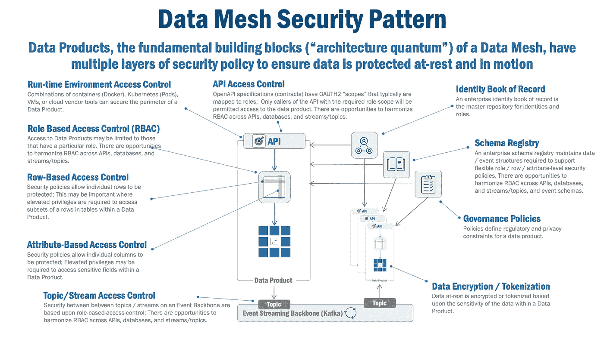
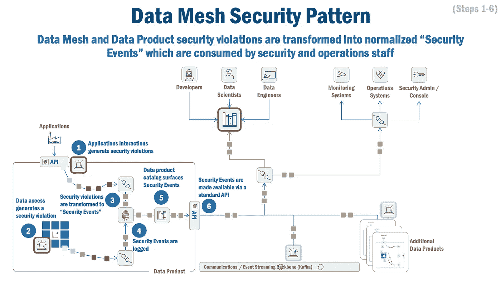
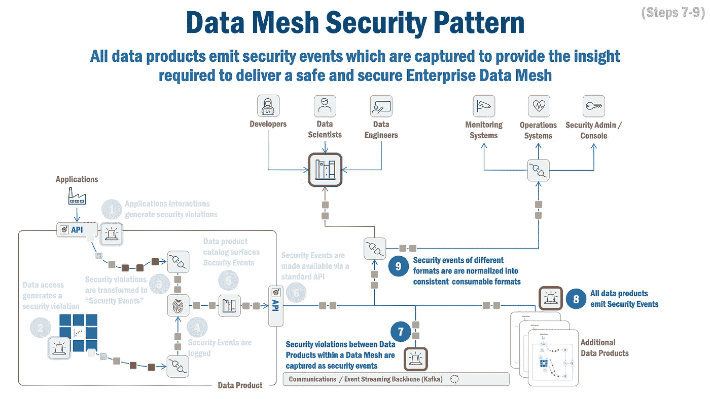
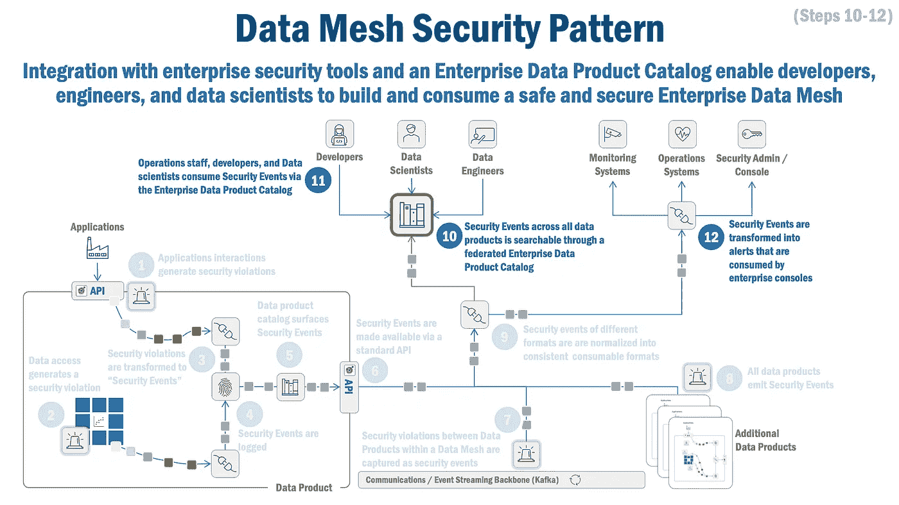

# 数据网格/数据产品安全模式

> 原文：<https://towardsdatascience.com/data-mesh-data-product-security-pattern-c5b93a27e82e>

## 数据网格/数据产品安全模式如何确保企业数据网格及其数据产品的安全

安娜·扎哈罗娃在 [Unsplash](https://unsplash.com/s/photos/paper-key?utm_source=unsplash&utm_medium=referral&utm_content=creditCopyText) 上的照片

# 数据网格/数据产品安全模式

数据是现代企业的基础构件。但是我们经常看到[头条](https://www.csoonline.com/article/3653372/8-it-security-disasters-lessons-from-cautionary-examples.html)强调安全措施漏洞导致的[灾难性](https://apnews.com/article/technology-business-lawsuits-ap-top-news-ga-state-wire-da3f0dde0ad24303ae1b3c98fae3697a)后果。这些安全漏洞有很多种，从漏洞百出的[周界](https://www.nytimes.com/2019/07/29/business/capital-one-data-breach-hacked.html)到误入歧途的[员工](https://www.cbc.ca/news/business/desjardins-breach-privacy-report-1.5840171)以及介于两者之间的一切。

数据安全是解决这些缺口的[实践](https://www.ibm.com/topics/data-security),以保护数字信息在其整个生命周期中不被未经授权的访问、破坏或窃取。数据网格提供了保护数据的独特机会。

本文将探讨**数据网格/数据产品安全模式**:

*   保护数据产品的边界，数据网格的架构[量子](https://martinfowler.com/articles/data-mesh-principles.html#LogicalArchitecturedataProductTheArchitecturalQuantum)。
*   为数据产品中的数据提供精细的安全性。
*   确保企业数据网格中数据产品之间的通信安全可靠并受到监控。
*   为企业数据网格中的每个数据产品构建一个安全的运行时环境。
*   将安全违规转化为格式一致、定义明确的“安全事件”。
*   通过将安全事件发布到企业运营和安全管理工具，集成到企业安全机制中。

本文假设您对数据网格有很高的理解。如果您需要一些关于数据网格的背景信息，这里有许多很棒的文章可供参考:这里的(模式)、这里的(架构)、这里的(原则)和这里的(经验教训)。对于感兴趣的读者，全套数据网格模式可从[这里](/data-mesh-solution-and-accelerator-patterns-acffbf6e350)和[这里](/data-mesh-architecture-patterns-98cc1014f251)获得。

# 模式摘要

数据网格提供了保护数据的独特机会。首先，它提供了数据产品，这些产品提供了可以应用安全性的明确定义的数据边界。第二，这些数据产品有所有者，确保域内数据安全有明确的责任和义务。第三，Data Mesh 提供了一个自助式访问模型，该模型提供了明确的合同，描述了谁能够或试图使用数据，如何使用数据。最后，它提供了一种便于监控数据安全性的联合治理方法。

**数据网格/数据产品安全模式**展示了一种为企业数据网格及其管理的数据产品应用安全性的一致方法。

# 背景和业务问题

企业数据的安全性建立在数据产品和数据网格组件中实现的安全策略的基础之上。如今，这些政策因以下原因而有所不同:

*   产品(例如，Oracle 与 SQL Server)
*   运行时环境(例如，AWS 与 Google)
*   位置(例如，数据中心与云)

因此，数据和安全专业人员缺乏关于其数据网格运营、安全和治理特征的关键信息也就不足为奇了，这些信息包括:

*   **不明确的访问权限**，使得难以理解消费数据所需的凭证、角色和/或权限。
*   **不一致的安全策略**，使得遵守数据的监管和隐私要求成本高昂。
*   **缺乏使用信息**，使得管理敏感数据的访问权限变得困难。
*   **出现安全违规的延迟**，导致解决安全问题的延迟。
*   **安全环境中的差距**，使得诊断安全违规变得困难且耗时。

**数据网格/数据产品安全模式**解决了这些问题。

# 解决办法

认识到数据产品是数据网的架构“[量子](https://martinfowler.com/articles/data-mesh-principles.html#LogicalArchitecturedataProductTheArchitecturalQuantum)”(即。数据网格是多个数据产品的混合体)，**数据网格/数据产品安全模式**定义了数据产品的访问安全控制点:

*   在数据产品的外围，
*   在数据产品中，
*   数据产品之间。

*图 1，数据网格安全模式、安全策略和访问控制*

在数据产品的外围，此模式识别以下安全策略:

*   **运行时环境安全性**:虽然这些策略在很大程度上依赖于数据产品的运行时环境，但许多供应商中有几家提供跨内部和云环境的容器(Docker)、容器(Kubernetes)、虚拟机的安全性。
*   **API 访问控制** : OpenAPI 规范，最流行的 API 契约定义，允许定义安全模式和“作用域”(与 OAUTH2 一起使用)，规定访问数据产品的凭证。

在数据产品中，这种模式识别几种安全策略:

*   **基于角色的访问控制**:对数据产品的访问可能仅限于那些具有特定角色或组的人。
*   **基于行的访问控制**:安全策略允许单个行受到保护；当需要提升特权来访问数据产品中给定表的子集时，这可能很重要。
*   **基于属性的访问控制**:安全策略允许保护各个列；访问数据产品中的敏感字段可能需要提升权限。
*   **数据加密和令牌化**:静态数据根据数据产品中数据的敏感性进行加密或令牌化。

在数据产品之间，此模式识别以下安全策略:

*   **一般网络安全控制**:这些是企业为管理网络访问和连接组件而建立的策略。
*   **基于主题/流的安全控制**:事件主干上的主题/流之间的安全性在功能上与 API 安全性相同(即所需的“范围”和角色)。

这种模式有几个支持功能:

*   **企业身份记录簿**:身份的主存储库，维护与分配的组和角色的关系(活动目录、云目录、大型机目录等)。).
*   **模式/规范注册中心**:维护支持 API 和事件的灵活安全策略所需的“范围”和数据/事件结构
*   **治理控制**:策略定义了数据产品的监管和隐私约束

**数据网格/数据产品安全模式还**捕获这些控制点的安全违规，并对所有安全违规**安全事件**进行建模。由于每个数据产品可能使用不同的技术来实现，因此这种模式将原始安全违规规范化为一致格式的安全事件。

这种模式还提供了支持各种消费者需求的能力:

*   **开发人员**使用这种模式来帮助设计应用程序，使用安全消费数据产品的方法。
*   **数据工程师**使用这种模式来构建和实现安全的数据产品和数据网格组件以及操作环境。
*   **数据科学家**使用这种模式来理解访问和消费数据产品所需的安全凭证。
*   **安全人员**使用该模式来捕获和诊断安全违规，以确保企业数据网格以安全可靠的方式运行。
*   **数据治理人员**使用此模式来了解使用模式，并确保遵守法规和隐私约束。

# 它是如何工作的

**数据网格/数据产品安全模式**提供访问控制，以确保数据产品仅由授权实体或人员访问。它还检测企业数据网格中的数据产品，以捕获和发出安全违规，这些安全违规被转换为“安全事件”,提供操作和安全人员可使用的简明和详细的安全信息。

该模式分为三个部分，每个部分概述了典型使用场景中的关键步骤，描述了数据产品内的安全流(图 2)、数据网格中数据产品之间的安全流(图 3)以及不同类型的用户如何在数据网格安全模式中交互(图 4)。

*图 2，数据网格安全模式，步骤 1–6*

数据产品中的安全流如图 2 所示。在步骤 1 和 2 中，用户或应用程序产生了安全违规(例如，试图访问用户没有足够权限访问的数据)。在步骤 3 中，原始安全事件被捕获并转换成“安全事件”。这些安全事件然后被过滤和记录(步骤 4)并存储在不可变的变更/审计日志中，用于进一步的分析或历史回顾。每个安全事件随后在一个简单的用户界面(“数据产品目录”)中可用(步骤 5)，这使得查看安全问题变得容易。最后，安全事件也通过 API 或事件传播(步骤 6 ),以允许它们在企业生产监控和安全解决方案中被吸收。

*图 3，数据网格安全模式，步骤 7–9*

在上面的图 3 中，我们可以看到数据产品之间的安全违规——例如，当数据产品没有足够的权限添加到主题时——被捕获并转换(步骤 7)为安全事件。如前所述，所有数据产品都会发出安全事件(步骤 8)，这些事件发生在整个企业数据网格中的数据产品之间。然后，每个安全事件被格式化，以供企业运营和安全系统摄取(步骤 9)。

*图 4，数据网格安全模式，步骤 10–12*

在上面图 4 中，安全事件存储在企业数据产品目录中(步骤 10)。这允许各种用户(开发人员、数据科学家和数据工程师)查看安全问题(步骤 11)，同时还允许将安全事件发送到标准企业控制台(监控、运营管理和安全应用程序)。

在本文的前面，我们提出了适当的安全功能必须解决的几个挑战。让我们重温一下它们，看看数据网格/数据产品安全模式如何解决它们:

*   **不明确的访问权限**:数据网格和数据产品安全在数据产品目录中呈现出基于角色的访问控制(RBAC)和基于属性的访问控制(如果需要的话)，使得使用数据所需的凭证、角色和/或权限易于理解。
*   **不一致的安全策略**:数据网格和数据产品安全引入了一致的基于角色的访问控制(RBAC)和基于属性的访问控制(如果需要的话)，使得使用数据所需的凭证、角色和/或权限易于理解。
*   **缺乏使用信息**:数据网格和数据产品安全将数据产品目录中的使用数据以及安全访问违规暴露出来，使得管理敏感数据的访问权限变得非常容易。
*   **出现安全违规的延迟**:数据网格和数据产品安全捕获安全违规，并将其立即发送到安全或操作控制台，以便及时诊断和解决安全问题。
*   **安全环境中的差距**:数据网格和数据产品安全提供了丰富的环境(谁、什么、何时等等。)关于安全违规，使诊断和解决安全违规变得简单而及时。

# 总结想法

最近的[头条](https://www.nytimes.com/2019/07/29/business/capital-one-data-breach-hacked.html)已经清楚地表明，不安全的数据环境将对组织产生灾难性的影响。通过捕获安全违规并立即暴露安全违规及其背景，全面的数据网格和数据产品安全方法允许快速识别、诊断和解决安全问题。通过使用这些信息，它可以提供必要的洞察力来保护您自己的企业数据网格，并提供数据密集型组织所需的安全性。

***

*除非另有说明，本文中的所有图片均由 Eric Broda(本文作者)创作。图像中使用的所有图标都是普通的 PowerPoint 图标，不受版权保护。*

*本文表达的观点仅代表我个人，不一定代表我的客户的观点。*