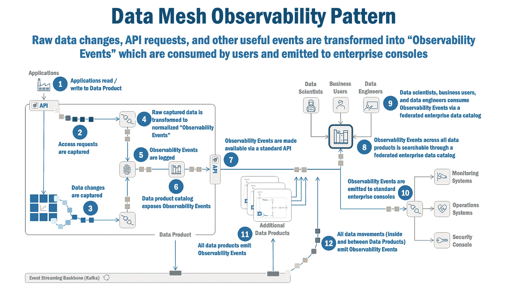
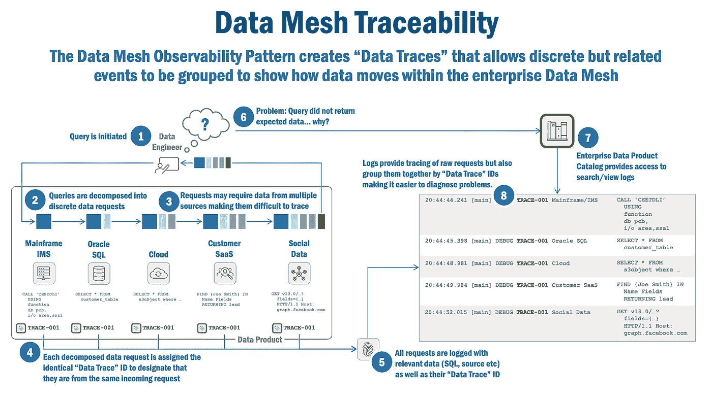

# 数据网格可观测性模式

> 原文：<https://towardsdatascience.com/data-mesh-observability-pattern-467438627572>

数据网格可观察性模式有助于我们理解数据网格的状态、数据的移动及其使用模式。下面是这种模式的工作原理，以及为什么它对企业数据网格的成功至关重要。

[粘土银行](https://unsplash.com/@claybanks?utm_source=unsplash&utm_medium=referral&utm_content=creditCopyText)在 [Unsplash](https://unsplash.com/s/photos/magnifying-glass?utm_source=unsplash&utm_medium=referral&utm_content=creditCopyText) 拍摄的照片

# 数据网格可观测性模式

数据网格承诺从根本上提高数据科学家的生产力。但是，除非我们对数据网格的状态、数据如何在其中移动、谁在使用它以及他们如何使用它有更好、更细粒度和更实时的了解，否则它可能不会辜负这些崇高的期望。

**数据网格可观察性模式**解决了这一挑战。首先，该模式捕获"**可观察性事件** " —数据变更、数据移动、访问请求和数据产品内以及企业数据网格中数据产品之间的其他有用事件。

其次，它为数据科学家、业务用户、开发人员和治理专业人员提供指标和使用洞察，以提高生产力和优化数据网格操作。

第三，它向感兴趣的观察者(如企业控制台)发出可观察性事件，以提高数据网格的弹性、稳定性和效率。

第四，当数据在数据产品内和整个企业数据网格中移动时，它将可观察性事件关联到“**数据跟踪**”。这些数据跟踪提供了一种对离散和异步事件进行分组的独特方式，以提供数据演变和迁移的完整和统一的画面。

在本文中，我将探索这种模式是如何工作的，并具体讨论如何捕获原始数据，如何将其转换为有用的“可观察性事件”，以及数据专业人员如何使用这些可观察性事件。

对于感兴趣的读者，在介绍性文章[这里](/data-mesh-solution-and-accelerator-patterns-acffbf6e350)和[这里](/data-mesh-architecture-patterns-98cc1014f251)中可以找到全套解决方案、加速器和基本模式。

本文假设您对数据网格有很高的理解。如果您需要一些关于数据网格的背景信息，这里有许多很棒的文章可供参考:这里的(模式)、这里的(架构)、这里的(原则)和这里的(经验教训)。

# 模式摘要

**数据网格可观察性模式**捕获并显示数据网格状态、数据网格中数据的变化、数据网格中数据产品内部和之间的数据移动以及数据网格访问请求。它将这些数据建模为可观察性事件，这些事件被分组到“数据跟踪”中，并被聚合以支持各种消费者的需求。

**数据网格可观察性模式**被多种消费者使用:

*   **开发人员**使用可观察性事件和数据跟踪来调试和优化应用程序。
*   **数据科学家**使用数据跟踪来了解工程管道中的数据移动。
*   **治理专家**使用可观察性事件和数据跟踪来理解数据使用模式。
*   **运营人员**使用可观察性事件来确保企业数据网格以安全、高效和弹性的方式运行。

# 背景和业务问题

虽然技术已经实现了分析和人工智能/机器学习的巨大进步，但数据专业人员缺乏关于他们数据的基本信息:

*   我有什么数据，我的数据是什么样的？
*   我的数据发生了什么变化，什么时候发生的，谁更改了它？
*   当数据在企业数据网格中的数据产品内部以及数据产品之间移动时，是否可以对其进行跟踪？
*   关于数据关系，数据使用模式说明了什么？

从管理和治理的角度来看，还会出现其他问题:

*   谁在访问我的数据，我的数据产品是如何使用的？
*   是否有可用于优化我的数据网格操作的趋势和指标？

数据网格可观测性模式解决了这些挑战。

# 解决办法

**数据网格可观察性模式**捕获、过滤、聚集并提供跨几个维度的可观察性事件的可见性:

*   **数据产品变更事件**，描述了一个数据产品如何在其生命周期内演化，通过变更数据捕获模式来捕获。
*   **描述数据产品如何被消费的数据产品访问请求**被捕获并转换成可观察性事件。
*   **使用模式和趋势**从原始产品访问请求中汇总，以深入了解数据产品的消费方式和消费对象
*   **数据产品格式、所有权和安全性**也通过这种模式浮出水面

通过这种模式可以获得几种形式的数据:

*   **原始数据和事件**，这可能有助于理解粒度使用模式和调试操作问题。
*   **Observability Events** ，它提供了所有事件的规范化视图，使它们易于搜索、排序、过滤和消费。
*   **数据跟踪**，它对相关的可观察性事件进行分组，以了解数据的移动和演变。
*   **汇总数据**，汇总和过滤事件，提供数据网格状态和操作的汇总和管理视图。

现在，让我们回到前面提出的挑战和问题，看看数据网格可观察性模式如何解决它们:

*   **我有哪些数据，我的数据是什么样的？**数据网格可观察性展现关于数据产品状态的元数据，包括诸如数据库名称、其中的表格、列的格式等细节；这些数据在数据产品目录中提供。
*   **我的数据发生了什么变化，什么时候发生的，谁更改了它？**数据网格可观察性模式捕获数据中的变化，它们发生的时间，以及谁改变了它。它通过数据产品目录以原始和汇总形式提供这些数据。
*   **在企业数据网格中，数据在数据产品内部和数据产品之间移动时是否可以被跟踪？**许多现代数据环境使用粒度微服务来访问数据，因此通过调用一系列微服务来处理单个请求是非常常见的；数据网格可观察性模式使用“相关性”和“可跟踪性”标识符，具有相同相关性的可跟踪性标识符表示离散的请求是相关的；可以对单个数据产品访问请求进行分组，以提供“数据跟踪”,确定数据如何在企业数据网格中移动。
*   关于数据关系，数据使用模式说明了什么？上述“数据痕迹”，尤其是在汇总时，可以提供一个关于数据产品如何使用以及数据产品中数据之间最常见关系的引人注目的视图。

现在，管理和治理问题怎么样:

*   谁在访问我的数据，我的数据产品是如何使用的？数据网格可观察性模式捕获并记录所有访问请求，包括“读”和“写”。这为数据产品提供了原始数据使用模式。
*   **是否有可用于优化我的数据网格操作的趋势和指标？**说明更广泛使用模式的聚合使用数据也可通过数据网格可观察性模式获得，并可通过数据产品目录访问。

# 它是如何工作的

在高层次上，数据网格可观察性模式的工作方式是捕获原始事件和状态信息，将其转换为“可观察性事件”以便于查看和使用，然后让用户可以访问它们。

图 1(如下)展示了数据网格可观察性模式是如何在粒度级别上工作的。

*图 1，数据网格可观测性模式*

数据网格可观察性模式中的关键活动描述如下:

1.  应用程序读写数据产品。
2.  数据产品 API 捕获关于谁、何时以及如何访问数据的信息。
3.  数据产品中的数据变化也可以使用嵌入在数据产品中的变化数据捕获功能来捕获，从而提供关于数据如何以及何时演变的关键见解。
4.  原始捕获的事件被规范化并转换成“可观察性事件”，这是用于提供数据网格可观察性的基本构建块。
5.  可观察性事件被过滤并记录在不可变的变更/审计日志中，提供对数据产品活动的历史访问。
6.  数据产品目录使用一个简单的用户界面公开可观察性事件，使数据消费者能够了解特定数据产品的数据生命周期和使用模式。
7.  API 还使用正式的 OpenAPI 规范公开可观察性事件，并定义安全的端点，以允许应用程序使用。
8.  使用企业数据产品目录可以访问和搜索所有数据产品的可观测性事件；该目录为企业数据网格中的所有数据产品提供了一个统一的可观察性信息视图。
9.  数据科学家、业务用户、开发人员和治理专业人员使用企业数据产品目录来搜索、查看和消费可观测性事件。
10.  可观察性事件被发送到标准企业控制台(监控、运营管理和安全应用程序)。
11.  所有数据产品都会发出可观察性事件，使它们在整个企业中普遍可搜索、可查看和可消费。
12.  企业数据网格中数据产品内部和之间的所有数据移动都会发出可观察性事件。

作为一个额外的好处，该模式还支持“数据网格可跟踪性”,可以“跟踪”数据请求以了解端到端的流程。其工作原理如下:

*图 2，数据网格可追溯性*

数据网格可追溯性的关键活动描述如下:

1.  发起一个查询。
2.  查询被分解成离散的数据请求。
3.  请求可能需要来自多个来源的数据，这使得它们难以跟踪和调试。
4.  每个分解的数据请求都分配有相同的“数据跟踪”ID，以表明它们来自同一个传入请求。
5.  所有请求都记录了相关数据(SQL、源等。)包括“数据跟踪”ID。
6.  查询工作不正常。为什么？数据工程师如何理解发生了什么？
7.  数据工程师使用企业数据产品目录来搜索和查看日志。
8.  日志提供了对原始请求的查看，而且还将日志条目按其“数据跟踪”ID 分组，从而更容易查看请求的所有组成部分并诊断问题。

有趣的是，通过适当选择“数据跟踪”id 并合并“之前/之后”图像的数据(作为捕获的日志数据)，扩展数据网格可观察性模式的可跟踪性特性以捕获数据血统信息并不困难。

# 总结想法

企业数据网是驱动实时数字企业的工厂。通过捕获数据产品内部以及数据产品之间的数据移动，该模式允许开发人员和生产人员理解高级使用模式以及跨企业数据网格的低级数据移动。

希望本文能为您提供必要的洞察力，以优化您自己的企业数据网格，并提供可见性来满足您的数据科学家、开发人员和操作人员的需求。

***

*除非另有说明，本文中的所有图片均由 Eric Broda(本文作者)创作。图像中使用的所有图标都是普通的 PowerPoint 图标，不受版权保护。*

*本文表达的观点仅代表我个人，并不代表我的客户的观点。*