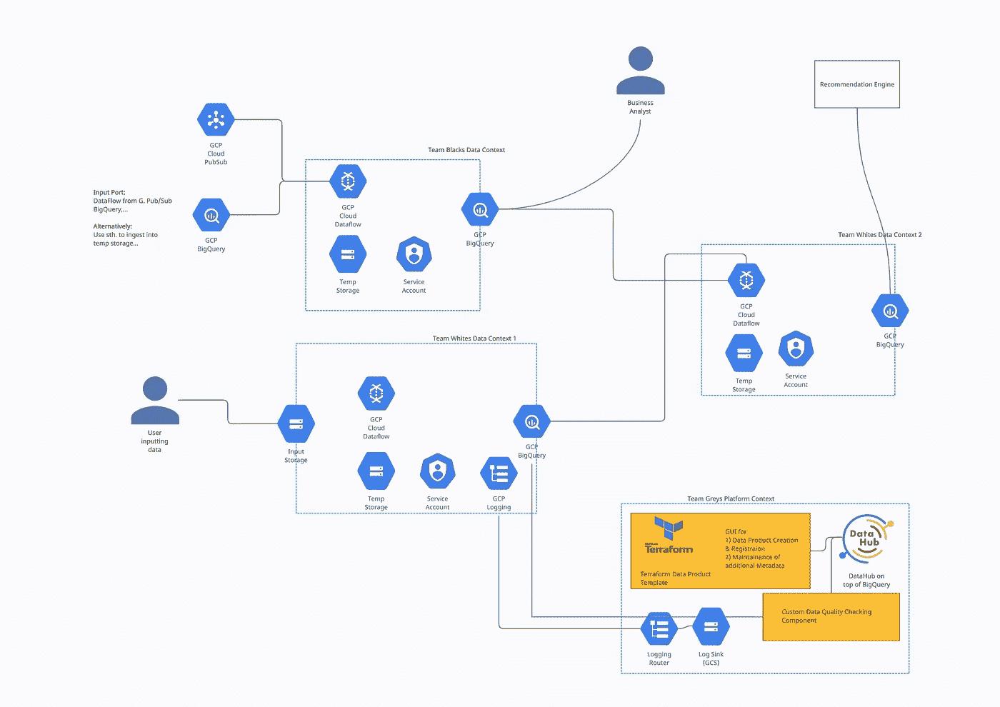
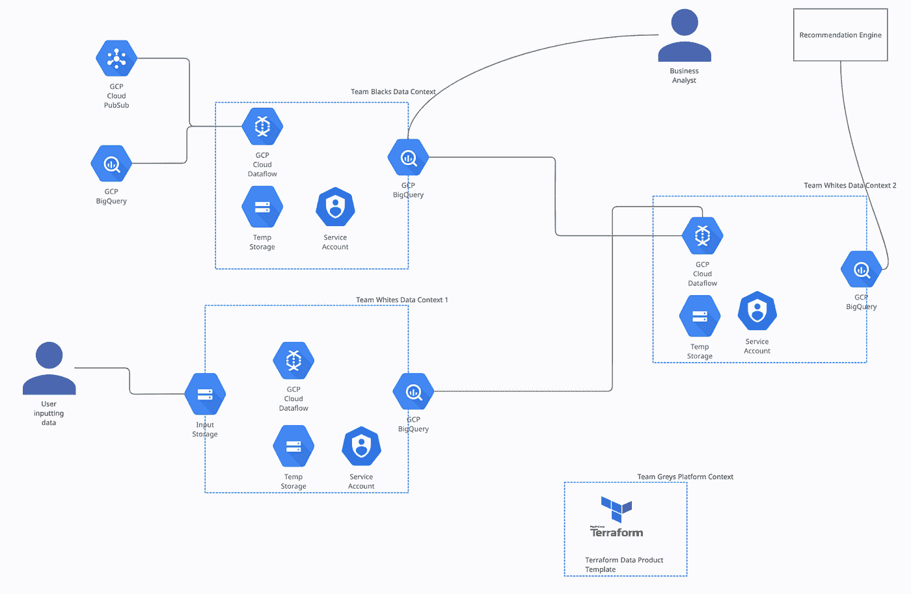
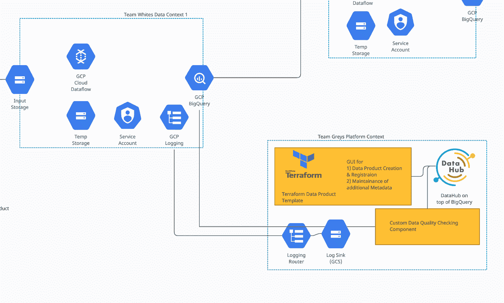

# 谷歌云上的数据网格——一个技术架构草图

> 原文：<https://towardsdatascience.com/data-mesh-on-the-google-cloud-a-technical-architecture-sketch-c28fb0a6a4d9>

## 如何使数据网格在谷歌云中技术上工作，以及如何将这些组件转移到其他云提供商

图片由作者提供。谷歌云数据网格架构。

数据网格不仅是技术的转变，也是组织、流程和人员的转变。我相信技术方面其实没那么重要。然而，由于我们还没有合适的工具，出于某种原因，为数据网格本身建立一个好的技术架构还是相当困难的。所以提供更多的工作示例似乎才是合理的！

这篇文章展示了 Google Cloud 上的数据网格架构，其灵感来自 ThoughtWorks 的 Samia Rahman 在 2020 年和 2021 年举办的“女性编码”的两部分研讨会，以及 DeliverHero 团队关于其数据网格灵感设置的演讲。

*这篇文章基本上是我与人合著的《MEAP 曼宁* [*【数据网格在行动】*](http://Data Mesh in Action MEAP) *一书中一章的部分内容的草稿。就当这是一次窥探吧。当然，我喜欢反馈，因为这将使这本书更好！*

好了，广告说够了，让我们开始吧！我们会…

1.  使用几个假想的参与者提供一个高层次的架构草图
2.  确定该平台的关键组件
3.  确定数据产品的关键组成部分(这通常很难掌握)
4.  浏览数据生产者和消费者的典型工作流程
5.  然后讨论该体系结构的变体/附件

## ***自助式数据平台架构***

我们的数据网格有几个参与者。

*   团队**黑色**是一个开发团队，也负责创建&维护数据产品。
*   团队 **White** 是一个数据科学团队，既创造又消费数据产品。
*   团队 **Grey** 拥有自助数据平台。在这种情况下，Grey 团队提供了一个可配置的 terraform 模板。
*   最后**消费者**:我们有一些商业分析师和一个推荐系统，它们都主要消费数据。

下图描述了第一个版本中的架构。我们将在下一节考虑一些补充。看看谷歌云平台产品的技术设置是如何工作的。

图片由作者提供。GCP 数据网技术组成部分的详细结构

让我们来识别一个数据网格通常具有的不同组成部分。我们分两步来做，首先是平台的组件，然后是详细的数据产品组件。然后我们将尝试理解不同角色的用户流，最后考虑这个平台的一些变化。

## **识别平台的组件**

平台的关键组件包括:

*   一个平台内核，它应该经常改变以获取额外的价值
*   一个平台接口，这个部分应该是尽可能固定的，以使平台工作。
*   和补充或参与者。

前两个是技术组件。

在我们的架构中，平台 team Grey 提供了一个可配置的 terraform 模板。他们选择将最新的模板放在 Git 存储库中。在这种情况下，git 存储库和它的 README 文件成为了**平台接口**。模板变成了**平台内核**。

有了这样一个最小的平台，就没有必要让一个完整的团队在这个平台上工作。平台内核可以通过提供新版本的 terraform 模板并让团队升级他们的堆栈来升级。这个平台目前的抽象程度非常低。

然而，由于数据产品的架构，模板已经为数据生产者和消费者提供了很多好处。

## **确定数据产品的组成部分**

这些数据产品都共享基于云数据流及其相关临时存储的公共工具。这使得团队能够轻松地创建数据产品。云数据流允许团队创建以 Java、Python 或 SQL 输出数据产品的管道。

在团队 Black 拥有的数据产品中，团队选择直接连接到数据源，无论是 PubSub 还是一些 BigQuery 数据集。在这种情况下，**数据输入端口**，即获取数据到数据产品的接口，成为云数据流管道。它的**上游数据源**是 PubSub 和 BigQuery 数据集。

数据流管道产生一个 BigQuery 数据集。这个平台使用数据集作为数据产品的容器。一个数据产品只有一个 BigQuery 数据集。BigQuery 数据集可以保存多个表和视图，但是可以在数据集级别轻松处理访问权限。一个数据产品中有多个表是完全正常的。该数据集成为第一个**数据输出端口**。

由于该平台使用共享服务 BigQuery，因此在每个数据产品中包含一个特定的 Google 服务帐户非常重要。这允许管理数据产品级别的权限

白队的第一个数据产品使用了一个 Google 云存储桶作为**输入端口**。这个存储桶允许用户以预定义的模式上传文件。上传时，数据流管道开始工作，将数据转换成 BigQuery 中的新数据产品。

您可以看到，数据端口是一个非常模糊的概念。我们这里有一个 GCS 桶形式的推送输入端口，一个数据流和上游数据集形式的拉取输入端口。最后，在白队的第二个数据产品中，我们将这两个数据产品结合起来，并再次将数据流与首先创建的两个上游数据产品一起作为输入端口。

对所有三种数据产品的访问都是通过服务帐户来管理的。每个都是单独配置的，以允许例如业务分析师访问某些重要的数据产品，或者让推荐系统完成其工作。

## **工作流程**

希望创造新的数据产品的数据生产者将前往平台接口 GitHub repository。他们阅读自述文件，引入最新的 terraform 模板，并应用它为他们的新数据产品创建新的堆栈。为此，他们例如配置他们是否想要使用输入存储。

然后，他们配置他们的数据流管道，连接到可能的上游数据源，并配置他们的服务帐户，以允许访问必要的消费者集合。

另一方面，数据消费者使用 BigQuery SQL 接口来浏览数据产品。如果他需要访问一个新的数据产品，他会向拥有它的团队提出请求。

如前所述，这仍然是一个非常小的平台。

## **这种建筑的变体**

一个简单的变化是将一组数据产品及其所有者包含到平台存储库中。这样，数据消费者将直接知道向谁请求访问。

另一组变化描绘在下面的图片。此图仅显示了可能的附加组件的平台环境，这些附加组件可以不按特定顺序使用。

图片由作者提供。附加平台组件的详细架构

首先，可以使用名为 **DataHub** 的工具，并将其直接连接到 BigQuery，作为分布式数据产品集的中央数据目录。该组件可以独立工作，无需添加任何附加组件。这将有助于消费者快速发现数据产品。

其次，通过访问 BigQuery 日志，可以通过“流行数据集”或“最频繁的数据用户”**统计数据**来丰富平台。这可以通过使用 GCP 日志记录和配置日志路由器以及 GCS 桶形式的日志接收器来实现。从 GCS bucket 中，一个定制组件可以计算这些统计数据，并将它们推送到数据中心。

第三，可以访问所有数据产品的另一个定制组件可以对组件运行**定制数据质量检查**，计算 nan 或运行由数据产品所属团队注册的定制检查。例如，一个对“客户”数据产品可靠的团队可以确保产品中的客户号总是以正确的格式出现。这个测试和结果也将暴露在 DataHub 中。

第四也是最后一点，裸露的 terraform 模板可以被包装成一个细长的**图形用户界面**。通过这样做，这个 GUI 可以用来通过需要手动设置的重要字段来丰富从 BigQuery 中提取的元数据。

## ***关系到数据网格思想***

尽管本文只是关于平台&技术实现，但是技术确实会影响数据网格的其他原则。

**平台思维**的原则是让所有平台参与者的生活更轻松，同时不限制他们的自由。这种架构在减轻其他团队的负担时也能帮助他们。例如，如果一家公司内的所有开发团队都在 GCP，并且都是像 PubSub & BigQuery 这样的共享服务的大量用户，就会出现这种情况。在这种情况下，模板将帮助团队通过数据流快速访问这些来源，并将它们转化为数据产品的数据集。

在上面概述的变体中，数据生成团队可能会将新的数据质量测试签入到中央存储库中，然后让中央质量组件运行它们。这可能会变成一个瓶颈，因为它可能会导致需要批准的 PR 请求和失败。如果出现这种情况，质量检查应该成为数据产品本身的一部分。然后，只有检查的结果会被暴露到 GCS 位置，并由中央组件获取，以推入数据中心。

**联合计算治理**仅在该架构中简要讨论，但有了中央数据中心，特别是用于注册数据产品的 GUI，以及对数据集本身运行检查的中央组件，就有很多空间将可自动执行的策略注入该平台。

**在这个架构中，数据作为产品**在很大程度上依赖于每个团队都有非常简单的方法来操作他们的数据。我们相信在这个例子中数据流服务于这个目的。

**具有讽刺意味的是，该体系结构中的 Data Domain 所有权**取决于服务帐户和访问控制，因为该体系结构使用大型共享服务。拥有访问的技术边界是至关重要的，否则，所有权不会真正落入数据生成团队的手中。

## **GCP 设置概要**

这个平台架构利用了共享云服务，这些服务大多来自 GCP 环境。它使用了一些非 GCP 特有的组件，Git 和 Terraform，以及变体定制代码和数据中心。

它为数据生产者提供了一套转换数据的工具，但只有一个标准化的数据端口。然而，数据端口可以很容易地扩展到使用 Google Cloud PubSub 和 Google Cloud Storage，为您提供大量的目标格式，满足大多数消费者的需求。

该设置也可以通过微小的差异移植到其他大型云提供商 AWS 和 Azure。因为它们看起来非常相似，所以我们选择不在这里将它们显示为 1-1 映射。

*如果你喜欢这篇文章，继续评论吧！*

*对如何建立伟大的数据公司、伟大的数据密集型产品、成为伟大的数据团队感兴趣，还是对如何利用开源构建伟大的东西感兴趣？然后考虑加入我的* [*免费简讯《三个数据点周四》*](http://thdpth.com/) *。它已经成为数据初创企业、风投和数据领导者值得信赖的资源。*