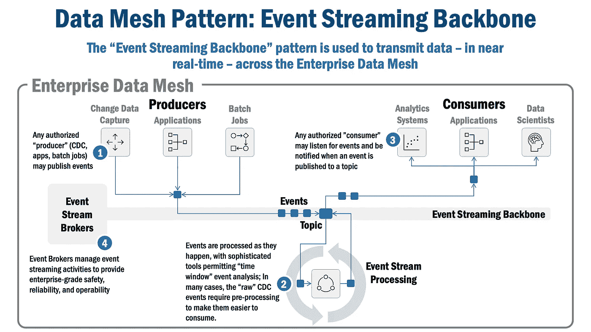

# 数据网格模式:事件流主干

> 原文：<https://towardsdatascience.com/data-mesh-pattern-deep-dive-event-streaming-backbone-99a5bb2a7cbf>

事件流主干是一种基本的企业数据网格模式。让我们探索一下它在企业数据网格中是如何工作的。

照片由[在](https://unsplash.com/@retrosupply?utm_source=unsplash&utm_medium=referral&utm_content=creditCopyText) [Unsplash](https://unsplash.com/s/photos/writing?utm_source=unsplash&utm_medium=referral&utm_content=creditCopyText) 上反推

# 事件流骨干网:一种基本的数据网格模式

本文讨论事件流主干，这是关于基础数据网格模式的系列文章的第二篇。将讨论几个主题:

*   模式总结，
*   模式问题域和上下文，
*   企业数据网格中的模式执行，
*   实现事件流主干模式以支持企业数据网格的候选供应商。

本文假设您对数据网格有很高的理解。但是不要担心，如果你需要复习，看看下面的资源:

*   数据网格原则(更多信息可在[这里](https://martinfowler.com/articles/data-mesh-principles.html)获得)
*   数据网格架构(更多信息请点击[这里](/an-architecture-for-the-data-mesh-32ff4a15f16f)
*   数据网格模式(更多信息见[此处](/data-mesh-architecture-patterns-98cc1014f251))

本文末尾提供了完整系列文章的列表。

# 模式摘要

“ **Event Streaming Backbone** ”模式用于以接近实时的方式在数据产品内、企业数据网格中的数据产品之间以及更大范围的组织内移动数据(建模为事件)。

# 背景和业务问题

如今，大多数企业仍在使用通宵批处理流程，运行数百甚至数千个“提取-转换-加载”(ETL)作业，处理数据并将其转移到整个企业的不同数据集。这会导致不必要的复杂性、陈旧和不一致的数据，并最终导致客户投诉。

# 解决办法

事件流主干模式负责安全、一致、可靠地管理和分发“**事件**”,并且接近实时。在企业数据网格中，每个事件代表一个应用程序状态变化、一个 API 消息或企业数据网格中数据变化的通知。事件通常在 [Apache Avro](https://avro.apache.org/docs/current/spec.html) 或 [JSON 模式](https://json-schema.org/)中定义。

事件流主干使用主题来存储事件。事件被发布或写入到类似队列的主题中。应用程序可以充当生产者(写入主题)、消费者(读取主题)，或者两者兼而有之。

事件流主干模式还提供了复杂的处理能力:

*   **事件源/持续**:主题上的事件作为事件序列存储在只附加日志中；这允许应用程序状态是可恢复的，同时还允许在企业数据网格中重放事件的时间窗口(这在生产问题诊断期间非常有用)。
*   **数据谱系**:事件源机制创建“事件历史”——实际上是数据谱系——为问题诊断以及企业数据网格中的数据治理提供有用的信息。
*   **事件流处理**:事件流主干允许在每个事件、时间窗口或聚合的基础上对事件进行分割；由于事件是由流式引擎中的内核功能处理的，因此在企业数据网格中很容易获得接近实时的事件处理功能。
*   **事务性**:事件流主干允许使用事务语义产生和消费事件；这提供了一种“全有或全无”的功能，将写/读主题和外部操作(如写入数据库)绑定在一起，在企业数据网格中提供了与我们对数据库的期望相同的一致性、安全性和可靠性。

事件流主干模式，尤其是当与 [CDC](/data-mesh-pattern-deep-dive-change-data-capture-eb3090178c34) 模式结合使用时，建立了一个可重复的模式，用于在企业数据网格中捕获和交流数据变更。这些方法有几个好处:

*   **不太复杂的架构**:它透明地从一个数据源捕获数据，并将其传递给任何下游实体，并为企业数据网格培育一个非常受欢迎的松散耦合架构。有了事务处理能力，围绕数据一致性的许多繁重工作都以无缝的方式得到了解决。
*   **易于使用**:它使用行业标准 JSON 模式(以及其他格式，如 AVRO)为所有在企业数据网格中管理的事件提供了一种通用格式。
*   **生产级集成**:它具有通用数据库和云 SaaS 解决方案的生产级内置连接器，可以轻松地在企业数据网格和更广泛的组织之间安全可靠地传递数据变更。
*   **近实时数据传输**:通过事件流主干传输的数据是近实时可用的；事实上，从发布事件到收到事件的时间通常在 50-500 毫秒之间；如果您的组织正在向所谓的“实时企业”发展，那么事件流骨干网必须是您的企业数据网的一个关键考虑因素。

# 它是如何工作的

图 1(下图)展示了事件流主干在企业数据网格中的工作方式。

*图 1:数据网状模式:企业流骨干网*

1.  授权的“制作者”发布事件；在企业数据网格中，常见的生产者可能包括[变更数据捕获](/data-mesh-pattern-deep-dive-change-data-capture-eb3090178c34)工具、数据产品组件(目录、变更/审计日志)、应用程序和批处理作业。
2.  使用事件流组件在事件发生时对其进行处理，允许在企业数据网格中的时间窗口内对每个事件进行连续处理、聚合和分析。
3.  授权消费者，并在事件到达主题时得到通知；消费者获取事件并根据需要处理它；企业数据网格中的普通消费者可能包括数据网格中的其他数据产品、数据科学家(他们使用事件来更新他们的模型训练数据)、应用程序和其他分析系统。
4.  事件代理管理事件流主干上的事件流，并确保事件在企业数据网格中安全可靠地传输。

# 企业数据网格的使用场景

事件流主干的一个特别有趣的用例是，当它与"[变更数据捕获](/data-mesh-pattern-deep-dive-change-data-capture-eb3090178c34) " (CDC)模式相结合，将变更从一个数据产品传播到另一个数据产品时。

例如，如今的数据科学家往往依赖陈旧的数据(在通宵批量运行后可用)来训练他们的模型。在企业数据网格中，带有 CDC 的事件流主干从运营系统中捕获数据，并近乎实时地将其同步到分析或培训数据存储库。结果是:数据科学家现在可以用最新数据训练 AI/ML 模型，并产生最佳输出。

# 供应商前景

下面是实现事件流主干模式的产品列表，其中每个产品都在企业数据网格中运行良好。

*   [Apache Kafka](https://kafka.apache.org/):Kafka 的开源发布是所有事件流骨干评判的基线。它最初是在 LinkedIn 上经过实战检验的，现在已经在全球范围内使用。这简直是一个神奇的产品！对于大型企业来说，唯一需要考虑的是产品支持——只要这很重要，大多数组织都会求助于供应商支持版本。
*   [Confluent Kafka](https://www.confluent.io/):Confluent 是 Apache Kafka 的主要企业支持供应商。但 Confluent 也在此基础上构建并扩展了它，以提供一组引人注目的功能，包括云原生支持(沙箱、生产运行时环境和端到端托管实例)、包括时间窗处理在内的复杂事件处理功能，以及独特的流处理工具，如 [KSQLDB](https://www.confluent.io/product/ksql/) ，使大规模执行流处理变得更加容易。
*   云流媒体供应商:虽然您可以在所有云供应商上安装和运行 Kafka，但每个供应商都提供类似的针对其云进行优化的功能(与其他供应商特定的集成)。AWS 提供[MSK](https://aws.amazon.com/msk/)(Apache Kafka 的托管流媒体)，Azure 提供[事件中心](https://azure.microsoft.com/en-ca/services/event-hubs/#overview)，谷歌提供 [PubSub](https://cloud.google.com/pubsub/docs/overview) 。这种方法有两个考虑因素，根据您的情况，它们的重要性可能会有所不同:首先，由于使用了特定于云的功能，这些功能不容易被否决/删除，因此会受到供应商的限制；其次，在混合的本地和云环境中运行通用 Kafka 发行版时会增加复杂性(对于使用 Kafka 将数据中心中运行的应用程序集成到云环境中的大型企业来说，这种情况很常见)。

*完全披露:在推荐上述任何产品时，我没有* ***经济利益****——我强调这些产品是因为我对它们有一些经验，它们对我很有效。*

# 本系列的其他文章

下面列出了本系列中关于基础数据网格模式的全部文章。

*   **变更数据捕获(CDC)模式**，它跟踪数据库中的变更，并将它们捕获为“事件”。此条可用 [**此处**](/data-mesh-pattern-deep-dive-change-data-capture-eb3090178c34) **。**
*   **事件流骨干模式**，CDC 和其他应用程序使用它来发布和订阅/接收企业数据网格中的事件(本文)。
*   **企业数据产品目录模式**，这是一个目录/存储库，包含关于企业数据网格中数据产品的元数据(即将推出)。
*   **不可变的变更/审计日志模式**，它保留日志并跟踪企业数据网格中的数据沿袭，用于未来的审计和治理目的(即将推出)。

# 总结想法

事件流主干是一种基本的数据网格模式。它是在企业数据网中以安全、可靠和一致的方式移动事件(以及数据)的高速公路。

技术细节——以及提供的 rational 应该帮助您启动事件流主干的设计和实现，并引导您的企业数据网格！

***

*除非另有说明，本文中的所有图片均由 Eric Broda(本文作者)创作。图像中使用的所有图标都是普通的 PowerPoint 图标，不受版权保护。*