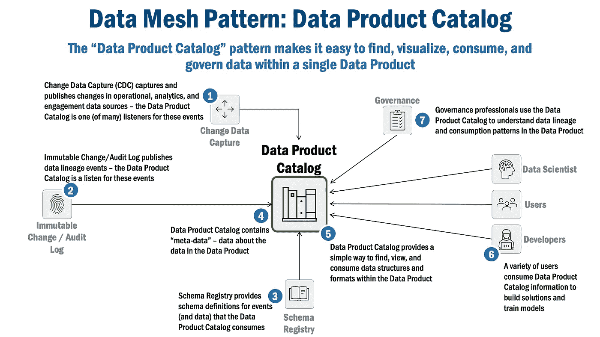
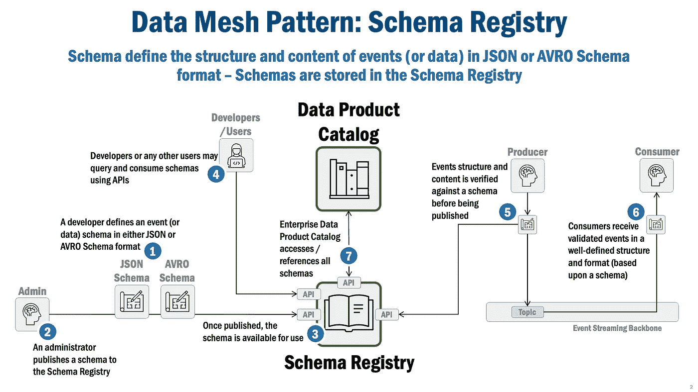
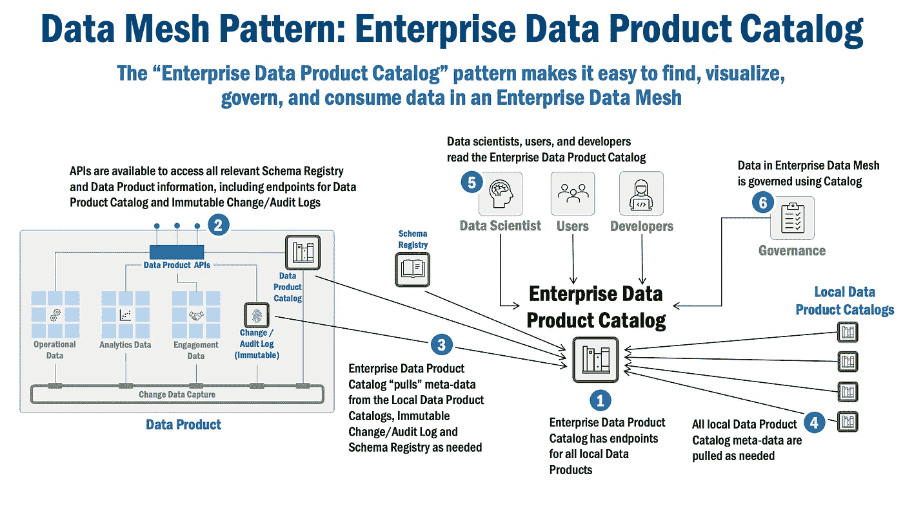

# 数据网格模式:企业数据产品目录

> 原文：<https://towardsdatascience.com/data-mesh-pattern-enterprise-data-product-catalog-ba4bf072d7c3>

## 企业数据产品目录使得在企业数据网格中查找、可视化、使用和管理数据变得更加容易。让我们详细看看这种模式是如何工作的，以及企业数据网格是如何使用这种模式的

丹尼·米勒在 [Unsplash](https://unsplash.com/s/photos/inventory?utm_source=unsplash&utm_medium=referral&utm_content=creditCopyText) 上的照片

# 企业数据产品目录:基础数据网格模式

本文讨论企业数据产品目录，这是关于基础数据网格模式的系列文章的第四篇。我将讨论模式总结、问题域和业务上下文、模式如何工作，以及支持该模式的候选供应商。

本文假设您对数据网格有很高的理解。如果你需要一些关于数据网格的背景信息，这里有很多很棒的文章[这里](https://martinfowler.com/articles/data-mesh-principles.html)(原则)，这里(架构)，这里(模式)。

本文末尾提供了完整系列文章的列表。

# 模式摘要

企业数据产品目录是一个“目录的目录”,它使得在任何具有企业数据网格的数据产品中查找、可视化、消费和管理数据(更具体地说，元数据)变得容易。它是在企业数据网格中查找、查看、使用和治理数据的一站式商店。

# 背景和业务问题

现代企业被数据堵塞了。数据存储在运营数据源、遗留平台、数据仓库、数据湖以及现在所谓的数据湖库中(还有很多)。企业，或者更具体地说，那些负责保护、治理和使用企业数据的专业人员所面临的挑战是，数据很难找到。

而一旦发现，就很难理解了。并且一旦发现并理解，就很难确定它是否是最新的或准确的:它是“记录在案”的质量，还是几天前的？或者它是否已经被转换，如果是，如何、何时、由谁、或哪个应用程序转换？

这些都是当今需要解决的具有挑战性的问题:单个特定于应用程序的解决方案过于狭隘，业务组孤岛解决方案产生有限的信息孤岛。而且，即使它们可以被聚合，那么多独特的解决方案又如何被组合在一起以提供用户真正需要的东西:一个用于查找、查看、管理和使用企业数据的一站式商店。

解决这个问题的一个常见但有问题的方法是使用“主数据管理”(MDM)方法。不幸的是，MDM 复杂、昂贵，并且很少(如果有的话)在大型组织中工作。

为什么？主要是因为一个简单的观察:大多数实现中的 MDM(现在)试图将数据复制/集中到一个新的“主”中，即使一个现有的主已经存在，通常是在操作系统中。这种对集中化的需求与康威定律(Conway's Law)背道而驰，康威定律是人类行为的一个基本真理，因为系统(和数据)与组织的结构(更具体地说，是其决策和融资结构)相一致。换句话说，激励和人类行为强烈支持将数据保存在拥有数据的各种联合团体中。

相反，Data Mesh 通过“数据产品”和“企业数据产品目录”解决了这个问题，它们允许数据停留在它已经驻留的位置，并通过 API 使它可用(这是 Data Mesh 的核心原则之一)。数据网格方法不需要移动数据，不需要整合数据，不需要冗长的辩论，也不需要组织上的麻烦。但是最重要的是，数据网格提供了对主数据所在位置的更好理解。

# 解决办法

企业数据产品目录是在企业数据网格中查找、查看、管理和使用数据的一站式商店。有几个组件直接与企业数据产品目录交互或向其提供信息:

*   数据产品目录
*   模式注册表
*   不可变的变更/审计日志

# 解决方案组件:数据产品目录

首先，数据产品目录是关于包含在企业数据网格中的数据产品的信息(“元数据”)的存储库。但它也为用户(可能包括开发人员、数据治理专家和数据科学家)提供了查找、分析和查看数据产品所包含的数据信息的方法。

数据产品目录包含来自多个来源的数据/元数据，包括:

*   变更数据捕获
*   模式注册表
*   不可变的变更/审计日志

一个数据产品目录由几个用户使用:

*   数据科学家使用它来寻找数据产品中的数据，并理解其结构和格式，以训练 AI/机器学习模型。
*   业务用户使用它来查找和消费数据，以便做出决策。
*   开发人员使用它来查找和理解数据结构和格式，以构建和集成应用程序。
*   治理专家使用数据沿袭和消费模式来治理和审计数据，并支持监管需求。

*图 1，数据网格模式:数据产品目录模式*

1.  [变更数据捕获](/data-mesh-pattern-deep-dive-change-data-capture-eb3090178c34) (CDC)获取并发布代表运营、分析和参与数据源变更的事件(使用[事件流骨干](/data-mesh-pattern-deep-dive-event-streaming-backbone-99a5bb2a7cbf));数据产品目录是这些事件的监听器。
2.  [不可变变更/审计日志](/data-mesh-patterns-immutable-change-audit-log-aec93da33648)获取并发布代表数据沿袭变更的事件；数据产品目录是这些事件的监听器。
3.  [模式注册中心](/data-mesh-architecture-and-the-role-of-apis-json-schemas-3dc616650960)获取并发布代表 JSON(或 AVRO)模式的事件，这些模式定义了数据产品目录中数据的结构、格式和内容；数据产品目录是这些事件的监听器。
4.  数据产品目录包含关于由数据产品管理的数据的元数据(关于数据的数据)。
5.  数据产品目录有一个用户界面，可以方便地查找、查看和使用数据产品中的数据结构。
6.  许多不同类型的用户访问数据产品目录:数据科学家使用它来了解用于训练模型的数据结构；业务用户使用它来了解用于做出关键业务决策的数据；开发人员使用有关数据和事件结构的信息来构建应用程序。
7.  治理专家使用数据产品目录来理解数据血统和消费模式。

# 解决方案组件:架构注册表

数据产品目录包含几种类型的元数据。它包含对由模式注册中心管理的模式的引用。这些模式定义数据产品中的事件和数据(如果需要的话)。这些模式用于帮助用户理解数据结构、格式和组件/元素数据类型，这使得理解和可视化数据产品中的数据变得容易。下面的图 2 显示了模式注册中心是如何工作的。

*图 2，数据网格模式:模式注册中心*

1.  开发人员在 JSON(或 AVRO)模式中定义他们的应用程序使用的事件或数据结构。
2.  管理员将模式发布到模式注册中心
3.  一旦发布，模式就可供使用。
4.  开发人员或任何其他用户都可以使用 API 从模式注册中心查询和使用模式。
5.  在发布事件之前，生产者的事件根据模式注册表中的模式进行验证；仅发布经过验证的消息。
6.  消费者只接收经过验证和明确定义的事件。
7.  产品数据目录访问数据产品目录中的事件定义。

# 解决方案组件:不可变的变更/审计日志

数据产品目录包含对数据产品[不可变变更/审计日志](/data-mesh-patterns-immutable-change-audit-log-aec93da33648)中维护的数据沿袭事件的引用。这使用户能够发现、了解数据在企业数据网格中更新和传输时是如何变化的。

这有多种用途:数据科学家使用数据产品目录来了解训练数据的谱系，以实现其模型的[可再现性、可追溯性和可验证性](/rethinking-ai-machine-learning-model-management-8afeaa31d8f8)，这已成为企业(和监管机构)的主要关注点。但这也使数据产品成为数据治理专业人员的主要“首选”工具。对于审计专业人员来说，当访问元数据和数据历史可以方便地搜索和可视化时，法规问题可以更容易地解决。

# 企业数据产品目录:工作原理

企业数据产品目录是一个“目录的目录”。它是访问所有本地数据产品信息的门面/代理。在大多数实现中，它并不物理地维护数据产品或模式注册数据。

相反，它为每个本地数据产品提供了一个简单的端点注册中心(API)和模式注册中心，用于根据需要“拉取”相关的元数据。这种方法避免了跨企业数据网格的元数据的重复，同时避免了整合和保持单个数据产品目录(即困扰“主数据管理”的问题)。

图 3(下图)展示了企业数据产品目录是如何工作的。

*图 3，数据网状模式:企业数据产品目录*

1.  企业数据产品目录已为所有本地数据产品注册了 API 端点。
2.  模式注册中心和每个数据产品中都提供了 API，可以方便地访问所有相关数据。
3.  企业数据产品目录调用数据产品的 API 来从数据产品目录和不可变变更/审计日志以及模式注册表中“拉出”数据。
4.  所有本地数据产品元数据都是根据需要提取的(通过 API 访问)。
5.  数据科学家使用元数据来改善 AI/ML 模型训练，业务用户使用元数据来改善决策，开发人员使用数据和事件信息来构建应用。
6.  企业数据产品目录中的元数据用于管理企业数据和理解消费模式。

# 供应商前景

下面是实现事件流主干的产品列表，每个产品都将在企业数据网格中工作。

*   Schema Registry: [Confluent 的 Schema Registr](https://docs.confluent.io/platform/current/schema-registry/index.html) y 非常可靠，它支持 JSON 模式(我最常用的模式)和 AVRO 模式； [RedHat 的服务注册中心](https://www.redhat.com/en/technologies/cloud-computing/openshift/openshift-service-registry)看起来与 Confluent 的产品即插即用兼容，并且支持多种模式类型(尽管我没有使用过这个产品)。
*   企业/数据产品目录:我不得不在很大程度上构建定制的数据目录，所以我不太熟悉具体的供应商产品，尽管有几个像[玛格达](https://magda.io/)、[阿蒙森](https://www.amundsen.io/)和[亚特兰](https://atlan.com/)看起来很有前途。

*完全披露:在推荐上述任何产品时，我没有任何经济利益***——我之所以强调这些产品，是因为我有一些使用它们的经验，它们对我来说效果很好。**

# *本系列的其他文章*

*下面列出了本系列中关于基础数据网格模式的全部文章。*

*   ***变更数据捕获(CDC)模式**，它跟踪数据库中的变更，并将它们捕获为“事件”(此处[可用](/data-mesh-pattern-deep-dive-change-data-capture-eb3090178c34))。*
*   ***事件流骨干模式**，CDC 和其他应用程序使用该模式在企业数据网中发布和订阅/接收事件(此处[可用](/data-mesh-pattern-deep-dive-event-streaming-backbone-99a5bb2a7cbf))。*
*   ***不可变的变更/审计日志模式**，它保留日志并跟踪企业数据网格中的数据沿袭，用于未来的审计和治理目的(此处[可用](/data-mesh-patterns-immutable-change-audit-log-aec93da33648))。*
*   ***企业数据产品目录模式**，它是一个目录/存储库，包含关于企业数据网格中数据产品的元数据(本文)。*

# *总结想法*

*企业数据产品目录是一种基础模式，它使得查看、使用和治理由企业数据网格管理的数据变得简单。技术细节——以及 rational 提供的——应该(有希望)帮助您启动事件流主干的设计和实现，并引导您的企业数据网格！*

*****

**除非另有说明，本文中的所有图片均由 Eric Broda(本文作者)创作。图像中使用的所有图标都是普通的 PowerPoint 图标，不受版权保护。**