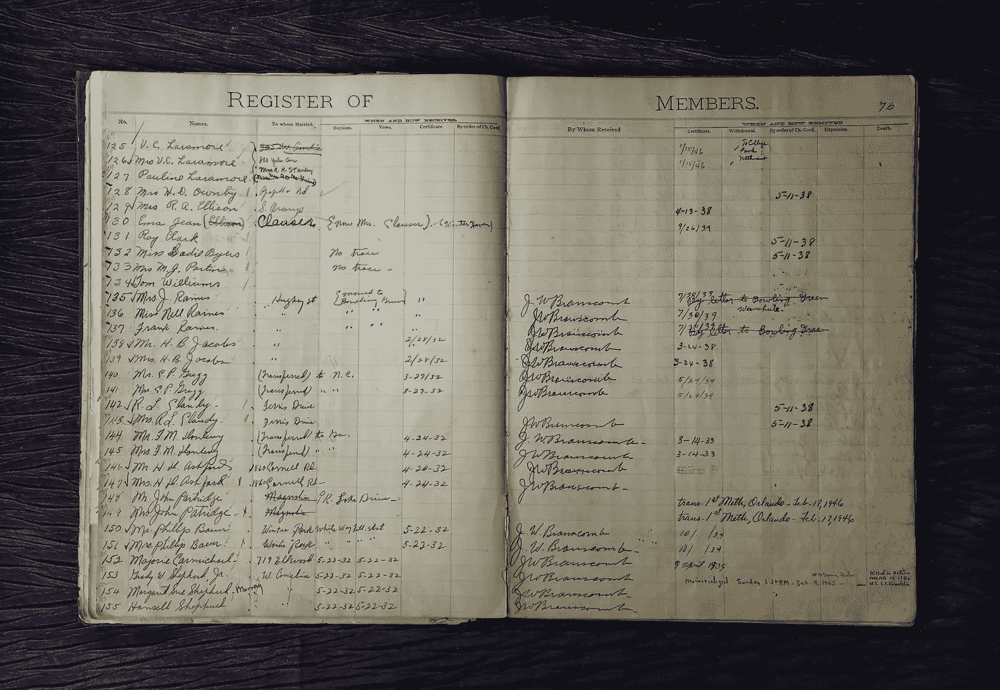
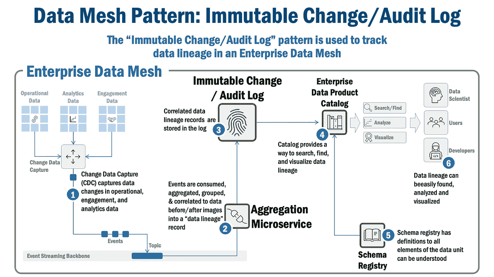

# 数据网格模式:不可变的变更/审计日志

> 原文：<https://towardsdatascience.com/data-mesh-patterns-immutable-change-audit-log-aec93da33648>

## 让我们回顾一下企业数据网格是如何使用“不可变变更/审计日志”模式的。

米克·豪普特在 [Unsplash](https://unsplash.com/s/photos/index?utm_source=unsplash&utm_medium=referral&utm_content=creditCopyText) 上的照片

# 不可变的变更/审计日志:一种基本的数据网格模式

本文讨论不可变的变更/审计日志，是关于基础数据网格模式的系列文章的第三篇。我将总结该模式的目的、它的问题域和业务上下文、该模式如何工作，以及支持该模式的候选供应商。

本文假设您对数据网格有很高的理解。如果需要的话，下面的文章应该会给你一些背景知识:

*   数据网格原则(更多信息可在[这里](https://martinfowler.com/articles/data-mesh-principles.html)获得)
*   数据网格架构(更多信息请点击[这里](/an-architecture-for-the-data-mesh-32ff4a15f16f)
*   数据网格模式(更多信息见[此处](/data-mesh-architecture-patterns-98cc1014f251))

本文末尾提供了完整系列的基础数据网格模式文章的列表。

# 模式摘要

不可变的变更/审计日志模式跟踪企业数据网格中的数据沿袭。它通过建立数据变更日志来实现这一点，该日志通常来自企业数据网格的[变更数据捕获](/data-mesh-pattern-deep-dive-change-data-capture-eb3090178c34) (CDC)系统，可以对其进行聚合、分析和切片，以支持审计和联合治理需求。

# 背景和业务问题

大多数大型企业都被看似简单的问题搞糊涂了。我的数据从哪里来？当它从一个应用程序和数据库转移到另一个应用程序和数据库时发生了什么？谁对数据进行了更改？

但是为什么这很重要呢？首先，最简单的是，数据治理所需的基本“良好卫生”使其变得有用，并且在许多情况下是大型企业所必需的。但更重要的是，尤其是在金融服务和医疗保健等受监管行业，它是由监管机构强制执行的。

例如，在金融服务监管机构要求“重要的”人工智能/机器学习模型(即。那些直接影响人或财务风险/状况的风险是[可重复、可追踪和可验证的](/rethinking-ai-machine-learning-model-management-8afeaa31d8f8)。满足这一需求意味着企业的数据血统必须被很好地建立、理解，并且在接到通知后立即可用/可视化。

不幸的是，企业不得不拼凑一些定制的解决方案，每个解决方案都针对特定的应用程序或数据库配置文件。因此，毫不奇怪，企业会留下一组不一致的工具和能力差距，最终阻碍敏捷性和上市时间。

# 解决办法

不可变的变更/审计日志使企业能够理解、可视化和报告数据单元的生命周期——或沿袭(注意，我使用的“数据单元”是最广义的，因为它可以是数据元素、数据行、数据表，这取决于您的具体情况所需的粒度。)

不可变的变更/审计日志监听(在事件流主干上)数据变更事件。它收到数据变更事件的通知，并自动捕获数据单元中的变更(使用[变更数据捕获](/data-mesh-pattern-deep-dive-change-data-capture-eb3090178c34)模式)，将数据单元变更(和元数据)呈现为“数据沿袭事件”，将事件存储在仅附加的持久日志中，并发布数据沿袭事件(使用[事件流骨干](/data-mesh-pattern-deep-dive-event-streaming-backbone-99a5bb2a7cbf)模式)，以便其他感兴趣的下游方可以消费数据沿袭事件。

它还提供了将数据变更事件转化为可操作见解的工具。低级数据更改事件被分组和聚合，以查看单个数据单元的生命周期，可视化工具使查找和查看数据单元的生命周期和沿袭变得容易。

请注意，将这种模式与流行的“事件源”模式混为一谈是一个常见的错误(为了方便起见，关于事件源的一些精彩信息可以在这里的[、这里](https://martinfowler.com/eaaDev/EventSourcing.html)[的](https://microservices.io/patterns/data/event-sourcing.html)以及这里[的](https://docs.microsoft.com/en-us/azure/architecture/patterns/event-sourcing)中找到)。但是有一些重要的区别。

在事件源提供事件的持久日志的情况下，不可变的更改/审核日志将数据单元更改(在数据映像之前和之后)与导致数据更改的事件联系起来。

事件源中的主要实体是事件，而 ***不是*** 它所作用的数据单元，不可变变更/日志模式中的主要实体既是数据单元 ***又是*** 它所作用的事件。

# 它是如何工作的

*图 1，数据网格模式:不可变变更/审计日志*

1.  [变更数据捕获](/data-mesh-pattern-deep-dive-change-data-capture-eb3090178c34) (CDC)从运营、参与或分析数据库的数据库事务日志中捕获数据变更，将其格式化为事件，并发布事件(使用[事件流主干](/data-mesh-pattern-deep-dive-event-streaming-backbone-99a5bb2a7cbf))供下游系统使用。
2.  其中一个下游服务是“聚合微服务”，它接收 CDC 数据更改事件并创建一个**数据沿袭记录**，该记录将数据的“之前”(数据更改之前)&“之后”(数据的最终状态)图像与导致数据更改的事件相关联。
3.  数据沿袭记录存储在不可变的变更/审核日志中；注意,“不可变”特征很重要——这通常实现为“仅附加”日志，因此提供了数据单元生命周期的持久且不可改变的历史记录。
4.  数据沿袭记录被转发到[企业数据产品目录](/data-mesh-architecture-patterns-98cc1014f251)；该目录允许按需搜索和可视化数据沿袭记录(以及许多其他属性)。
5.  模式注册表为所有事件以及数据沿袭记录(以及它们包含的事件信息)提供了定义，从而为实现复杂的数据沿袭分析提供了必要的结构。
6.  整个企业的用户——数据科学家、治理团队成员和开发人员可以根据需要使用数据谱系记录。

# 使用场景

数据科学家使用这种模式来了解训练数据的谱系，以实现其模型的[可再现性、可追溯性和可验证性](/rethinking-ai-machine-learning-model-management-8afeaa31d8f8)，这是人工智能/机器学习支持日益关键的决策所必需的。

数据治理团队也使用这种模式来理解整个企业中的数据沿袭和相关的消费模式。

# 供应商前景

有几个组件相互作用来捕获、编目和可视化由不可变变更/审计日志模式存储的数据沿袭记录:

*   [**模式注册中心**](/data-mesh-architecture-and-the-role-of-apis-json-schemas-3dc616650960) :由于该组件提供了事件的定义(通常是 [JSON 模式](https://json-schema.org/)或 [AVRO](https://avro.apache.org/docs/current/spec.html) )，因此它与事件流主干紧密耦合。我对 Kafka Schema Registry 的[汇合](https://www.confluent.io/)版本有很好的体验。
*   [**企业数据产品目录**](/data-mesh-architecture-patterns-98cc1014f251) :到目前为止，我还没有找到一个具体的供应商来解决这个问题，我必须构建自己的定制系统，将模式注册、聚合微服务、事件可视化和可搜索的目录联系起来。考虑到这一点，我通常会从一个灵活的静态开源内容管理服务开始，如 [Docusaurus](https://docusaurus.io/) 或 [Hugo](https://gohugo.io/) ，它们具有可靠的搜索/查找和内容存储功能，然后在聚合和可视化功能上再加一层。我意识到可能有更复杂的解决方案，但这很有效，可以很快实现。
*   **不可变日志**:任何可以存储非结构化数据的健壮数据库在这里都可以；此外，虽然该功能不同于事件源，但 Kafka 保存的持久日志可以作为不可变更改/审计日志的基础，尽管可能需要实现额外的功能和配置。

*完全披露:在推荐上述任何产品时，我没有* ***经济利益****——我之所以强调这些产品，是因为我有一些使用它们的经验，它们对我很有效。*

# 本系列的其他文章

下面列出了本系列中关于基础数据网格模式的全部文章。

*   **变更数据捕获(CDC)模式**，它跟踪数据库中的变更，并将它们捕获为“事件”(此处[可用](/data-mesh-pattern-deep-dive-change-data-capture-eb3090178c34))。
*   **事件流骨干模式**，CDC 和其他应用程序使用该模式在企业数据网格中发布和订阅/接收事件(此处[可用](/data-mesh-pattern-deep-dive-event-streaming-backbone-99a5bb2a7cbf))。
*   **不可变的变更/审计日志模式**，它保留日志并跟踪企业数据网格中的数据血统，用于未来的审计和治理目的(本文)。
*   **企业数据产品目录模式**，这是一个目录/存储库，包含关于企业数据网格中数据产品的元数据(即将推出)。

# 总结想法

不可变的变更/审计日志是一种基本的数据网格模式。与模式注册中心和企业数据产品目录相结合，它提供了实现监管者、审计者和数据治理专家所需的数据谱系的底层能力，同时实现了“联合计算治理”的核心数据网格原则。

***

*除非另有说明，本文中的所有图片均由 Eric Broda(本文作者)创作。图像中使用的所有图标都是普通的 PowerPoint 图标，不受版权保护。*