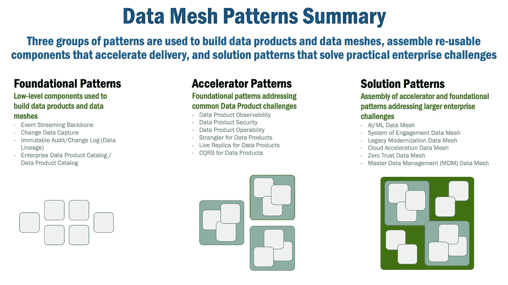
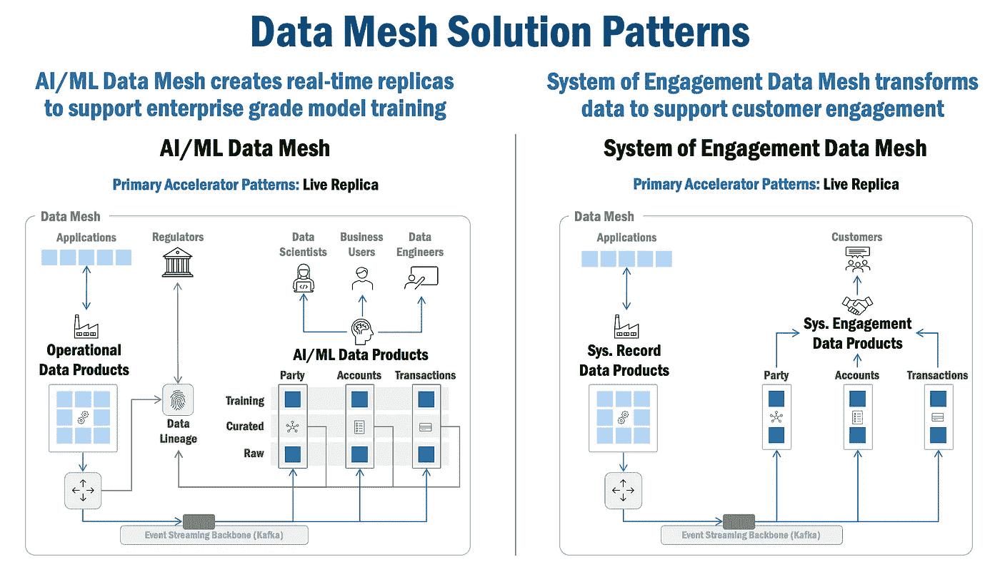
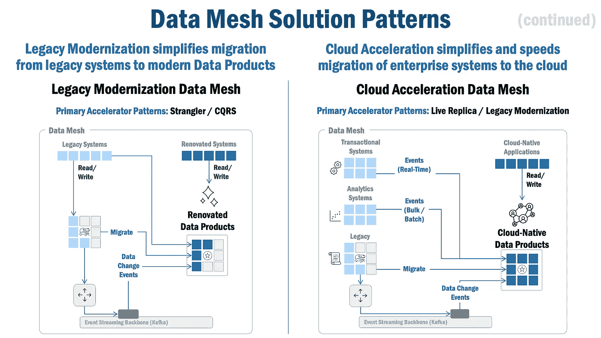
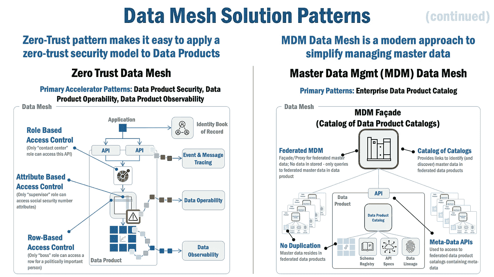
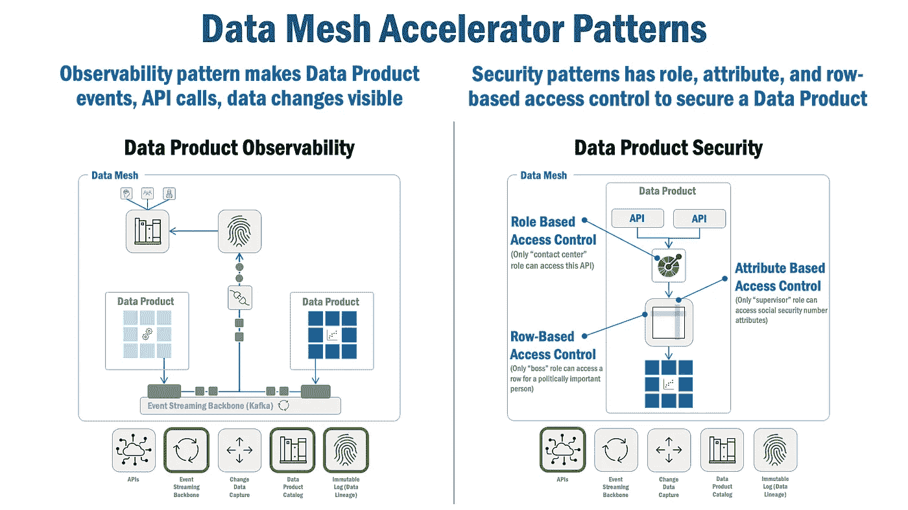
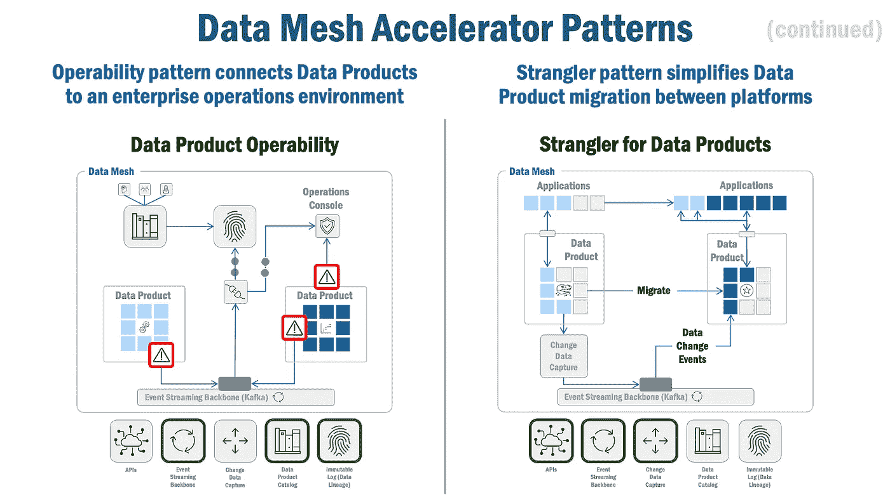
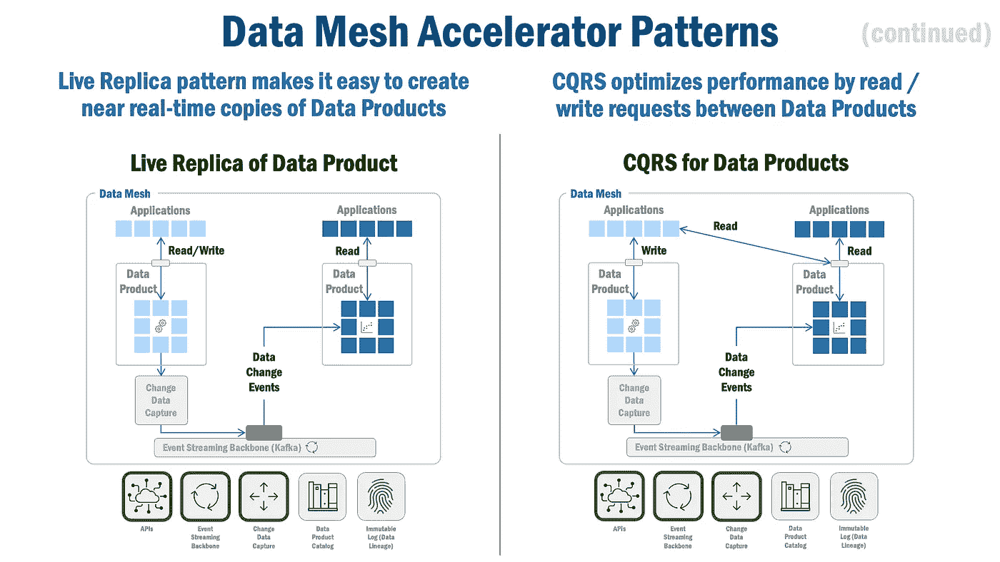
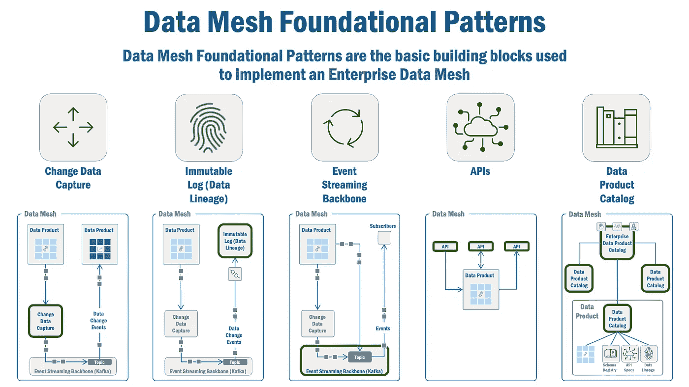

# 数据网格解决方案和加速器模式

> 原文：<https://towardsdatascience.com/data-mesh-solution-and-accelerator-patterns-acffbf6e350>

太多时候，我们全神贯注于数据网格技术，而忽视了它所能带来的令人难以置信的业务成果。以下是企业中数据网格的一些最佳机会。

佩顿·塔特尔在 [Unsplash](https://unsplash.com/s/photos/book-computer?utm_source=unsplash&utm_medium=referral&utm_content=creditCopyText) 上拍摄的照片

# 通过数据网格交付出色的业务成果

像你们中的许多人一样，我本质上是一名技术专家，我绝对喜欢深入研究低级数据网格技术。但是我的经验表明，理解数据网格的**好处**与其实现细节同样重要。

为什么？嗯，我认为，任何数据网格之旅都不是一件小事，可能会花费数百万美元，这是一个现实。然而，总得有人来买单。为了解决这个问题，我们应该准备好回答一个非常实际的问题:**数据网格可以实现哪些业务成果？**

在本系列文章中，我将介绍几种“解决方案”和“加速器”模式，它们将数据产品和数据网格功能结合起来，以交付实际和有形的业务成果。本系列的后续文章将详细探讨每个解决方案和加速器模式。

本文假设您对数据网格有很高的理解。如果您需要一些关于数据网格的背景信息，这里有一些很棒的文章可供参考:这里的(模式)、这里的(架构)、这里的(原则)和这里的(经验教训)。

# 数据网格模式适用于运营和参与系统(不仅仅是分析)

数据网格通过一组公共的“管道”、组织结构(所有权、平台思维)和治理问题将分析系统和运营/参与系统绑定在一起。正如 Zhamak Dehghani 在她最近的[书](https://www.amazon.com/Data-Mesh-Delivering-Data-Driven-Value/dp/1492092398)中指出的那样，“数据网格建议通过作为产品共享并围绕领域定向的数据来弥合两个(分析和运营)层面之间的差距和反馈回路。Data mesh 在一个新的结构下连接了两个层面(分析层面和运营层面)，这是一个点对点连接的数据产品和应用程序网络。”

但我会更进一步。我认为数据网格原则——数据所有权、数据即产品、自助服务和联合治理——同样适用于洞察系统以及记录和参与系统。事实上，除了“分析数据产品”之外，我还提倡“运营数据产品”和“参与数据产品”,它们将数据网格的力量带给运营企业的系统/记录数据以及那些与我们的客户互动的系统/数据。

现在，要明确的是，我同意 Dehghani 的观点，即数据网格目前**专注于分析，因为这是目前的难点所在，但这并不能改变这样一个事实，即数据网格原则和模式可以使整个企业的各种挑战受益，包括与系统/系统记录数据/参与数据相关的挑战。**

**因此，随着本文的深入，您将看到数据网格解决方案和加速器模式不仅涵盖分析数据产品，还涵盖运营和参与数据产品。**

****

***图 1，分析、运营和参与度数据产品***

# **解决方案、加速器和基础模式**

**有几组模式被组合来交付杰出的业务成果:**

*   ****基础模式**包括低级模式，如[变更数据捕获](/data-mesh-pattern-deep-dive-change-data-capture-eb3090178c34)和[事件流骨干](/data-mesh-pattern-deep-dive-event-streaming-backbone-99a5bb2a7cbf)模式(本文后面提供了完整的列表)。这些模式通常用于构建核心企业数据网格，但也可以直接用于组装解决方案模式。这些模式在之前的[文章](https://medium.com/@ericbroda)中有详细讨论。**
*   ****加速器模式**提供了高层次的构建块，这些构建块被组合来解决业务问题的点元素。在许多情况下，它们是由基本模式组合而成的。**
*   ****解决方案模式**是解决实际业务问题的基础模式和加速器模式的组合。**

****

***图 2，数据网格模式汇总***

# **解决方案模式**

**因此，正如企业中的数据是相互关联的一样，解决方案模式试图解决连接洞察、参与和记录系统的挑战。因此，在创建和部署解决方案模式时，除了想象力之外，没有任何实际限制。**

**当您通读这些模式时，您可能会认识到有许多方法可以解决它们所解决的业务挑战。之所以选择这些解决方案和加速器模式，是因为 Data Mesh 及其核心原则和补充架构特别适合以实用的方式解决这些挑战。**

**所以，让我们开始吧！**

**以下是一些最常见的解决方案模式:**

****

***图 3，解决方案模式:AI/ML 数据网格，系统约定数据网格***

****AI/ML 支持数据网格**解决方案模式(图 3)展示了数据网格如何建立支持数据谱系的实时分析环境。Data Mesh 使用“ **Live Replica** ”加速器模式(将在本文后面讨论)来创建数据产品，它是来自操作系统的数据的近乎实时的副本。但是同样重要的是，这种模式使用[变更数据捕获](/data-mesh-pattern-deep-dive-change-data-capture-eb3090178c34)、[事件流骨干](/data-mesh-pattern-deep-dive-event-streaming-backbone-99a5bb2a7cbf)和[不可变审计/变更日志](/data-mesh-patterns-immutable-change-audit-log-aec93da33648)基本模式来提供模型可再现性和可追溯性所需的数据谱系，这些都是金融服务和医疗保健等受监管行业所要求的。*(深潜文章即将推出)***

****参与系统数据网格**解决方案模式(图 3)加速了“参与系统”的实现。在数据网格通常解决“洞察系统”(也称为分析系统)的地方，数据网格模式可以很容易地应用于建立“参与系统”。这些互动系统结合了来自多个来源的信息，以提供客户数据和所有相关数据的一致和整体视图，从而提供卓越的客户体验。Data Mesh 使用**实时副本**加速器模式(将在本文后面讨论)将数据从运营系统(或数据产品)近乎实时地移动到项目数据产品中。*(深潜文章即将推出)***

****

***图 4，解决方案模式:遗留现代化数据网格，云加速数据网格***

****遗留现代化数据网格**解决方案模式(图 4)使用**扼杀者**和 **CQRS** 加速器模式(本文稍后讨论)以安全、可靠且不引人注目的方式迁移数据。随着数据以接近实时的方式迁移到新平台，一致的新数据产品变得可用，并且随着时间的推移，它可以取代旧的遗留平台。*(深潜文章即将推出)***

****云加速数据网格**解决方案模式(图 4)使用**实时副本**和**扼杀**加速器模式(本文稍后讨论)来显著加速您的云迁移。该模式将数据从任何类型的系统(事务或分析)或数据产品移动到安全的云驻留数据存储。这是创建数据“引力井”的基础，而数据“引力井”是经济高效地构建高性能云原生系统所必需的。*(深潜文章即将推出)***

****

****零信任数据网格**解决方案模式(图 5)创建了一个安全可靠的数据产品。所有企业——尤其是受监管行业中的企业——都管理敏感数据(监管示例包括 [GDPR](https://gdpr-info.eu/) 、 [PCI](https://www.pcisecuritystandards.org/) 、 [PII](https://www.investopedia.com/terms/p/personally-identifiable-information-pii.asp) 、 [HIPPA](https://www.hhs.gov/hipaa/index.html) )。然而，保护这些数据既昂贵又耗时，而且很难做到正确无误。我很肯定，由于缺乏预见安全需求的远见，已经有太多的项目被推迟。该解决方案模式通过创建可重复的过程(DevSecOps)来解决这一问题，以快速构建安全的任务关键型(零信任)数据产品。*(深潜文章即将推出)***

****主数据管理(MDM)网格**解决方案模式(图 5)有助于了解您的记录簿或主数据以及相关数据的位置。传统的 MDM 解决方案复制主数据，这需要复杂的数据迁移和同步技术。另一方面，这种模式使用[企业数据产品目录](/data-mesh-pattern-enterprise-data-product-catalog-ba4bf072d7c3)来允许数据驻留在它们的自然数据产品中，但是使用数据产品的可发现性特性来动态收集主数据信息的链接。*(深潜篇即将推出)***

# **加速器模式**

**加速器模式是高级构建块，通常构建在基础数据网格模式之上，可以组合起来加速解决方案模式的交付。下面是一些最常见的。**

****

***图 6，加速器模式:数据产品可观察性，数据产品安全性***

****数据产品可观察性**加速器模式提供了数据产品的可见性(详细文章可在[此处](/data-mesh-observability-pattern-467438627572))。该模式展现了几个重要的静态和动态数据产品属性(可通过数据产品目录/仪表板访问)，包括:**

*   ****数据移动**，提供数据产品内的低级事件跟踪，但也关联数据产品内部和之间发生的事件；这些信息对于调试和了解数据产品内部和之间的高度异步通信至关重要。**
*   ****元数据**，提供关于在数据产品中管理的数据的信息。**
*   ****接口定义**，提供数据产品访问方法的可见性。**
*   ****事件模式**，提供由数据产品消费或发出的事件的定义。**
*   ****指标**，提供关于数据产品消费模式的信息。**
*   ****数据谱系**，提供数据产品内的数据谱系。**
*   ****数据访问权限**，提供访问数据产品所需的安全性和访问权限的可见性。**
*   ****警报和错误**，提供操作警报和错误的可见性，以支持生产监控。**

****数据产品安全**加速器模式提供了一个粒度安全模型来保护数据产品*(深入探讨文章即将推出)。*它实施策略来保护数据产品，包括以下内容(注意:为简单起见，我使用了数据库/属性/行命名法，但这些安全结构可应用于非结构化或基于文件的数据):**

*   ****基于角色的访问控制**，确保只有授权的实体(即已经在他们的简档中被分配了授权角色)可以访问该数据产品。**
*   ****基于属性的访问控制**，保护对数据产品中数据的各个列、字段或属性的访问。**
*   ****基于行的访问控制**，保护对数据产品中相关数据的单个行或分组的访问。**

****

***图 7，加速器模式:数据产品可操作性，数据产品的扼杀者***

****数据产品可操作性**加速器模式转发来自数据产品的警报和错误，并将它们发送给相关方，包括例如企业监控功能。请注意，与“数据产品可观察性”模式存在潜在的重叠，但差异虽细微，但仍然很重要:数据可观察性模式捕获数据产品内部的警报和错误，数据产品可操作性模式旨在向相关方发出这些错误(并可能根据需要聚合它们)。(详细文章可在[这里](/data-mesh-operability-pattern-8e52a1955e54)获得)。**

****数据产品的扼杀者**加速器模式使用众所周知的[扼杀者——图](https://martinfowler.com/bliki/StranglerFigApplication.html)模式是一种将数据从一个数据产品迁移到另一个数据产品的实用可行的机制。Data Mesh 使用多种基本模式，包括 API、变更数据捕获和事件流主干，在数据产品之间安全可靠地迁移数据。*(深潜文章即将推出)***

****

***图 8，加速器模式:实时副本数据产品，数据产品的 CQRS***

****实时副本**加速器模式创建近乎实时(延迟 50–500 毫秒)的数据实时副本。Data Mesh 使用变更数据捕获和事件流主干基本模式将数据安全、可靠且接近实时地移动到同步(在 50-500 毫秒内)的数据产品中。*(深潜文章即将推出)***

****数据产品 CQRS**加速器模式应用众所周知的 [CQRS](https://martinfowler.com/bliki/CQRS.html) 模式，通过在数据产品之间分离数据产品读写活动来优化性能。Data Mesh 使用 API、变更数据捕获和事件流主干基本模式来优雅而可靠地隔离数据访问方法。*(深潜篇即将推出)***

# **基本模式**

**最底层的组件——数据网格基本模式——用于组成加速器和解决方案模式。这些将在其他文章中讨论:**

*   **[基础模式总结](/data-mesh-architecture-patterns-98cc1014f251):介绍模式，它们是如何工作的，以及它们是如何交互的。**
*   **[数据网格架构](/an-architecture-for-the-data-mesh-32ff4a15f16f)，提出了一种绑定各种数据网格模式和组件的架构，**
*   **[改变数据捕获](/data-mesh-pattern-deep-dive-change-data-capture-eb3090178c34)，在数据产品内部和之间捕获和传输数据，**
*   **[不可变日志(数据沿袭)](/data-mesh-patterns-immutable-change-audit-log-aec93da33648)，它捕获数据变更并将它们聚合到数据沿袭记录中，**
*   **[事件流骨干](/data-mesh-pattern-deep-dive-event-streaming-backbone-99a5bb2a7cbf)，在数据产品内部和之间传输事件，以及更广泛的企业，**
*   **[API](/data-mesh-architecture-and-the-role-of-apis-json-schemas-3dc616650960)，为数据产品提供接口合同，**
*   **[数据产品目录&企业数据产品目录](/data-mesh-pattern-enterprise-data-product-catalog-ba4bf072d7c3)，为数据产品使用的模式提供元数据和定义。**

****

***图 9:数据网格基础模式***

# **总结想法**

**企业数据网格是实时数字企业的新兴基础。解决方案、加速器和基础模式提供了一种理解和解决常见业务和技术挑战的实用方法。通过使用这些模式，数据网格提供了一种解决这些挑战的实用方法，从而创造真正的价值和切实的业务成果。**

**希望这篇文章给你必要的洞察力来启动你自己的企业数据网格！**

*******

***除非另有说明，本文中的所有图片均由 Eric Broda(本文作者)创作。图像中使用的所有图标都是普通的 PowerPoint 图标，不受版权保护。***

***本文表达的观点仅代表我个人，并不代表我的客户的观点。***