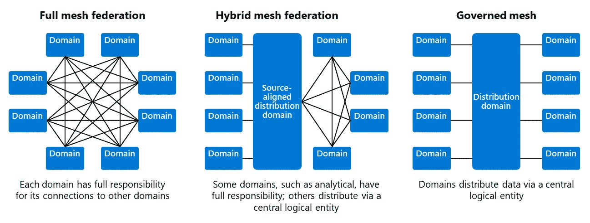
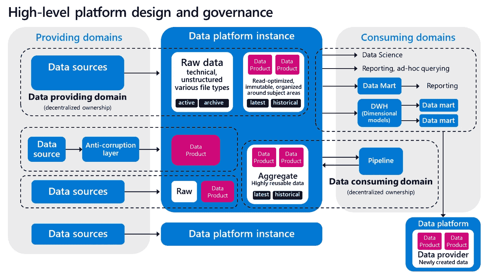
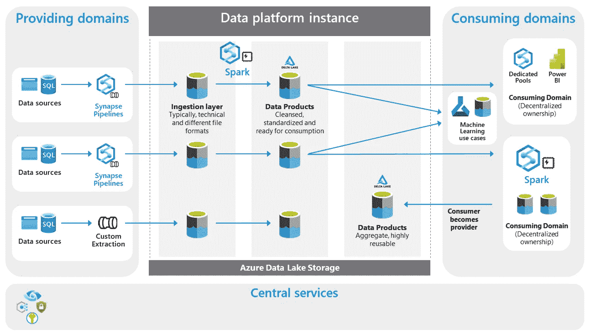

# 数据网格:集中和分散的平衡行为

> 原文：<https://towardsdatascience.com/data-mesh-the-balancing-act-of-centralization-and-decentralization-f5dc0bb54bcf>

## 实现数据网格的细微差别和注意事项

数据网格体系结构通过联合治理和分散的数据产品将数据所有权分布到各个领域团队。数据网格不同于其他数据架构，因为它是高度分散的:分布式而非集中式。

## **观察结果**

我接触的许多大型企业都在研究数据网格。他们发现团队对其数据负责并增加商业价值的扩展模型是一种优雅的方法。他们喜欢数据产品管理思维。然而，他们不喜欢采用完全分散的架构，这可能导致连接数据时的数据重复、平台管理的重复工作、孤岛的创建和技术标准的激增。其他企业担心合并来自多个团队的数据的成本和性能下降。或者害怕对复杂系统管理的深入专业知识的需求:构建一个通过集中治理来控制的分散架构被认为太复杂了。

**不同的数据网格拓扑。完全分散化会带来额外的复杂性管理开销。企业在分散化和集中化之间寻求平衡，以解决重复数据分布等问题。**(鸣谢:皮埃登·斯特朗霍尔特)

# 提出参考设计

基于这些客户对话，我经常采用 data mesh 的一些原则提出一个替代方案。

## 企业享有强大的数据所有权

将责任放在数据产生的地方是一件好事，我真的很喜欢数据网格。它分散了数据的责任，并将责任落实到数据产生的地方。这种一致性完全有意义，因为数据生产者是他们自己数据的专家。他们知道他们的系统是如何设计的，以及在这些系统中管理哪些数据。他们经常与最终用户或业务分析师密切合作，因此知道良好的数据质量对数据消费者意味着什么。在分配数据所有权和确定您的领域时，我的建议是不要局限于应用程序和系统。看看范围，了解你试图解决的[业务问题空间](/data-domains-where-do-i-start-a6d52fef95d1)。这种分析包括特定环境中的数据、流程、组织和技术，与您组织的战略业务目标和目的相一致。定义域时，确保边界清晰明确。这一点非常重要，因为不同的团队可能会试图声明相同应用程序和数据的所有权。

## 数据产品思维引起了很好的共鸣

另一个引起广泛共鸣的概念是数据产品。将数据作为产品来管理和提供并不是转储原始数据的极端情况，转储原始数据需要所有消费团队在数据质量和兼容性问题上执行可重复的工作。使用来自所有团队的一个(企业)规范数据模型和强大的一致性，这也不是构建集成层的极限。数据产品设计是一种细致入微的方法，从您的(复杂的)操作和分析系统中提取数据，并将其转换为适合整个组织使用的读取优化版本。这种数据产品设计方法附带了许多最佳实践，例如将您的数据产品与您的领域的语言保持一致，为快速消费设置明确的互操作性标准，从创建的源头直接捕获它，解决时变和非易失性问题，封装元数据以实现安全性，确保可发现性，等等。你可以在这里找到更多这些最佳实践。

## 对权力下放的保留意见

当涉及到为领域团队配备工程工具来执行数据产品创建和平台所有权的任务时，企业会做出不同的权衡。并非所有组织都有 500 多名数据工程师。并非所有的组织团队都熟悉复杂的数据建模技术、变更数据捕获、Kubernetes 和 Python 笔记本。公司根据其规模、业务需求和现有架构要求不同的方法。

我交谈过的许多企业实施了[轴辐式网络拓扑](https://docs.microsoft.com/en-us/azure/architecture/reference-architectures/hybrid-networking/hub-spoke)架构，通常由集中的平台团队管理所有公共基础设施，包括数据平台。对于通用数据服务，企业通常使用[支持团队](https://itrevolution.com/get-started-with-team-topologies-in-8-steps/)，该团队与其他团队密切合作，以实现数据的引入或消费。数据产品思维模式是通过要求团队获得数据的所有权来设想的，这意味着故障排除、修复数据质量问题或解决摄取问题。但是当涉及到复杂的工程时，就有这种成熟度曲线，所以支持团队也经常在入职数据、培训和指导团队最佳实践方面提供帮助。当领域团队缺乏必要的技能时，这些支持团队有时甚至接管数据管道管理。

同样的成熟度曲线通常也出现在数据消费端。在许多情况下，团队依赖共享的资源池来提供关于数据的配置、接收和转换的知识和帮助。这个支持数据的团队吸取经验教训并进行改进以增强服务，例如用于数据管道和接收的[框架](https://piethein.medium.com/modern-data-pipelines-with-azure-synapse-analytics-and-azure-purview-fe752d874c67)，以使这些更具动态性和可配置性。在解决效率低下和应用自助服务与花费时间帮助搭载新数据产品之间，这是一个持续的平衡。

## 较少分散的参考模型

为了解决数据重复问题，企业通常会选择一个中央数据分发平台，而不是由所有团队管理的许多已部署的逻辑组件。这也是我看到许多重叠的地方，例如，数据湖房子架构。您可以在下面找到一个参考模型，它展示了这种具有单一平台实例和数据产品所有权的架构。

**基于域的数据所有权参考模型。域总是拥有数据的所有权。**(鸣谢:皮埃登·斯特朗霍尔特)

这个参考设计是一个面向领域的架构。尽管使用了共享平台，但是数据提供域或消费域拥有数据的所有权。数据所有权也适用于从新创建或聚合的数据中派生的数据产品。没有合并所有数据的中央或共享集成层。为了应对数据不一致的挑战，您可以考虑引入[主数据管理原则](/master-data-management-in-data-mesh-594d21f3ee10)。

这种体系结构的解决方案设计如下所示:

**应用一些数据网格原则的解决方案架构，例如基于域的数据所有权**(鸣谢:Piethein Strengholt)

对于这种架构，我推荐使用元数据驱动的摄取框架:数据处理的统一通用方式。通过这个控制框架，您可以建立适当的数据所有权，这意味着分发数据的团队将始终拥有他们的源系统、元数据配置、管道和数据产品的所有权。

对于消费方，我也主张分散数据所有权。这意味着从事用例工作的团队将对其转换后的数据和分析应用程序拥有所有权。

在这个体系结构中，有一个逻辑存储层，它将来自许多不同团队的数据聚集在一起。在分发数据产品时，这个环境充当所有团队之间的解耦点。这种环境中的分段和隔离通常通过使用每个域的容器来进行。但是，您也可以根据您发现的内聚性，使用存储帐户对域进行逻辑分组。这一层中的数据是不可变的，并且是读优化的。根据您希望如何扩展，您可以提供额外的平台实例。

为了支持您的数据域，还必须有一套强大的数据管理服务。这些功能用于:支持数据接收、处理流程编排、调度、管理主数据管理和数据生命周期管理、执行数据治理和质量管理，以及解决安全管理问题。

该模型中更高的集中化程度解决了以下问题:1)遍历大型历史数据集，无需将数据从一个域转移到另一个域 2)允许检查数据的逻辑关联程度和相互一致性 3)允许主数据管理更高效地运行 4)通过在不同团队之间共享计算资源来降低成本。同时，它应用了来自数据网格的若干最佳实践，例如数据产品思维、面向领域的数据所有者、自助服务功能和数据治理。

## **结束**

每个企业都有自己的数据环境和需要应对的挑战。并不是所有的企业都准备好了大规模的权力下放。但是，您可以通过选择符合您需求的拓扑来取得平衡。