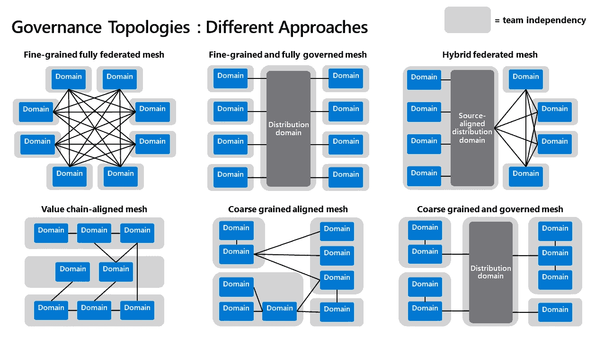
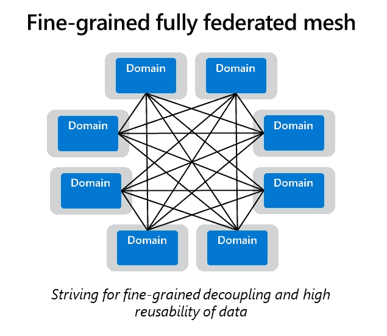
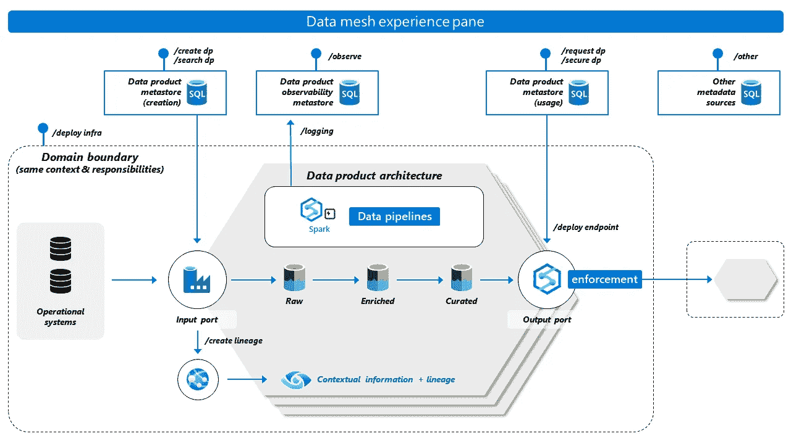
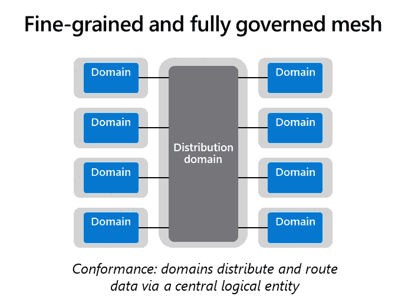
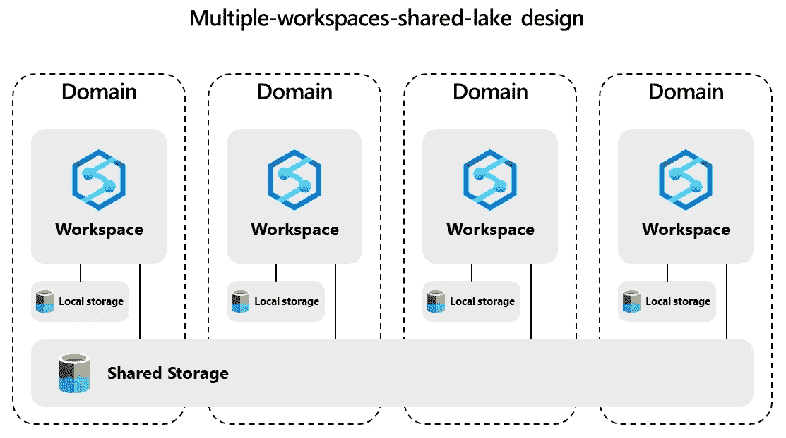
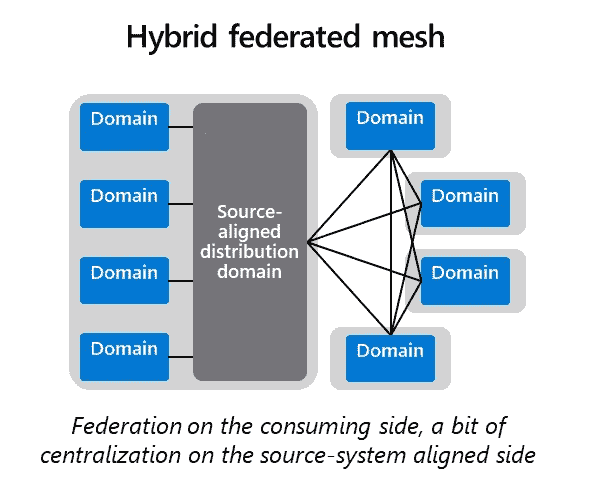
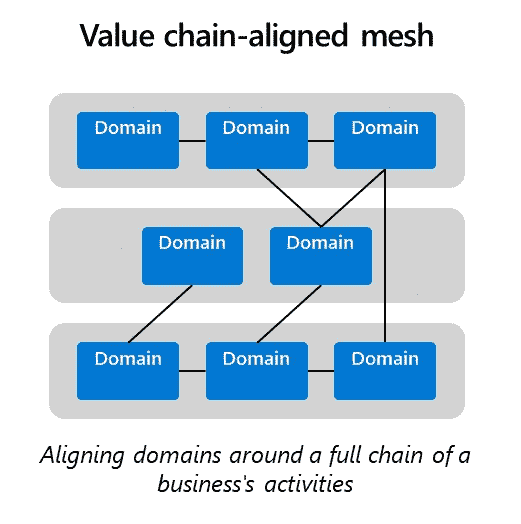
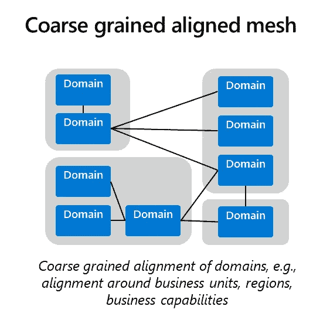
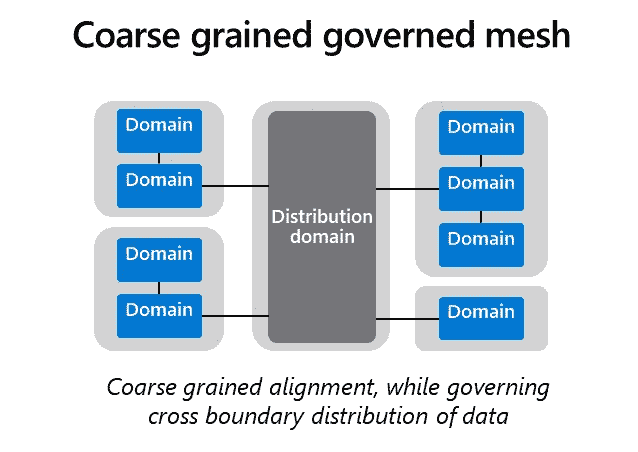

# 数据网格:拓扑和领域粒度

> 原文：<https://towardsdatascience.com/data-mesh-topologies-and-domain-granularity-65290a4ebb90>

至少可以说，微软过去的一年很有趣！我参加了无数的客户对话、研讨会和架构设计会议。在这些客户互动中，数据网格经常成为争论的中心话题。

据我所知，数据网格相对来说是一个新的课题。这是一个必须由公司独特的所有权、组织、安全性、变化速度、技术和成本管理要求来塑造的概念。平衡所有这些需求并不容易，所以公司选择一个通用的架构来满足这些需求。

不同的数据网格拓扑。从完全去中心化和细粒度解耦到更受管理的数据分布。(鸣谢:皮埃登·斯特朗霍尔特)

在这篇博文中，我想分享不同的架构设计模式以及选择每种模式的考虑因素。我将解释公司的驱动力，以及为什么他们偏爱一种设计而不是另一种。

## **场景 1:** **细粒度全密目网**

第一个设计模式是 [Zhamak Dehghani](https://www.thoughtworks.com/profiles/z/zhamak-dehghani) 如何以最纯粹的理论形式描述数据网格。它是细粒度的、高度联合的，并且使用许多小型的、独立的可部署组件。下图显示了这种架构设计的一个抽象示例。

细粒度和完全联合的数据网格(鸣谢:Piethein Strengholt)

在上面的模型中，数据分发是对等的，而所有与治理相关的元数据在逻辑上是集中的。这种拓扑中的数据由每个单独的域拥有、管理和共享。域保持灵活性，不依赖中央团队进行协调或数据分发。

在细粒度和完全联合的网格中，每个数据产品都被视为一个架构量子。简而言之:这意味着您可以实例化许多不同的小型数据产品架构，用于跨域提供和提取数据。你可以在下面找到这种工作方式的图像。

数据产品架构(鸣谢:Piethein Strengholt)

细粒度和完全联合的网格支持细粒度的领域专门化。它提供了组织的灵活性和更少的依赖性，因为交互是多对多的。最后，它促进了数据的密集重用，因为数据产品的创建程度很高。每个数据产品都变成了体系结构量子。

虽然细粒度和完全联邦的网格看起来很完美，但当公司深入研究时，他们会提出一些问题。首先，拓扑需要所有域在互操作性、元数据、治理和安全标准方面的一致性。这些维度的标准化过程不会自发发生。这是一项艰巨的任务，需要你打破政治界限。它要求你在不同的阶段移动你的架构和工作方式，包括预概念化、概念化、讨论、写作和实现。你需要有足够的数量和更广泛的观众的支持。

第二，公司担心能力重复和网络利用率过高。许多小型数据产品架构极大地增加了基础设施资源的数量。它会使您的架构成本高昂。当集中执行跨域数据查找和数据质量验证时，数据产品架构的粒度也变得有问题。数据重心和去中心化并不同步。

细粒度的全联邦网格是一个很好的选择，但是很难实现。我经常在那些诞生在云上、做多云、相对年轻并拥有许多高技能软件工程师的公司看到这种拓扑结构。当您的公司内部已经有了高度自治时，这种拓扑也可能是一个不错的选择。

## 场景 2: **细粒度和完全治理的网格**

为了解决联合问题，我看到许多公司通过增加一个中心分布层来调整以前的拓扑结构。虽然这种拓扑没有实现完整的数据网格体系结构，但它遵循了许多数据网格原则:每个域都有一个明确的边界，并对自己的应用程序和数据产品拥有自主权，但这些数据产品需要通过一个中央逻辑实体进行分发。

细粒度和完全受控的数据网格(鸣谢:Piethein Strengholt)

上面可视化的拓扑解决了在细粒度完全联合网格中观察到的一些问题。它解决了数据分布和重力问题，如大型数据消费者的时变和非易失性考虑。域不需要分布大型历史数据集，因为数据更紧密地保存在共享存储层上。

公司还认为这种拓扑更容易解决一致性问题。例如，您可以阻止数据分发或消费、强制元数据交付或要求特定的工作方式。**多工作空间共享湖设计**是一个经常应用的最佳实践。域在它们自己的工作空间中管理和创建数据产品，但是向其他域的分发是通过使用特定于域的容器的中央存储层进行的。

解决开销的多工作空间共享湖设计

除了提供中央存储层，我还看到一些公司提供集中管理的计算或处理服务。例如，使用专用计算在每个域内应用特定于域的转换，但是使用计算资源的共享池集中处理历史数据。这种方法大大降低了成本。

这种拓扑更强的集中化和一致性也是一个考虑因素。这将导致更长的上市时间，并在您的域之间引入更多的耦合。当功能没有准备好时，您的中央分布层可能会阻碍域交付商业价值。我还预计这种拓扑在多云中会更加困难，因为它要求您设计一个中央分布式逻辑实体，在遵守所有治理标准的同时无缝地移动数据。鉴于云供应商目前所提供的特性，使用云原生标准实现这一点很困难。

然而，我看到许多公司选择完全治理的网状拓扑。大多数金融机构和政府都实施这种拓扑结构，但也有其他公司将质量和合规性看得比灵活性更重要。

## 场景 3:混合联邦网格

不是所有的公司都有很多高技能的软件工程师。其他人则使用过时的遗留系统，这些系统很难维护和提取数据。属于这些类别的公司通常实施“一些”数据网格，如下图所示。

混合联邦数据网格(鸣谢:Piethein Strengholt)

这种拓扑与其他拓扑相比有什么特点？联邦越来越少，集权越来越多。有一种数据产品管理的思维模式，但是有一个维护和创建数据产品的中央平台实例。有时，在领域团队缺乏必要的技能或资源的情况下，甚至会有一个支持团队或平台团队接管数据产品。

在消费数据上，通常有更高程度的自治和网状分布。不同的团队可能处理不同的用例，并对他们转换后的数据和分析应用程序拥有所有权。结果或新创建的数据产品被对等分发或推回到中央平台。

这种拓扑的一个考虑因素是增加了源系统对齐域的管理开销，因为它们很可能由一个中央团队负责。使用这种架构的组织可能会受到不同的操作模型和更复杂的指导和原则的影响。还可能有不一致的数据分发规则，因为消费域经常变成提供域。实现这种架构的额外考虑和治理模型可以在这里找到:[https://towards data science . com/data-mesh-the-balancing-act-of-centrization-and-decorization-f 5 DC 0 bb 54 BCF](/data-mesh-the-balancing-act-of-centralization-and-decentralization-f5dc0bb54bcf)。

## 场景 4:价值链对齐的网格

专门从事供应链管理、产品开发或运输的组织非常尊重他们的价值链。这些公司有什么特点？他们需要高度专业化或流程整合来为客户带来价值。这些价值链通常在本质上是紧密相连和可操作的。他们还典型地前后处理数据:从操作到分析，再回到操作。

与价值链一致的数据网格(鸣谢:Piethein Strengholt)

在这种价值链结构中，价值链被认为是一组紧密合作的较小领域。这种价值链需要更高程度的自主性，因此可以被视为更大的领域。在这样拓扑中，您通常会看到内部数据产品和跨域数据产品之间的差异。只有当跨越价值链的边界时，才需要遵守核心标准。您还可以允许或混合不同类型治理模型；在一个领域严格遵守，在其他领域放松控制。

使用价值链的考虑是，这个模型需要架构师更强的指导，因为边界可能不总是那么明确。

## 场景 5:粗粒度对齐网格

一些组织通过兼并和收购实现有机增长，从而扩大规模。这些组织通常有复杂的环境，有时有数百或数千个应用程序和系统。在这些复杂的结构中，你可以看到不同层次的治理、联合和分解。一些结构可能独立自主地运行，而另一些结构则更加完整。

在这些大规模公司中观察到的结构通常相当大。域被认为拥有数十或数百个应用程序。我认为这样的拓扑是一个粗粒度的对齐网格。

粗粒度对齐数据网格(鸣谢:Piethein Strengholt)

这种拓扑的困难在于边界并不总是那么明确。数据不符合领域和业务功能的边界。更常见的是，领域边界基于相对较大的组织或区域观点。这可能会在谁控制数据和需要什么主权的问题上产生政治内讧。

粗粒度数据网格拓扑的另一个挑战是**能力复制**。很可能每个粗粒度域都使用自己的数据平台来实现数据的加入、转换和分发。这种为更大的领域实现许多平台的方法会导致功能重复。例如，整个企业都可能需要数据质量管理和主数据管理。这种联合方法可能会导致在所有数据平台上实现许多数据质量和主数据管理。确保这些服务在所有平台上的一致实施需要强大的协作和指导。你的组织越大，就越难。

这种多平台方法经常会引发很多问题:如何校准数据平台和域？是否允许更大的域共享一个数据平台？当不同平台需要相同的数据时，如何处理重叠的数据需求？如何在这些更大的域和平台实例之间高效地分发数据？一个好的起点是[在实现数据网格之前对你的组织进行适当的域分解](/data-domains-where-do-i-start-a6d52fef95d1)。继续设置应用程序和数据所有权。通过制定关于[数据产品创造](/data-domains-and-data-products-64cc9d28283e)的强有力的指导来继续。

当考虑粗粒度网格拓扑时，重要的是强烈引导向数据网格的过渡。这种拓扑具有更高的自主性，因此需要更强的治理策略和自助式数据平台功能。例如，注册数据产品并使其可被发现可能需要基于域的技术和互操作性选择的特定指导。否则，跨平台的可见性可能会更差，或者基于在域中看到的扩散，成本可能会增加。

粗粒度自治与真正的数据网格实现相矛盾。它带来了在分发数据产品之前对数据进行组合和集成的风险。这有造成更大孤岛的风险。这些巨大的单体在系统之间创造了额外的耦合。它们还引入了数据所有权混淆，因为数据产品是通过使用中间系统分发的，这使得更难看到实际的来源。为了降低这些风险，引入一些原则，例如只捕获唯一的数据，以及使用其唯一的域上下文直接从来源捕获数据。

## 场景 6:粗粒度和治理的网格

一些大规模的复杂组织旨在通过在这些更大的结构之间建立一个分布的中心层来克服复杂性、对等分布和互操作性偏差。

粗粒度治理数据网格(鸣谢:Piethein Strengholt)

在这种拓扑结构中，团队或组织结构在一个分发平台或市场上达成一致，通过该平台或市场可以发布和消费数据产品。这种拓扑增加了受治理数据网格拓扑的一些特征，例如解决时变和非易失性问题。另一方面，它允许在这些更大的范围内进行更宽松的控制。

所有粗粒度的方法，就像前面的场景一样，需要数据平台团队的高度成熟度。所有组件都需要自助服务，并且必须在分布的中心层和域平台之间很好地集成。元数据管理、治理标准和政策至关重要。如果中央架构和治理团队没有强有力的授权，这些架构很容易失败。

## 结论

数据网格是一种转变，它可以完全重新定义数据管理对组织的意义。您的中央团队不再集中执行数据管理的所有领域，而是负责定义什么构成了强大的数据治理，什么构成了自助式数据平台。

在向联盟过渡的过程中，公司会做出取舍。一些组织喜欢高度自治，而另一些组织喜欢质量和控制。一些组织的结构相对简单，而另一些组织则庞大而复杂。创建完美的数据架构并不容易，所以对于您的策略，我鼓励您将数据网格视为一个框架。没有对错之分。数据网格伴随着最佳实践和原则。有些你可能喜欢，有些你不喜欢。因此，实施最适合你的方案。

如果这是你喜欢的内容，我让你看看《规模化数据管理[*》这本书。*](https://learning.oreilly.com/library/view/data-management-at/9781492054771/)