# 数据挖掘:基于 Apriori 算法的购物篮分析

> 原文：<https://towardsdatascience.com/data-mining-market-basket-analysis-with-apriori-algorithm-970ff256a92c>

## 揭开为什么面包总是方便地放在食品杂货店黄油旁边的秘密

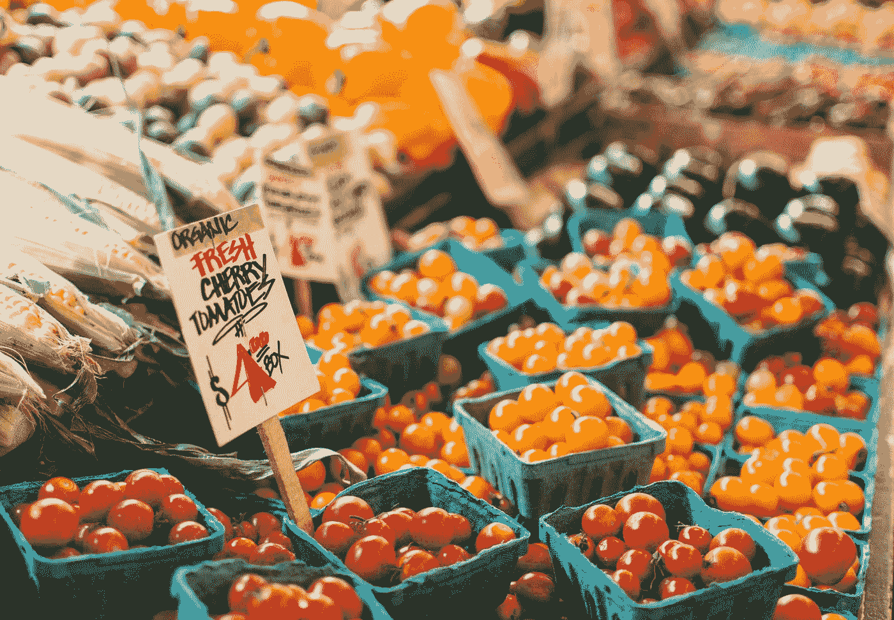

安妮·普雷布尔在 [Unsplash](https://unsplash.com?utm_source=medium&utm_medium=referral) 上的照片

# **简介**

我们中的一些人带着标准清单去杂货店；尽管我们中的一些人很难坚持购物清单，不管我们有多坚定。不管你是哪种类型的人，零售商总是擅长制造各种诱惑来抬高你的预算。

还记得那次你吃了"*哦，我可能也需要这个。*“瞬间？零售商依靠这一简单的直觉来提高销售额。

> 买这个的人很可能也想买那个。

购买面包的人有更高的机会一起购买黄油，因此一个有经验的产品分类经理肯定会知道，面包打折也会促进黄油的销售。

## 数据驱动战略

大型零售商依靠详细的购物篮分析来揭示商品之间的关联。利用这些有价值的信息，他们能够实施各种策略来增加收入:

*   相关产品被放置在彼此靠近的地方，这样一种商品的购买者会被提示购买另一种商品。
*   折扣只能应用于一种相关产品。

[Artem Beliaikin](https://unsplash.com/@belart84?utm_source=medium&utm_medium=referral) 在 [Unsplash](https://unsplash.com?utm_source=medium&utm_medium=referral) 上的照片

# 关联规则挖掘

但是市场篮子分析究竟是如何进行的呢？

数据科学家能够通过实现关联规则挖掘来执行市场购物篮分析。关联规则挖掘是一种**基于规则的机器学习方法，有助于根据不同产品在数据集中的同现情况来发现它们之间有意义的相关性**。

然而，一个主要的缺陷是，它包含各种公式和参数，这可能会使没有数据挖掘专业知识的人感到困难。因此，在与利益相关者分享您的结果之前，请确保对基本定义有充分的理解。

照片由[普里西拉·杜·普里兹](https://unsplash.com/@priscilladupreez?utm_source=medium&utm_medium=referral)在 [Unsplash](https://unsplash.com?utm_source=medium&utm_medium=referral) 拍摄

## 核心概念说明

下面我将用一些简单的例子来说明关联规则挖掘中使用的三个核心概念。这将帮助您掌握数据挖掘过程。

假设你现在开了自己的自助餐厅。您将如何利用您的数据科学技能来理解菜单上的哪些项目是相关联的？

亚历山大·萨多夫斯基在 [Unsplash](https://unsplash.com?utm_source=medium&utm_medium=referral) 上的照片

在你的自助餐厅里总共有六笔不同的交易。

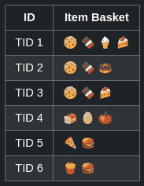

作者图片

我们可以利用三个用于关联规则学习的核心度量，它们是:**支持度**、**置信度、**和**提升度**。

1.  **支持**。

**支持只是一个事件发生的简单基本概率。**以项目集出现的交易比例来衡量。换句话说，支持(A)是包括 A 的事务数除以事务总数。

如果我们分析上面的事务表，对 cookie 的支持是 6 中 3。也就是说，在总共 6 次交易中，包含 cookies 的购买发生了 3 次。或者 50%。

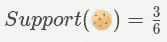

作者支持方程图像

也可以同时对多个项目实施支持。对曲奇和蛋糕的支持度是 6 分之 2。

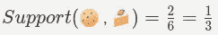

作者支持方程图像

**2。信心**。

给定一个**前因事件**的**后果事件** **事件**的置信度可以用条件概率的来描述。简单来说就是**在事件 B 已经发生的情况下，事件 A 发生的概率。**

这可以用来描述当一个商品已经在购物篮中时，另一个商品被购买的概率。它的计算方法是用 X 和 Y 项的交易比例除以 Y 项的交易比例。

从上面的事务表中可以看出，{cookie -> cake}的置信度可以用下面的公式表示:

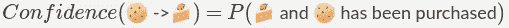

作者的置信方程图像

条件概率也可以写成:

作者的置信方程图像

最后，我们得出了三选二的解决方案。如果我们只看交易 1 到交易 3，我们可以理解信心的直觉。三次购买饼干，其中两次实际上是和蛋糕一起购买的！

**3。抬起**。

升力是观察到的 ***与预期的*** (缩写为 o/e)。Lift 衡量一件商品被购买时，另一件商品被购买的可能性**，同时控制这两件商品的受欢迎程度**。它可以通过将两个项目一起出现的概率除以两个单独项目出现的概率的乘积来计算，就好像它们之间没有关联一样。

作者提供的升力方程图像

提升 1 将意味着这两个项目实际上是独立的，没有任何关联。对于任何高于 1 的值，lift 表明实际上存在关联。值越高，关联度越高。

再看表格，{cookies -> cake}的 lift 是 2，暗示着 cookies 和 cake 之间其实是有关联的。

现在我们已经掌握了所有的核心概念，我们可以研究一个能够从事务性数据中生成项目集的算法，该算法用于计算这些关联规则。

# Apriori 算法

## 概观

Apriori 算法是关系数据库关联规则学习中最常用的算法之一。它**识别数据集中的项目，并进一步将它们扩展到越来越大的项目集**。

然而，Apriori 算法只在项目集频繁的情况下才扩展，即项目集的概率超过某个预定的阈值。

Shane Aldendorff 在 [Unsplash](https://unsplash.com?utm_source=medium&utm_medium=referral) 上拍摄的照片

更正式地说，

**Apriori 算法提出:**

在下列情况下，项目集的概率不是频繁的:

*   P(I) < Minimum support threshold, where I is any non-empty itemset
*   Any subset within the itemset has value less than minimum support.

The second characteristic is defined as the **反单调性质**。一个很好的例子是，如果购买汉堡的概率已经低于最低支持，那么购买汉堡和薯条的概率肯定也会低于最低支持。

## Apriori 算法的步骤

下图说明了 Apriori 算法如何从最小项集开始构建，并进一步向前扩展。

*   该算法从**通过连接步骤**生成一个项集开始，即从 K 个项集生成(K+1)个项集。例如，算法在第一次迭代中生成 Cookie、巧克力和蛋糕。
*   在此之后，该算法立即进行修剪步骤，即**移除任何不满足最小支持要求**的候选项目集。例如，如果支持度(蛋糕)低于预定的最小支持度，则该算法将移除蛋糕。

它重复这两个步骤，直到没有可能的进一步扩展。

请注意，此图并不是上面事务表的完整版本。它作为一个插图，有助于描绘更大的流动画面。

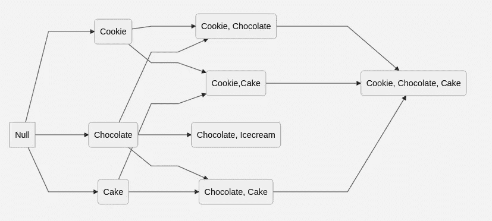

Apriori 算法粗糙概念图像作者

# 代码实现

为了使用 Apriori 算法执行购物篮分析实现，我们将使用来自 Kaggle 的[杂货数据集](https://www.kaggle.com/datasets/heeraldedhia/groceries-dataset)。该数据集由 Heeral Dedhia 于 2020 年以通用公共许可证第 2 版发布。

该数据集有 38765 行来自杂货店的采购订单。

照片由 [Cookie 在](https://unsplash.com/@cookiethepom?utm_source=medium&utm_medium=referral) [Unsplash](https://unsplash.com?utm_source=medium&utm_medium=referral) 上的 Pom 拍摄

## 导入和读取数据

*   首先，让我们导入一些必要的模块，并读取我们从 Kaggle 下载的数据集。

***代码:***

***输出:***

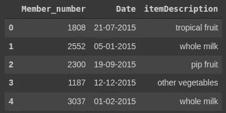

作者输出的代码

## 分组为交易

*   数据集在一行中记录单个商品的购买情况。我们将不得不把这些购买的东西归入一篮子物品中。
*   之后，我们将使用 TransactionEncoder 将事务编码成适合 Apriori 函数的格式。

***代码:***

***输出:***

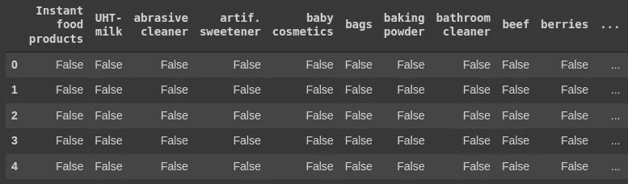

作者输出的代码

***注:*** 数据框将每一行记录为一次交易，交易中购买的物品将被记录为真。

## 先验和关联规则

*   Apriori 算法将用于生成频繁项目集。我们将指定最低支持为总事务数的 6。产生关联规则，并且我们过滤提升值> 1.5。

**代码:**

**输出:**

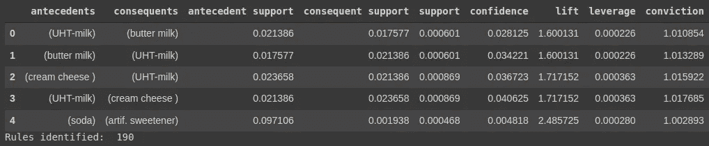

作者输出的代码

## 形象化

*   为了可视化我们的关联规则，我们可以将它们绘制成 3D 散点图。更靠近右上角的规则可能是最有意义的规则，可以进一步深入研究。

***代码:***

**输出:**

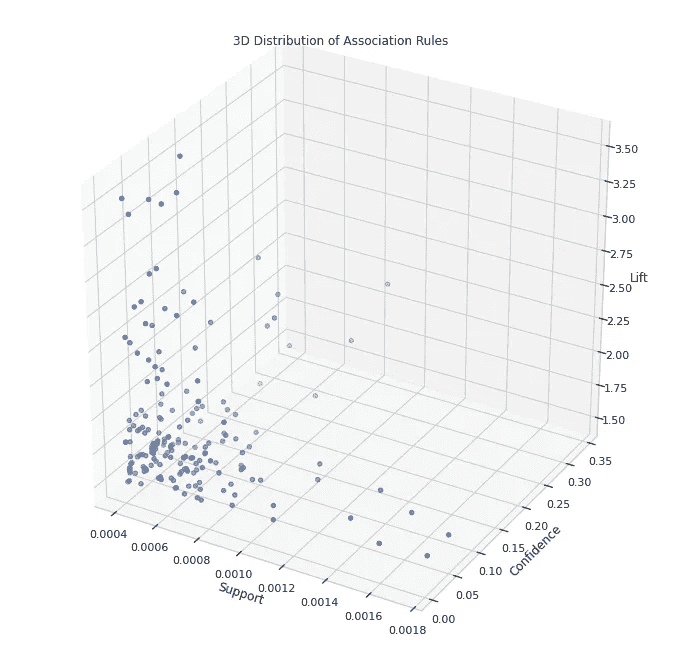

作者的 3D 散点图

*   查看产品之间关系的另一种可视化方式是通过网络图。让我们定义一个函数来画一个网络图，它可以指定我们想要显示多少规则。

***代号:***

***输出:***

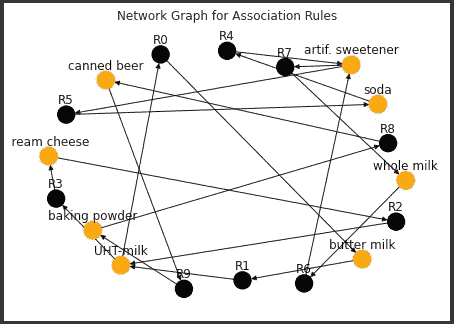

按作者划分的网络图

# 商业应用

假设杂货店购买了太多的全脂牛奶，现在担心如果不能及时销售出去，库存会过期。更糟糕的是，全脂牛奶的利润率如此之低，以至于他们无法在不牺牲太多利润的情况下享受促销折扣。

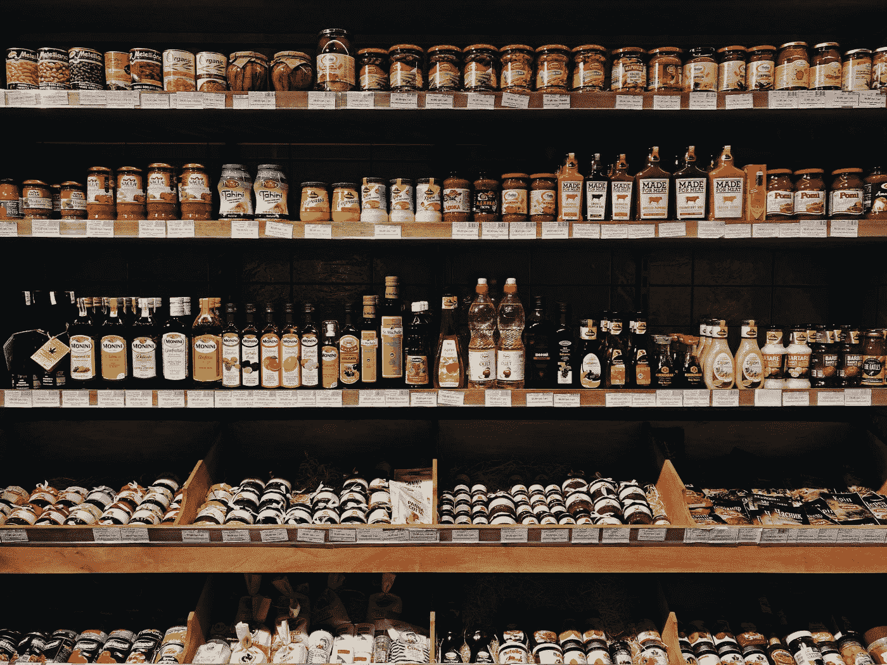

照片由[达莉亚·沃尔科娃](https://unsplash.com/@darias_big_world?utm_source=medium&utm_medium=referral)在 [Unsplash](https://unsplash.com?utm_source=medium&utm_medium=referral) 上拍摄

可以提出的一种方法是找出哪些产品推动了全脂牛奶的销售，并对这些产品提供折扣。

***代码:***

***输出:***

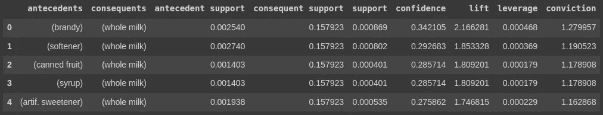

作者输出的代码

例如，我们可以对白兰地、软化剂、水果罐头、糖浆和人造甜味剂实行促销折扣。有些关联可能看起来违背直觉，但规则表明这些产品确实推动了全脂牛奶的销售。

# 外卖食品

通过实施 Apriori 算法和分析关联度量，企业可以衍生出许多数据驱动的策略来提高收入和利润。这些关联规则在分析消费者购买行为的数据挖掘中至关重要。零售商的一些最重要的战略，如客户分析、购物篮分析和产品聚类，都能够通过关联规则挖掘获得有价值的见解。

最后，非常感谢你读到最后。我希望你喜欢这篇文章！

照片由[刘汉宁·内巴霍](https://unsplash.com/@hannynaibaho?utm_source=medium&utm_medium=referral)在 [Unsplash](https://unsplash.com?utm_source=medium&utm_medium=referral) 上拍摄

# 参考

**【1】**默罕默德和阿科克。一种改进的关联规则 Apriori 算法。(2014).国际自然语言计算杂志。3.2014.3103

**【2】**d . h . Goh，R.P. Ang。[关联规则挖掘简介:在青少年咨询和求助行为中的应用。](https://doi.org/10.3758/BF03193156) (2007)。*行为研究方法* **39、**259–266

**【3】**拉什卡。[机器学习扩展文档](https://rasbt.github.io/mlxtend/)。(2021).检索自:https://rasbt.github.io/mlxtend/

**【4】**a .哈格伯格，d .舒尔特，p .斯沃特。 [NetworkX 参考版本 2.7.1](https://networkx.org/documentation/stable/_downloads/networkx_reference.pdf) 。(2022).检索自:https://networkx.org/

**【5】**h . ded hia。[根据 GPL 2](https://www.kaggle.com/datasets/heeraldedhia/groceries-dataset) 许可的杂货数据集。(2020).检索自:https://www . ka ggle . com/datasets/heeraldehia/杂货-数据集