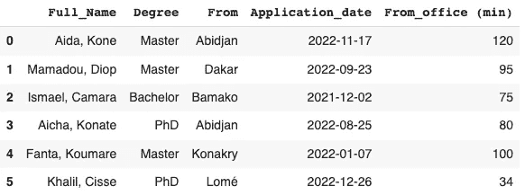
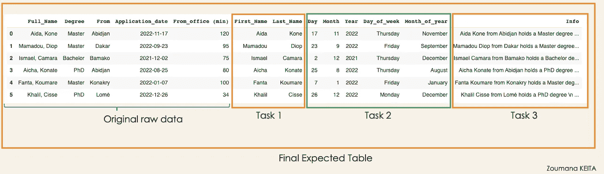
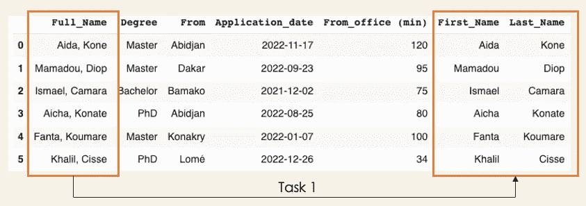
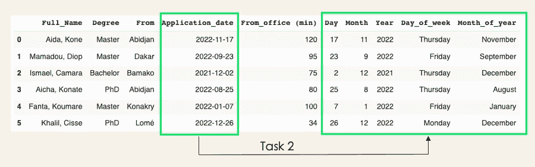
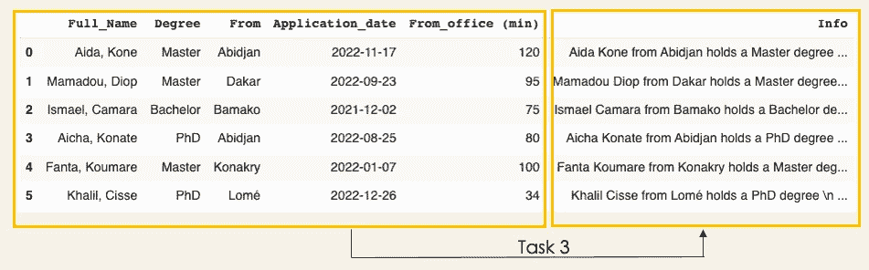

# Pandas 中使用流水线的数据预处理

> 原文：<https://towardsdatascience.com/data-preprocessing-using-pipeline-in-pandas-6170f4456796>

## 使用熊猫管道函数编写更好的代码

# 动机

现实生活中的数据会经历许多预处理阶段，如质量评估、清洗、转换、归约等。在大多数情况下，使用熊猫时，这些步骤的执行方式并不总是有效的。

如果我们能有一种方法，能够以最有效的方式在一个链中执行所有的处理功能，那会怎么样？这就是熊猫的`[**Pipe**](https://pandas.pydata.org/docs/reference/api/pandas.DataFrame.pipe.html)`派上用场的地方。

在这篇短文中，我们将首先了解熊猫的烟斗是什么。然后，我们将介绍几个实践案例来展示它的作用。

# 开始

在本节结束时，您将理解什么是`Pipe`，然后在对数据集有了一个好的概念之后，对我们试图解决的业务问题有一个更好的理解。

## 什么是管道？

Pipe 是一个 Pandas 函数，用于通过将前一个函数的结果传递给链中的下一个函数来执行多个函数。这是一个很好的方法，可以使代码更清晰，可读性更好。

现在我们知道我们正在处理什么，让我们看看实践案例的数据集。

## 让我们创建数据集

这个数据集可能对招聘经理更有意义。但是，如果你不是，就不用担心😀。基本上，它存储了来自不同非洲大城市的申请人的信息。正如您在下面看到的，大多数列都是不言自明的。

pipe _ candidates.py



候选人的原始信息(图片由作者提供)

*   `Full_Name`是候选人的全名。
*   `Degree`是申请期间考生的学位。
*   `From`对应于候选人来自哪里。
*   `Application_date`是候选人申请职位的时间。
*   `From_office (min)`是到求职者所在城市的公司办公室的通勤时间(以分钟为单位)。

## 问题陈述

基于这些信息，招聘经理希望您作为数据科学家创建下表，以帮助他获得关于每个候选人的更详细的信息。



基于业务需求的最终预期表格(图片由作者提供)

## 使用管道前的独立预处理

在弄脏我们的手之前还有一件事！我们需要为图像中显示的每个任务实现相应的功能。本节的目标是在使用 Pipe 获得最终结果之前，以独立的方式执行每个任务的结果。

**→任务 1:全名中的名和姓:**全名的格式如下[名][逗号][姓]。所以我们可以使用下面的函数来完成这项工作。

结果 _ 任务 1.py

从第 11 行，我们从任务 1 的执行中得到以下结果。



任务 1:从全名到名和姓(图片由作者提供)

**→任务 2:** 我们要从申请日期，日，月，年，星期几，年中的月。

结果 _ 任务 2.py

从第 15 行，我们从任务 2 的执行中得到以下结果。



任务 2:从申请日期到更详细的时间信息(图片由作者提供)

**→任务 2:** 让你的招聘经理满意的最后一个任务是为每个候选人创建一条如下格式的文本信息，其中[候选人]是候选人的全名:

> [候选人]拥有[学位]，住在离办公室[From_office (min)]的地方。

结果 _ 任务 3.py



任务 2:从所有栏目中生成候选人信息(图片由作者提供)

## 函数与管道链接

既然我们已经知道了每个函数的工作原理以及它们的预期结果，那么是时候使用 Pipe 将它们全部合并到一个管道中了。使用 Pipe 不需要额外的库，因为它是一个 Pandas 内置函数，一般语法如下:

```
final_dataset = (my_original_data.
                 pipe(my_first_function, "single_column").
                 pipe(my_second_function, "[col1, ...colN]").
                 pipe(my_third_function).
                 ...
                 pipe(my_nth_function)
                 )
```

*   `final_dateset`是应用所有函数后的最终预处理数据集。
*   `my_original_data`是原始数据集。
*   `pipe(my_first_function, "single_column")`意味着`my_first_function`需要`single_column`来完成任务。
*   `pipe(my_second_function, "[col1, ..., colN]")`表示`my_second_function`需要`[col1, ..., colN]`完成任务。
*   `pipe(my_second_function,)`意味着不需要指定列名。

下面是前面格式对应的管道逻辑。请注意，在我们的案例中，顺序并不重要。但是如果我们需要名字和姓氏来计算 Info 列，这是可能的，这不是我们在这里所做的，因为我们直接使用全名。

创建 _ 管道. py


使用 Pipe 将 1 到 3 的所有任务组合在一起的最终结果(图片由作者提供)

# 结论

恭喜你！🎉 🍾您刚刚学习了如何使用 Pandas Pipe 进行多功能链接！我希望这篇文章是有帮助的，它将帮助您把预处理任务提高到一个新的水平。

此外，如果你喜欢阅读我的故事，并希望支持我的写作，可以考虑[成为一个媒体成员](https://zoumanakeita.medium.com/membership)。每月支付 5 美元，你就可以无限制地阅读媒体上的故事。

欢迎在[媒体](https://zoumanakeita.medium.com/)、[推特](https://twitter.com/zoumana_keita_)和 [YouTube](https://www.youtube.com/channel/UC9xKdy8cz6ZuJU5FTNtM_pQ) 上关注我，或者在 [LinkedIn](https://www.linkedin.com/in/zoumana-keita/) 上问好。讨论人工智能、人工智能、数据科学、自然语言处理和人工智能是一种乐趣！

**链接到源代码→** [**此处**](https://github.com/keitazoumana/Medium-Articles-Notebooks/blob/main/Pandas_Pipe.ipynb)

再见🏃🏾‍♂️