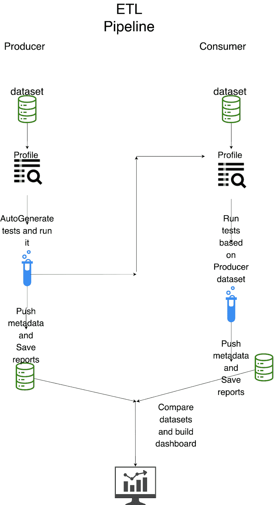
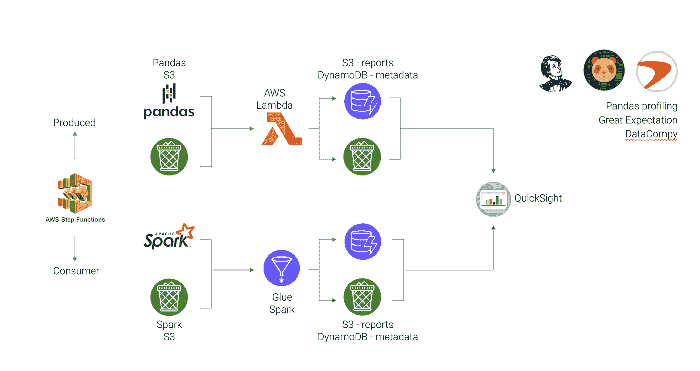
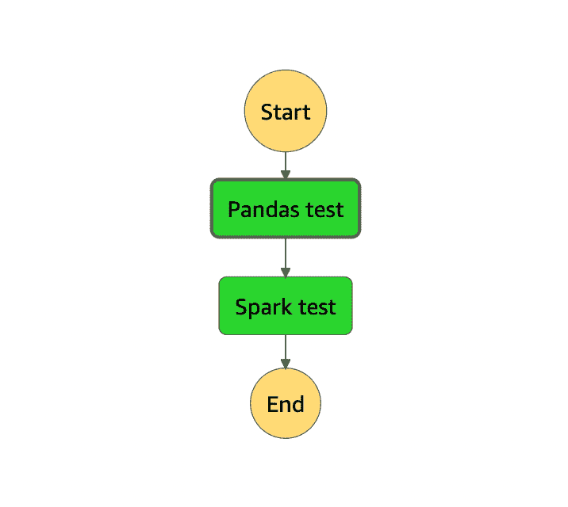
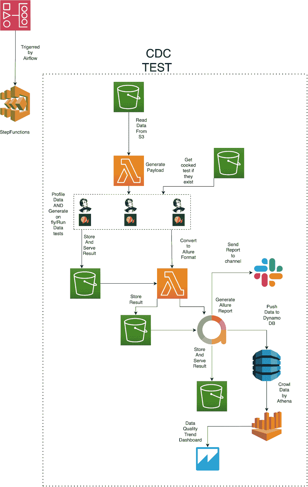
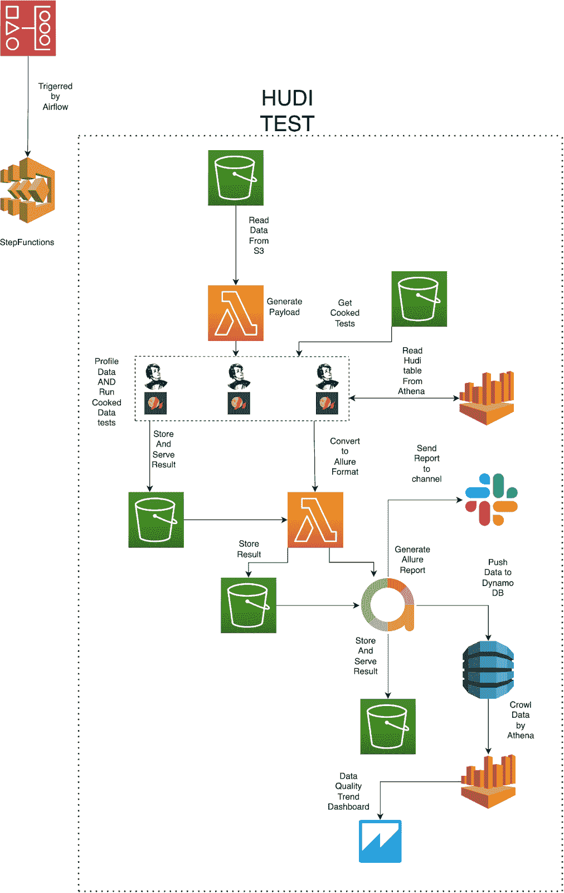

# AWS Glue 和 Great Expectations 上的数据质量比较/用 V3 API 更新

> 原文：<https://towardsdatascience.com/data-quality-comparison-on-aws-glue-and-great-expectations-70af5bdfe39c>


图片来自 [freepik](https://www.freepik.com/) 的 [anustudio](https://www.freepik.com/anustudio)

在我以前的文章([贴一](/monitoring-data-quality-in-a-data-lake-using-great-expectations-and-allure-built-serverless-47fa1791af6a)和[贴二](/fast-data-quality-framework-on-great-expectations-8921331a08c2))中，我描述了如何处理存储为中等大小(~500 MB)的 Apache Parquet 文件的同构数据源。但是如果需要处理大数据呢？如何在 AWS 上用《远大前程》来测试？如何比较两个非同质数据集？在本文中，我将探索一种方法来做到这一点。

# 挑战

Provectus 数据工程团队正在开发由 Pandas 引擎支持的数据管道。最初，Pandas 已经足够了，但是随着数据量的增长，该团队面临着 Pandas 在处理大数据方面的局限性。他们的解决方案是使用阿帕奇火花，而不是熊猫。虽然这是合理的，但他们还需要确保新算法不会出现数据问题。他们正在寻找一种方法来比较他们在 Pandas 上的小型黄金数据集和 Apache Spark 上的大型数据集。有了这些信息，我们开始设计解决方案。

# AWS 胶水

首先，我们需要一个可以读取大数据帧的工具。我们排除了对我们的基本解决方案做太多改变的可能性，因为 Pandas Profiling 只适用于 Pandas，而且我们还没有尝试对 Apache Spark 使用 Great Expectations。所以，我们开始了探索过程。

我们的第一个选择是用黄昏代替熊猫。然而，在对 AWS Lambda 进行测试后，很明显它没有改变任何东西——机器无法将如此大量的数据上传到 RAM，以有效地读取 df。

我们的第二个选择是使用 AWS Glue Python，因为它可以处理开箱即用的熊猫。在这个实例中安装必要的库是一个相当大的挑战，结果是不可接受的——我们再次收到 OutMemoryError。

我们最后的选择是尝试使用 Apache Spark。这里我们有两种可能的变体:AWS Glue Spark 和 Amazon EMR。我们选择尝试 AWS Glue Spark，因为这只是一个实验，我们不打算推出基础设施或任何其他组件。最重要的是，AWS Glue 是无服务器的，这满足了使用无服务器服务的需求。

在这一步中，我们需要完成两个基本操作:概要分析和数据测试。我们通常使用 Panda Profiling 作为分析工具，但是它没有 Spark 实现。相反，我们决定使用 [spark_df_profiling](https://github.com/julioasotodv/spark-df-profiling) ，它基于 Pandas Profiling，但支持 spark。Great Expectations 也支持 Spark，所以数据测试部分很容易。

最大的挑战是发布带有必要库的 AWS Glue Spark:
1。使用带有亚马逊 S3 适配器的预配置 great_expectations.yaml 将您的初始 Great Expectations 文件夹上传到亚马逊 S3

**V3 API 通用电气:**

2.使用作业参数创建 AWS Glue Spark 作业来安装库:

```
*— additional-python-modules* ***awswrangler, great_expectations,*** [***https://github.com/julioasotodv/spark-df-profiling/archive/master.zip,***](https://github.com/julioasotodv/spark-df-profiling/archive/master.zip,) ***pyyaml, datacompy***
```

3.照常初始化库

V2:

V3:

4.把 ge.yaml 和 df 读成 Spark

5.使用 spark_df_profiling 进行配置，并动态更改 Great Expectations 配置

6.初始化远大的期望并开始运行测试

V2:

V3:

7.读取 Pandas 数据集并运行 DataComPy

之后，你会收到预期的结果。

稍微介绍一下 [DataComPy](https://github.com/capitalone/datacompy) :它是一个可以显示统计数据和模式变化的库。它使我们能够从测试角度获得更多的数据可见性，并为我们提供关于数据集的附加信息。

```
DataComPy Comparison--------------------DataFrame Summary-----------------DataFrame  Columns  Rows0  original        5     61       new        4     5Column Summary--------------Number of columns in common: 4Number of columns in original but not in new: 1Number of columns in new but not in original: 0Row Summary-----------Matched on: acct_idAny duplicates on match values: YesAbsolute Tolerance: 0.0001Relative Tolerance: 0Number of rows in common: 5Number of rows in original but not in new: 1Number of rows in new but not in original: 0Number of rows with some compared columns unequal: 5Number of rows with all compared columns equal: 0Column Comparison-----------------Number of columns compared with some values unequal: 3Number of columns compared with all values equal: 1Total number of values which compare unequal: 7Columns with Unequal Values or Types------------------------------------Column original dtype new dtype  # Unequal  Max Diff  # Null Diff0  dollar_amt        float64   float64          1    0.0500            01   float_fld        float64   float64          4    0.0005            32        name         object    object          2    0.0000            0Sample Rows with Unequal Values-------------------------------acct_id  dollar_amt (original)  dollar_amt (new)0  10000001234                 123.45             123.4acct_id  float_fld (original)  float_fld (new)0  10000001234            14530.1555        14530.1555  10000001238                   NaN          111.0002  10000001236                   NaN            1.0001  10000001235                1.0000              NaNacct_id name (original)            name (new)0  10000001234  George Maharis  George Michael Bluth3  10000001237      Bob Loblaw         Robert LoblawSample Rows Only in original (First 10 Columns)-----------------------------------------------acct_id  dollar_amt           name  float_fld    date_fld4  10000001238        1.05  Lucille Bluth        NaN  2017-01-01
```

# 生产者和消费者的概念

我们已经学习了如何使用 Apache Spark 的必要工具集。让我们回到第一步，更深入地研究比较概念。主要思想很简单:您需要一个黄金数据集(生产者)并基于它生成测试，然后对它运行，并对目标数据集(消费者)运行这些测试，以比较质量。要访问所有报告，您需要实现一个元数据存储和一个 BI 仪表板。

在这里，您可以看到参考架构:



作者图片

# 管道

为了实现参考架构，让我们重新使用我们的基本解决方案和 AWS Step 函数和 AWS Lambda。(查看[这篇文章](/monitoring-data-quality-in-a-data-lake-using-great-expectations-and-allure-built-serverless-47fa1791af6a)了解技术细节。)您需要:

1.  对 pandas_df 运行分析
2.  动态生成测试
3.  针对 spark_df 运行分析
4.  针对 spark_df 运行准备好的测试
5.  运行 DataComPy



作者图片

这里只需要一个技术说明:在生产者步骤中，我们将项目推送到元数据存储，并保存到有效负载 id；在消费者步骤中，我们需要更新这个项目。

从 ETL 的角度来看，这看起来很简单:



作者图片

# 实施理念

上述经验帮助我们为我们的一个客户 [Lane Health](https://lanehealth.com/) 实施了一个数据 QA 解决方案。挑战在于车道健康数据是不均匀的，并且获取和读取数据的方式有很大不同。创建一个用于处理高负载的通用管道并不容易。我们将其构建为一个两步解决方案:

1.  从 PostgreSQL CDC 迁移到亚马逊 S3
2.  Apache 胡迪上的数据转换



作者图片



作者图片

# 结论

本文探索了使用带有 AWS Glue (Apache Spark ETL)的 Great Expectations 来比较两个数据集的质量的方法，而不需要行比较、字节大小等。我们为我们的一个商业客户演示了这种[数据质量方法](https://provectus.com/data-quality-assurance/)的实现。

如果您有任何问题或建议，欢迎在下面的评论中联系我，或者直接联系 [LinkedIn](https://www.linkedin.com/in/bogdan-volodarskiy-652498108/) ！