# 使用 SQL 进行数据检索—教程和示例

> 原文：<https://towardsdatascience.com/data-retrieval-with-sql-tutorial-examples-a4b6b4b8f816>

## 带示例和备忘单的 SQL 教程


一个组织良好的图书馆。E 2

我们都听说过各种公司，如谷歌、脸书和苹果，如何通过各自的网站、服务和产品收集客户信息和活动。现在，让我们假设其中一家公司的数据科学家想要查看存储的客户数据，以找到业务问题的解决方案。在开始分析和建模之前，科学家将使用结构化查询语言或 SQL(类似于“sequel”)来检索存储的数据。在这篇文章中，我们将回顾什么是 SQL，并通过例子学习如何使用它。

在我关于[亚马逊数据科学家角色要求的主要帖子](https://medium.com/@fmnobar/data-scientist-role-requirements-bbae1f85d4d5)中，我将“数据检索”确定为每个数据科学家都应该具备的首要能力，并将在面试过程中接受测试。作为一名科学家，我发现自己在数据检索和数据分析/建模之间来回穿梭，因此我认为数据检索是我们数据科学家候选人的一项关键能力。

我们将通过附带的脚本来介绍数据科学家日常工作中使用的一些最常见的 SQL 函数，这样您也可以在我们一起解决问题的过程中跟随并继续学习。这一部分以 16 个问题和答案的形式出现，我在回答中进一步解释了每个主题。我建议您跟随并尝试编写自己的查询，以最大限度地学习。最后，我还将提供我在学习 SQL 时开发的备忘单。

我们开始吧！

[](https://medium.com/@fmnobar/membership) [## 加入我的介绍链接-法扎德 Mahmoodinobar 媒体

### 阅读法扎德(以及媒体上的其他作家)的每一个故事。你的会员费直接支持法扎德和其他…

medium.com](https://medium.com/@fmnobar/membership) 

# 先决条件

为了使用您可以理解的真实示例，首先我们将创建两个名为“people”和“salary”的临时表，然后这两个临时表将用于余下的练习。这种方法的好处是，您可以复制和粘贴表创建部分，然后按照以下步骤进行练习，以最大限度地增加学习机会。请注意，此时您不需要理解表格创建部分的工作，因为这只是为问答部分创建我们需要的内容。

请将下面的内容复制并粘贴到您最喜欢的 SQL 工具中，然后运行。

# 数据科学家最常用的 SQL 概念

## 1.基础

现在让我们看看我们在上面的两个临时表中创建了什么。我将把这些框成问题和答案，这样你也可以先尝试解决每个问题，然后再看我提供的答案。我提供的只是解决这些问题的一种方法——通常有不止一种正确的方法可以得到相同的答案。

**Q1:检索** `**people**` **表中所有可用的数据。**

A1:

一般来说，我将首先提供答案，然后解释发生了什么以及不同的 SQL 概念是如何工作的，无论是在同一个问题下还是在下一个问题下。例如，Q2 将解释在 Q1 发生了什么。

```
SELECT
 *
FROM
 people;
```

结果:

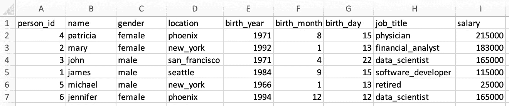

为了将来参考，这是表`salary`的样子，使用如下:

```
SELECT
 *
FROM
 salary;
```

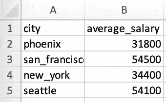

***专业提示:*** 此时，我建议您给这两个表拍个快照——我在下面添加了如何拍快照的说明。在这篇文章中，你会想要回头参考这些表来编写查询，然后上下滚动，发现这两个表并不有趣。为了方便起见，我提供了如何在 Mac 和 Windows 上拍摄快照的说明:

*   **Mac 用户—** 同时按住这三个键:Shift、Command 和 4，然后选择要拍摄快照的区域。如果您不希望手动选择快照区域，同时按下 Shift、Command 和 3 将打印屏幕。
*   **Windows 用户—** 同时按下这三个键:Windows 键+ Shift + S，然后使用 Snip 和 Sketch 工具创建一个快照(我在 Mac 上，所以这是基于谷歌搜索的—希望它能起作用)。

Q2:解释一下在之前的查询中发生了什么。

A2: `SELECT`语句用于从给定的数据库(即表)中选择数据。`FROM`用于指示应该从哪个数据库中选择数据(本例中为“people”)。最后`*`简单地说从数据库中选择一切。

**Q3:仅检索以下各列的数据:** `**['name', 'gender', 'job_title']**` **。**

A3:

```
SELECT
 name,
 gender,
 job_title
FROM
 people;
```

结果:


这一步很简单——我们可以明确指出要选择哪些列。

## 2.过滤

哪些人在纽约工作？

A4:

```
SELECT
 name
FROM
 people
WHERE
 location = 'new_york';
```

结果:

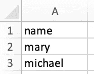

如本例所示，我们可以使用`WHERE`过滤结果。

## 3.聚集

聚合帮助我们对数据进行一些基本的分析。例子包括`COUNT()`、`MAX()`、`MIN()`、`AVG()`、`SUM()`。

有多少人住在西雅图或菲尼克斯？

A5:

```
SELECT
 count(person_id)
FROM
 people
WHERE
 location IN ('seattle', 'phoenix');
```

结果:

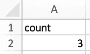

每个城市有多少人居住？

A6:

```
SELECT
 location,
 count(person_id)
FROM
 people
GROUP BY
 location;
```

结果:

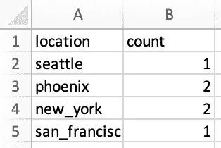

从上一个问题中我们已经知道了`COUNT()`的作用，但是现在在查询的末尾还有一个新概念。`GROUP BY`语句将具有相同值的数据行组合在一起，用于聚合函数，如`COUNT()`、`MAX()`、`MIN()`、`AVG()`和`SUM()`。

凤凰城和纽约的总工资是多少？

A7:

```
SELECT
 location,
 SUM(salary) AS total_salary
FROM
 people
WHERE
 location = 'phoenix'
 OR location = 'new_york'
GROUP BY
 location;
```

结果:

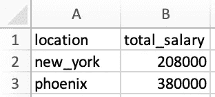

这个例子中有两个新的知识。首先，在这个例子中，我们给`SUM()`列分配了一个别名，结果列现在被命名为`total_salary`。如果我们没有这样做，该列将如下所示:

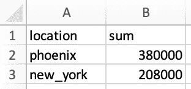

第二次学习是另一种方法。注意在`WHERE`中，我们使用的是`OR`，这决定了`location`可以是`phoenix`也可以是`new_york`。或者，我们可以使用`location IN ('phoenix', 'new_york')`，类似于我们在 Q5 中使用的方法。这不会改变结果，只是一种替代方法。

# 4.连接

这是最有用的特性之一。当试图理解查询时，它有助于可视化数据。让我们先看一个例子，然后我会解释发生了什么。

**Q8:检索个人姓名、他们的位置和薪水，以及每个位置的平均薪水。**

回答 8:请注意，这是一个我们以前没有解决过的新型问题。个人姓名、工作地点及其工资见表`people`，而按工作地点划分的平均工资见表`salary`。我们需要的是将这两个表`JOIN`在一起，这是可能的，因为这两个表有共同的城市名称(尽管列在`people`中被命名为`location`，在`salary`中被命名为`city`)。我们的结构如下:

```
SELECT
 p.name,
 p.location,
 p.salary,
 s.average_salary
FROM
 people p
 LEFT JOIN salary s ON p.location = s.city;
```

结果:

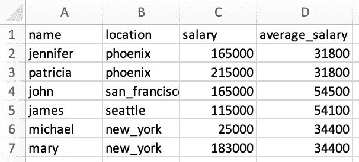

那么到底发生了什么？让我们更仔细地看看联接:

```
FROM
 people p
 LEFT JOIN salary s ON p.location = s.city
```

上面说看表`people`然后将其连接到表`salary`。然后，我们需要指出每个表中共享相同值的列(想象一下，只有在这两个特定的列中有公共值时，才把这两个表缝合在一起)。具有相互值的列是来自`people`的`location`和来自`salary`的`city`。最后，我们在这里使用别名的概念。例如，表`people`现在的别名是`p`，而表`salary`的别名是`s`。当我们想要从`people`中指示列`location`时，我们可以将其指示为`people.location`或`p.location`。这同样适用于我们如何将列`city`从`salary`表示为`s.city`。注意结构总是如`table_name.column_name`所示。最后，我们在这个例子中使用了一个`LEFT JOIN`。下面我将讨论这意味着什么，以及还有什么其他方式来连接表。

如上所述，我们在这个例子中使用了一个`LEFT JOIN`。在思考`JOIN`如何工作时，记住下面的图片是有帮助的。

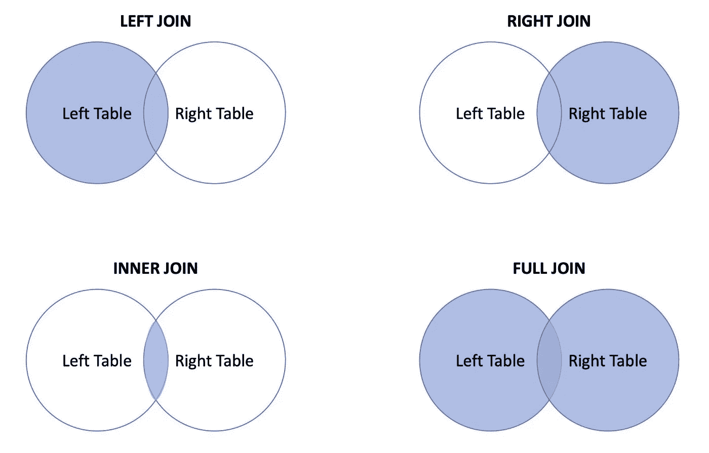

连接的可视化(由作者创建)

以下是一些最常见的`JOIN`类型:

*   `JOIN`或`INNER JOIN`:返回左表和右表中有匹配值的数据。
*   `LEFT JOIN`或`LEFT OUTER JOIN`:返回左表数据和右表所有匹配的数据。
*   `RIGHT JOIN`或`RIGHT OUTER JOIN`:这是`LEFT JOIN`的反面。它返回右表中的数据和左表中所有匹配的数据。
*   `FULL JOIN`或`FULL OUTER JOIN`:当左表或右表匹配时，返回左表或右表的所有数据

# 5.条件式

**Q9:在** `**people**` **中创建一个新列，将职位细分为技术和非技术。只返回姓名、职位名称，新的类别命名为** `**job_group**` **和工资。**

A9:为了回答这个问题，首先我们需要使用以下查询来查看`people`中有哪些独特的职位:

```
SELECT
 DISTINCT job_title
FROM
 people;
```

请注意，`DISTINCT`是添加到`SELECT`中的语句，只返回该列中的唯一值，如下面的结果所示:

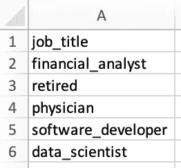

既然我们已经知道了现有的职位名称，我们可以按照指示将它们分为技术和非技术。在本练习中，使用您的最佳判断来确定什么是技术角色，什么是非技术角色，重要的是学习如何在查询中实现此逻辑。比如`financial_analyst`是非技术角色，而`data_scientist`是技术角色。以下查询就是这样做的:

```
SELECT
 name,
 job_title,
 CASE
  WHEN job_title IN ('software_developer', 'data_scientist') THEN 'tech'
  WHEN job_title IN ('financial_analyst', 'physician') THEN 'non-tech'
  ELSE job_title
 END AS job_group,
 salary
FROM
 people;
```

结果:

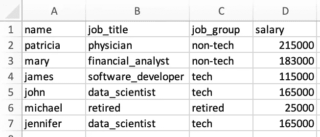

让我们通过更仔细地看我们为这个问题所做的来讨论一下`CASE`表达式是如何工作的:

```
CASE
  WHEN job_title IN ('software_developer', 'data_scientist') THEN 'tech'
  WHEN job_title IN ('financial_analyst', 'physician') THEN 'non-tech'
  ELSE job_title
 END AS job_group,
```

为了实现这个逻辑，我们首先从`CASE`表达式开始，然后使用`WHEN`确定条件，例如:

```
WHEN job_title IN ('software_developer', 'data_scientist') THEN 'tech'
```

上面的脚本首先查看列`job_title`，如果任意行的该列的值为`software_developer`或`data_scientist`，则输出`tech`。同样的逻辑也适用于`non-tech`类别。

然后就是`ELSE job_title`。该子句说明，如果在上面的`WHEN`条件下遇到了列中没有的值，则返回列`job_title`中存在的值。例如，如果我们在列`job_title`中有一行的值为`chef`，因为`chef`不在我们包含在`WHEN`条件中的那些条件中(即`software_developer`、`data_scientist`、`financial_analyst`和`physician`)，那么该子句将返回列`job_title`中的原始值，即`chef`。

脚本的最后一部分是`END AS job_group`。`CASE`表达式以`END`结束，而`AS job_group`是给结果列的别名。这就是在结果表中将列命名为`job_group`的原因。

> **Pro 提示:**从`WHEN`开始的条件语句的顺序很重要。一旦条件为真，它将停止读取其余条件并返回结果。如果不满足任何条件，它将返回`ELSE`子句中的值。

**Q10:哪个** `**job_group**` **平均赚钱多？将结果从最高的** `**job_group**`到最低的**排序。**

A10:我会用两种方法来回答这个问题，每种方法都会引入新的概念。首先，我将介绍一种方法来展示如何在查询的输出中直接使用`FROM`，然后我将介绍一种不同的方法来演示`WITH`子句的应用。

***方法 1:***

```
SELECT
 job_group,
 AVG(salary) AS average_salary
FROM
 (
  SELECT
   person_id,
   CASE
    WHEN job_title IN ('software_developer', 'data_scientist') THEN 'tech'
    WHEN job_title IN ('financial_analyst', 'physician') THEN 'non-tech'
    ELSE job_title
   END AS job_group,
   salary
  FROM
   people
 )
GROUP BY
 job_group
ORDER BY
 average_salary DESC;
```

结果:


那么到底发生了什么？过去我们总是在`FROM`后面包含一个表名，但是这里的新概念是我们也可以包含一个内部查询来代替表名。首先运行`FROM`之后的内部查询，然后将结果用作临时表，从外部查询中选择数据。

***方法二:***

我将首先介绍这种方法中使用的查询，然后解释查询中的每个步骤。让我们首先从查询开始:

```
WITH count_table AS(
 SELECT
  CASE
   WHEN job_title IN ('software_developer', 'data_scientist') THEN 'tech'
   WHEN job_title IN ('financial_analyst', 'physician') THEN 'non-tech'
   ELSE job_title
  END AS job_group,
  count(person_id) as total_count
 FROM
  people
 GROUP BY
  1
),
total_salary_table AS(
 SELECT
  CASE
   WHEN job_title IN ('software_developer', 'data_scientist') THEN 'tech'
   WHEN job_title IN ('financial_analyst', 'physician') THEN 'non-tech'
   ELSE job_title
  END AS job_group,
  SUM(salary) as total_salary
 FROM
  people
 GROUP BY
  1
)
SELECT
 ct.job_group,
 tst.total_salary / ct.total_count as average_salary
FROM
 count_table ct
 INNER JOIN total_salary_table tst ON ct.job_group = tst.job_group
ORDER BY
 average_salary DESC;
```

现在让我们更仔细地看看发生了什么。

首先，我们将使用`WITH`子句创建一个名为`count_table`的临时表。这个临时表格显示了每个`job_group`内有多少个人，如下所示:

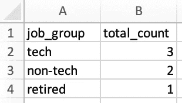

接下来，我们将创建第二个名为`total_salary_table`的临时表，显示每个`job_group`的总工资，如下所示:

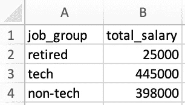

现在我们有了这两个表，我们可以将它们连接在一起，找出每个`job_group`的平均工资，如下所示:


这里的结果与预期的方法 1 的结果相匹配。

# 6.窗口功能

这些功能在最初的时候更难想象，所以如果你不能马上理解，不要失望。浏览几个例子，你会开始更好地理解它们。我们通常在面试中包括这些，所以我建议你理解并练习这些。

窗口函数通常在一组相关的表格行中执行计算。换句话说，它们在某种程度上类似于带有一些警告的聚合。与聚合不同，窗口函数不会将行组合在一起。这将通过例子变得更加清楚。

窗口功能的几个例子是:`COUNT()`、`AVG()`、`SUM()`、`ROW_NUMBER()`、`RANK()`、`DENSE_RANK()`、`LAG`和`LEAD`，它们的结构如下:

```
window_function(column_name) OVER (
 PARTITION BY 
  column_name
 ORDER BY
  column_name ROWS BETWEEN UNBOUNDED PRECEDING
  AND UNBOUNDED FOLLOWING
) AS output_alias;
```

上面的例子显示了如何构造窗口函数的最常见的元素，但并不是所有的都是必要的。我知道到目前为止这是没有意义的，所以让我们在实践中看看其中的一些，以便更好地理解它们。

**Q11:从最高工资到最低工资，按性别创建一个总体工资等级。**

A11:

```
SELECT
 name,
 gender,
 salary,
 RANK() OVER(
  ORDER BY
   salary DESC
 ) AS salary_rank_overall,
 RANK() OVER(
  PARTITION BY gender
  ORDER BY
   salary DESC
 ) AS salary_rank_by_gender
FROM
 people
ORDER BY
 salary_rank_overall,
 salary_rank_by_gender;
```

结果:


正如您在结果中看到的，使用`RANK()`窗口功能，我们能够从整体角度以及在每个男性或女性类别中对工资进行排名。在`OVER()`中，我们指出我们希望通过`gender`来分解(或“划分”)排名，并通过添加`ORDER BY salary DESC`从最高工资到最低工资进行排序。

**Q12:创建每个薪金的运行总和(即，第 2 行的总和应为第 1 行+第 2 行，第 3 行的总和应为第 1 行+第 2 行+第 3 行的总和，依此类推)，并按性别、年龄(从年长到年轻)排序。还包括一列显示每一行的总工资。**

A12:

```
SELECT
 name,
 gender,
 birth_year,
 salary,
 SUM(salary) OVER(
  ORDER BY
   birth_year ROWS between UNBOUNDED PRECEDING
   And CURRENT ROW
 ) AS running_total_salary_overall,
 SUM(salary) OVER(
  PARTITION BY gender
  ORDER BY
   birth_year ROWS between UNBOUNDED PRECEDING
   And CURRENT ROW
 ) AS running_total_salary_by_gender,
 SUM(salary) OVER(
  ORDER BY
   birth_year ROWS between UNBOUNDED PRECEDING
   And UNBOUNDED FOLLOWING
 ) AS total_salary
FROM
 people
ORDER BY
 running_total_salary_overall,
 running_total_salary_by_gender;
```

结果:

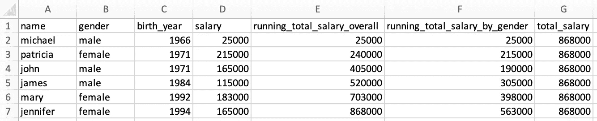

一旦你仔细阅读了下面的解释并与结果进行了比较，我相信你也会体会到窗口函数的强大。

这份报告使用了一些新的陈述，所以让我们更仔细地看一下。我们先来看以下内容:

```
SUM(salary) OVER(
  ORDER BY
   birth_year ROWS between UNBOUNDED PRECEDING
   And CURRENT ROW
 ) AS running_total_salary_overall,
```

`SUM(salary)`只是简单地把工资加起来，但是工资应该如何加起来才是更有趣的部分，在`OVER()`语句中有说明。首先，薪水按照个人出生年份从低到高排序，如`ORDER BY birth_year`(没有`DESC`告诉我们是升序)。然后`ROWS`告诉如何将`SUM()`应用于这些数据行。在这种情况下，求和应用于每行(`UNBOUNDED PRECEDING`)之前的所有行，包括行本身(`CURRENT ROW`)。

现在，如果我们希望每一行的总和包括特定行之前和之后的所有内容，会怎么样呢？这可以通过以下方式实现:

```
ROWS between UNBOUNDED PRECEDING
   And UNBOUNDED FOLLOWING
```

该结构用于计算查询的以下部分中的`total_salary`，您可以在结果部分中看到:

```
SUM(salary) OVER(
  ORDER BY
   birth_year ROWS between UNBOUNDED PRECEDING
   And UNBOUNDED FOLLOWING
 ) AS total_salary
```

因为对于每一行，我们希望得到给定行之前和之后所有行的总和，本质上我们要求查看在每一行的`total_salary`下显示的该列的总和，这对于每一行都是相同的`868,000`值。

# 8.杂项—联合运算符、空处理和日期管理

到目前为止，我们已经介绍了一些可以帮助您编写自己的查询的更常见的概念。在这一部分，我将涉及一些额外的话题，这些话题也能在面试中帮助你。

与上次类似，让我们首先创建两个名为`misc_part1`和`misc_part2`的新表，然后浏览概念。现在，只需复制、粘贴并运行下面的脚本，为练习的这一部分创建临时表。

***加分项(可选):*** 既然你对不同的 SQL 概念已经比较熟悉了，那就看看你复制粘贴的内容，看你能不能按照逻辑来。您可以看到，我们首先定义一个表，然后指定表中的列以及与每列相关联的数据类型，接着为每列添加值(以一行值的格式)。就是这样！现在，您可以创建自己的临时表，并开始从中检索数据！

现在让我们看看这些表是什么样子的。我将用下面的例子来看一下`mist_part1`:

```
SELECT
 *
FROM
 misc_part1:
```

结果:

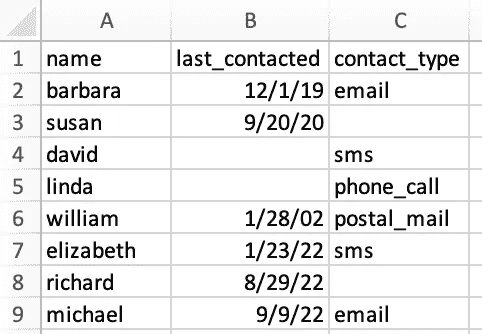

然后会用下面的来看`misc_part2`:

```
SELECT
 *
FROM
 misc_part2;
```

结果:

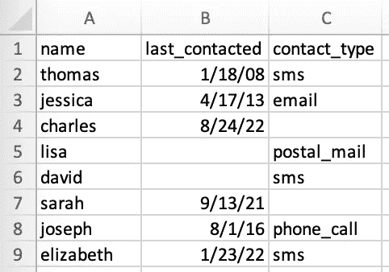

我们可以把这两个表想象成一些关于客户最后一次被联系的营销数据，以及他们是如何被联系的，比如通过电子邮件、电话等等。光看数据就有三个观察结果:

1.  这两个表有相同的列名，所以作为我们练习的一部分，也许有机会将它们合并，我们将在`UNION`下进一步探讨。
2.  有些值丢失了，这在`people`和`salary`表中并不存在。比如看`misc_part2`，单元格`B5`和`B6`都是空的。`misc_part1`也有一些缺失值。我们将讨论空处理。
3.  两个表都包含一个日期格式列，这是我们在`people`和`salary`表中没有的。我们将使用这些值进行一些日期操作。

与上次类似，您可以随意抓取这两个表格以供参考，然后让我们继续使用相同的问答格式来介绍一些新概念。

# 8.1.联合运算符

**Q13:我看到两个表包含相同的列。你能把它们组合成一张桌子吗？按名称对结果进行排序，并确定哪一行属于哪一个表。**

回答 13:请记住，我们从两个表开始，每个表包含 8 行数据(不包括标题)，因此我们希望合并后的表包含 16 行数据(不包括标题)。

这可以使用以下格式的`UNION ALL`来完成:

```
SELECT
 *,
 1 AS misc_table_number
FROM
 misc_part1
UNION ALL
SELECT
 *,
 2 AS misc_table_number
FROM
 misc_part2
ORDER BY
 name;
```

结果:

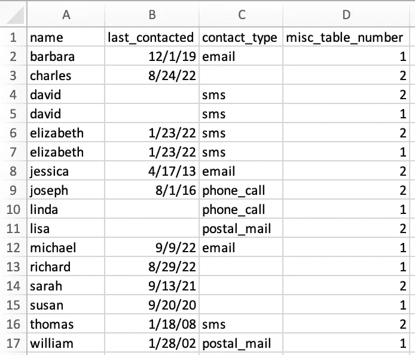

结果包括我们预期的 16 行数据(不包括标题)。我们来说说发生了什么。

`UNION ALL` operator 将来自每个查询的数据堆叠起来。要使其正常工作，需要满足一些条件:

1.  `UNION ALL`运算符中的每个`SELECT`必须具有相同的列数。例如，在我们的练习中，每个表包括 4 列。
2.  每个`SELECT`语句的对应列必须具有相同的数据类型。例如，两个表中的`name`都是`VARCHAR(30)`数据类型，或者两个表中的`last_contacted`都是`DATE`数据类型。
3.  每个`SELECT`语句的列必须是相同的顺序。换句话说，在我们的示例表中，两个表的顺序应该是`name`、`last_contacted`、`contact_type`、`misc_table_number`。在我们的例子中也满足了这个条件，这就是我们能够使用`UNION ALL`的原因。

**Q14:查看 Q13 的结果，看起来两个表都包含相同的** `**david**` **和** `**elizabeth**` **数据。您能否创建相同的表，但只包含唯一的行(例如，对结果进行重复数据删除)？不需要显示哪些表行属于哪个表行。**

A14:这可以通过使用`UNION`而不是`UNION ALL`很容易地完成。换句话说，`UNION`只选择不同的值，而`UNION ALL`选择所有的值。查询如下所示:

```
SELECT
 *
FROM
 misc_part1
UNION
SELECT
 *
FROM
 misc_part2
ORDER BY
 name;
```

结果:

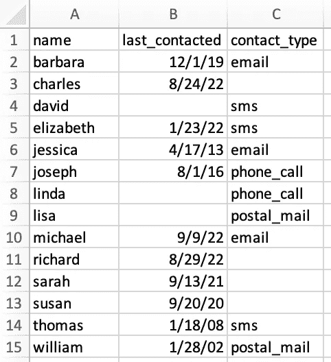

正如预期的那样，结果现在只包括不同的行，行的总数现在是 14(不包括标题)，而不是我们在 Q13 中看到的 16。

# 8.2.零处理

**Q15:创建一个名为** `**combined_table**` **的临时表，其中包含组合表的不同行(类似于 Q14)。在** `**last_contacted**` **值缺失的地方，输入值为** `**1901-01-01**` **。我们还知道，缺少的** `**contact_type**` **是** `**phone_call**` **，所以也要填充它们。**

A15:

```
WITH combined_table as (
 SELECT
  *
 FROM
  misc_part1
 UNION
 SELECT
  *
 FROM
  misc_part2
 ORDER BY
  name
)
SELECT
 name,
 NVL(last_contacted, '1901-01-01') as last_contacted,
 COALESCE(contact_type, 'phone_call') AS contact_type
FROM
 combined_table;
```

结果:

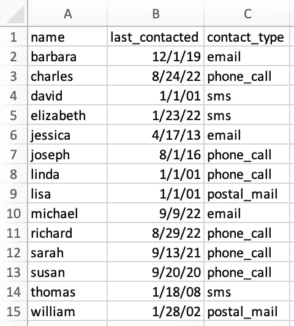

结果正如我们所料，所以让我们谈谈发生了什么。

我们在这个练习中使用了两个空函数，就我们的目的而言，它们都是相似的。当表达式为空时，它们都返回替代值。我想两个都用来展示，但你可以选择使用任何一个。让我们更仔细地看看它们:

```
NVL(last_contacted, '1901-01-01') as last_contacted,
COALESCE(contact_type, 'phone_call') AS contact_type
```

第一个是说当在列`last_contacted`中遇到 NULL 时，用`1901-01-01`替换它。类似地，第二个是说当在`contact_type`列中遇到 NULL 时，用`phone_call`替换它，如问题中所指示的。

***专业提示:*** 根据 SQL 环境的不同，语句可能略有不同，但概念保持不变。例如，`COALESCE()`用于 MySQL、SQL Server、Oracle 和 MS Access，而`NVL()`主要用于 Oracle。

# 8.3.日期管理

**Q16:从** `**combined_table**` **开始，为年、季度、月和最后一次联系个人的日期创建单独的列(如果有这样的日期)。**

A16:让我们先看看结构和结果，然后再讨论。

```
WITH combined_table as (
 SELECT
  *
 FROM
  misc_part1
 UNION
 SELECT
  *
 FROM
  misc_part2
 ORDER BY
  name
)
SELECT
 name,
 last_contacted,
 DATE_PART(year, last_contacted) AS year_contacted,
 DATE_PART(quarter, last_contacted) AS quarter_contacted,
 DATE_PART(month, last_contacted) AS month_contacted,
 DATE_PART(day, last_contacted) AS day_contacted,
 contact_type
FROM
 combined_table
WHERE
 last_contacted IS NOT NULL;
```

结果:

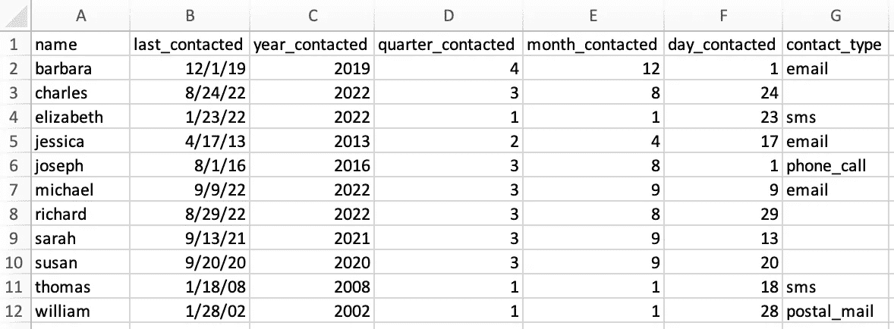

在这个练习中有两个新概念。第一种方法是从日期中提取一个特定的部分(例如，年、季度、月或日)，可以按如下方式实现:

```
DATE_PART(year, last_contacted) AS year_contacted,
```

想法很简单。`year`标识要提取日期的哪一部分，然后是原始日期所在的列名，在本例中是`last_contacted`。

第二个概念是过滤掉具有空值的行，这是使用以下方法实现的:

```
WHERE
 last_contacted IS NOT NULL
```

***Pro 提示:*** 在 SQL Server 中，不用`DATE_PART()`，一用`DATEPART()`。

# 小抄

我在这里附上了我为自己开发的备忘单。在你开始使用它之前，我有两个关于这个和其他备忘单的临别建议:

1.  如果可能的话，随着时间的推移建立你自己的备忘单，而不是依赖一个准备好的备忘单。与别人分享的相比，当你自己创建和更新它的时候，你会学到更多。
2.  如果您没有时间创建自己的备忘单，请使用现有的备忘单并将其制作成您自己的备忘单。我的意思是，从现有的小抄开始，然后添加、修改、编辑它，在某个时候它会变成*“你的”*小抄，你会在这个过程中继续学习。

# 摘要

在这篇文章中，我们首先讨论了使用 SQL 进行数据检索对于数据科学家的重要性。然后，在 16 道练习题和答案的帮助下，我们继续学习最常见的 SQL 概念。最后，提供了 SQL 中一些更常见概念的参考表，以供将来参考。

# 感谢阅读！

如果你觉得这篇文章有帮助，请[在媒体](https://medium.com/@fmnobar)上关注我，订阅接收我的最新文章！