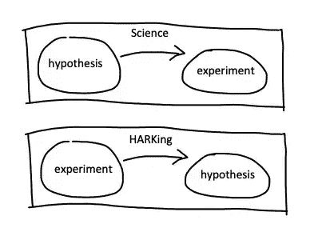

# 你应该知道的数据科学反模式

> 原文：<https://towardsdatascience.com/data-science-anti-patterns-you-should-know-1d8711eef72d>

## 通过理解潜在的模式来消除重复出现的棘手问题

杰里米·毕晓普在 [Unsplash](https://unsplash.com/s/photos/patterns?utm_source=unsplash&utm_medium=referral&utm_content=creditCopyText) 上的照片

一种反思维模式是对反复出现的问题的常见却适得其反的反应。因为它们是无效的，它们延续了重复出现的痛点，而没有解决潜在的、系统的问题。反模式几乎存在于人们一起解决问题的任何地方，在软件开发、项目管理中，是的，在数据科学中也是如此。

关于反模式的知识是避免它们的最好方法，所以在这篇文章中，我将分解我在自己的职业生涯中观察到的 5 种常见的数据科学反模式，即:

1.  临时过载，
2.  会议瘫痪，
3.  别针工厂，
4.  过度的简历驱动开发，以及
5.  听着。

(当然，这个列表并不完整，列表上的所有项目也不是数据科学领域独有的。)

准备好了吗？让我们开始吧。

# 临时过载

每个数据科学家都知道临时请求。它们是来自合作者和利益相关者的询问，例如…

*   *“哎，能不能快点再拉一遍这些数字？”，*
*   *“嘿，这个指标突然飙升，你能找出原因吗？”，*
*   *“嘿，那个指标突然*下降*，你能找出原因吗？”，*
*   *“嘿，有人在推特上发布了关于我们产品的奇怪事情，你能调出数据看看这是不是真的吗？”，*

如此等等。在最坏的情况下，临时请求可能会完全填满数据科学家的一天，导致[临时过载](/this-is-why-you-are-getting-so-many-ad-hoc-requests-edf3370484b8)。

👉取而代之的是:

**千万不要马上做。除非是紧急情况，否则不要立即处理请求，而是等到你收集了几个这样的请求，然后一次完成所有的请求，也许是在每周的一个专用时间段内(我过去常常在周五设置这样的时间段)。这个'[中断合并](/the-science-of-time-management-7297600e8a0e)有两个优点:**

*   首先，它减少了上下文切换。上下文切换的代价比看起来要高:“在一个项目中，20 分钟的中断需要两次上下文切换；戴夫·奥康纳在*网站可靠性工程:谷歌如何运行生产系统*中写道:“实际上，这种中断会导致损失几个小时真正有成效的工作。”。
*   其次，它发出了正确的信息。如果你马上处理特别的请求，人们可能会认为这是邀请你在未来提出更多特别的请求。这不是你想要的处境。

自动处理重复的临时请求。一个好的经验法则:如果你两次做一个小任务，第三次试着写一个自动化的脚本。例如，在 Amazon，我们的团队经常被要求准备一份我们拥有的所有模型的列表，以及某些元数据，例如自上次模型更新以来的时间。手动完成几次任务后，我安排了一个 ETL 任务，每周自动提取数据并通过电子邮件发送给相关的利益相关者。瞧，我再也不用去想那个任务了。

**当心不可行的数据洞察。**在编写任何 SQL 查询之前，请务必询问根据结果可以采取什么措施。如果你正在拉的数据点没有通知任何特定的业务行为，我们真的需要它吗？

# 会议瘫痪

你是被雇来解决问题的，不是来开会的。然而，几乎不可避免的是，会议量会随着你在一个组织中的任期而增加。如果你觉得因为会议你没有完成任何实际的工作，你就患上了会议瘫痪症。

👉取而代之的是:

**如果你没有贡献，就离开会议。如果你既没有在决策过程中贡献你的专业知识，也没有向他人展示任何东西，也没有学到任何对你有用的东西，那就离开吧。离开一个浪费你时间的会议并不粗鲁，但是浪费公司资源(包括你的时间)是不礼貌的。**

**跳过一次定期会议，看看会发生什么。有时你会发现自己在一系列定期会议的邀请名单上，即使你不确定是否真的需要你出席。亚马逊首席工程师 Steve Huynh 对这种情况有一个有用的建议:一周内，不要出现在下一次会议上，看看会发生什么。如果没有人问你在哪里，这意味着你可以从你的日历中永久删除这个会议系列。如果有人问起你的缺席，道歉并说你下次会回来的。**

感觉被授权重新安排会议。将四个 30 分钟的会议分散在一天中进行，与将它们全部放在上午的一个 2 小时时间段内进行，这两者之间有着巨大的差异。这是因为在前一种情况下，你会在“会议模式”和“深度工作模式”之间进行 4 次以上的上下文切换(8 次，而不是 2 次)，这实际上会耗费一整天的工作时间。因此，分批安排你的会议，比如尽量减少上下文切换，不仅符合你个人的最大利益，也符合公司的最大利益，因为他们为你的时间付钱。不要犹豫这样做。

# 别针工厂

这里有一个灾难的处方:让一个模型开发团队构建模型工件，并将它们交给一个工程团队进行部署。这种[引脚工厂](https://multithreaded.stitchfix.com/blog/2019/03/11/FullStackDS-Generalists/)的方法在实践中并不奏效，因为:

*   它引入了通信开销。建模团队和工程团队之间的反复增加了摩擦，减缓了迭代周期。ML 是一门经验主义学科，快速的迭代周期是成功的关键。
*   它错误地假设模型开发和部署是相互独立的。实际上，基础设施约束会影响建模决策，反之亦然。例如，深度神经网络可能需要调整以满足延迟要求。
*   当生产中出现问题时，它会带来在没有明确所有权的情况下相互指责的风险。例如，如果一个分类特征在生产中突然有一个打破模型的新类别，这是建模问题还是工程问题？两者都有，但是在引脚工厂的方法中，这个问题没有明确的归属。

👉取而代之的是:

与 pin factory 方法相反的是[端到端所有权](https://netflixtechblog.com/full-cycle-developers-at-netflix-a08c31f83249)，其中模型所有者拥有整个模型生命周期，包括数据收集、模型开发、离线/在线测试和部署。

为了让这种方法发挥作用，一个组织需要两种类型的 ML 角色，即 ML 基础架构工程师和模型开发人员(又名数据/应用/研究科学家)。ML infra 工程师构建、维护并拥有一组服务，这些服务抽象出围绕模型开发过程的基础设施，一个服务用于模型训练，一个服务用于特征工程，一个服务用于推理调用，等等。模型所有者使用这些服务来端到端地开发、测试和部署他们的模型。

前者拥有服务，后者拥有模型:这种方法工作得很好，因为它拥有清晰的所有权边界，并且几乎没有通信开销。

# 过度的简历驱动开发

ML 模型开发人员被激励在简单的解决方案可以完成的地方构建过于复杂的解决方案，只是因为复杂的解决方案在他们的简历或推广文档上看起来更好，这种现象被称为简历驱动的开发。从长远来看，这可能会为整个组织带来更高的维护成本，因为过于复杂的模型更难解释、调试和重新培训，并且会为培训和服务带来更高的基础设施成本。

👉取而代之的是:

因此，一个好的策略是保持生产系统尽可能简单，并为研究项目保留大胆的想法，这些想法可以产生出版物。LinkedIn 员工 ML 工程师 Brandon Rohrer 是这样说的:

> “ML 策略提示:当你有一个问题时，建立两个解决方案——一个运行在多云 Kubernetes 上的深度贝叶斯转换器和一个建立在一堆过分简化的假设上的 SQL 查询。一个放在简历上，另一个放在生产上。大家高高兴兴回家。”

# 听

作为一门实证学科，ML 的许多进展都是由实验推动的。然而，当模型开发人员把所有的东西都扔在一个问题上，“看看有什么坚持”时，事情就变得有问题了。这是[听](/machine-learning-science-or-alchemy-655bea25b227)的说法，即只有在大量实验的结果已知后才形成假设的做法。

科学与听觉。图片由作者提供。

由于统计学上的[看别处效应](/the-statistics-of-the-improbable-cec9a754e0ff)，倾听是危险的:你做的实验越多，你偶然发现一个看起来更好的模型的几率就越高。不用说，如果提出的模型被采纳，那么预期的模型改进实际上不会在生产中实现:这只是一个统计上的侥幸。

👉取而代之的是:

*   **永远遵循科学方法。**在进行任何实验之前，一定要明确提出一个假设。这可以简单到“我假设 BERT 模型比词袋模型更好，因为在这个问题中，词的上下文很重要，而不仅仅是它们的频率。”没有假设的实验不是科学，是伪科学。
*   **估计方差。**不要仅仅测量测试集上的模型准确性，还要尝试估计它的方差，这样你就知道这些变化在统计上有多大意义。例如，您可以通过 bootstrapping 来估计方差，即从测试集的不同随机子集(替换)中创建多个测量值。
*   [**不依赖线下指标**](https://medium.com/towards-data-science/is-my-model-really-better-560e729f81d2) **，可以轻松对局**。始终根据在线模型性能做出最终发布决定。
*   记录一切。即使一个实验不成功(不会提高模型性能)，也要记录下你尝试了什么，为什么要尝试，以及你发现了什么。留下这样的书面记录将有助于你理解和交流你是如何做出最终的建模选择的，并防止你(和其他人)再次尝试同样的事情。

# 最后的想法

让我们将这 5 种反模式及其各自的解决方案总结如下:

1.  避免临时过载:练习中断合并，
2.  避免会议瘫痪:离开实际上不需要你出席的会议，
3.  避免 pin 工厂:在支持端到端模型所有权的组织中工作，
4.  避免过多的简历驱动的开发:为你的研究论文保留疯狂的想法，而不是为了生产
5.  避免重复:在进行任何实验之前，始终遵循科学方法并制定一个假设。

当然，这份清单并不完整。一般来说，在日常工作中发现反模式的一个好方法是注意重复出现的痛点。例如，由临时过载引起的重复出现的痛点是频繁的上下文切换，这会降低您的工作效率。或者，由 pin 工厂引起的反复出现的痛点是必须频繁地在团队之间来回发送数据。注意重复出现的痛点，您可能会发现潜在的反模式。

最后，区分你可以打破的反模式和你不能打破的反模式。例如，通过遵循我在这里列出的步骤，你可以自己打破临时超载和会议瘫痪，至少在某种程度上。然而，对于像“pin factories”这样的组织反模式，作为一个个体贡献者，你真的没有什么可以做的。如果反模式是组织性的，你唯一能做的就是离开那个组织。

*📫* [*订阅*](/subscribe/@samuel.flender) *把我的下一篇文章直接发到你的收件箱。
💪* [*成为中等会员*](/@samuel.flender/membership) *并解锁无限权限。
📖* [*获取我的电子书*](https://samflender.gumroad.com/l/mlontheground) *，50 页挤满了来自战壕的实用 ML 见解。*