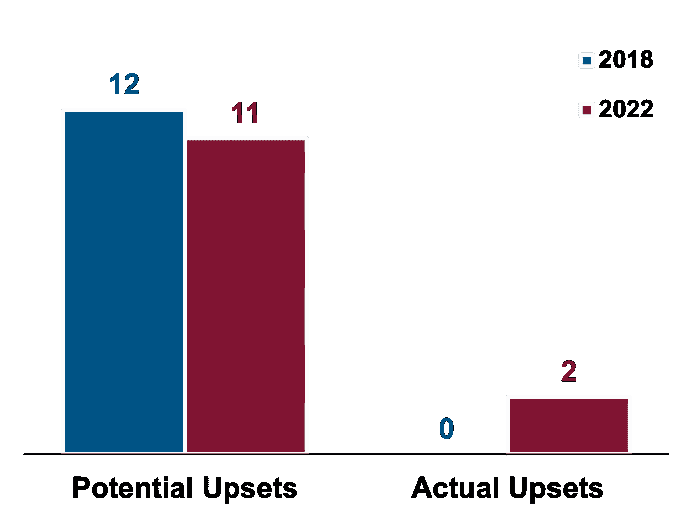

# 2022 年世界杯上的数据科学

> 原文：<https://towardsdatascience.com/data-science-at-the-2022-world-cup-43f24391c2d4>

## 意见

## 数据如何平衡竞争环境

2022 年世界杯正在进行中！总的来说，我喜欢体育的一个原因是，在很多方面，每一场比赛、每一个赛季和每一场锦标赛都可以被视为商业世界的缩影。

由[瑞德·路易斯](https://unsplash.com/@historysoccerof?utm_source=medium&utm_medium=referral)在 [Unsplash](https://unsplash.com?utm_source=medium&utm_medium=referral) 上拍摄的照片

从数据科学的角度来看，足球领域正在进行一场大数据革命。足球界最大的球队要么正在建立或扩充他们的数据科学部门。广播开始引入一些有意义的统计数据，这些数据至少有些实质内容。分析网站如雨后春笋般到处涌现，提供大量有趣的数据，让你垂涎三尺。

这是一场数据革命，在其他一些运动中发生得更早。特别是在棒球领域，许多数据科学家将迈克尔·刘易斯的*钱球*和内特·西尔弗(*信号和噪音*、*、*、[fivethirtyeeight](https://fivethirtyeight.com/)、佩科塔)作为数据科学在体育和商业领域的灵感来源。

但是，让统计学在棒球中如此成功的许多东西并不容易转化为足球。棒球是由离散的事件组成的。足球本质上是不稳定的。很难把一场足球比赛分成几个独立的事件，尽管已经取得了很大进展。从统计学的角度来看，足球比棒球多了一层抽象。

流动性和抽象性是减缓足球数据革命的重要原因。但是，它也更好地反映了商业中的数据科学。在商业领域，数据科学家试图做的大多数事情都可以归结为将一些流动、抽象、定义不清的概念转化为更容易理解的具体模型和数字。

这并不是要抨击棒球。棒球数据科学的成功是足球数据科学建设的必要一步，甚至是在商业社区。事实上，*信号和噪声*让我在数据科学领域面临的许多挑战中产生了共鸣。Nate Silver 在棒球和政治领域的成功让我感觉到数据科学解决方案在当今世界中有着如此强大的作用。

因此，虽然数据科学仍在足球领域发展壮大，但世界杯上出现了一些引人入胜的趋势，从整体上说明了数据科学。其中之一是重大扰乱事件的上升。在 2022 年世界杯的前 32 场比赛中，有 11 场比赛可能会产生重大冷门，有 2 场比赛实际上产生了重大冷门，而 2018 年世界杯在同一阶段产生了 0 场冷门。

在这里，爆冷被定义为国际足联排名第 15 位或以上的球队输给排名比他们差至少 20 位的球队，即阿根廷(排名第 3)输给沙特阿拉伯(排名第 51)。根据不同的定义，你可以在 2022 年看到 2-3 次颠覆，在 2018 年看到 0-2 次颠覆。运动员数了 3 个。一场*潜在的爆冷*是任何符合国际足联排名定义的比赛，无论结果如何。

随着数据进入一个新的领域，我们经常看到根深蒂固的竞争对手坚持他们的传统行为，并为此遭受痛苦。这是因为这些传统通常源自同一批根深蒂固的竞争对手。这些传统是过去那些团队、那些企业成功的原因。而那些传统，虽然经常被盲从，但一般都是制度知识的体现。它们是朝着最佳解决方案缓慢进化的行为，并将继续进化。这种缓慢的进化保护了根深蒂固的竞争对手免于犯危险的错误，但也抑制了他们像弱者一样快速创新的能力。

数据科学的强大之处在于，它提供了一种更快找到最佳解决方案的方法。它让处于劣势的一方很快学会那些根深蒂固的竞争对手花了几十年才弄明白的东西。从根本上说，数据科学，做得好的话，让我们量化情况，并快速提取有意义的模式，而不必亲自经历每种情况。有了数据科学，我们可以比以往任何时候都学得更快。我们可以为弱者创造公平的竞争环境。

因此，对于根深蒂固的竞争对手来说，当数据与现有传统不一致时，这是一个困难的局面。创新和学习存在于这些分歧中，但糟糕的建议和错误也是如此。此外，对于根深蒂固的竞争对手来说，根据创新建议采取行动可能会令人尴尬，因为这是承认他们的一些机构知识是不正确的。

不那么根深蒂固的竞争对手更愿意接受数据科学推荐的创新解决方案，因为他们不拘泥于标准传统。换句话说，这些数据与他们的机构知识并不矛盾，所以并不意味着承认错误。

然而，作为数据科学家，我们不能忽视企业的传统。我们需要尊重他们共同行为背后的制度知识。我们需要采取贝叶斯方法来理解我们的客户。当我们发现一个企业创新行动的机会时，我们需要明白我们可能会过度使用大量的机构知识。我们需要问自己:

1.  这种传统从何而来，企业有多少证据证明这是一个好主意？
2.  我们对创新建议的正确性有多大信心？
3.  我们的模型可靠吗？背后的数据是否干净清晰？
4.  我们确定我们一开始就问了正确的问题吗？

在足球中，一个有趣的例子是换人的时间。传统上，失败的球队在比赛的第 60 分钟左右开始换人，这是一种长期的做法。但是，这是正确的做法吗？任何对最佳换人时机的分析都应该对重要创新的可能性感到兴奋——也许第 45 分钟的换人明显更好——但他们也需要尊重建立这一传统的机构知识。

一个重要的经验法则是，好的分析应该遵循 80/20 法则。如果我们在一个成功的企业中工作，那么我们的模型中大约 80%的建议应该验证现有的行为，20%应该是创新的。

照片由[奥斯汀·迪斯特尔](https://unsplash.com/@austindistel?utm_source=medium&utm_medium=referral)在 [Unsplash](https://unsplash.com?utm_source=medium&utm_medium=referral) 上拍摄

也就是说，80%的建议或见解可能会稍微改变现有的行为，但不会大幅度改变它们，因此不会对业务绩效产生大的影响。验证性 80%使企业领导能够满怀信心地采取行动，并让我们相信我们拥有良好的数据和可靠的模型，并且我们已经提出了正确的问题。创新的 20%是我们真正感到兴奋的地方，因为有机会对业务绩效产生重大影响。

如果我们远低于 80%的验证阈值，那么就有理由担心。这意味着我们要告诉企业，他们“学到的”很多东西都是错误的。当然有可能，但是我们需要非常小心。我们需要对它进行贝叶斯分析，并建立我们的信心，从企业目前的状况到我们的建议。我们不能在没有深刻理解我们是如何做到这一点的情况下，就关掉一大堆行为，打开一个全新的集合。事实上，如果我们远低于 80%的阈值，那么我们应该将模型作为一个整体来考虑——是否存在可能将我们引入歧途的基本问题？

即使我们已经达到了 80%的验证阈值，我们创新的 20%也应该从贝叶斯的角度来考虑。我们的模型 80%有效的事实给了我们一些信心，事情运行良好，但我们仍然需要认识到创新的 20%可能是不正确的，因为我们已经说过它与现有机构知识的一些优势相矛盾。我们有许多方法可以建立这种信心，我们可以在风险较低或业务有风险偏好的情况下进行试验(例如，快速行动和打破常规)，或者在需要时通过额外的分析。

回到我们的换人时间的例子，结果是模型显示落后的球队进行第一次换人的最佳时间是在第 58 分钟[2]。这足够接近现有的传统，它将进入我们 80%的“验证”。所以，一方面，这里没有什么大的创新，但是酷的是数据显示机构知识在这个话题上或多或少是正确的。这是我们在这种情况下可能会预料到的，考虑到这个决定对比赛的重要性。

本·萨瑟兰、[https://www.flickr.com/photos/bensutherland/14833714489](https://www.flickr.com/photos/bensutherland/14833714489)、 [CC BY 2.0 License](https://creativecommons.org/licenses/by/2.0/) 摄影

虽然验证很棒，但企业确实需要预料到来自数据科学团队的干扰。创新的 20%只有在企业愿意实施变革并朝着新的方向前进时才有价值。如果他们不是，那么更愿意利用这些新见解的不那么根深蒂固的竞争对手将会打败他们。在世界杯上，我们将继续看到更多的冷门，因为弱队比现有精英队的策略更胜一筹。

作为数据科学家，我们应该为自己在推动体育和商业向创新方向发展方面的独特地位感到兴奋。但是，我们也要记住，创新意味着颠覆传统。大多数传统来自丰富的知识和经验。

当我们推荐创新时，我们就在发出信号，表明我们组织的制度知识库有问题。这并不意味着我们错了，但这意味着我们需要小心。我们需要明白，我们正在推翻的那些传统可能不是凭空产生的。我们需要权衡支持他们的证据的力度和我们新建议的力度。我们不仅需要在模型中使用贝叶斯方法，还需要在如何推出我们的建议时使用贝叶斯方法。

# 取得联系

欢迎通过 LinkedIn 联系我，了解更多关于数据科学领域的观点。

# **参考文献**

[1]利特尔顿，本。 [*足球中的数据和决策*](https://www.strategy-business.com/blog/Data-and-decisions-in-soccer) *。*

[2]布雷特·迈尔斯。(2012).*足球换人时机的提议决策规则*。体育定量分析杂志。8.11–11.10.1515/1559–0410.1349.

[3]迈克尔·考克斯。世界杯冲击:小组赛的惊喜会让比赛变得不那么有趣吗？