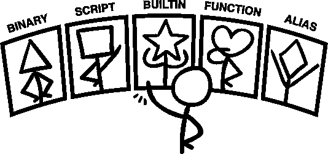
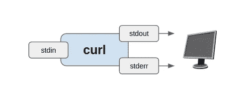
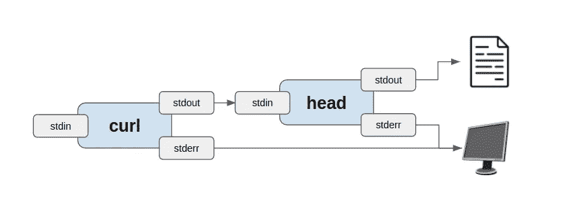

# 命令行中的数据科学

> 原文：<https://towardsdatascience.com/data-science-at-the-command-line-3ad09ee73d1a>

## 每个数据科学家都应该了解的关于 shell 的知识

现在已经 50 岁了，我们还是想不出该怎么称呼它。命令行、shell、终端、bash、提示符还是控制台？我们将把它称为命令行，以保持事情的一致性。

为了清楚起见，本文将集中讨论 UNIX 风格(Linux & Mac)的命令行，忽略其余部分(如 Windows 的命令处理器和 PowerShell)。我们观察到，如今大多数数据科学家都在基于 UNIX 的系统上工作。


命令行让你先睹为快(图片由作者提供)

# 这是什么？

命令行是基于文本的计算机界面。你可以把它想象成一个操作系统的“引擎盖”。有些人误认为它只是过去的遗迹，但不要被愚弄。现代命令行前所未有的震撼！


作者图片

过去，基于文本的输入和输出是你所拥有的一切(那是在打孔卡之后)。就像最早的汽车一样，第一个操作系统甚至没有引擎盖。一切都一览无余。在这种环境下，所谓的 REPL(读取-评估-打印循环)方法是与计算机交互的自然方式。

REPL 意味着你输入一个命令，按下回车键，命令会立即被执行。它不同于编辑-运行-调试或编辑-编译-运行-调试循环，后者通常用于更复杂的程序。

# 我为什么要用它？

命令行一般遵循“让每个程序做好一件事”的 UNIX 哲学，因此基本命令非常简单。最根本的前提是，你可以通过组合这些简单的程序来做复杂的事情。旧的 UNIX neckbeards 指的是“与计算机进行对话”

几乎世界上所有的编程语言都比命令行更强大，而且大多数点击式图形用户界面更容易学习。你为什么要在命令行上做任何事情呢？

第一个原因是速度。一切触手可及。对于告诉计算机做简单的任务，如下载文件，用特定的前缀重命名一堆文件夹，或对 CSV 文件执行 SQL 查询，你真的不能击败命令行的灵活性。学习曲线是存在的，但是一旦你内化了一组基本的命令，它就像魔术一样。

第二个原因是不可知论。无论您当前使用的是什么堆栈、平台或技术，您都可以从命令行与之交互。它就像万物之间的粘合剂。也是无处不在。哪里有电脑，哪里就有命令行。

第三个原因是自动化。与 GUI 界面不同，在命令行中完成的一切最终都可以自动化。指令和计算机之间没有任何歧义。在基于 GUI 的工具中，所有那些你浪费生命的重复点击都可以在命令行环境中自动完成。

第四个原因是扩展性。与 GUI 不同，命令行是非常模块化的。简单的命令是为无数用例创建复杂功能的完美构建块，而生态系统在 50 年后仍在增长。命令行将一直存在。

第五个原因是没有其他选择。常见的情况是，第三方服务的一些更加模糊或前沿的功能可能根本无法通过 GUI 访问，只能通过 CLI(命令行界面)使用。

# 它是如何工作的？

命令行的工作方式大致分为四层:

**终端** =获取键盘输入的应用程序将它传递给正在运行的程序(例如 shell)并呈现结果。由于现在所有的现代计算机都有图形用户界面(GUI ),终端是你和其他基于文本的堆栈之间必要的 GUI 前端层。

**Shell** =解析终端应用程序传递的击键并处理运行命令和程序的程序。它的工作基本上是找到程序在哪里，处理变量之类的事情，还提供用 TAB 键完成的功能。这里有不同的选项，比如 Bash、Dash、Zsh 和 Fish 等等。所有这些都具有稍微不同的内置命令和选项集。

**命令** =与操作系统交互的计算机程序。常见的例子是像`ls`、`mkdir`和`rm`这样的命令。有些是预先构建到 shell 中的，有些是在您的磁盘上编译的二进制程序，有些是文本脚本，有些是指向另一个命令的别名，但归根结底，它们都只是计算机程序。

**操作系统** =执行所有其他程序的程序。它处理与所有硬件(如 CPU、硬盘和网络)的直接交互。

# 提示符和波浪号


作者图片

对于每个人来说，命令行看起来都略有不同。

不过，通常有一个共同点:提示，可能由美元符号($)表示。这是一个可视的提示，指示状态结束的位置以及可以开始输入命令的位置。

在我的电脑上，命令行显示:

```
juha@ubuntu:~/hello$
```

`juha`是我的用户名，ubuntu 是我的电脑名，`~/hello`是我当前的工作目录。

那个波浪号(~)字符是怎么回事？甚至当前目录是`~/hello`是什么意思？

代字号是主目录的简写，是存放所有个人文件的地方。我的主目录是`/home/juha`，所以我现在的工作目录是`/home/juha/hello`，简称`~/hello`。(约定~用户名一般指某人的主目录；`~juha`指我的主目录等等。)

从现在开始，我们将省略提示中除美元符号以外的所有内容，以使我们的示例更加清晰。

# 对命令的剖析

之前，我们简单地将命令描述为与操作系统交互的计算机程序。虽然正确，但还是具体一点吧。

当您在提示符后键入内容并按 enter 键时，shell 程序将尝试解析并执行它。假设:

```
$ generate million dollars 
generate: command not found
```

shell 程序获取第一个完整的单词`generate`，并将其视为命令。

剩下的两个单词`million`和`dollars`被解释为两个独立的参数(有时称为自变量)。

现在，负责促进执行的 shell 程序开始寻找一个`generate`命令。有时是磁盘上的文件，有时是其他东西。我们将在下一章详细讨论这一点。

在我们的例子中，没有找到名为`generate`的命令，我们以一个错误消息结束(这是意料之中的)。

让我们运行一个实际有效的命令:

```
$ df --human-readable

Filesystem      Size  Used Avail Use% Mounted on
sysfs              0     0     0    - /sys
proc               0     0     0    - /proc
udev             16G     0   16G   0% /dev
. . .
```

这里我们运行一个命令“`df`”(disk free 的缩写)和“`--human-readable`”选项。

通常在缩写选项前使用“-”(破折号)，在长格式选项前使用“-”(双破折号)。(这些惯例随着时间的推移而演变；更多信息请看这篇[博文](https://blog.liw.fi/posts/2022/05/07/unix-cli/)。)

例如，这些是同一件事:

```
$ df -h 
$ df --human-readable
```

通常也可以在一个破折号后合并多个缩写选项。

```
df -h -l -a 
df -hla
```

注意:格式最终由每个命令决定，所以不要假设这些规则是通用的。

因为像空格或反斜杠这样的字符有特殊的含义，所以将字符串参数用引号括起来是个好主意。但是，对于类似 bash 的 shells，单引号(')和双引号(")是有区别的。单引号从字面上理解一切，而双引号允许 shell 程序解释变量之类的东西。例如:

```
$ testvar=13 
$ echo "$testvar" 
13 
$ echo '$testvar' 
$testvar
```

如果您想知道所有可用的选项，您通常可以通过`--help`参数获得一个列表:

提示:在命令行中输入的通常是一个很长的文件路径。大多数 shell 程序提供 TAB 键来自动完成路径或命令，以避免重复键入。试试吧！

# 命令的不同类型



作者图片

有五种不同类型的命令:二进制、脚本、内置、函数和别名。

我们可以将它们分为两类，基于文件的和虚拟的。

二进制和脚本命令是基于文件的，通过创建新进程(新程序的操作系统概念)来执行。基于文件的命令往往更加复杂和重量级。

内置、函数和别名是虚拟的，它们在现有的 shell 进程中执行。这些命令大多简单而轻量。

一个**二进制文件**是一个经典的可执行程序文件。它包含只有操作系统才能理解的二进制指令。如果你试图用文本编辑器打开它，你会得到乱码。二进制文件是通过将源代码编译成可执行的二进制文件来创建的。例如，Python 解释器命令`python`是一个二进制可执行文件。

对于二进制命令，shell 程序负责从文件系统中找到与命令名匹配的实际二进制文件。但是，不要期望 shell 会在您的机器上到处寻找命令。相反，shell 依赖于一个名为`$PATH`的环境变量，这是一个用冒号(:)分隔的路径列表，可以进行迭代。总是选择第一个匹配。

要检查你当前的`$PATH`，试试这个:

如果想知道某个命令的二进制文件在哪里，可以调用 which 命令。

```
$ which python 
/home/juha/.pyenv/shims/python
```

现在您已经知道在哪里可以找到文件，您可以使用`file`实用程序来确定文件的一般类型。

```
$ file /home/juha/.pyenv/shims/pip
/home/juha/.pyenv/shims/pip: Bourne-Again shell script text executable, ASCII text
$ file /usr/bin/python3.9
/usr/bin/python3.9: ELF 64-bit LSB executable, x86-64, version 1 (SYSV), dynamically linked, interpreter /lib64/ld-linux-x86-64.so.2, for GNU/Linux 3.2.0, stripped
```

脚本是包含人类可读程序的文本文件。Python、R 或 Bash 脚本是一些常见的例子，您可以将它们作为命令来执行。

通常我们不把 Python 脚本作为命令来执行，而是像这样使用解释器:

```
$ python hello.py 
Hello world
```

这里的`python`是命令，`hello.py`只是它的一个参数。(如果你看看`python --help`所说的，你可以看到它对应于变体“文件:程序从脚本文件读取”，这在这里确实有意义。)

但是我们也可以像命令一样直接执行 hello.py:

```
$ ./hello.py 
Hello world
```

要做到这一点，我们需要两样东西。首先，`hello.py`的第一行需要使用特殊的`#!`符号定义一个脚本解释器。

```
#!/usr/bin/env python3 
print("Hello world")
```

`#!`符号告诉操作系统哪个程序知道如何解释文件中的文本，并且有许多很酷的昵称，比如 shebang、hashbang 或者我最喜欢的 hash-pling！

我们需要的第二件事是将文件标记为可执行。您可以使用`chmod`(更改模式)命令来完成这个任务:`chmod u+x hello.py`将为所有用户设置可执行标志。

一个**内置**是一个硬编码到 shell 程序本身的简单命令。像`cd`、`echo`、`alias`和`pwd`这样的命令通常是内置的。

如果您运行`help`命令(这也是内置的！)，您将获得所有内置命令的列表。

**功能**就像是用户定义的额外内置功能。例如:

```
$ hello() { echo 'hello, world'; }
```

可以用作命令:

```
$ hello 
hello, world
```

如果想要列出当前可用的所有函数，可以调用(在 Bash 类 shells 中):

别名就像宏。更复杂命令的简写或替代名称。

例如，您希望 new 命令`showerr`列出最近的系统错误:

```
$ alias showerr="cat /var/log/syslog"
$ showerr
Apr 27 10:49:20 juha-ubuntu gsd-power[2484]: failed to turn the kbd backlight off: GDBus.Error:org.freedesktop.UPower.GeneralError: error writing brightness
. . .
```

由于函数和别名不是物理文件，所以它们在关闭终端后不再存在，通常在所谓的配置文件`~/.bash_profile`或`~/.bashrc`文件中定义，当新的交互或登录 shell 启动时执行。一些发行版还支持一个`~/.bash_aliases`文件(很可能是从概要文件中调用的——它是一路向下的脚本！).

如果您想获得 shell 当前活动的所有别名的列表，您可以不使用任何参数调用`alias`命令。

# 将命令组合在一起

几乎所有发生在你电脑上的事情都发生在进程内部。二进制和脚本命令总是启动一个新的进程。内置、函数和别名依附于现有 shell 程序的进程。

进程是用于运行命令(程序)实例的操作系统概念。每个进程都有一个 ID、自己的保留内存空间和在系统上执行操作的安全特权。每个流程还有一个标准输入(`stdin`)、标准输出(`stdout`)和标准误差(`stderr`)流。

这些溪流是什么？它们只是任意的数据流。没有指定编码，这意味着它可以是任何东西。文本，视频，音频，莫尔斯电码，任何命令的作者觉得合适的。最终，你的电脑只是一台美化了的数据转换机器。因此，每个进程都有输入和输出是有意义的，就像函数一样。将输出流与错误流分开也是有意义的。如果您的输出流是一个视频，那么您不希望基于文本的错误消息的字节与您的视频字节混合在一起(或者，在 20 世纪 70 年代，当您的照相排版被排版而不是显示在终端上的错误消息破坏后，标准错误流被实现)。

默认情况下，stdout 和 stderr 流通过管道返回到您的终端，但是这些流可以重定向到文件或通过管道成为另一个进程的输入。在命令行中，这是通过使用特殊的重定向操作符来完成的(`|`、`>`、`<`、`>>`)。

先说个例子。默认情况下，`curl`命令下载一个 URL 并将其标准输出返回到终端。



curl 命令输入和输出(图片由作者提供)

```
$ curl https://filesamples.com/samples/document/csv/sample1.csv
"May", 0.1, 0, 0, 1, 1, 0, 0, 0, 2, 0, 0, 0
"Jun", 0.5, 2, 1, 1, 0, 0, 1, 1, 2, 2, 0, 1
"Jul", 0.7, 5, 1, 1, 2, 0, 1, 3, 0, 2, 2, 1
"Aug", 2.3, 6, 3, 2, 4, 4, 4, 7, 8, 2, 2, 3
"Sep", 3.5, 6, 4, 7, 4, 2, 8, 5, 2, 5, 2, 5
```

假设我们只想要前三排。我们可以使用管道操作符(`|`)将两个命令连接在一起。第一个命令的标准输出(`curl`)作为第二个命令的标准输入(`head`)通过管道传输。默认情况下，第二个命令的标准输出(`head`)仍然输出到终端。

```
$ curl https://filesamples.com/samples/document/csv/sample1.csv | head -n 3
"May", 0.1, 0, 0, 1, 1, 0, 0, 0, 2, 0, 0, 0
"Jun", 0.5, 2, 1, 1, 0, 0, 1, 1, 2, 2, 0, 1
"Jul", 0.7, 5, 1, 1, 2, 0, 1, 3, 0, 2, 2, 1
```

通常，您希望数据在磁盘上，而不是在终端上。我们可以通过使用`>`操作符将最后一个命令(`head`)的标准输出重定向到一个名为`foo.csv`的文件中来实现这一点。



命令卷曲管道与头部命令(图片由作者提供)

```
$ curl https://filesamples.com/samples/document/csv/sample1.csv | head -n 3 > foo.csv
```

最后，进程在结束时总是会返回值。当返回值为零(0)时，我们将其解释为成功执行。如果它返回任何其他数字，这意味着执行有一个错误，并提前退出。例如，任何未被 try/except 捕获的 Python 异常都会让 Python 解释器以非零代码退出。

您可以使用`$?`变量检查先前执行的命令的返回值。

```
$ curl http://fake-url
curl: (6) Could not resolve hostmm
$ echo $?
6
```

以前，我们通过管道将两个命令与流连接在一起，这意味着它们是并行运行的。当我们使用`&&`操作符将两个命令组合在一起时，命令的返回值很重要。这意味着我们要等待上一个命令成功，然后再继续下一个命令。例如:

```
cp /tmp/apple.png /tmp/usedA.png && cp /tmp/apple.png /tmp/usedB.png && rm /tmp/apple.png
```

这里我们尝试将文件`/tmp/apple`复制到两个不同的位置，最后删除原始文件。使用`&&`操作符意味着 shell 程序检查每个命令的返回值，并在移动之前断言它为零(成功)。这可以防止我们在最后意外删除文件。

如果您对编写更长的 shell 脚本感兴趣，那么现在是一个很好的时机，可以绕道去 Bash“严格模式”的领地[将自己从许多令人头痛的事情中解救出来](http://redsymbol.net/articles/unofficial-bash-strict-mode/)。

# 像老板一样管理数据科学项目


作者图片

通常，当数据科学家冒险使用命令行时，是因为他们使用了第三方服务或云运营商提供的 CLI(命令行界面)工具。常见的例子包括从 AWS S3 下载数据，在 Spark 集群上执行一些代码，或者为生产构建 Docker 映像。

总是手动记忆并一遍又一遍地键入这些命令不是很有用。从团队合作和版本控制的角度来看，这不仅令人痛苦，而且是一种糟糕的做法。一个人应该总是记录神奇的配方。

为此，我们建议使用自 1976 年以来的经典命令之一 make 命令。它是一个简单的、无处不在的、健壮的命令，最初是为编译源代码而创建的，但是可以被武器化，用于执行和记录任意脚本。

使用`make`的默认方式是在项目的根目录下创建一个名为`Makefile`的文本文件。您应该始终将该文件提交到您的版本控制系统中。

让我们创建一个只有一个“目标”的非常简单的`Makefile`。由于编译源代码的历史，它们被称为目标，但是你应该把目标看作一个任务。

**Makefile**

```
hello:
    echo "Hello world!"
```

记得我们说过这是 1976 年的经典之作吗？嗯，也不是没有怪癖。你必须**非常小心**用制表符缩进那个`echo`语句，而不是任何数量的空格。如果你不这样做，你会得到一个“缺少分隔符”的错误。

为了执行我们的“hello”目标(或任务)，我们调用:

```
$ make hello
echo "Hello world!"
Hello world!
```

注意 make 是如何打印出食谱而不仅仅是输出的。您可以使用-s 参数来限制输出。

```
$ make -s hello
Hello world!
```

接下来，让我们添加一些有用的东西，比如下载我们的训练数据。

**Makefile**

```
hello:
    echo "Hello world!"

get-data:
    mkdir -p .data

    curl <https://filesamples.com/samples/document/csv/sample1.csv>
    > .data/sample1.csv
    echo "Downloaded .data/sample1.csv"
```

现在，我们可以通过以下方式下载示例培训数据:

```
$ make -s get-data
Downloaded .data/sample1.csv
```

(旁白:我们读者中更有经验的 Makefile 向导会注意到,`get-data`实际上应该命名为`.data/sample1.csv`,以利用 Makefile 的简写和数据依赖性。)

最后，我们将看一个数据科学项目中简单的`Makefile`可能是什么样子的示例，这样我们就可以演示如何使用 make 变量，让您更有灵感:

**Makefile**

```
DOCKER_IMAGE := mycompany/myproject
VERSION := $(shell git describe --always --dirty --long)

default:
    echo "See readme"

init:
    pip install -r requirements.txt
    pip install -r requirements-dev.txt
    cp -u .env.template .env

build-image:
    docker build .
        -f ./Dockerfile
        -t $(DOCKER_IMAGE):$(VERSION)

push-image:
    docker push $(DOCKER_IMAGE):$(VERSION)

pin-dependencies:
    pip install -U pip-tools
    pip-compile requirements.in
    pip-compile requirements-dev.in

upgrade-dependencies:
    pip install -U pip pip-tools
    pip-compile -U requirements.in
    pip-compile -U requirements-dev.in
```

这个例子`Makefile`将允许您的团队成员在克隆存储库之后初始化他们的环境，当他们引入新的库时固定依赖项，并部署一个带有漂亮版本标签的新 docker 映像。

如果您在代码库中始终提供一个漂亮的`Makefile`和一个写得很好的自述文件，它将使您的同事能够使用命令行并始终如一地再现您的每个项目的魔力。

**结论**

归根结底，有些人喜欢命令行，有些人不喜欢。

这不是每个人都喜欢的，但每个数据科学家都应该尝试一下，给它一个机会。即使它在你的日常工具箱中找不到位置，了解基本面也是有好处的。能够与热衷于命令行的同事交流而不被他们的终端巫术吓倒是一件好事。

如果这个话题激发了你的灵感，我强烈推荐接下来看看耶鲁安·扬森斯的免费书籍《命令行数据科学》。

*原载于*[*https://valohai.com*](https://valohai.com/blog/command-line-for-data-science/)*。*