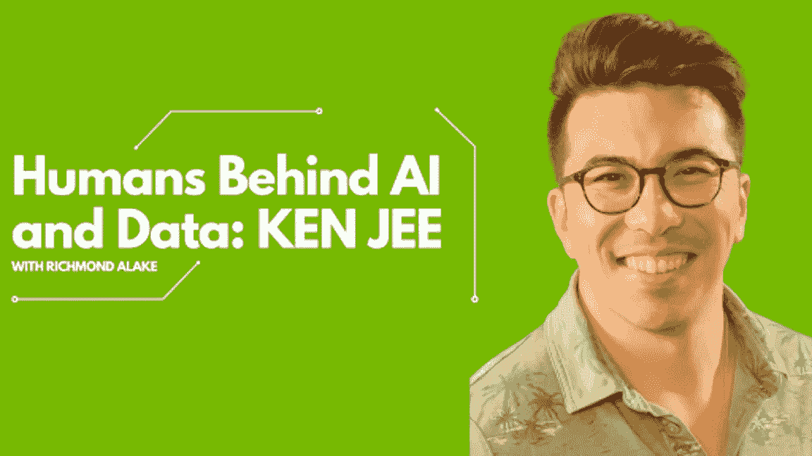

# 来自 Ken Jee 的数据科学职业建议

> 原文：<https://towardsdatascience.com/data-science-career-advice-from-ken-jee-bee257426de4>

## 关于在人工智能和数据领域导航学术和专业职业道路的建议

拉兹万·苏驰在 [Unsplash](https://unsplash.com/s/photos/career?utm_source=unsplash&utm_medium=referral&utm_content=creditCopyText) 上的照片

# 谁是肯·吉？

肯·吉(Ken Jee)是一名数据科学家，也是 YouTube 上的内容创作者，他很快成为了所有人最喜爱的数据科学家。Ken 通过其引人入胜且易于理解的视频，帮助无数人了解了数据科学、机器学习和人工智能。更值得注意的是，Ken 是广受欢迎的#66daysofdata 运动的发起者。肯有两个硕士学位:一个是计算机科学，另一个是商业、营销和管理。他还拥有经济学学士学位。Ken 是 Scouts Consulting Group 的数据科学主管。

在本文中，Ken 讨论了他作为数据科学家的工作，并为任何希望进入该领域的人提供了建议。我们探讨了大学教育对数据科学职业生涯的重要性、数学对数据科学家的相关性、在行业内创造能见度，以及对新技术保持开放态度的价值。

> 作者注:这篇文章是我有幸在我的播客中深入谈论的肯的智慧的片段转录。在本文的结尾，您会找到整个讨论的链接。这也意味着 Ken 提供的回答经过了大量的编辑，以确保简洁明了，但是请放心，Ken 的信息的意图是保持不变的。

人工智能和数据背后的人类:Ken Jee

# 你是如何对数据科学产生兴趣的？

我对数据科学产生了兴趣，因为我想提高我的高尔夫技术。我开始探索数据如何帮助我分析自己的表现，并找到改进的方法。我很快发现我有一个独特的优势:分析数据和创造数据驱动的行动来提高我的高尔夫技术的能力。这促使我进一步探索由数据和智能支持的其他性能改进方法。

# 数学在数据科学中有多重要？

我认为，在进入数据科学领域时，数学不那么重要，重要的是动手编程。我建议人们通过构建项目和编码来动手，因为这将帮助他们直观地发现数学在哪里是有价值的和必要的。

我还建议复习微积分、线性代数和离散数学，但前提是你有理由这样做，并且理解它们与数据科学的关系。随着你在这个领域的进步，你会逐渐了解数学技能的重要性和相关性。一旦你看到它们带来的价值，你就会更有动力去理解它们。

# 进入数据科学，自我导向学习比正式学位更重要吗？

我鼓励人们研究不同寻常的学习方法，而不是上大学，其中一个主要原因是，许多学生没有充分利用学校的资源。我把所有的办公时间都花在了教授身上，并向精通相关学科的博士们提问，但我发现很少有学生这么做。

我相信拥有一个学位只有在你付出努力并充分利用现有机会的情况下才有帮助。我建议利用大学里的其他选择，比如兼职项目。这样做可以帮助学生从他们的教育中获得最大的收益，并让他们在就业市场上获得优势。然而，我警告说，仅仅获得学位并不能保证事业成功。

> 作者注:Ken Jee 为数据科学学习平台 [365DataScience](https://365datascience.com/instructors/ken-jee/) 做出了贡献，他在那里教育学习者如何开始成功的数据科学职业生涯。

获得数据科学等高级学科的硕士学位并不总是脱颖而出的最佳方法。我的想法是，用你所拥有的资源做你能做的事情，尽可能让自己与众不同，这是非常有价值的。拥有令人印象深刻的作品集、独特的工作或志愿者经历会更有益。

这是值得考虑的，如果你能投入时间和金钱获得硕士学位，因为它无疑是一个可行的资源。但是考虑回学校找工作的机会成本总是很重要的。因此，从财务角度来看，读研以获得人工智能领域的一个特殊职位是一种机会成本；你需要确定读研是否会带来好的投资回报。你需要计算学费和攻读学位的时间成本，然后比较用同样的资金资助一种更加自主的学习方法来获得同样的目标工作。

大多数从业者会发现，如果预期目标是获得一个特定的角色，将资本投入到自我导向的学习方法而不是研究生院是更合适的投资。这种将资金分配视为学习方法的心态表明，大学不应该被视为实现一维目标(如获得特定工作)的方法。在大多数情况下，将时间和金钱投入到有助于求职的资源中，比如简历服务或模拟面试，会比重返校园获得更高的投资回报。

在大多数情况下，将时间和金钱投入到有助于求职的资源中，比如简历服务或模拟面试，会比重返校园获得更高的投资回报。我没有直接攻读数据科学硕士学位，而是攻读了计算机科学硕士学位，这一点，加上我独特的商业技能，使我能够在充满数据科学硕士毕业生的候选人中脱颖而出。

# 如何合理利用大学资源？

我相信很少有人充分利用现有资源，这是一个被浪费的机会。上班时间，我花了大量时间在老师的办公室里，问问题，寻求帮助。我觉得这是我学费的一次有价值的使用。我建议学生考虑他们的目标，问问他们的钱花得值不值。如果他们去上课，不做任何额外的工作或项目，他们就没有从教育中获得最大的收益。如果学生想从大学教育中获益，他们需要努力工作。

# 你是怎么学习的？

我学得最好的方法是按照我自己的速度努力学习，反复重读同样的东西，直到我理解为止。读研的时候就爱上了读书，大部分知识都是从课本上得来的。我建议从不同的角度看待事物，以便对一个话题有不同的理解。加快学习的最重要的一个关键是找到一个合适的媒介，以一种对你有意义的方式解释这个主题，这可以是读一篇博客，看一段视频，或者听一段播客。虽然我在研究生院获得知识的主要方法是通过书籍，但我承认我今天学习数据科学概念和主题涉及视频和 YouTube 教程。具体来说，**我要提一下流行数据科学 YouTube 频道**[**stat quest with Josh Starmer**](https://www.google.com/search?gs_ssp=eJzj4tVP1zc0TCqJtzCpSCoxYPSSLi5JLCksTS0uUSjPLMlQyMovzlAAihXlphYBAEY4D4A&q=statquest+with+josh+starmer&oq=statquet+with+&aqs=chrome.1.69i57j46i13j0i13j0i390l2.6496j0j4&sourceid=chrome&ie=UTF-8#:~:text=Search%20Results-,StatQuest%20with%20Josh%20Starmer%20%2D%20YouTube,https%3A//www.youtube.com%20%E2%80%BA%20joshstarmer,-StatQuest%20breaks%20down)**。**

# 作为一名数据科学家，让自己脱颖而出的最佳技能是什么？

数据科学家必须学习编码、数学和商业才能成功。我凭借自己独特的技能组合在竞争中脱颖而出。我的商业知识和满足编码和数据科学战略需求的能力使我成为一个非常理想的候选人。我的简历和作品集在竞争中脱颖而出。此外，我的沟通技巧和商业知识让我在求职面试中有了明显的优势。

# 你为什么开始在 YouTube 上制作数据科学视频？

我开始在 YouTube 上制作数据科学视频是因为我在尝试学习数据科学的时候没有看到我要找的资源。

我也认为制作视频是提高我沟通技巧的最好方法。创造内容给了我竞争优势，因为它把雇主吸引到了我这里，而不是出去找他们。我通常把这称为内容重力的概念。我创作的内容越多，我对雇主的吸引力就越大，机会就越多。我认为这是竞争优势的圣杯，因为这意味着我不必出去得到我想要的东西；它来找我是因为努力工作和内容创作。

# 作为数据科学从业者，如何提高自己的知名度？

我喜欢从事有趣的数据项目，创造易于理解的内容，帮助他人学习和成长。我相信数据科学技能是有价值和可分享的，数据驱动的内容有很大的潜力去病毒式传播。公司应该鼓励员工搞兼职，并公开，因为这对公司有好处。我看到一个未来，每个人都使用社交媒体来分享他们的工作和想法，这在大多数角色中都被接受和期待。在我之前的一些工作中，我被称为“制作 YouTube 视频的人”我在工作之外的外部努力有助于我在公司内部的知名度。

# 对于计划探索元宇宙的数据科学家，你有什么建议吗？

我认为，为元宇宙做准备包括尝试不同的数据类型。具体来说，我建议数据科学家要知道如何在更高维度中建模数据，并预测潜在的问题。此外，我建议温习编程语言，以便更好地理解元宇宙。数据科学家需要预测元宇宙将面临的问题，并了解第三方应用程序的开发。

> 作者注:Nvidia 深度学习研究所拥有优秀的[学习资源](https://courses.nvidia.com/courses/course-v1:DLI+S-FX-02+V1/)，这些资源介绍了创建数字、现实世界和对象的工作流程和过程。

# 数据科学家的收入潜力有多大？

我接受了减薪，在目前的公司工作，因为它让我有很多自由来创作内容和追求工作之外的其他兴趣。对我来说，选择项目的自主权和自由比更高的薪水更有价值。我不认为人们应该为了赚钱而学习数据科学。我认为软件工程师的准入门槛要低一点，数据科学家必须学习编码、数学和商业才能获得成功。对我来说，比金钱更重要的是享受我的工作。

# 你是如何成为目前公司的数据科学主管的？

我很早就发现自己不太适应公司的官僚作风。我的重点是创造价值，通过增加价值获得关注，并获得工作满足感。我的头衔从数据科学家进步到了数据科学主管，我现在负责所有与数据相关的工作，并承担了数据科学主管的角色。这一变化反映了我在当前公司很早就承担了越来越多的责任，从单独负责所有数据科学活动到管理数据科学家团队。如果你正在找工作，我建议你通过接触潜在雇主来创造机会。如果他们看到你愿意并且有能力做这项工作，你可能会惊讶于他们对雇佣你的开放程度。我建议数据科学从业者找到一个尚不存在的职位，或者为自己创造一个职位。这样，你就可以跳过这条线，到达你想去的地方，而不用等待机会。

# 你对入门级数据科学家的建议是什么？

入门级的数据科学家应该与他人分享他们的工作和旅程。人们对生产内容犹豫不决，因为他们害怕被评判，但通常情况并非如此。人们更有可能变得积极和支持。我还建议先学习编码，因为这对数据科学家来说是一项有价值的技能。然而，我认识到每个人的学习方式不同，所以这不是一个放之四海而皆准的方法。

# 你未来五年的计划是什么？

我未来五年的计划是继续制作内容。我喜欢创作视频，并把它们放在那里，但我也喜欢创业和为人们创造价值的东西。在我人生的下一个篇章中，我计划从事一个应用数据科学技术的项目——一个比内容创作维护成本更低的项目。

# 作者摘要

Ken 在数据科学领域的经历是独一无二的，但他取得成功的步骤是可复制的，可以适应您的数据科学职业生涯。我与他的讨论揭示了利用数字内容传达您在数据科学领域的专业知识和存在的重要性，这有时会充满噪音。

Ken 对数据科学从业者的建议是专注于创造价值，并确保您不断学习，以跟上快速变化的领域。因此，无论您的数据科学职业目标是什么，都不要忘记享受这一过程并记录下来！

感谢您阅读这篇报道了我和肯·吉的对话的文章。我相信 Ken 的建议和提示将有助于您的数据科学之旅。

**本文的一个版本最初发表在** [**Nvidia AI 博客**](https://developer.nvidia.com/blog/advice-on-building-a-data-science-career-qa-with-ken-jee/) 上

你可以在 [**YouTube**](https://youtu.be/mpfIt7CxFbE) 或 [**Spotify**](https://spoti.fi/38IIC06) **上观看或收听与肯·吉的整个对话。**

**在以下平台找到更多肯的内容:**[**YouTube**](https://www.youtube.com/c/KenJee1)**|**[**Twitter**](https://twitter.com/KenJee_DS)**|**[**LinkedIn**](https://www.linkedin.com/in/kenjee)**|**[**播客**](https://www.youtube.com/channel/UCpEJMMRoTIHJ8vG8q_EwqCg)

> ***完成步骤 1-4，了解我在媒体和其他平台上制作的最新内容。***

1.  [**成为推荐媒介会员，支持我的写作**](https://richmondalake.medium.com/membership)
2.  订阅我的 [**YouTube 频道**](https://www.youtube.com/channel/UCNNYpuGCrihz_YsEpZjo8TA)
3.  为我的时事通讯订阅我的 [**邮件列表**](https://richmond-alake.ck.page/c8e63294ee)
4.  在 [**上订阅我的播客苹果播客**](https://apple.co/3tbXlIa)**|**[**Spotify**](https://spoti.fi/38IIC06)**|**[**Audible**](https://amzn.to/3m62Vb3)

<https://richmondalake.medium.com/richmond-alake-podcast-lewis-tunstall-62db44b7b1f0> 