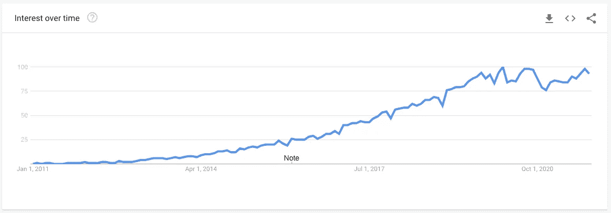
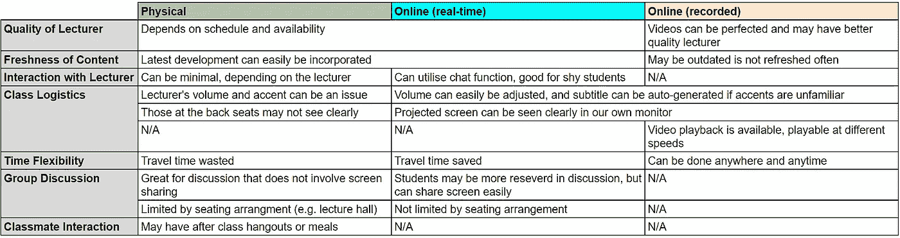

# 数据科学职业转换:硕士值得吗？

> 原文：<https://towardsdatascience.com/data-science-career-switch-is-masters-degree-worth-it-d2d23e87b3de>

## 意见

# 数据科学职业转换:硕士值得吗？

## 第 1 部分:学习模式(在线与物理)

斯蒂芬·道森在 [Unsplash](https://unsplash.com?utm_source=medium&utm_medium=referral) 上拍摄的照片

最近，我的职业转向了数据科学。我将在一系列文章中分享我的想法、经验和思考。本帖是第一部分。

# 我的背景和经历

我于 2021 年 6 月从新加坡国立大学系统科学学院(NUS ISS)提供的一年全日制企业和商业分析技术硕士课程毕业。在此之前，我在公共交通行业全职工作了三年，一直在考虑将职业生涯转向数据科学/分析。当时，由于我在大学期间所学的一些课程，我对统计学有一定的了解，对编码也有一些了解——我学习的是工业和系统工程。

要了解全部细节，你可以点击查看我的 [LinkedIn 页面，我们也可以联系(:](https://www.linkedin.com/in/nathanthandoko/)

# 数据科学炒作

数据科学的趋势(作为一个研究领域)|图片来自谷歌趋势

上图是数据科学(作为研究领域)的 Google 搜索趋势。我们可以看到，在过去的十年中，这一主题正在兴起，尽管在过去的两年中明显停滞不前。这无疑是行业需求、工作机会和未来职业前景的代表。

当我在 2019 年考虑转行时，我真的不太明白数据角色的工作会是什么样子。公平地说，这是一个相当新的领域，也是一个仍在发展的课题。然而，当我在任何工作门户网站上搜索数据分析师或数据科学家等术语时，我发现自己滚动了很长时间，仍然没有到达职位空缺的最后一页。简单地说，这个领域有无数的工作机会。虽然我们应该考虑我们的偏好、能力和职业倾向，但就业前景无疑是数据科学领域的一个主要拉动因素。

# 学习模式:在线还是实体

这一节一般适用于所有高等教育(不仅仅是数据领域)。

过去，几乎所有的课程都是在教室或演讲厅里进行的。渐渐地，大学开始提供录音讲座，主要是为那些会缺课的学生，同时也为学生提供复习他们所学内容的机会。现在有许多完全 100%的在线学位，甚至来自世界各地著名的大学。在新冠肺炎·疫情期间，许多大学也求助于将他们的学习模式完全转变为在线学习。这就引出了一个紧迫而关键的问题，在线学习会有效吗？

在注册我的课程之前，我也有这种恐惧和担心。我担心在线学习会阻碍知识转移。然而。我的经历证明我的担心是错误的。事实上，在线学习可以和物理课堂一样有效，甚至更有效。

## 讲师素质

提供在线课程录音的学校通常会确保最好的讲师来授课。由于这是一个录音讲座，学校能够确保提供最好的教学质量。视频重拍是可能的，不准确的可以被删除，口音和不清楚的音调可以被最小化，从而产生一个近乎完美的演讲。这与物理课不同，物理课取决于讲师的时间安排和是否有空，也可能容易出现无意的错误。但是，这一优势仅适用于录制的在线课程，不适用于直播课程或通过在线会议平台举办的课程。

## 内容的新鲜度

开设实时课程(无论是在线还是实体课程)的好处是，讲师可以发表评论，了解最新的问题，并分享任何最新的发展。随着数据科学领域的快速发展，这一点尤为重要。

## 与讲师互动

在物理课上与讲师互动可能是一个挑战。很自然，学生们会犹豫是否要举手提问，尤其是坐在后排的学生。在讲课过程中问一个问题也会打乱思路。然而，在在线课堂上，学生可以随时在聊天窗口提出问题，他们也可以在不干扰教学流程的情况下虚拟地举手。对于不喜欢发言或有语言障碍的学生来说，用键盘输入他们的问题肯定比口头提问容易。

## 班级后勤

这是网上课程的一个明显的优势，直到我亲身经历后才意识到这一点。在体育课上，讲师的音量和口音可能是一个挑战。在线课程很好地处理了这个问题，因为我们可以很容易地从我们的设备上调整音量，当讲师的口音对我们来说不熟悉时，字幕可以自动生成。此外，当讲师投影他们的幻灯片时，我们可以在自己的屏幕上清楚地看到它们，而坐在演讲厅后面的人可能很难清楚地看到幻灯片。

## 时间灵活性

当我在网上上课的时候，最大的好处之一就是不用起得那么早，而且我还能准时去上早课。与体育课不同，上学路上没有浪费时间。如果你住得离学校很远，这尤其好。对于在线录制的课程，学生甚至可以随时随地观看，提供了更好的时间灵活性。

## 小组讨论

虽然面对面的讨论比在线讨论更好更自然，但当我们需要向其他小组成员展示我们的屏幕时，就不那么好了。由于演讲厅的座位安排，在演讲厅进行小组讨论也很困难。在线设置中不是这样的。通过分组讨论室，学生可以轻松地共享屏幕，不受座位安排的限制，可以立即随机分配小组，尽管他们在讨论中可能更保守。

## 同学互动

在体育方面，学生们可能会在课后闲逛或者在课间一起吃饭。这对于在线课程是不可能的。我认为这是在线课程最大的缺点之一。与物理课堂相比，建立网络和形成关系的机会要少得多。

实体课程和在线课程的比较|图片由作者提供

总之，我认为，如果学生有一个有利的环境，在线课程即使不比课堂环境更好，也是一样的。实体课程的主要好处是与同学建立友谊和关系网，这是网上课程很可能缺少的一个非常重要的方面。然而，我认为无论学习的模式是什么，选择在数据科学领域追求知识已经是迈向(希望)光明未来的一步。

希望这篇分享对你有所启发，尤其是那些正在考虑决定继续深造的人。

在以后的文章中，我计划继续分享:

1.  考虑转行的人应该关注哪些语言:Python？r？SQL？
2.  你是应该参加在线课程/训练营，还是应该攻读学位来改变职业？
3.  转行的经验和技巧

请关注我，获取上述主题的最新信息！

**更新:这是第二部分！**

  

订阅我的邮件列表:

   